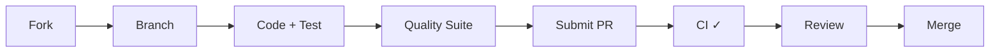

# Contributing to nbadb

Thanks for your interest in contributing to nbadb! This guide covers everything you need to get started.

## Quick Reference

| Task | Command |
|------|---------|
| Lint | `uv run ruff check src/ tests/` |
| Format | `uv run ruff format src/ tests/` |
| Type check | `uv run ty check src/` |
| Unit tests | `uv run pytest tests/unit` |
| All tests | `uv run pytest tests/` |
| Regen docs | `uv run nbadb docs-autogen --docs-root docs/content/docs` |
| Docs dev | `cd docs && pnpm dev` |

## Prerequisites

- Python 3.12+
- [uv](https://docs.astral.sh/uv/) (package manager)
- [pnpm](https://pnpm.io/) (for docs site only)

## Setup

```bash
git clone https://github.com/wyattowalsh/nbadb.git
cd nbadb
uv sync --extra dev
```

## Development Commands

```bash
# Quality checks
uv run ruff check src/ tests/       # Lint
uv run ruff format src/ tests/      # Format
uv run ty check src/                # Type check

# Tests
uv run pytest tests/unit            # Unit tests (fast, ~1500 tests)
uv run pytest tests/                # All tests (unit + integration)

# Docs
uv run nbadb docs-autogen --docs-root docs/content/docs   # Regenerate auto-generated docs
cd docs && pnpm dev                                        # Docs dev server
```

> [!NOTE]
> pytest is configured with `--import-mode=importlib` in `pyproject.toml` because the `nbadb/` root directory shadows `src/nbadb/`.

## Code Guidelines

### Tech Stack Rules

- **Polars**, not pandas, for all DataFrame operations
- **DuckDB** native Python API only (no SQLAlchemy)
- **Pandera\[polars\]** for schema validation
- All column names must be **lowercase snake_case**
- Type annotate everything; run `uv run ty check src/`

### Transform Conventions

> [!TIP]
> Most transforms extend the `SqlTransformer` base class — define a `_SQL` class variable with the DuckDB SQL query, no `transform()` override needed:

```python
class FactExample(SqlTransformer):
    _SQL = """
        SELECT col_a, col_b
        FROM stg_example
    """
```

Naming conventions:
- `dim_*` — Dimension tables
- `fact_*` — Fact tables
- `bridge_*` — Bridge tables
- `agg_*` — Pre-aggregated rollups
- `analytics_*` — Analytics convenience views

### Schema Validation

nbadb uses 3-tier Pandera validation: **raw → staging → star**. New tables need a corresponding schema in `src/nbadb/schemas/star/`. The base config uses `strict=False` — hard-fail on missing or type errors, soft-warn and strip extras.

### Docs Workflow

- **Hand-edit** authored pages (guides, architecture, CLI reference)

> [!IMPORTANT]
> **Do not hand-edit** auto-generated files — regenerate them instead:
> - `docs/content/docs/schema/*-reference.mdx`
> - `docs/content/docs/data-dictionary/*.mdx`
> - `docs/content/docs/diagrams/er-auto.mdx`
> - `docs/content/docs/lineage/lineage-auto.mdx`
>
> Regenerate with: `uv run nbadb docs-autogen --docs-root docs/content/docs`

## Commit Conventions

Use [Conventional Commits](https://www.conventionalcommits.org/):

- `feat:` — New feature
- `fix:` — Bug fix
- `refactor:` — Code restructuring (no behavior change)
- `docs:` — Documentation only
- `test:` — Test additions or fixes
- `chore:` — Build, CI, or dependency update

Include scope when useful: `feat(transform): add fact_player_clutch_detail`

## Common Pitfalls

> [!CAUTION]
> **Do not** use pandas — all DataFrame operations use **Polars**.

> [!CAUTION]
> **Do not** use SQLAlchemy for DuckDB — use the native Python API only.

## Pull Request Process



1. Fork the repo and create a feature branch from `main`
2. Make your changes with tests
3. Run the full quality suite:
   ```bash
   uv run ruff check src/ tests/
   uv run ruff format --check src/ tests/
   uv run ty check src/
   uv run pytest tests/unit
   ```
4. Submit a PR against `main` — the PR template will guide the rest
5. CI runs automatically; all checks must pass before merge
