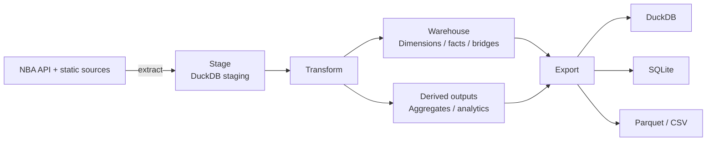

# nbadb


**The most comprehensive open NBA database available.**

[](https://pypi.org/project/nbadb/)
[](https://pypi.org/project/nbadb/)
[](LICENSE)
[](https://github.com/wyattowalsh/nba-db/actions/workflows/ci.yml)
[](https://duckdb.org)
[](https://pola.rs/)
[](https://github.com/astral-sh/ruff)
[](https://nbadb.w4w.dev)
[](https://www.kaggle.com/datasets/wyattowalsh/basketball)
[](https://nbadb.w4w.dev/docs/schema)

| Extractor coverage                | Public model                  | Derived outputs                              | Docs site                                       |
| --------------------------------- | ----------------------------- | -------------------------------------------- | ----------------------------------------------- |
| Current `nba_api` runtime surface | Generated star-schema outputs | Generated `agg_*` and `analytics_*` surfaces | Guides, references, diagrams, and lineage pages |

## 📊 What's Inside

nbadb exposes an analytics-first warehouse surface rather than a thin mirror of raw upstream payloads.

| Surface           | What it covers                                                                                                                |
| ----------------- | ----------------------------------------------------------------------------------------------------------------------------- |
| **`dim_*`**       | Stable identity and lookup context for players, teams, games, seasons, arenas, officials, and other conformed dimensions      |
| **`fact_*`**      | Event and measurement tables across box scores, tracking, shot charts, play-by-play, standings, matchups, and specialty feeds |
| **`bridge_*`**    | Many-to-many connectors where public entities legitimately fan out                                                            |
| **`agg_*`**       | Reusable rollups for season, career, pace, efficiency, and other repeated reporting needs                                     |
| **`analytics_*`** | Convenience outputs for notebooks, dashboards, and quick exploratory analysis                                                 |

For the current public contract, use the generated docs surfaces: **[Schema Reference](https://nbadb.w4w.dev/docs/schema)**, **[Data Dictionary](https://nbadb.w4w.dev/docs/data-dictionary)**, and **[Lineage](https://nbadb.w4w.dev/docs/lineage)**.

## 🏀 Data Coverage

nbadb covers the **1946-47 season to present** for executable `nba_api` contracts,
with current seasons auto-updated by the daily pipeline and every upstream-unavailable,
blocked, or not-yet-modeled contract classified explicitly rather than silently omitted.

Trust floor: preserve and improve full historical `nba_api` coverage for every year available per endpoint. If an endpoint/year/season-type combination is unavailable upstream or blocked by a known contract gap, classify it explicitly in coverage reports and support matrices instead of silently dropping it.

- **Game-level** — box scores (traditional, advanced, misc, four factors, hustle, tracking), play-by-play, shot charts, rotations, win probability, game context, scoring runs
- **Player-level** — career stats, season splits, matchups, awards, draft combine measurements, player tracking (speed, distance, touches, passes, rebounding, shooting), estimated metrics
- **Team-level** — game logs, matchups, splits, clutch stats, franchise history, IST standings, playoff picture, pace and efficiency, player dashboards
- **League-level** — leaders, hustle stats, lineup visualizations, shot locations by zone, synergy play types, league-wide tracking

## 📦 Output Formats

| Format  | Path         | Description                                                        |
| ------- | ------------ | ------------------------------------------------------------------ |
| DuckDB  | `nba.duckdb` | Canonical analytics engine — columnar storage and fast SQL queries |
| SQLite  | `nba.sqlite` | Kaggle preview-friendly portable relational database               |
| Parquet | `parquet/`   | Zstd-compressed columnar files, partitioned by season              |
| CSV     | `csv/`       | Universal flat files for any tool                                  |

## 🚀 Quick Start

> [!TIP]
>
> ```bash
> pip install nbadb    # or: uv add nbadb
>
> # Full build from scratch (1946-present, ~2-4 hours)
> nbadb init
>
> # Daily incremental update (~5-15 minutes)
> nbadb daily
>
> # Export to all formats
> nbadb export
>
> # Query with natural language
> nbadb ask "who led the league in scoring last season"
>
> # Upload to Kaggle and verify the published bundle
> nbadb upload --verify-remote
> ```

## ⌨️ CLI Reference

| Command                             | Description                                                                                                        |
| ----------------------------------- | ------------------------------------------------------------------------------------------------------------------ |
| `nbadb init`                        | Local full historical build                                                                                        |
| `nbadb daily`                       | Current-season refresh plus automatic live snapshot append when games are active                                   |
| `nbadb monthly`                     | Last-3-seasons refresh plus automatic live snapshot append when games are active                                   |
| `nbadb backfill`                    | Recovery and targeted historical repair                                                                            |
| `nbadb live-snapshot`               | Manually append a live snapshot for active or explicit game ids                                                    |
| `nbadb migrate`                     | Run schema migrations                                                                                              |
| `nbadb scan --fail-on error`        | Hard assurance gate for missing data, gaps, and quality issues                                                     |
| `nbadb export`                      | Re-export DuckDB → SQLite / Parquet / CSV                                                                          |
| `nbadb upload`                      | Stage declared resources, validate the bundle, push to Kaggle, and optionally verify exact-version remote readback |
| `nbadb download`                    | Pull the Kaggle dataset and seed local DuckDB                                                                      |
| `nbadb extract-completeness`        | Report coverage gaps; with an upstream checkout, generate `nba_api` contracts                                      |
| `nbadb endpoint-support-matrix`     | Report strict endpoint support + warehouse contract coverage                                                       |
| `nbadb endpoint-adequacy-scorecard` | Generate endpoint adequacy scorecard artifacts                                                                     |
| `nbadb audit-models`                | Generate end-to-end model + result-table audit artifacts                                                           |
| `nbadb schema-annotation-audit`     | Generate schema annotation, route, and field fate audit artifacts                                                  |
| `nbadb table-year-coverage`         | Generate table/year coverage summary artifacts                                                                     |
| `nbadb docs-autogen`                | Regenerate generator-owned schema, data dictionary, ER, and lineage artifacts                                      |
| `nbadb schema [TABLE]`              | Show schema for a table or list all star tables                                                                    |
| `nbadb status`                      | Pipeline status, row counts, and watermarks                                                                        |
| `nbadb journal-summary`             | Export pipeline telemetry summary artifacts                                                                        |
| `nbadb ask QUESTION`                | Natural-language query interface (read-only)                                                                       |
| `nbadb chat`                        | AI-powered Chainlit chat interface backed by the local DuckDB warehouse                                            |
| `nbadb full`                        | Fill gaps and retry failed extractions (deprecated—use `backfill` instead)                                         |
| `nbadb lint-sql`                    | Lint SQL in transformers against SQLFluff rules                                                                    |
| `nbadb metadata`                    | Generate Kaggle metadata JSON                                                                                      |

Run `nbadb --help` or `nbadb <command> --help` for full option details.

Release publishes should use `nbadb upload --verify-remote`. Verification reads
only `nbadb-publication.json` and requires the exact positive Kaggle version
returned with that marker. A marker-specific HTTP 404 can enter a one-upload
bootstrap path after the dataset metadata API supplies the current version; any
other baseline lookup error stops before upload. If any upload remains unresolved,
every later bundle is reconciliation-only until exact marker evidence resolves the
prior publication. Full, daily, and monthly workflows publish only from the default
branch, serialize publishers through a FIFO queue, and preserve that reconciliation
state in a shared Actions cache and publication artifacts so a later runner or
extraction chain cannot silently lose it. Remote markers and local publication
records are schema-validated before any upload decision.

For docs-site maintenance, regenerate generator-owned artifacts from the repo root with:

```bash
uv run nbadb docs-autogen --docs-root docs/content/docs
```

That command owns the generated schema references, data-dictionary tier pages,
ER/lineage auto pages, `docs/lib/generated/*`, and `docs/lib/site-metrics.generated.ts`.

## 🧭 Companion Surfaces

This repository now carries two repo-owned companion surfaces alongside the warehouse code:

- `chat/` — the canonical Chainlit chat application surface used by `nbadb chat`
- `src/nbadb/chat/` — shared launcher, notebook, runtime, tracing, SQL, catalog, and memory helpers that back the chat UX
- `kb/` — an intentional Obsidian-native companion knowledge base for maintainers and agents; it supplements repo canon and public docs, but does not replace them

`README.md`, `AGENTS.md`, `docs/`, and `src/nbadb/` remain canonical material. The `kb/` vault is additive-first and exists to improve navigation, provenance, and maintainer context without replacing the public docs site.

## 🤖 AI Query Interface

`nbadb ask` translates natural-language questions into read-only DuckDB queries:

```bash
nbadb ask "top 5 players by career three-pointers made"
nbadb ask "which teams had the best home record in 2023-24"
nbadb ask "LeBron James career averages by season"
```

Queries run against the star schema with safety guards: read-only DuckDB connections, external access disabled, static SQL validation, DuckDB planning checks, row limits, and optional `--verbose` SQL provenance.

Launch the browser-based chat UI with:

```bash
nbadb chat
```

The Chainlit app lives in `chat/`, while shared runtime, catalog, and SQL result helpers live in `src/nbadb/chat/`.

## 📓 Kaggle Notebooks

Ten analysis notebooks are published on Kaggle, all powered by this dataset:

| Notebook                                                                                     | Description                                           |
| -------------------------------------------------------------------------------------------- | ----------------------------------------------------- |
| [NBA Aging Curves](https://www.kaggle.com/code/wyattowalsh/nba-aging-curves)                 | Peak, prime, and decline — career trajectory modeling |
| [Defense Decoded](https://www.kaggle.com/code/wyattowalsh/nba-defense-decoded)               | Tracking + hustle + synergy PCA to quantify defense   |
| [Draft Combine Analysis](https://www.kaggle.com/code/wyattowalsh/nba-draft-combine-analysis) | What pre-draft measurements actually predict          |
| [Game Prediction](https://www.kaggle.com/code/wyattowalsh/nba-game-prediction)               | Stacking ensemble model for game outcomes             |
| [MVP Predictor](https://www.kaggle.com/code/wyattowalsh/nba-mvp-predictor)                   | Explainable ML for MVP voting prediction              |
| [Play-by-Play Insights](https://www.kaggle.com/code/wyattowalsh/nba-play-by-play-insights)   | Win probability, scoring runs, and clutch analysis    |
| [Player Archetypes](https://www.kaggle.com/code/wyattowalsh/nba-player-archetypes)           | UMAP + GMM clustering — 8 data-driven player types    |
| [Player Dashboard](https://www.kaggle.com/code/wyattowalsh/nba-player-dashboard)             | Interactive explorer with 50+ metrics                 |
| [Player Similarity](https://www.kaggle.com/code/wyattowalsh/nba-player-similarity)           | Find any player's statistical twin                    |
| [Shot Chart Analysis](https://www.kaggle.com/code/wyattowalsh/nba-shot-chart-analysis)       | The geography of scoring and the 3-point revolution   |

## 🏗️ Architecture



- **Polars** for all DataFrame operations with zero-copy Arrow interchange to DuckDB
- **3-tier Pandera validation** — raw → staging → star
- **SQL-first transforms** for the star surface, with dependency-ordered execution
- **SCD Type 2** for `dim_player` and `dim_team_history` (surrogate keys, `valid_from`/`valid_to`)
- **Checkpoint/resume** for interrupted transform runs
- **Watermark tracking** for incremental extraction
- **Proxy rotation** via proxywhirl with circuit-breaker failover

The GitHub Actions full-extraction control plane defaults to the `standard` chunk
profile and targets a `5:3:1:1` rotation across fresh, partial-progress, retry,
and infrastructure lanes when every queue has work. A
centralized discovery job seeds only the current wave's exact
season/season-type scopes, carries those artifacts forward by chain and source
run, refreshes active-season player/game/workload evidence, and blocks matrix
fan-out when any required scope remains unproven. Aggregate-only player waves still
refresh the active season, and sparse player-team misses are fetched as exact pairs.
The manifest is generated only from executable parameter contracts. The comparison
surfaces `player_vs_player`, `team_vs_player`, `team_and_players_vs`, and its
extractor-only `team_and_players_vs_players` alias remain schema-backed and
documented, but are classified as `contract_not_modeled_yet` for
historical fan-out because the current affiliation workload cannot supply observed
player pairs or opposing lineups. They are not replaced with synthetic Cartesian
requests, and restored manifests that still schedule them fail before VPN preflight.
`league_game_log` is owned by the centralized discovery seed instead of redundant
extract lanes. Canonical coverage rows that combine alternate wrappers are projected
back to every concrete endpoint/pattern route before lane generation, preserving each
distinct staging surface without scheduling endpoint-name aliases as zero-work jobs.
The full-history `video_details_asset` route keeps its upstream season contract intact,
but runs with a ten-call persistence boundary, isolated two-call concurrency, a
15-second request timeout, no in-call retries, a fully-failed-chunk stop, and a
600-second no-completed-chunk watchdog. Empty successful responses are journaled
only after their zero-row staging chunk is durable, so retries cannot recreate a
thousand-call all-or-nothing barrier.
VPN-backed work accepts a tunnel only after route and changed-exit-IP checks, a
strict NBA result-set probe, and installed-stack player/game discovery canaries pass.
The player canary also requires a positive player/team membership row.
NBA-blocked servers are rejected across fallback technologies and carried from
preflight into both the current lane quarantine and child manifests. Authentication
rejections remain separate from server-health quarantine: downstream jobs reuse the
credential source proven by preflight, pause after bounded rejection sweeps, and
rotate servers and protocols only after a budgeted cooldown. Servers that pass the
preflight and discovery NBA probes are handed to extraction as a verified pool. Lane
indexes assign at most one such host to each parallel slot and exclude the rest from
that slot's fresh recommendations, preserving distinct active exits. VPN lane
parallelism defaults to three while preserving a separate runner and selected server
per active lane. Token-derived extraction is serialized, and VPN/auto full-extraction workflows
cannot overlap another VPN-backed full chain. Discovery uses
hard request timeouts, a bounded homogeneous-outage canary, a 90-minute soft deadline,
a 95-minute process watchdog, atomic coverage summaries, and content-addressed
discovery/workload Parquet generations whose manifest pointers bind scope or pairs,
schema, row counts, and SHA-256. A complete bundle is checked against the exact
lane-manifest digest and independently reloaded before upload and after lane download.
Partial state is retained under a run/attempt-scoped
recovery name; it can seed a retry, but it cannot spend lane retries, trigger child
dispatch, or become canonical without passing the full seed and verifier gates.
Each
checkpoint generation copies the previous database into a new output before
applying attested current lane deltas, preserving legitimate duplicate
multiplicity while removing checkpoint overlap. Schema-v3 attestation requires all
manifest season/type units and concrete successful journal units; false
`contract_blocked` declarations fail closed. Chained
runs preserve literal
`max_iterations=auto`, enforce the manifest's numeric iteration budget locally,
and refuse an active or successful `chain=<id> iteration=<n>` dispatch while
allowing recovery from failed/cancelled history.
The pinned source SHA must remain on its trusted branch. Terminal assurance has
read-only permissions; `publish=false` never receives Kaggle secrets, while
`publish=true` consumes the exact assured artifact in a separate FIFO-serialized
writer job. The exported bundle carries a sorted SHA-256 manifest bound to the
source commit, chain ID, and coverage fingerprint; the publisher recomputes that
identity after download, includes it in Kaggle metadata and marker v2, and pushes
checked-in metadata as its final step only after revalidating the frozen source and
completing exact remote verification. A publication rerun accepts only the original
source or its single byte-identical metadata-only child. A zero-active resume can
replay its attested terminal checkpoint.
For a one-lane VPN proof, `targeted_smoke=true` requires a manual manifest,
`publish=false`, `max_iterations=1`, and `retry_pipeline_failures=false`. It skips
global merge/scan and redispatch, then succeeds only when lane control and the
checkpoint attest exactly one complete terminal lane. This is an extractor proof,
not full-dataset assurance.

Read more in the full **[Architecture Guide](https://nbadb.w4w.dev/docs/architecture)**.

## 🔧 Tech Stack

| Component       | Technology                                                                                                              |
| --------------- | ----------------------------------------------------------------------------------------------------------------------- |
| Language        | Python ≥3.12                                                                                                            |
| Package Manager | [uv](https://docs.astral.sh/uv/)                                                                                        |
| DataFrames      | [Polars](https://pola.rs/) 1.42.1                                                                                       |
| Validation      | [Pandera](https://pandera.readthedocs.io/) 0.32.1 (Polars backend)                                                      |
| Analytics DB    | [DuckDB](https://duckdb.org/) 1.5.4                                                                                     |
| Relational DB   | [SQLModel](https://sqlmodel.tiangolo.com/) 0.0.39 + SQLite                                                              |
| HTTP / Proxy    | [proxywhirl](https://github.com/wyattowalsh/proxywhirl)                                                                 |
| CLI             | [Typer](https://typer.tiangolo.com/) + [Rich](https://rich.readthedocs.io/) + [Textual](https://textual.textualize.io/) |
| Type Checking   | [ty](https://github.com/astral-sh/ty) 0.0.56                                                                            |
| Linting         | [Ruff](https://docs.astral.sh/ruff/)                                                                                    |
| Docs            | [Fumadocs](https://fumadocs.vercel.app/) + [Next.js](https://nextjs.org/) + [pnpm](https://pnpm.io/) 11.x               |
| CI              | GitHub Actions (SHA-pinned)                                                                                             |

## 📖 Documentation

Full documentation lives at **[nbadb.w4w.dev](https://nbadb.w4w.dev)**.

- **[Getting Started](https://nbadb.w4w.dev/docs)** — install, run the pipeline, and learn where to go next
- **[Architecture](https://nbadb.w4w.dev/docs/architecture)** — pipeline stages, validation layers, and state tables
- **[Schema Reference](https://nbadb.w4w.dev/docs/schema)** — curated star-surface guide plus generated raw/staging/star references
- **[Data Dictionary](https://nbadb.w4w.dev/docs/data-dictionary)** — glossary plus generated raw/staging/star field references
- **[Diagrams](https://nbadb.w4w.dev/docs/diagrams)** — ER, endpoint map, and pipeline visuals
- **[Lineage](https://nbadb.w4w.dev/docs/lineage)** — trace endpoints and staging inputs to final tables
- **[Guides](https://nbadb.w4w.dev/docs/guides)** — onboarding, query recipes, Parquet, Kaggle, and troubleshooting
- **[Playground](https://nbadb.w4w.dev/docs/playground)** — in-browser DuckDB SQL exploration

## 📄 License

MIT
