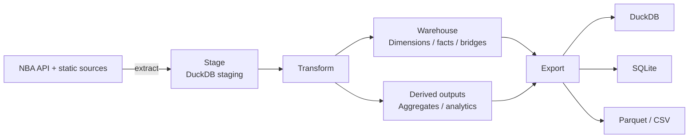

# nbadb


**The most comprehensive open NBA database available.**

[](https://pypi.org/project/nbadb/)
[](https://pypi.org/project/nbadb/)
[](LICENSE)
[](https://github.com/wyattowalsh/nba-db/actions/workflows/ci.yml)
[](https://duckdb.org)
[](https://pola.rs/)
[](https://github.com/astral-sh/ruff)
[](https://nbadb.w4w.dev)
[](https://www.kaggle.com/datasets/wyattowalsh/basketball)
[](https://nbadb.w4w.dev/docs/schema)

| Extractor coverage                | Public model                  | Derived outputs                              | Docs site                                       |
| --------------------------------- | ----------------------------- | -------------------------------------------- | ----------------------------------------------- |
| Current `nba_api` runtime surface | Generated star-schema outputs | Generated `agg_*` and `analytics_*` surfaces | Guides, references, diagrams, and lineage pages |

## 📊 What's Inside

nbadb exposes an analytics-first warehouse surface rather than a thin mirror of raw upstream payloads.

| Surface           | What it covers                                                                                                                |
| ----------------- | ----------------------------------------------------------------------------------------------------------------------------- |
| **`dim_*`**       | Stable identity and lookup context for players, teams, games, seasons, arenas, officials, and other conformed dimensions      |
| **`fact_*`**      | Event and measurement tables across box scores, tracking, shot charts, play-by-play, standings, matchups, and specialty feeds |
| **`bridge_*`**    | Many-to-many connectors where public entities legitimately fan out                                                            |
| **`agg_*`**       | Reusable rollups for season, career, pace, efficiency, and other repeated reporting needs                                     |
| **`analytics_*`** | Convenience outputs for notebooks, dashboards, and quick exploratory analysis                                                 |

For the current public contract, use the generated docs surfaces: **[Schema Reference](https://nbadb.w4w.dev/docs/schema)**, **[Data Dictionary](https://nbadb.w4w.dev/docs/data-dictionary)**, and **[Lineage](https://nbadb.w4w.dev/docs/lineage)**.

## 🏀 Data Coverage

nbadb covers the **1946-47 season to present** for executable `nba_api` contracts,
with current seasons auto-updated by the daily pipeline and every upstream-unavailable,
blocked, or not-yet-modeled contract classified explicitly rather than silently omitted.

Trust floor: preserve and improve full historical `nba_api` coverage for every year available per endpoint. If an endpoint/year/season-type combination is unavailable upstream or blocked by a known contract gap, classify it explicitly in coverage reports and support matrices instead of silently dropping it.

- **Game-level** — box scores (traditional, advanced, misc, four factors, hustle, tracking), play-by-play, shot charts, rotations, win probability, game context, scoring runs
- **Player-level** — career stats, season splits, matchups, awards, draft combine measurements, player tracking (speed, distance, touches, passes, rebounding, shooting), estimated metrics
- **Team-level** — game logs, matchups, splits, clutch stats, franchise history, IST standings, playoff picture, pace and efficiency, player dashboards
- **League-level** — leaders, hustle stats, lineup visualizations, shot locations by zone, synergy play types, league-wide tracking
- **Video/media** — video details, assets, events, and status surfaces, including every documented/runtime video context measure and explicit request provenance

## 📦 Output Formats

| Format  | Path         | Description                                                        |
| ------- | ------------ | ------------------------------------------------------------------ |
| DuckDB  | `nba.duckdb` | Canonical analytics engine — columnar storage and fast SQL queries |
| SQLite  | `nba.sqlite` | Kaggle preview-friendly portable relational database               |
| Parquet | `parquet/`   | Zstd-compressed columnar files, partitioned by season              |
| CSV     | `csv/`       | Universal flat files for any tool                                  |

## 🚀 Quick Start

> [!TIP]
>
> ```bash
> pip install nbadb    # or: uv add nbadb
>
> # Full local build from scratch (1946-present; runtime depends on endpoint availability and throttling)
> nbadb init
>
> # Daily incremental update (~5-15 minutes)
> nbadb daily
>
> # Export to all formats
> nbadb export
>
> # Query with natural language
> nbadb ask "who led the league in scoring last season"
>
> # Upload to Kaggle and verify the published bundle
> nbadb upload --verify-remote
> ```

## ⌨️ CLI Reference

| Command                             | Description                                                                                                        |
| ----------------------------------- | ------------------------------------------------------------------------------------------------------------------ |
| `nbadb init`                        | Local full historical build                                                                                        |
| `nbadb daily`                       | Current-season refresh plus automatic live snapshot append when games are active                                   |
| `nbadb monthly`                     | Last-3-seasons refresh plus automatic live snapshot append when games are active                                   |
| `nbadb backfill`                    | Recovery and targeted historical repair                                                                            |
| `nbadb live-snapshot`               | Manually append a live snapshot for active or explicit game ids                                                    |
| `nbadb migrate`                     | Run schema migrations                                                                                              |
| `nbadb scan --fail-on error`        | Hard assurance gate for missing data, gaps, and quality issues                                                     |
| `nbadb export`                      | Re-export DuckDB → SQLite / Parquet / CSV                                                                          |
| `nbadb upload`                      | Stage declared resources, validate the bundle, push to Kaggle, and optionally verify exact-version remote readback |
| `nbadb download`                    | Pull the Kaggle dataset and seed local DuckDB                                                                      |
| `nbadb extract-completeness`        | Report coverage gaps; with an upstream checkout, generate `nba_api` contracts                                      |
| `nbadb endpoint-support-matrix`     | Report strict endpoint support + warehouse contract coverage                                                       |
| `nbadb endpoint-adequacy-scorecard` | Generate endpoint adequacy scorecard artifacts                                                                     |
| `nbadb audit-models`                | Generate end-to-end model + result-table audit artifacts                                                           |
| `nbadb schema-annotation-audit`     | Generate schema annotation, route, and field fate audit artifacts                                                  |
| `nbadb table-year-coverage`         | Generate table/year coverage summary artifacts                                                                     |
| `nbadb docs-autogen`                | Regenerate generator-owned schema, data dictionary, ER, and lineage artifacts                                      |
| `nbadb schema [TABLE]`              | Show schema for a table or list all star tables                                                                    |
| `nbadb status`                      | Pipeline status, row counts, and watermarks                                                                        |
| `nbadb journal-summary`             | Export pipeline telemetry summary artifacts                                                                        |
| `nbadb ask QUESTION`                | Natural-language query interface (read-only)                                                                       |
| `nbadb chat`                        | AI-powered Chainlit chat interface backed by the local DuckDB warehouse                                            |
| `nbadb full`                        | Fill gaps and retry failed extractions (deprecated—use `backfill` instead)                                         |
| `nbadb lint-sql`                    | Lint SQL in transformers against SQLFluff rules                                                                    |
| `nbadb metadata`                    | Generate Kaggle metadata JSON                                                                                      |

Run `nbadb --help` or `nbadb <command> --help` for full option details.

Full-extraction release publishes should use `nbadb upload --full-publication`. This
mode requires terminal extraction assurance and implies exact remote verification. The
publication marker
resolves an exact positive Kaggle version; verification then paginates that version's
complete API file inventory and downloads one file at a time for full SHA-256
readback, deleting each temporary file after it is checked. Full publication also
requires a valid `assured-artifact-manifest.json` and matching
`terminal-assurance-report.json` whose inventory and provenance exactly match the
published files. Generic `--verify-remote` still proves the exact Kaggle version and
every resource digest without requiring full-extraction provenance; an ordinary upload
without readback is reported as submitted and unverified. Generated metadata covers all
254 runtime transform outputs rather than a curated subset. A marker-specific HTTP 404
can enter a one-upload bootstrap path after
the dataset metadata API supplies the current version; any other baseline lookup error
stops before upload. If an upload remains unresolved, every later bundle is
reconciliation-only until exact evidence resolves it. Full, daily, and monthly
workflows publish only from the default branch, serialize publishers through a FIFO
queue, and preserve reconciliation state in a shared Actions cache and publication
artifacts. Metadata is committed only after the remote file inventory and every
resource digest match.

For docs-site maintenance, regenerate generator-owned artifacts from the repo root with:

```bash
uv run nbadb docs-autogen --docs-root docs/content/docs
```

That command owns the generated schema references, data-dictionary tier pages,
ER/lineage auto pages, `docs/lib/generated/*`, and `docs/lib/site-metrics.generated.ts`.

## 🧭 Companion Surfaces

This repository now carries two repo-owned companion surfaces alongside the warehouse code:

- `chat/` — the canonical Chainlit chat application surface used by `nbadb chat`
- `src/nbadb/chat/` — shared launcher, notebook, runtime, tracing, SQL, catalog, and memory helpers that back the chat UX
- `kb/` — an intentional Obsidian-native companion knowledge base for maintainers and agents; it supplements repo canon and public docs, but does not replace them

`README.md`, `AGENTS.md`, `docs/`, and `src/nbadb/` remain canonical material. The `kb/` vault is additive-first and exists to improve navigation, provenance, and maintainer context without replacing the public docs site.

## 🤖 AI Query Interface

`nbadb ask` translates natural-language questions into read-only DuckDB queries:

```bash
nbadb ask "top 5 players by career three-pointers made"
nbadb ask "which teams had the best home record in 2023-24"
nbadb ask "LeBron James career averages by season"
```

Queries run against the star schema with safety guards: read-only DuckDB connections, external access disabled, static SQL validation, DuckDB planning checks, row limits, and optional `--verbose` SQL provenance.

Launch the browser-based chat UI with:

```bash
nbadb chat
```

The Chainlit app lives in `chat/`, while shared runtime, catalog, and SQL result helpers live in `src/nbadb/chat/`.

## 📓 Kaggle Notebooks

Ten analysis notebooks are published on Kaggle, all powered by this dataset:

| Notebook                                                                                     | Description                                           |
| -------------------------------------------------------------------------------------------- | ----------------------------------------------------- |
| [NBA Aging Curves](https://www.kaggle.com/code/wyattowalsh/nba-aging-curves)                 | Peak, prime, and decline — career trajectory modeling |
| [Defense Decoded](https://www.kaggle.com/code/wyattowalsh/nba-defense-decoded)               | Tracking + hustle + synergy PCA to quantify defense   |
| [Draft Combine Analysis](https://www.kaggle.com/code/wyattowalsh/nba-draft-combine-analysis) | What pre-draft measurements actually predict          |
| [Game Prediction](https://www.kaggle.com/code/wyattowalsh/nba-game-prediction)               | Stacking ensemble model for game outcomes             |
| [MVP Predictor](https://www.kaggle.com/code/wyattowalsh/nba-mvp-predictor)                   | Explainable ML for MVP voting prediction              |
| [Play-by-Play Insights](https://www.kaggle.com/code/wyattowalsh/nba-play-by-play-insights)   | Win probability, scoring runs, and clutch analysis    |
| [Player Archetypes](https://www.kaggle.com/code/wyattowalsh/nba-player-archetypes)           | UMAP + GMM clustering — 8 data-driven player types    |
| [Player Dashboard](https://www.kaggle.com/code/wyattowalsh/nba-player-dashboard)             | Interactive explorer with 50+ metrics                 |
| [Player Similarity](https://www.kaggle.com/code/wyattowalsh/nba-player-similarity)           | Find any player's statistical twin                    |
| [Shot Chart Analysis](https://www.kaggle.com/code/wyattowalsh/nba-shot-chart-analysis)       | The geography of scoring and the 3-point revolution   |

## 🏗️ Architecture



- **Polars** for all DataFrame operations with zero-copy Arrow interchange to DuckDB
- **3-tier Pandera validation** — raw → staging → star
- **SQL-first transforms** for the star surface, with dependency-ordered execution
- **SCD Type 2** for `dim_player` and `dim_team_history` (surrogate keys, `valid_from`/`valid_to`)
- **Checkpoint/resume** for interrupted transform runs
- **Watermark tracking** for incremental extraction
- **Proxy rotation** via proxywhirl with circuit-breaker failover

The GitHub Actions full-extraction control plane defaults to the `standard` chunk
profile and targets a `5:3:1:1` rotation across fresh, partial-progress, retry,
and infrastructure lanes when every queue has work. When an alternative endpoint is
available, the scheduler also prevents a six-lane runner window from containing only
one endpoint identity. This spreads endpoint pressure across the six-runner window;
it does not prove that the runners have six unique VPN exit IPs. A centralized
discovery job seeds only the current wave's exact
season/season-type scopes, carries those artifacts forward by chain and source
run, refreshes active-season player/game/workload evidence, and blocks matrix
fan-out when any required scope remains unproven. Aggregate-only player waves still
refresh the active season, and sparse player-team misses are fetched as exact pairs.
The manifest is generated only from executable parameter contracts. The comparison
surfaces `player_vs_player`, `team_vs_player`, `team_and_players_vs`, and its
extractor-only `team_and_players_vs_players` alias remain schema-backed and
documented, but are classified as `contract_not_modeled_yet` for
historical fan-out because the current affiliation workload cannot supply observed
player pairs or opposing lineups. They are not replaced with synthetic Cartesian
requests, and restored manifests that still schedule them fail before VPN preflight.
`league_game_log` is owned by the centralized discovery seed instead of redundant
extract lanes. Canonical coverage rows that combine alternate wrappers are projected
back to every concrete endpoint/pattern route before lane generation, preserving each
distinct staging surface without scheduling endpoint-name aliases as zero-work jobs.
`video_details` and `video_details_asset` parse every recursively nested result set
instead of assuming one static table. Full extraction classifies 1946-47 through
2003-04 as `contract_blocked` because an exact 290-scope discovery pass found 89,722
LeagueGameLog rows with no video-bearing game; it retains every season from 2004-05
onward.
Their rows carry endpoint, result-set, player/team/season/type, and context-measure
provenance. The extraction contract covers all 78 measures found across the installed
runtime and upstream docs/tools, schedules at most three measures per lane, and
classifies pre-2019 PlayIn, pre-1950-51 All Star, and cancelled 1998-99 All Star
requests as upstream-unavailable. Non-2xx responses are rejected before JSON parsing;
HTTP 429/5xx responses and equivalent JSON error envelopes remain retryable, while
malformed success payloads fail closed as response-contract errors. The asset route
also uses a ten-call persistence boundary, isolated two-call concurrency, a 15-second
request timeout, no in-call retries, a fully-failed-chunk stop, and a 600-second
no-completed-chunk watchdog. Empty successful responses are journaled only after their
zero-row staging chunk is durable.
VPN-backed work accepts a tunnel only after route and changed-exit-IP checks, a
bounded GitHub control-plane reachability probe, strict NBA result-set probe, and
installed-stack player/game discovery canaries pass.
The player canary also requires a positive player/team membership row.
NBA-blocked servers are rejected across fallback technologies. Preflight and discovery
failures, plus failed hosts reported by successful concurrent capacity probes, are
validated and merged into both the current lane quarantine and child manifests. A
capacity probe that cannot complete leaves diagnostics and blocks the matrix before a
child manifest exists; its unvalidated host inventory is not promoted. Authentication
rejections remain separate from server-health quarantine: downstream jobs reuse the
credential source proven by preflight, pause after bounded rejection sweeps, and
rotate servers and protocols only after a budgeted cooldown. Servers that pass the
preflight NBA probes are tried first by the serial discovery job; preflight and
discovery successes are then handed to extraction as a verified pool. Logical lane
indexes never wrap a verified preferred host onto a later lane. Matrix rows also carry
one of the bounded `vpn_parallelism` slots; later logical lanes reuse a slot only after
its `queue: max` job concurrency group releases it. Fresh recommendation hostnames are
assigned by a run-attempt-seeded hash to exactly one live slot, and additive candidate
expansion does not reassign hosts between slots. Each active lane still runs on a
separate runner and tunnel, but neither server selection nor scheduling attests unique
exit IPs. VPN lane parallelism defaults to two. Token-derived extraction is serialized,
disables parallel recommendation partitioning, and VPN/auto full-extraction workflows
cannot overlap another VPN-backed full chain.
Discovery uses hard request timeouts and spends its bounded retry budget on both
transport-transient failures and response-contract/validation failures, including
wrapped causes. True application errors remain permanent. It also uses a bounded
homogeneous-outage canary, a 90-minute soft deadline, a 95-minute process watchdog,
atomic coverage summaries, and content-addressed
discovery/workload Parquet generations whose manifest pointers bind scope or pairs,
schema, row counts, and SHA-256. A complete bundle is checked against the exact
lane-manifest digest and independently reloaded before upload and after lane download.
Partial state is retained under a run/attempt-scoped
recovery name; it can seed a retry, but it cannot spend lane retries, trigger child
dispatch, or become canonical without passing the full seed and verifier gates.
Each checkpoint generation copies the previous database into a new output before
applying attested current lane deltas, preserving legitimate duplicate multiplicity
while removing checkpoint overlap. Prior checkpoints and historical/current lane
artifacts are accepted only when chain, source, run, artifact name, generation, and
coverage provenance match exactly; a prior checkpoint containing any lane outside the
current manifest is rejected. Lane snapshots are resumable only after a DuckDB
checkpoint, WAL removal, structural validation, exact database digest, and a successful
artifact upload whose positive ID and SHA-256 receipt are finalized into metadata. A failed
checkpoint build remains attempt-scoped diagnostics; the canonical checkpoint name is
uploaded only after successful validation. Canonical metadata schema v3 is uploaded
even when no lane snapshot can be attested, so restore/VPN failures remain visible to
lane control and failed servers still enter the chain quarantine.
`vpn_network_error`, authentication failure, and connect timeout are all bounded
`vpn_egress` failures rather than one-shot application failures.
Configured-credential waves first run a concurrent VPN capacity gate sized to the
actual active lane count and `vpn_parallelism`; any failed probe blocks the extraction
matrix. Every probe publishes a run-attempt marker while its tunnel remains connected,
waits for all peer markers, and then rechecks its process, route, and exit IP before
disconnecting, so the gate proves overlapping live tunnels rather than sequential
logins. A separate fail-closed job downloads and validates every capacity marker,
merges the successful probes' failed servers with preflight and discovery failures, and publishes the
run-attempt-scoped effective-quarantine report before extraction is admitted.
Extraction lanes then reserve a complete connection attempt and cleanup, one bounded
five-minute cooldown, and a complete follow-up attempt and cleanup before starting an
authentication-capacity probe. The recovery sweep tolerates up to three further
rejections inside a 12-minute connector budget. Every server attempt stops before a
120-second connector finalization reserve for process cleanup, work-directory
readability, and action outputs; the outer supervisor retains a separate emergency
margin.
Preflight and discovery keep their shorter fail-closed deadlines. Token-derived and
direct runs skip the configured-credential capacity gate.
VPN-backed planning also caps each matrix wave at `vpn_parallelism * 32` jobs (64 at the
default configured value of two); the later admission gate can prove fewer active
tunnels, and token authentication serializes execution without changing that planned
batch cap. The larger matrix is assigned round-robin to the admitted VPN slots, with a
non-cancelling queue serializing every repeated slot. If a later connector receives
`vpn_auth_failure`, it publishes an immutable
run-attempt circuit marker. Queued lanes consult that marker before authentication and
trust it only after the REST artifact identity, workflow run/source, archive SHA-256,
single safe JSON member, and marker provenance all validate. A verified marker emits
retry-neutral deferred metadata and prevents another connector call. An unavailable or
invalid artifact lookup also prevents authentication, but emits
`vpn_auth_circuit_check_failed` as a bounded `runner_infrastructure` retry; it neither
opens the provider circuit nor suppresses a healthy redispatch. Lanes already admitted
before the first marker can each receive a rejection and consume one bounded VPN retry.
Any authoritative rejection or valid circuit-open deferral opens the lane-control
circuit. The current wave checkpoints completed work and suppresses automatic
redispatch until the account-capacity issue is repaired and the chain is resumed.
Each extract job records a 350-minute internal deadline before checkout, inside the
360-minute Actions job cap, and caps the lane's effective extraction timeout against
current elapsed time. This preserves at least 20 minutes for status finalization,
state attestation, artifact upload and retry, diagnostics, and tunnel cleanup, plus a
separate job-level margin.
State-attestation schema v3 binds each player/team/season snapshot to the exact
lane workload, including zero-pair sentinels, and rejects unexpected journal identities
during both restore and checkpoint merge. Append-only growth outside that lane is safe:
checkpoints carry `included_lane_workload_contracts` and compare the generation-independent
scope identity before rebinding the lane to the current cumulative generation. Only metadata
with an explicitly attested, durably uploaded artifact pointer can carry state into a retry;
active partial pointers use
`extraction-lane-recovery-<chain>-<lane>-run-<run>-attempt-<attempt>` with matching positive
run and attempt identities. Canonical complete-lane artifact names are not partial-resume
pointers. An invalid or missing new receipt never replaces an older canonical recovery pointer
or its counters. Without prior durable state, the pointer and progress baseline remain clear;
in either case, unreceipted reported counter growth remains diagnostics-only and increments the
cumulative no-progress streak.
Partial lanes that add calls or rows retry in place so their journal progress remains reusable,
including transport-class `needs_resume` outcomes. Timeout-class lanes split only when the
latest attempt adds no durable progress. Complete and partial lane-state uploads each get one
exact-name overwrite retry before metadata is downgraded to diagnostics-only. Split children
clear parent pointers and progress baselines, and duplicate child IDs fail before checkpoint
indexing. False
`contract_blocked` declarations fail closed. Valid blocked lanes are recorded in a
separate artifact-bound evidence inventory whose canonical rows and digest are committed
in manifest chain state across generations. Cancellation/source resume carries newly
classified rows in a digest-bound pending commitment until the next checkpoint consumes
and clears it; they do not inflate the effective
checkpoint coverage used for terminal assured identity.
Manual workflow cancellation prevents queued network jobs from being admitted and the
lane wrapper makes a bounded attempt to terminate its child and emit `cancelled`
outputs. GitHub can still tear down an ephemeral runner before later artifact steps run,
so cancellation is not an artifact-durability guarantee; recovery starts from the last
attested upload or checkpoint. A dispatch interrupted before child acknowledgement also
makes a best-effort API cancellation of the newly created child.
Chained runs preserve literal `max_iterations=auto`, set one fixed numeric cap from
remaining matrix dispatch credits and retry depth, and never extend that cap in a
child run. They refuse an active or successful `chain=<id> iteration=<n>` dispatch
while allowing recovery from failed/cancelled history. Cumulative no-progress retries
remain bounded even when failure classes alternate, and a self-dispatch is
acknowledged only after a stabilization poll still finds exactly one newly created
exact-title child.
The pinned source SHA must remain on its trusted branch. Terminal assurance has
read-only permissions; `publish=false` never receives Kaggle secrets, while
`publish=true` consumes the exact assured artifact in a separate FIFO-serialized
writer job. Terminal assurance exports every format before running the hard scan with
required nonempty silver/gold domain anchors, declared silver-to-gold row-count parity,
and a checkpoint report canonically bound to its
manifest, database, chain, source commit, and every planned lane,
then builds the sorted SHA-256 manifest from the
validated effective checkpoint coverage. The publisher downloads the exact GitHub
artifact ID, normalizes and verifies the archive SHA-256 against the upload result,
assured data identity, includes it in Kaggle metadata and marker v2, paginates the
exact remote version inventory, and streams every remote file through SHA-256
readback before pushing checked-in metadata as its final step. Every marker-present
baseline is matched to the current metadata version and rechecked immediately before
upload, preventing a concurrent publisher from being silently superseded. A publication rerun
accepts only the original source or its single byte-identical metadata-only child. A
zero-active resume replays the exact `checkpoint-manifest.json` stored with its attested
terminal checkpoint when present; after interruption before checkpointing,
it rebuilds from the exact complete lane/database pairs named by the chain's recorded
`chain_state.artifact_run_ids`.
For a one-lane VPN proof, `targeted_smoke=true` requires a manual manifest,
`publish=false`, `max_iterations=1`, and `retry_pipeline_failures=false`. It skips
global merge/scan and redispatch, then succeeds only when lane control and the
checkpoint attest exactly one complete terminal lane. This is an extractor proof,
not full-dataset assurance.

Read more in the full **[Architecture Guide](https://nbadb.w4w.dev/docs/architecture)**.

## 🔧 Tech Stack

| Component       | Technology                                                                                                              |
| --------------- | ----------------------------------------------------------------------------------------------------------------------- |
| Language        | Python ≥3.12                                                                                                            |
| Package Manager | [uv](https://docs.astral.sh/uv/)                                                                                        |
| NBA API client  | [nba_api](https://github.com/swar/nba_api) 1.11.4 (exact contract pin)                                                  |
| DataFrames      | [Polars](https://pola.rs/) 1.42.1                                                                                       |
| Validation      | [Pandera](https://pandera.readthedocs.io/) 0.32.1 (Polars backend)                                                      |
| Analytics DB    | [DuckDB](https://duckdb.org/) 1.5.4                                                                                     |
| Relational DB   | [SQLModel](https://sqlmodel.tiangolo.com/) 0.0.39 + SQLite                                                              |
| HTTP / Proxy    | [proxywhirl](https://github.com/wyattowalsh/proxywhirl)                                                                 |
| CLI             | [Typer](https://typer.tiangolo.com/) + [Rich](https://rich.readthedocs.io/) + [Textual](https://textual.textualize.io/) |
| Type Checking   | [ty](https://github.com/astral-sh/ty) 0.0.58                                                                            |
| Linting         | [Ruff](https://docs.astral.sh/ruff/)                                                                                    |
| Docs            | [Fumadocs](https://fumadocs.vercel.app/) + [Next.js](https://nextjs.org/) + [pnpm](https://pnpm.io/) 11.x               |
| CI              | GitHub Actions (SHA-pinned)                                                                                             |

## 📖 Documentation

Full documentation lives at **[nbadb.w4w.dev](https://nbadb.w4w.dev)**.

- **[Getting Started](https://nbadb.w4w.dev/docs)** — install, run the pipeline, and learn where to go next
- **[Architecture](https://nbadb.w4w.dev/docs/architecture)** — pipeline stages, validation layers, and state tables
- **[Schema Reference](https://nbadb.w4w.dev/docs/schema)** — curated star-surface guide plus generated raw/staging/star references
- **[Data Dictionary](https://nbadb.w4w.dev/docs/data-dictionary)** — glossary plus generated raw/staging/star field references
- **[Diagrams](https://nbadb.w4w.dev/docs/diagrams)** — ER, endpoint map, and pipeline visuals
- **[Lineage](https://nbadb.w4w.dev/docs/lineage)** — trace endpoints and staging inputs to final tables
- **[Guides](https://nbadb.w4w.dev/docs/guides)** — onboarding, query recipes, Parquet, Kaggle, and troubleshooting
- **[Playground](https://nbadb.w4w.dev/docs/playground)** — in-browser DuckDB SQL exploration

## 📄 License

MIT
