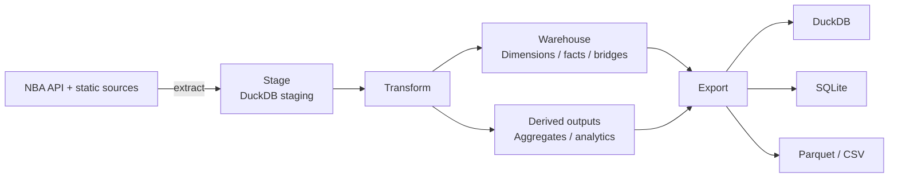

# nbadb


**The most comprehensive open NBA database available.**

[](https://pypi.org/project/nbadb/)
[](https://pypi.org/project/nbadb/)
[](LICENSE)
[](https://github.com/wyattowalsh/nba-db/actions/workflows/ci.yml)
[](https://duckdb.org)
[](https://pola.rs/)
[](https://github.com/astral-sh/ruff)
[](https://nbadb.w4w.dev)
[](https://www.kaggle.com/datasets/wyattowalsh/basketball)
[](https://nbadb.w4w.dev/docs/schema)

| Extractors | Warehouse Models | Derived Outputs | Docs Pages |
| ---------- | ---------------- | --------------- | ---------- |
| 154 | 96 | 24 | 49 |

## 📊 What's Inside

nbadb exposes an analytics-first warehouse surface rather than a thin mirror of raw upstream payloads.

| Surface | What it covers |
| ------- | -------------- |
| **`dim_*`** | Stable identity and lookup context for players, teams, games, seasons, arenas, officials, and other conformed dimensions |
| **`fact_*`** | Event and measurement tables across box scores, tracking, shot charts, play-by-play, standings, matchups, and specialty feeds |
| **`bridge_*`** | Many-to-many connectors where public entities legitimately fan out |
| **`agg_*`** | Reusable rollups for season, career, pace, efficiency, and other repeated reporting needs |
| **`analytics_*`** | Convenience outputs for notebooks, dashboards, and quick exploratory analysis |

For the current public contract, use the generated docs surfaces: **[Schema Reference](https://nbadb.w4w.dev/docs/schema)**, **[Data Dictionary](https://nbadb.w4w.dev/docs/data-dictionary)**, and **[Lineage](https://nbadb.w4w.dev/docs/lineage)**.

## 🏀 Data Coverage

All data spans from the **1946-47 season to present** (auto-updating via the daily pipeline).

- **Game-level** — box scores (traditional, advanced, misc, four factors, hustle, tracking), play-by-play, shot charts, rotations, win probability, game context, scoring runs
- **Player-level** — career stats, season splits, matchups, awards, draft combine measurements, player tracking (speed, distance, touches, passes, rebounding, shooting), estimated metrics
- **Team-level** — game logs, matchups, splits, clutch stats, franchise history, IST standings, playoff picture, pace and efficiency, player dashboards
- **League-level** — leaders, hustle stats, lineup visualizations, shot locations by zone, synergy play types, league-wide tracking

## 📦 Output Formats

| Format | Path | Description |
| ------ | ---- | ----------- |
| DuckDB | `nba.duckdb` | Primary analytics engine — columnar storage and fast SQL queries |
| SQLite | `nba.sqlite` | Portable single-file relational database |
| Parquet | `parquet/` | Zstd-compressed columnar files, partitioned by season |
| CSV | `csv/` | Universal flat files for any tool |

## 🚀 Quick Start

> [!TIP]
>
> ```bash
> pip install nbadb    # or: uv add nbadb
>
> # Full build from scratch (1946-present, ~2-4 hours)
> nbadb init
>
> # Daily incremental update (~5-15 minutes)
> nbadb daily
>
> # Export to all formats
> nbadb export
>
> # Query with natural language
> nbadb ask "who led the league in scoring last season"
>
> # Upload to Kaggle
> nbadb upload
> ```

## ⌨️ CLI Reference

| Command | Description |
| ------- | ----------- |
| `nbadb init` | Full pipeline — extract all endpoints, stage, transform, export |
| `nbadb daily` | Incremental update for recent games |
| `nbadb monthly` | Dimension refresh + recent data |
| `nbadb full` | Full re-extraction without export |
| `nbadb migrate` | Run schema migrations |
| `nbadb audit-models` | Inventory consistency, column lineage, and validation gap audit |
| `nbadb export` | Re-export DuckDB → SQLite / Parquet / CSV |
| `nbadb upload` | Push the dataset to Kaggle |
| `nbadb download` | Pull the Kaggle dataset and seed local DuckDB |
| `nbadb extract-completeness` | Report endpoint coverage gaps |
| `nbadb docs-autogen` | Regenerate generator-owned schema, data dictionary, ER, and lineage artifacts |
| `nbadb schema [TABLE]` | Show schema for a table or list all star tables |
| `nbadb status` | Pipeline status, row counts, and watermarks |
| `nbadb ask QUESTION` | Natural-language query interface (read-only) |

Run `nbadb --help` or `nbadb <command> --help` for full option details.

For docs-site maintenance, regenerate generator-owned artifacts from the repo root with:

```bash
uv run nbadb docs-autogen --docs-root docs/content/docs
```

## 🤖 AI Query Interface

`nbadb ask` translates natural-language questions into read-only DuckDB queries:

```bash
nbadb ask "top 5 players by career three-pointers made"
nbadb ask "which teams had the best home record in 2023-24"
nbadb ask "LeBron James career averages by season"
```

Queries run against the star schema with safety guards (read-only mode, query limits, SQL injection protection).

## 📓 Kaggle Notebooks

Ten analysis notebooks are published on Kaggle, all powered by this dataset:

| Notebook | Description |
| -------- | ----------- |
| [NBA Aging Curves](https://www.kaggle.com/code/wyattowalsh/nba-aging-curves) | Peak, prime, and decline — career trajectory modeling |
| [Defense Decoded](https://www.kaggle.com/code/wyattowalsh/nba-defense-decoded) | Tracking + hustle + synergy PCA to quantify defense |
| [Draft Combine Analysis](https://www.kaggle.com/code/wyattowalsh/nba-draft-combine-analysis) | What pre-draft measurements actually predict |
| [Game Prediction](https://www.kaggle.com/code/wyattowalsh/nba-game-prediction) | Stacking ensemble model for game outcomes |
| [MVP Predictor](https://www.kaggle.com/code/wyattowalsh/nba-mvp-predictor) | Explainable ML for MVP voting prediction |
| [Play-by-Play Insights](https://www.kaggle.com/code/wyattowalsh/nba-play-by-play-insights) | Win probability, scoring runs, and clutch analysis |
| [Player Archetypes](https://www.kaggle.com/code/wyattowalsh/nba-player-archetypes) | UMAP + GMM clustering — 8 data-driven player types |
| [Player Dashboard](https://www.kaggle.com/code/wyattowalsh/nba-player-dashboard) | Interactive explorer with 50+ metrics |
| [Player Similarity](https://www.kaggle.com/code/wyattowalsh/nba-player-similarity) | Find any player's statistical twin |
| [Shot Chart Analysis](https://www.kaggle.com/code/wyattowalsh/nba-shot-chart-analysis) | The geography of scoring and the 3-point revolution |

## 🏗️ Architecture



- **Polars** for all DataFrame operations with zero-copy Arrow interchange to DuckDB
- **3-tier Pandera validation** — raw → staging → star
- **SQL-first transforms** for the star surface, with dependency-ordered execution
- **SCD Type 2** for `dim_player` and `dim_team_history` (surrogate keys, `valid_from`/`valid_to`)
- **Checkpoint/resume** for interrupted transform runs
- **Watermark tracking** for incremental extraction
- **Proxy rotation** via proxywhirl with circuit-breaker failover

Read more in the full **[Architecture Guide](https://nbadb.w4w.dev/docs/architecture)**.

## 🔧 Tech Stack

| Component | Technology |
| --------- | ---------- |
| Language | Python 3.12 |
| Package Manager | [uv](https://docs.astral.sh/uv/) |
| DataFrames | [Polars](https://pola.rs/) 1.38 |
| Validation | [Pandera](https://pandera.readthedocs.io/) (Polars backend) |
| Analytics DB | [DuckDB](https://duckdb.org/) 1.4 |
| Relational DB | [SQLModel](https://sqlmodel.tiangolo.com/) + SQLite |
| HTTP / Proxy | [proxywhirl](https://github.com/wyattowalsh/proxywhirl) |
| CLI | [Typer](https://typer.tiangolo.com/) + [Rich](https://rich.readthedocs.io/) + [Textual](https://textual.textualize.io/) |
| Type Checking | [ty](https://github.com/astral-sh/ty) |
| Linting | [Ruff](https://docs.astral.sh/ruff/) |
| Docs | [Fumadocs](https://fumadocs.vercel.app/) + [Next.js](https://nextjs.org/) |
| CI | GitHub Actions (SHA-pinned) |

## 📖 Documentation

Full documentation lives at **[nbadb.w4w.dev](https://nbadb.w4w.dev)**.

- **[Getting Started](https://nbadb.w4w.dev/docs)** — install, run the pipeline, and learn where to go next
- **[Architecture](https://nbadb.w4w.dev/docs/architecture)** — pipeline stages, validation layers, and state tables
- **[Schema Reference](https://nbadb.w4w.dev/docs/schema)** — curated star-surface guide plus generated raw/staging/star references
- **[Data Dictionary](https://nbadb.w4w.dev/docs/data-dictionary)** — glossary plus generated raw/staging/star field references
- **[Diagrams](https://nbadb.w4w.dev/docs/diagrams)** — ER, endpoint map, and pipeline visuals
- **[Lineage](https://nbadb.w4w.dev/docs/lineage)** — trace endpoints and staging inputs to final tables
- **[Guides](https://nbadb.w4w.dev/docs/guides/role-based-onboarding-hub)** — onboarding, query recipes, Parquet, Kaggle, and troubleshooting

## 📄 License

MIT
