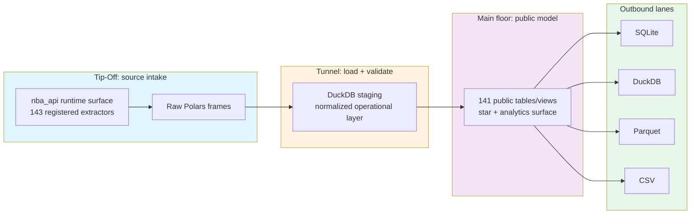

import { Callout } from "fumadocs-ui/components/callout";

# Architecture

Think of nbadb as an **arena control tower** for NBA data: extraction brings the game film in, DuckDB stages and validates it, transformers reshape it into analytics-ready tables, and export lanes package it for downstream use.

<StatGrid columns={4}>
  <StatPill label="Extractors" value="143" note="registered wrappers over the current nba_api runtime surface" />
  <StatPill label="Public outputs" value="141" note="dimensions, facts, bridges, aggregates, and analytics surfaces" />
  <StatPill label="Export formats" value="4" note="sqlite, duckdb, csv, and parquet" />
  <StatPill label="Internal state tables" value="8" note="watermarks, journals, checkpoints, metrics, and schema history" />
</StatGrid>

## Quick navigation

<div className="grid gap-4 md:grid-cols-2 xl:grid-cols-4">
  <ScoutCard title="See the pipeline path" label="Entry surface">
    Start with <a href="#the-short-version">The short version</a> for the raw → staging → star flow before you drop into details.
  </ScoutCard>
  <ScoutCard title="Map commands to run modes" label="Entry surface">
    Jump to <a href="#command-intent-by-run-mode">Command intent by run mode</a> if your question is operational rather than structural.
  </ScoutCard>
  <ScoutCard title="Understand public vs internal tables" label="Entry surface">
    Use <a href="#validation-and-operational-state">Validation and operational state</a> when you need to know what is contract surface versus pipeline machinery.
  </ScoutCard>
  <ScoutCard title="Check generated-docs boundaries" label="Entry surface">
    Go to <a href="#docs-boundary-what-is-generated-vs-curated">Docs boundary</a> if you are editing docs and need to know what is command-owned.
  </ScoutCard>
</div>

## Use this page when…

| If you need to answer… | Start here |
| ---------------------- | ---------- |
| “How does data move from the NBA API into the warehouse?” | [The short version](#the-short-version) |
| “Which layer is public contract versus internal pipeline machinery?” | [Validation and operational state](#validation-and-operational-state) |
| “What is actually different between `init`, `daily`, `monthly`, and `full`?” | [Command intent by run mode](#command-intent-by-run-mode) |
| “Which docs are hand-written and which are command-owned?” | [Docs boundary: what is generated vs. curated](#docs-boundary-what-is-generated-vs-curated) |



## The short version

- **Extraction** wraps the NBA stats surface with registered extractors and produces Polars DataFrames.
- **Staging** lands result sets in DuckDB, where normalized schemas and pipeline state live.
- **Transforms** build the public analytical surface in dependency order.
- **Exports** write the same modeled data to SQLite, DuckDB, Parquet, and CSV.
- **Distribution** can publish the built dataset to Kaggle.

### Pipeline path in one glance

| Stage | Primary input | Primary output | Why this stage exists |
| ----- | ------------- | -------------- | --------------------- |
| Extraction | `nba_api` runtime endpoints | Raw Polars frames | Capture source data with retries, rate controls, and extractor-specific handling |
| Staging | Raw frames | Normalized DuckDB staging tables | Standardize types, names, and warehouse-ready shape before modeling |
| Transform | Staging tables | Public `dim_*`, `fact_*`, `bridge_*`, `agg_*`, and `analytics_*` outputs | Turn endpoint-shaped payloads into analysis-friendly structures |
| Export | Public modeled surface | SQLite, DuckDB, Parquet, and CSV artifacts | Make the same warehouse available in the formats downstream tools expect |

<CourtDivider label="Pipeline walkthrough" />

## Stage-by-stage walkthrough

<DataColumns>
  <ScoutCard title="1. Tip-off: extract" label="Pipeline stage">
    Extraction calls the upstream NBA surface, applies retries and rate controls, and produces raw Polars frames. This is the layer closest to the source API and the first place where data fidelity matters.
  </ScoutCard>
  <ScoutCard title="2. Tunnel: validate and normalize" label="Pipeline stage">
    Raw frames land in DuckDB staging, where schemas enforce normalized column names, types, nullability, and basic ranges before those tables feed transforms.
  </ScoutCard>
  <ScoutCard title="3. Main floor: transform" label="Pipeline stage">
    SQL-first transformers build the public model in dependency order. The result is the analytical surface most users query directly.
  </ScoutCard>
  <ScoutCard title="4. Outbound lanes: export" label="Pipeline stage">
    The same modeled surface is written to SQLite, DuckDB, Parquet, and CSV, then can be packaged for Kaggle distribution.
  </ScoutCard>
</DataColumns>

## Validation tiers in one glance

```text
raw -> staging -> star
```

| Tier | Where it happens | Why it exists | What it catches |
| ---- | ---------------- | ------------- | --------------- |
| Raw | Immediately around extracted frames | Validate close to the upstream source | Source-shape problems before load |
| Staging | After DuckDB load into normalized tables | Enforce warehouse-ready normalization | Naming, typing, nullability, and range issues after load |
| Star | After transforms build the public model | Protect the reader-facing analytical contract | Public-surface contract problems before export and use |

## Public model families

| Family | Count | Prefix | What it gives you |
| ------ | ----: | ------ | ----------------- |
| Dimensions | 17 | `dim_` | Core entities such as players, teams, games, and seasons |
| Facts | 102 | `fact_` | Grain-specific measurements and events |
| Bridges | 2 | `bridge_` | Join helpers for many-to-many relationships |
| Aggregates | 16 | `agg_` | Reusable rollups for repeated analysis |
| Analytics outputs | 4 | `analytics_` | Analysis-ready convenience surfaces |

Most transforms are SQL-first and run in dependency order, which keeps the model readable and predictable for maintainers.

## Directory map by responsibility

| Area | What lives there | Why you would care |
| ---- | ---------------- | ------------------ |
| `src/nbadb/extract/` | Extractors wrapping stats and static NBA sources | Source-surface coverage and extraction behavior |
| `src/nbadb/schemas/` | Raw, staging, and star Pandera schemas | Validation rules and warehouse contracts |
| `src/nbadb/transform/` | Dimension, fact, bridge, aggregate, and analytics builders | The public model itself |
| `src/nbadb/load/` | Export and load logic | How modeled data gets written back out |
| `src/nbadb/orchestrate/` | Pipeline orchestration and staging map | Run ordering, checkpoints, and resume behavior |
| `src/nbadb/cli/` | Typer CLI and Textual TUI surface | Current operator entry points |
| `src/nbadb/docs_gen/` | Docs generators for schema, dictionary, ER, and lineage artifacts | Generator-owned docs boundaries |

## Command intent by run mode

This is the quickest way to understand how the pipeline behaves operationally.

| Command | Primary intent | Scope |
| ------- | -------------- | ----- |
| `nbadb init` | Full historical build | Historical seasons from `--season-start` through `--season-end` |
| `nbadb daily` | Current-season refresh play | Current season, recent games within `NBADB_DAILY_LOOKBACK_DAYS`, plus active player/team refresh |
| `nbadb monthly` | Broader roster-and-history sweep | The last 3 seasons |
| `nbadb full` | Recovery and gap-fill run | Retries failed journal entries, then scans the full season range while skipping already-extracted work |

<Callout type="info">
One subtle but important behavior: `daily`, `monthly`, and `full` all finish by rebuilding downstream tables in <strong>replace</strong> mode. They are not row-level upsert commands against the public star surface.
</Callout>

## Validation and operational state

The repo maintains **8 underscore-prefixed internal DuckDB tables** for watermarks, journals, checkpoints, metrics, and schema history.

<DataColumns>
  <ScoutCard title="Public analytical contract" label="What most readers care about">
    Treat dimensions, facts, bridges, aggregates, and analytics outputs as the reader-facing warehouse surface. That is the layer documented for analysts, downstream SQL, and exported datasets.
  </ScoutCard>
  <ScoutCard title="Internal pipeline machinery" label="What operators care about">
    Treat underscore-prefixed tables such as `_pipeline_watermarks`, `_extraction_journal`, `_pipeline_metadata`, and `_transform_checkpoints` as operational state unless a page explicitly calls them out for workflows like status inspection or resume behavior.
  </ScoutCard>
</DataColumns>

### Internal tables to recognize quickly

| Table | Why it exists |
| ----- | ------------- |
| `_pipeline_watermarks` | Tracks incremental extraction high-water marks |
| `_extraction_journal` | Records extraction run history |
| `_pipeline_metadata` | Stores pipeline configuration state |
| `_pipeline_metrics` | Captures per-transformer timing and row counts |
| `_transform_checkpoints` | Supports resume-safe interrupted transforms |
| `_transform_metrics` | Stores transform execution metrics |
| `_schema_versions` | Snapshots column hashes for drift detection |
| `_schema_version_history` | Keeps schema change history |

## Key design decisions

<DataColumns>
  <InsightCard title="Polars over pandas">
    The pipeline leans on columnar execution and clean Arrow interchange with DuckDB instead of a pandas-first execution model.
  </InsightCard>
  <InsightCard title="DuckDB as the center floor">
    DuckDB holds staging data, powers validation and SQL transforms, and remains the easiest local inspection surface after the run.
  </InsightCard>
  <InsightCard title="Star-schema public model">
    The warehouse is shaped to make common joins and analytics patterns easier to reason about than raw endpoint-shaped payloads.
  </InsightCard>
  <InsightCard title="Three validation tiers">
    Validation happens close to the source of the problem instead of only at the final export edge.
  </InsightCard>
  <InsightCard title="SQL-first transformers">
    Most transforms stay readable and dependency-driven because the transformation logic lives primarily in SQL rather than imperative code.
  </InsightCard>
  <InsightCard title="Selective SCD Type 2 history">
    `dim_player` and `dim_team_history` preserve time-varying attributes where historical identity changes matter.
  </InsightCard>
</DataColumns>

## Docs boundary: what is generated vs. curated

Use this command when generator-owned docs drift from the code:

```bash
uv run nbadb docs-autogen --docs-root docs/content/docs
```

That command owns these outputs:

- `schema/raw-reference.mdx`
- `schema/staging-reference.mdx`
- `schema/star-reference.mdx`
- `data-dictionary/raw.mdx`
- `data-dictionary/staging.mdx`
- `data-dictionary/star.mdx`
- `diagrams/er-auto.mdx`
- `lineage/lineage-auto.mdx`
- `lineage/lineage.json`

### Practical boundary

| If the page is… | Treat it as… |
| --------------- | ------------ |
| A guide, entry page, architecture page, or CLI walkthrough | Hand-authored and safe to edit directly |
| A schema reference, data dictionary artifact, ER auto page, or lineage auto page listed above | Generator-owned; regenerate instead of hand-editing |

## Best next reads

- [CLI Reference](/docs/cli-reference) for exact commands and operator behavior
- [Schema Reference](/docs/schema) for the public table families
- [Data Dictionary](/docs/data-dictionary) for field-level meaning
- [Diagrams](/docs/diagrams) for visual maps
- [Daily Updates](/docs/guides/daily-updates) for the recurring operational runbook
