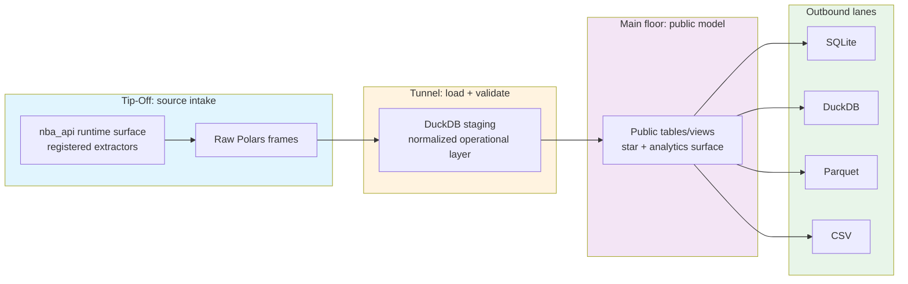
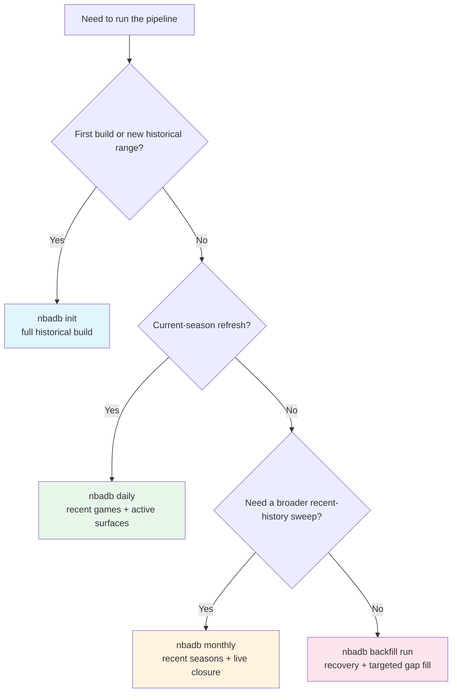

import { Callout } from "fumadocs-ui/components/callout";
import { siteInventory } from "@/lib/site-metrics.generated";

# Architecture

Think of nbadb as an **arena control tower** for NBA data: extraction brings the game film in, DuckDB stages and validates it, transformers reshape it into analytics-ready tables, and export lanes package it for downstream use.

<StatGrid columns={4}>
  <StatPill
    label="Extractors"
    value={siteInventory.extractorCount}
    note="registered wrappers over the current nba_api runtime surface"
  />
  <StatPill
    label="Public outputs"
    value={siteInventory.publicOutputCount}
    note="dimensions, facts, bridges, aggregates, and analytics surfaces"
  />
  <StatPill
    label="Export formats"
    value="4"
    note="sqlite, duckdb, csv, and parquet"
  />
  <StatPill
    label="Internal state tables"
    value="8"
    note="watermarks, journals, checkpoints, metrics, and schema history"
  />
</StatGrid>

## Navigate by decision

<div className="grid gap-4 md:grid-cols-2 xl:grid-cols-4">
  <ScoutCard title="See the pipeline path" label="Structure">
    Start with <a href="#the-short-version">The short version</a> when the
    question is how the ball moves from source intake to exports.
  </ScoutCard>
  <ScoutCard title="Pick the right run mode" label="Operations">
    Jump to{" "}
    <a href="#which-run-mode-should-i-pick">Which run mode should I pick?</a>{" "}
    when the question is operational rather than structural.
  </ScoutCard>
  <ScoutCard title="Separate public from internal tables" label="Boundary">
    Use{" "}
    <a href="#public-surface-vs-internal-machinery">
      Public surface vs internal machinery
    </a>{" "}
    when you need to know which tables are contract surface versus pipeline
    state.
  </ScoutCard>
  <ScoutCard title="Check docs ownership" label="Docs boundary">
    Go to <a href="#docs-boundary-curated-vs-generated">Docs boundary</a> if you
    are editing docs and need to know what is command-owned.
  </ScoutCard>
</div>


```mermaid
flowchart LR
    subgraph Tipoff["Tip-Off: source intake"]
        API["nba_api runtime surface\nregistered extractors"] --> RAW["Raw Polars frames"]
    end
    subgraph Tunnel["Tunnel: load + validate"]
        RAW --> STG["DuckDB staging\nnormalized operational layer"]
    end
    subgraph Scoreboard["Main floor: public model"]
        STG --> STAR["Public tables/views\nstar + analytics surface"]
    end
    subgraph Exits["Outbound lanes"]
        STAR --> SQLITE["SQLite"]
        STAR --> DUCK["DuckDB"]
        STAR --> PARQUET["Parquet"]
        STAR --> CSV["CSV"]
    end

    style Tipoff fill:#e1f5fe
    style Tunnel fill:#fff3e0
    style Scoreboard fill:#f3e5f5
    style Exits fill:#e8f5e9
```

## The short version

- **Extraction** wraps the NBA stats surface with registered extractors and produces Polars DataFrames.
- **Staging** lands result sets in DuckDB, where normalized schemas and pipeline state live.
- **Transforms** build the public analytical surface in dependency order.
- **Exports** write the same modeled data to SQLite, DuckDB, Parquet, and CSV.
- **Distribution** can publish the built dataset to Kaggle.

### Pipeline path in one glance

| Stage      | Primary input               | Primary output                                                           | Why this stage exists                                                            |
| ---------- | --------------------------- | ------------------------------------------------------------------------ | -------------------------------------------------------------------------------- |
| Extraction | `nba_api` runtime endpoints | Raw Polars frames                                                        | Capture source data with retries, rate controls, and extractor-specific handling |
| Staging    | Raw frames                  | Normalized DuckDB staging tables                                         | Standardize types, names, and warehouse-ready shape before modeling              |
| Transform  | Staging tables              | Public `dim_*`, `fact_*`, `bridge_*`, `agg_*`, and `analytics_*` outputs | Turn endpoint-shaped payloads into analysis-friendly structures                  |
| Export     | Public modeled surface      | SQLite, DuckDB, Parquet, and CSV artifacts                               | Make the same warehouse available in the formats downstream tools expect         |

<CourtDivider label="Pipeline walkthrough" />

## Stage-by-stage walkthrough

<DataColumns>
  <ScoutCard title="1. Tip-off: extract" label="Pipeline stage">
    Extraction calls the upstream NBA surface, applies retries and rate
    controls, and produces raw Polars frames. This is the layer closest to the
    source API and the first place where data fidelity matters.
  </ScoutCard>
  <ScoutCard title="2. Tunnel: validate and normalize" label="Pipeline stage">
    Raw frames land in DuckDB staging, where schemas enforce normalized column
    names, types, nullability, and basic ranges before those tables feed
    transforms.
  </ScoutCard>
  <ScoutCard title="3. Main floor: transform" label="Pipeline stage">
    SQL-first transformers build the public model in dependency order. The
    result is the analytical surface most users query directly.
  </ScoutCard>
  <ScoutCard title="4. Outbound lanes: export" label="Pipeline stage">
    The same modeled surface is written to SQLite, DuckDB, Parquet, and CSV,
    then can be packaged for Kaggle distribution.
  </ScoutCard>
</DataColumns>

## Validation tiers in one glance

```text
raw -> staging -> star
```

| Tier    | Where it happens                         | Why it exists                                 | What it catches                                          |
| ------- | ---------------------------------------- | --------------------------------------------- | -------------------------------------------------------- |
| Raw     | Immediately around extracted frames      | Validate close to the upstream source         | Source-shape problems before load                        |
| Staging | After DuckDB load into normalized tables | Enforce warehouse-ready normalization         | Naming, typing, nullability, and range issues after load |
| Star    | After transforms build the public model  | Protect the reader-facing analytical contract | Public-surface contract problems before export and use   |

## Pre-extraction contract assurance

The provider boundary preserves successful parser results before DataFrame
construction, renaming, coercion, or schema projection. Public-safe landings and
committed receipts retain canonical request identity, result name and ordinal,
ordered headers or nested paths, source row ordinal, values and presence state,
provider authority, and observation provenance. One logical call may therefore
close several ordered result routes without being duplicated, and a valid empty
packet remains distinct from an absent optional packet or a failed request.

Additive stats or live fields land in typed lossless drift tables until they are
semantically reviewed. Exact decoded-body capture is private evidence only: it may
serve as optional bounded same-run
diagnostic material, never enters any public candidate, archive, or metadata, and is
not a completeness, resume, baseline, assurance, or
publication dependency. Cookies, authorization data, request headers, proxy/VPN
details, credentials, and unrestricted error bodies are excluded from landings,
receipts, diagnostics, logs, exports, metadata, and Kaggle resources.

### Request terminal accounting

Request accounting uses one closed eight-state partition. Only
`success_nonempty`, `success_empty`, and `upstream_unavailable` are
release-terminal. The remaining states stay explicitly incomplete:
`contract_blocked`, `transient_failed`, `response_contract_failed`,
`unattempted`, and `unclassified`. None of those five states may be promoted to
green coverage.

The two successful response states require the exact captured response body,
decoded result occurrences, and persisted result receipts. A positive total row
count is `success_nonempty`; present, decoded, persisted zero-row results are
`success_empty`. `absent_optional` describes only a result occurrence. It is
neither an empty response nor a request-success state.

`upstream_unavailable` requires complete
`TypedUpstreamUnavailableEvidence`, not a bare digest or a failed request. Its
independently reproduced support authority is cross-bound to the exact request,
scope, competition, provider, source, and endpoint identities. Timeouts, retry
exhaustion, VPN or infrastructure failures, parser failures, policy limits, and
implementation gaps therefore remain incomplete evidence.

The checked-authority dependency stays acyclic and advances in this order:

```text
terminal policy -> request surface -> competition occurrences
-> competition applicability -> sealed implicit-competition reconciliation
-> competition identity -> assurance
```

This dependency chain is a local structural contract. It does not by itself
make the terminal-accounting work current, prove populated data, authorize live
operations, or admit publication.

Structural contract compilation inventories the current code and pinned provider
surface without claiming that the model or populated data is correct.

| Contract inventory               | Exact current census                                             | What the census proves                                             |
| -------------------------------- | ---------------------------------------------------------------- | ------------------------------------------------------------------ |
| Registered extractors            | 162, including 4 embedded static datasets                        | Every registered extraction entry is visible to coverage analysis  |
| Staging routes                   | 438, including 4 embedded-static routes                          | Every canonical staging entry has a stable route-contract identity |
| Schema contracts                 | 377 staging / 261 star                                           | Structural schemas cover the current route and output registries   |
| Provider-field occurrences       | 11,323 declared; 11,323 storage-mapped; 0 unmapped               | Repeated route occurrences stay visible instead of being collapsed |
| Public transform outputs         | 204 facts, 18 dimensions, 6 bridges, 19 aggregates, 14 analytics | All 261 current outputs are present in the structural inventory    |
| Public numeric-column candidates | Derived from the frozen field and expression inventories         | Expression identity is finite; metric semantics are not implied    |

<Callout type="warn">
  The structural model audit passes with zero model problems and zero
  result-table contract failures across all 438 routes and 261 outputs. Overall
  <strong>MODEL-GREEN remains RED</strong>: observed field capture, semantic
  model/ metric dispositions, complete request-parameter execution, and
  deterministic assurance still have open blockers. Populated rows and remote
  publication remain a separate DATA-GREEN gate that requires a fresh exact-SHA
  extraction.
</Callout>

Temporal contracts keep planning policy separate from observed availability. The
438-route inventory remains `unknown` wherever no applicable observation evidence
exists; the 1946 sweep floor is `fallback_attempt_unverified`, not a supported-since
claim. The 149 migrated legacy blocked rules produce 340 bounded intervals without
widening historical holes. The deterministic temporal probe plan is no-network evidence with
`execution_authorized=false`; it does not enable provider calls or replace the live
planner.

## Which run mode should I pick?


```mermaid
flowchart TD
  START["Need to run the pipeline"] --> HIST{"First build or new historical range?"}
  HIST -- Yes --> INIT["nbadb init\nfull historical build"]
  HIST -- No --> CURRENT{"Current-season refresh?"}
  CURRENT -- Yes --> DAILY["nbadb daily\nrecent games + active surfaces"]
  CURRENT -- No --> RECENT{"Need a broader recent-history sweep?"}
  RECENT -- Yes --> MONTHLY["nbadb monthly\nrecent seasons + live closure"]
  RECENT -- No --> GAP["nbadb backfill run\nrecovery + targeted gap fill"]

  style INIT fill:#e1f5fe
  style DAILY fill:#e8f5e9
  style MONTHLY fill:#fff3e0
  style GAP fill:#fce4ec
```

| Command              | Primary intent                 | Scope                                                                                                     |
| -------------------- | ------------------------------ | --------------------------------------------------------------------------------------------------------- |
| `nbadb init`         | Full historical build          | Historical seasons from `--season-start` through `--season-end`                                           |
| `nbadb daily`        | Current/open-season refresh    | Recent games, current entity scopes, all applicable result routes, and active live-game closure           |
| `nbadb monthly`      | Broader recent-season refresh  | The configured recent-season window with season-local discovery, all applicable routes, and live closure  |
| `nbadb backfill run` | Recovery and targeted gap fill | Explicit season/endpoint/pattern scopes; it does not replace recurring assurance or publication admission |

### Recurring one-repository transaction

Daily and monthly start from the current local dataset or the latest fully
verified exact Kaggle version and build one disposable candidate. They do not
require a private repository, private planning store, GHCR package, or remote
generation pointer.

```text
reconcile unresolved publication -> verify exact Kaggle parent
-> compile complete request universe -> persist public-safe receipts
-> replace request-owned scopes -> rebuild all stable outputs
-> freeze dynamic inventory -> scan and assure candidate
-> durable intent -> upload at most once -> exact remote readback
```

The request universe reaches a fixed point over games, dates, players, teams,
player-team-seasons, live games, and provider-owned dependent workloads. Missing
or partial evidence stays incomplete; a present and verified zero-row result is
typed-zero completion. Successful calls preserve request/result/header-or-path/
ordinal/value/presence/provenance authority, including additive fields. A
baseline journal row cannot suppress a mutable request.

Persistence replaces each exact request-owned source slice in one DuckDB
transaction, so upstream corrections, deletions, and valid-empty responses
remove stale rows without touching out-of-scope history. Every stable transform
is rebuilt, including schema-valid empty outputs. The table and resource
inventory comes from the runtime registries and the actually observed
conditional lossless routes; it is not a hard-coded product constant.

Automated publication uses the existing `nbadb-kaggle-publish` FIFO mutex and
GitHub Deployment ledger. An unresolved intent is reconciled before any later
candidate or upload. Exact already-published evidence closes the same intent
without another mutation; ambiguous evidence blocks the writer. Local
checkpoints, caches, and artifacts are bounded recovery or diagnostics only and
never become a second dataset authority.

See <a href="/docs/guides/daily-updates">Daily Updates</a> for the operator runbook.

## If the run goes sideways

<div className="grid gap-4 md:grid-cols-2 xl:grid-cols-4">
  <ScoutCard
    title="The run finished, but the output looks wrong"
    label="Debug lane"
  >
    Start with{" "}
    <a href="/docs/guides/troubleshooting-playbook">Troubleshooting Playbook</a>
    , then verify the public contract on{" "}
    <a href="/docs/schema">Schema Reference</a> or{" "}
    <a href="/docs/data-dictionary">Data Dictionary</a>.
  </ScoutCard>
  <ScoutCard title="You need a recurring operator route" label="Ops lane">
    Keep <a href="/docs/guides/daily-updates">Daily Updates</a> open when the
    job is the same refresh, validation, or handoff every day.
  </ScoutCard>
  <ScoutCard
    title="You need to explain the system to someone new"
    label="Context lane"
  >
    Use <a href="/docs/diagrams/pipeline-flow">Pipeline Flow</a>,{" "}
    <a href="/docs/diagrams/er-diagram">ER Diagram</a>, and{" "}
    <a href="/docs/schema">Schema Reference</a> for the shortest explain-it-once
    route.
  </ScoutCard>
  <ScoutCard title="Contracts changed and docs drifted" label="Docs lane">
    Regenerate command-owned docs with{" "}
    <code>uv run nbadb docs-autogen --docs-root docs/content/docs</code>, then
    verify the authored guidance still points at the right surfaces.
  </ScoutCard>
</div>

## Public model families

<table>
  <thead>
    <tr>
      <th>Family</th>
      <th>Count</th>
      <th>Prefix</th>
      <th>What it gives you</th>
    </tr>
  </thead>
  <tbody>
    <tr>
      <td>Dimensions</td>
      <td>{siteInventory.tableFamilyCounts.dimensions}</td>
      <td>
        <code>dim_</code>
      </td>
      <td>Core entities such as players, teams, games, and seasons</td>
    </tr>
    <tr>
      <td>Facts</td>
      <td>{siteInventory.tableFamilyCounts.facts}</td>
      <td>
        <code>fact_</code>
      </td>
      <td>Grain-specific measurements and events</td>
    </tr>
    <tr>
      <td>Bridges</td>
      <td>{siteInventory.tableFamilyCounts.bridges}</td>
      <td>
        <code>bridge_</code>
      </td>
      <td>Join helpers for many-to-many relationships</td>
    </tr>
    <tr>
      <td>Aggregates</td>
      <td>{siteInventory.tableFamilyCounts.aggregates}</td>
      <td>
        <code>agg_</code>
      </td>
      <td>Reusable rollups for repeated analysis</td>
    </tr>
    <tr>
      <td>Analytics outputs</td>
      <td>{siteInventory.tableFamilyCounts.analytics}</td>
      <td>
        <code>analytics_</code>
      </td>
      <td>Analysis-ready convenience surfaces</td>
    </tr>
  </tbody>
</table>

Most transforms are SQL-first and run in dependency order, which keeps the model readable and predictable for maintainers.

## Public surface vs internal machinery

<DataColumns>
  <ScoutCard title="Public analytical contract" label="Reader-facing">
    Treat dimensions, facts, bridges, aggregates, and analytics outputs as the
    warehouse surface documented for analysts, downstream SQL, and exported
    datasets.
  </ScoutCard>
  <ScoutCard title="Internal pipeline machinery" label="Operator-facing">
    Treat underscore-prefixed tables such as `_pipeline_watermarks`,
    `_extraction_journal`, `_pipeline_metadata`, and `_transform_checkpoints` as
    operational state unless a page explicitly documents them for workflows like
    status inspection or resume behavior.
  </ScoutCard>
</DataColumns>

### Internal tables to recognize quickly

| Table                     | Why it exists                                                        |
| ------------------------- | -------------------------------------------------------------------- |
| `_pipeline_watermarks`    | Tracks incremental extraction high-water marks                       |
| `_extraction_journal`     | Records extraction run history                                       |
| `_pipeline_metadata`      | Per-table row counts, schema hashes, and last-updated timestamps     |
| `_pipeline_metrics`       | Captures per-extraction-endpoint timing and row counts               |
| `_lane_metrics`           | Full-extraction lane timing, task counts, and success/failure totals |
| `_transform_checkpoints`  | Supports resume-safe interrupted transforms                          |
| `_transform_metrics`      | Stores transform execution metrics                                   |
| `_schema_versions`        | Snapshots column hashes for drift detection                          |
| `_schema_version_history` | Keeps schema change history                                          |
| `_staging_chunk_journal`  | Tracks durable staging-batch chunk hashes for resume-safe extraction |

## Directory map by responsibility

| Area                     | What lives there                                                  | Why you would care                              |
| ------------------------ | ----------------------------------------------------------------- | ----------------------------------------------- |
| `src/nbadb/extract/`     | Extractors wrapping stats and static NBA sources                  | Source-surface coverage and extraction behavior |
| `src/nbadb/schemas/`     | Raw, staging, and star Pandera schemas                            | Validation rules and warehouse contracts        |
| `src/nbadb/transform/`   | Dimension, fact, bridge, aggregate, and analytics builders        | The public model itself                         |
| `src/nbadb/load/`        | Export and load logic                                             | How modeled data gets written back out          |
| `src/nbadb/orchestrate/` | Pipeline orchestration and staging map                            | Run ordering, checkpoints, and resume behavior  |
| `src/nbadb/cli/`         | Typer CLI and Textual TUI surface                                 | Current operator entry points                   |
| `src/nbadb/docs_gen/`    | Docs generators for schema, dictionary, ER, and lineage artifacts | Generator-owned docs boundaries                 |

## Key design decisions

<DataColumns>
  <InsightCard title="Polars over pandas">
    The pipeline leans on columnar execution and clean Arrow interchange with
    DuckDB instead of a pandas-first execution model.
  </InsightCard>
  <InsightCard title="DuckDB as the center floor">
    DuckDB holds staging data, powers validation and SQL transforms, and remains
    the easiest local inspection surface after the run.
  </InsightCard>
  <InsightCard title="Star-schema public model">
    The warehouse is shaped to make common joins and analytics patterns easier
    to reason about than raw endpoint-shaped payloads.
  </InsightCard>
  <InsightCard title="Three validation tiers">
    Validation happens close to the source of the problem instead of only at the
    final export edge.
  </InsightCard>
  <InsightCard title="SQL-first transformers">
    Most transforms stay readable and dependency-driven because the
    transformation logic lives primarily in SQL rather than imperative code.
  </InsightCard>
  <InsightCard title="Selective SCD Type 2 history">
    `dim_player` and `dim_team_history` preserve time-varying attributes where
    historical identity changes matter.
  </InsightCard>
</DataColumns>

## Docs boundary: curated vs generated

Use this command when generator-owned docs drift from the code:

```bash
uv run nbadb docs-autogen --docs-root docs/content/docs
```

That command owns these outputs:

- `schema/raw-reference.mdx`
- `schema/staging-reference.mdx`
- `schema/star-reference.mdx`
- `data-dictionary/raw.mdx`
- `data-dictionary/staging.mdx`
- `data-dictionary/star.mdx`
- `diagrams/er-auto.mdx`
- `lineage/lineage-auto.mdx`
- `docs/lib/generated/{raw,staging,star}-reference.json`
- `docs/lib/generated/{raw,staging,star}-dictionary.json`
- `docs/lib/generated/{schema,lineage,schema-coverage,agent-catalog}.json`
- `docs/lib/site-metrics.generated.ts`
- `docs/table-profile.generated.json` when `data/nba.duckdb` exists

| If the page is…                                                                               | Treat it as…                                        |
| --------------------------------------------------------------------------------------------- | --------------------------------------------------- |
| A guide, entry page, architecture page, or CLI walkthrough                                    | Hand-authored and safe to edit directly             |
| A schema reference, data dictionary artifact, ER auto page, or lineage auto page listed above | Generator-owned; regenerate instead of hand-editing |

## Best next reads

- [CLI Reference](/docs/cli-reference) for exact commands and operator behavior
- [Schema Reference](/docs/schema) for the public table families
- [Data Dictionary](/docs/data-dictionary) for field-level meaning
- [Diagrams](/docs/diagrams) for visual maps
- [Daily Updates](/docs/guides/daily-updates) for the recurring operational runbook
