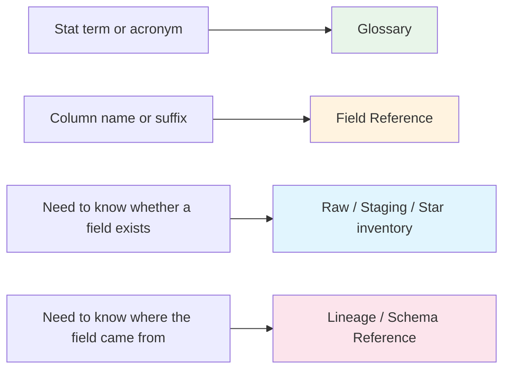

import { Callout } from "fumadocs-ui/components/callout";

# Data Dictionary

Think of this section as the scorer's table for the warehouse: the place you go when a stat abbreviation, column suffix, or layer name looks familiar but not familiar enough.

The split in this section is intentional. The hand-authored pages explain meaning, naming habits, and reading strategy. The generated pages answer the contract question: which exact fields exist on a given tier right now.

<div className="grid gap-3 md:grid-cols-3">
  <StatPill
    label="Best first read"
    value="Curated"
    note="start with the glossary or field reference before diving into generated inventories"
  />
  <StatPill
    label="Command-owned pages"
    value="3"
    note="raw, staging, and star field inventories are generated from schema metadata"
  />
  <StatPill
    label="Core question"
    value="Meaning + owner"
    note="what does this field mean, and which tier owns it?"
  />
</div>

<Callout type="info">
Use the curated pages for interpretation and navigation. Use the generated tier pages when you need the exact field inventory for a specific schema-backed layer. If you are deciding <em>what a field means</em>, start curated. If you are checking <em>whether a field exists</em>, go generated.
</Callout>

<CourtDivider label="Start at the scorer's table" />

## Choose the decoder

<div className="grid gap-4 md:grid-cols-2 xl:grid-cols-4">
  <ScoutCard title="Glossary" label="Meaning first">
    Start with <a href="/docs/data-dictionary/glossary">Glossary</a> when the problem is a metric, acronym, formula, or box-score shorthand such as <code>TS%</code>, <code>PIE</code>, or <code>PPP</code>.
  </ScoutCard>
  <ScoutCard title="Field Reference" label="Pattern first">
    Start with <a href="/docs/data-dictionary/field-reference">Field Reference</a> when the question is really about naming habits: keys, suffixes, home/visitor labels, rating names, or row discriminators.
  </ScoutCard>
  <ScoutCard title="Tier inventories" label="Contract first">
    Start with <a href="/docs/data-dictionary/raw">Raw</a>, <a href="/docs/data-dictionary/staging">Staging</a>, or <a href="/docs/data-dictionary/star">Star</a> when you need to verify whether a field exists on a specific tier right now.
  </ScoutCard>
  <ScoutCard title="Ownership trail" label="Where it came from">
    Jump to <a href="/docs/lineage">Lineage</a> or <a href="/docs/schema">Schema Reference</a> when the real blocker is not meaning but ownership, join path, or transform lineage.
  </ScoutCard>
</div>

If you only remember one lookup order, use this one.



Text fallback: use Glossary for meaning, Field Reference for naming patterns, the generated tier pages for exact field inventories, and Lineage or Schema Reference when you need the field's owner or dependency chain.

## Fastest lookup by what you have in hand

| If you have... | Start here | Why this is the fastest lane |
| -------------- | ---------- | ---------------------------- |
| A stat term, acronym, or formula | [Glossary](/docs/data-dictionary/glossary) | It decodes basketball analytics language before you worry about table ownership |
| A column name that looks familiar but unclear | [Field Reference](/docs/data-dictionary/field-reference) | It explains how keys, suffixes, split labels, and row types usually behave |
| A raw endpoint-shaped field | [Raw](/docs/data-dictionary/raw) | That generated page reflects the source-near inventory |
| A normalized staging column | [Staging](/docs/data-dictionary/staging) | That generated page reflects the warehouse-ready staging inventory |
| A public warehouse field | [Star](/docs/data-dictionary/star) | That generated page reflects the analytics-facing contract surface |
| No clear starting point | [Glossary](/docs/data-dictionary/glossary), then [Field Reference](/docs/data-dictionary/field-reference), then the matching generated tier page | Meaning first, pattern second, inventory last |

## Curated vs generated boundary

| Surface | Owns | Best for | Maintenance path |
| ------- | ---- | -------- | ---------------- |
| This index, [Glossary](/docs/data-dictionary/glossary), and [Field Reference](/docs/data-dictionary/field-reference) | Interpretation | Meaning, naming habits, common traps, and route-finding | Hand-authored |
| [Raw](/docs/data-dictionary/raw), [Staging](/docs/data-dictionary/staging), and [Star](/docs/data-dictionary/star) | Inventory | Exact field presence for each schema-backed layer | Regenerate, do not hand-edit |

<DataColumns>
  <InsightCard title="Curated pages explain how to read">
    They translate field families, abbreviations, and naming conventions into analyst-facing guidance.
  </InsightCard>
  <InsightCard title="Generated pages explain what exists">
    They are command-owned snapshots of the current field inventory, not narrative documentation.
  </InsightCard>
</DataColumns>

<CourtDivider label="Read the layer labels" />

## Layer and prefix guide

| Prefix | Layer | Example | What it usually means |
| ------ | ----- | ------- | --------------------- |
| `raw_` | Raw schema/reference object | `raw_boxscoretraditionalv3` | Endpoint-shaped payload contract closest to source naming |
| `stg_` | DuckDB staging target | `stg_boxscoretraditionalv3__player_stats` | Cleaned, typed, warehouse-ready input layer |
| `dim_` | Dimension | `dim_player`, `dim_team`, `dim_game` | Context and controlled vocabulary around the facts |
| `fact_` | Fact | `fact_play_by_play`, `fact_team_game` | Measured events, game lines, dashboards, or specialty outputs |
| `bridge_` | Bridge | `bridge_game_official`, `bridge_play_player` | Many-to-many helper that prevents repeated columns or duplicate joins |
| `agg_` | Aggregate | `agg_player_season`, `agg_team_season` | Reusable rollups for common analytical questions |
| `analytics_` | Analytics view/table | `analytics_player_game_complete` | Pre-joined shortcut for everyday analyst workflows |

## Read a column in this order

1. Find the grain anchor: `player_id`, `team_id`, `game_id`, `season_year`, or lineup/group keys.
2. Check the row-type columns: `split_type`, `detail_type`, `summary_type`, `tracking_type`, or similar.
3. Only then read the measures: percentages, totals, ratings, ranks, and rolling windows.

## High-signal naming patterns

| Pattern | Usually means... | Example |
| ------- | ---------------- | ------- |
| `<entity>_id` | business key | `player_id`, `team_id`, `game_id` |
| `<entity>_sk` | history-aware surrogate key | `player_sk` |
| `_pct` | decimal percentage | `fg_pct`, `ts_pct` |
| `total_` / `avg_` / `_rank` | totals, averages, and rankings | `total_pts`, `avg_ast`, `reb_rank` |
| `is_` | boolean flag | `is_current`, `is_weekend` |
| `split_type` / `detail_type` / `summary_type` / `tracking_type` | row meaning discriminator | tells you what kind of row you are reading |

<CourtDivider label="Command-owned inventories" />

## Generated pages

Refresh the generated tier pages in this section with:

```bash
uv run nbadb docs-autogen --docs-root docs/content/docs
```

That command regenerates:

- `data-dictionary/raw.mdx`
- `data-dictionary/staging.mdx`
- `data-dictionary/star.mdx`

It also refreshes the matching schema reference pages plus ER and lineage artifacts. Keep this index, the glossary, and the field reference hand-authored.

## Related docs

- [Schema Reference](/docs/schema)
- [Relationships](/docs/schema/relationships)
- [Lineage](/docs/lineage)
