# Star Schema ER Diagram

{/* Auto-generated by nbadb docs-gen. Do not edit by hand. */}
{/* Regenerate: uv run nbadb docs-autogen --docs-root docs/content/docs */}

## Dimensions

```mermaid
erDiagram
    dim_all_players {
        int person_id PK
        str display_last_comma_first
        str display_first_last
        int roster_status
        str from_year
        str to_year
        str playercode
        int team_id PK
        str team_city
        str team_name
        str team_abbreviation
        str team_code
        str games_played_flag
    }
    dim_arena {
        int arena_id PK
        str arena_name
        str city
        str state
        str country
    }
    dim_coach {
        int coach_id PK
        int team_id PK
        str season_year
        str first_name
        str last_name
        str coach_type
        bool is_assistant
    }
    dim_college {
        int college_id PK
        str college_name
    }
    dim_date {
        int date_key
        str full_date
        int year
        int month
        int day
        int day_of_week
        str day_name
        str month_name
        bool is_weekend
        str nba_season
    }
    dim_defunct_team {
        str league_id PK
        int team_id PK
        str team_city
        str team_name
        str start_year
        str end_year
        int years
        int games
        int wins
        int losses
        float win_pct
        int po_appearances
        int div_titles
        int conf_titles
        int league_titles
    }
    dim_game {
        str game_id PK
        str game_date
        str season_year
        str season_type
        int home_team_id PK
        int visitor_team_id PK
        str matchup
        str arena_name
        str arena_city
    }
    dim_official {
        int official_id PK
        str first_name
        str last_name
        str jersey_num
    }
    dim_play_event_type {
        int event_type_id PK
        str event_type_name
        str event_category
    }
    dim_player {
        int player_sk
        int player_id PK
        str full_name
        str first_name
        str last_name
        bool is_active
        int team_id PK
        str position
        str jersey_number
        str height
        int weight
        str birth_date
        str country
        int college_id PK
        int draft_year
        int draft_round
        int draft_number
        int from_year
        int to_year
        str valid_from
        str valid_to
        bool is_current
    }
    dim_schedule_int {
        str game_id PK
        str game_code
        str league_id PK
        str season_year
        str game_date
        str game_date_est
        str game_date_time_est
        str game_date_utc
        str game_time_utc
        str game_date_time_utc
        int game_status
        str game_status_text
        int game_sequence
        int week_number
        str week_name
        str day_of_week
        str arena_name
        str arena_city
        str arena_state
        int home_team_id PK
        str home_team_name
        str home_team_city
        str home_team_tricode
        int home_team_wins
        int home_team_losses
        int home_team_score
        int away_team_id PK
        str away_team_name
        str away_team_city
        str away_team_tricode
        int away_team_wins
        int away_team_losses
        int away_team_score
        str if_necessary
        str series_text
        str game_subtype
        str is_neutral
        str postponed_status
        str week_start_date
        str week_end_date
    }
    dim_season {
        str season_year
        str start_date
        str end_date
        str all_star_date
        str playoff_start_date
    }
    dim_season_phase {
        int phase_id PK
        str phase_name
        int phase_order
    }
    dim_season_week {
        str season_id PK
        int week_number
        str start_date
        str end_date
    }
    dim_shot_zone {
        int zone_id PK
        str shot_zone_basic
        str shot_zone_area
        str shot_zone_range
    }
    dim_team {
        int team_id PK
        str abbreviation
        str full_name
        str city
        str state
        str arena
        int year_founded
        str conference
        str division
    }
    dim_team_extended {
        int team_id PK
        str abbreviation
        str nickname
        int yearfounded
        str city
        str arena
        int arenacapacity
        str owner
        str generalmanager
        str headcoach
        str dleagueaffiliation
        str season_year
        str team_city
        str team_name
        str team_abbreviation
        str team_conference
        str team_division
        str team_code
        str team_slug
        int w
        int l
        float pct
        int conf_rank
        int div_rank
        str min_year
        str max_year
    }
    dim_team_history {
        int team_history_sk
        int team_id PK
        str city
        str nickname
        str abbreviation
        str franchise_name
        str league_id PK
        str valid_from
        str valid_to
        bool is_current
    }
```



## Facts

```mermaid
erDiagram
    fact_assist_leaders {
        int rank
        int team_id PK
        str team_abbreviation
        str team_name
        float ast
    }
    fact_assist_tracker {
        float assists
    }
    fact_box_score_advanced_team {
        str game_id PK
        int team_id PK
        str team_name
        str team_abbreviation
        str team_city
        str team_slug
        str min
        float e_off_rating
        float off_rating
        float e_def_rating
        float def_rating
        float e_net_rating
        float net_rating
        float ast_pct
        float ast_tov
        float ast_ratio
        float oreb_pct
        float dreb_pct
        float reb_pct
        float tm_tov_pct
        float tov_pct
        float efg_pct
        float ts_pct
        float usg_pct
        float e_usg_pct
        float e_pace
        float pace
        float pace_per40
        float poss
        float pie
    }
    fact_box_score_defensive_team {
        str game_id PK
        int team_id PK
        str team_name
        str team_abbreviation
        str team_city
        str team_slug
        str min
    }
    fact_box_score_four_factors {
        str game_id PK
        int team_id PK
        int player_id PK
        float effective_field_goal_percentage
        float free_throw_attempt_rate
        float team_turnover_percentage
        float offensive_rebound_percentage
        float opp_effective_field_goal_percentage
        float opp_free_throw_attempt_rate
        float opp_team_turnover_percentage
        float opp_offensive_rebound_percentage
    }
    fact_box_score_four_factors_team {
        str game_id PK
        int team_id PK
        str team_name
        str team_abbreviation
        str team_city
        str team_slug
        str min
        float effective_field_goal_percentage
        float free_throw_attempt_rate
        float team_turnover_percentage
        float offensive_rebound_percentage
        float opp_effective_field_goal_percentage
        float opp_free_throw_attempt_rate
        float opp_team_turnover_percentage
        float opp_offensive_rebound_percentage
    }
    fact_box_score_hustle_player {
        str game_id PK
        int team_id PK
        str team_abbreviation
        str team_city
        str team_name
        str team_slug
        int player_id PK
        str player_name
        str first_name
        str family_name
        str name_i
        str player_slug
        str position
        str comment
        str jersey_num
        str min
        float contested_shots
        float contested_shots_2pt
        float contested_shots_3pt
        float deflections
        float charges_drawn
        float screen_assists
        float screen_ast_pts
        float loose_balls_recovered
        float box_outs
        float offensive_box_outs
        float defensive_box_outs
        float loose_balls_recovered_offensive
        float loose_balls_recovered_defensive
        float box_out_player_rebounds
        float box_out_player_team_rebounds
        float points
    }
    fact_box_score_misc_team {
        str game_id PK
        int team_id PK
        str team_name
        str team_abbreviation
        str team_city
        str team_slug
        str min
        float pts_off_tov
        float second_chance_pts
        float fbps
        float pitp
        float opp_pts_off_tov
        float opp_second_chance_pts
        float opp_fbps
        float opp_pitp
        float blk
        float blka
        float pf
        float pfd
    }
    fact_box_score_player_track_team {
        str game_id PK
        int team_id PK
        str team_name
        str team_abbreviation
        str team_city
        str team_slug
        str min
        float dist
        float orbc
        float drbc
        float rbc
        float tchs
        float sast
        float ftast
        float passes
        float ast
        float cfgm
        float cfga
        float cfg_pct
        float ufgm
        float ufga
        float ufg_pct
        float fg_pct
        float dfgm
        float dfga
        float dfg_pct
    }
    fact_box_score_scoring_team {
        str game_id PK
        int team_id PK
        str team_name
        str team_abbreviation
        str team_city
        str team_slug
        str min
        float pct_fga_2pt
        float pct_fga_3pt
        float pct_pts_2pt
        float pct_pts_2pt_mr
        float pct_pts_3pt
        float pct_pts_fb
        float pct_pts_ft
        float pct_pts_off_tov
        float pct_pts_pitp
        float pct_ast_2pm
        float pct_uast_2pm
        float pct_ast_3pm
        float pct_uast_3pm
        float pct_ast_fgm
        float pct_uast_fgm
    }
    fact_box_score_starter_bench {
        str game_id PK
        int team_id PK
        str team_name
        str team_abbreviation
        str team_city
        str team_slug
        str min
        float fgm
        float fga
        float fg_pct
        float fg3m
        float fg3a
        float fg3_pct
        float ftm
        float fta
        float ft_pct
        float oreb
        float dreb
        float reb
        float ast
        float stl
        float blk
        float tov
        float pf
        float pts
        str starters_bench
    }
    fact_box_score_summary_v3 {
        str game_id PK
        str game_status_text
        int home_team_id PK
        int away_team_id PK
        int team_id PK
        str team_name
        str team_tricode
        int person_id PK
        str name
        int arena_id PK
        str arena_name
        int attendance
        int score
        int points
        int rebounds_total
        int assists
        int lead_changes
        int times_tied
        int biggest_lead
        int bench_points
        int video_available_flag
        str summary_type
    }
    fact_box_score_summary_v3_available_video {
        str game_id PK
        int video_available_flag
        int pt_available
        int pt_xyz_available
        int wh_status
        int hustle_status
        int historical_status
    }
    fact_box_score_summary_v3_game_info {
        str game_id PK
        str game_date
        int attendance
        str game_duration
    }
    fact_box_score_summary_v3_game_summary {
        str game_id PK
        str game_code
        int game_status
        str game_status_text
        int period
        str game_clock
        str game_time_utc
        str game_et
        int away_team_id PK
        int home_team_id PK
        str duration
        int attendance
        int sellout
    }
    fact_box_score_summary_v3_inactive_players {
        str game_id PK
        int team_id PK
        int person_id PK
        str first_name
        str family_name
        str jersey_num
    }
    fact_box_score_summary_v3_last_five_meetings {
        int recency_order
        str game_id PK
        str game_time_utc
        str game_et
        int game_status
        str game_status_text
        int away_team_id PK
        str away_team_city
        str away_team_name
        str away_team_tricode
        int away_team_score
        int away_team_wins
        int away_team_losses
        int home_team_id PK
        str home_team_city
        str home_team_name
        str home_team_tricode
        int home_team_score
        int home_team_wins
        int home_team_losses
    }
    fact_box_score_summary_v3_line_score {
        str game_id PK
        int team_id PK
        str team_city
        str team_name
        str team_tricode
        str team_slug
        int team_wins
        int team_losses
        int period1_score
        int period2_score
        int period3_score
        int period4_score
        int score
    }
    fact_box_score_summary_v3_officials {
        str game_id PK
        int person_id PK
        str name
        str name_i
        str first_name
        str family_name
        str jersey_num
    }
    fact_box_score_summary_v3_other_stats {
        str game_id PK
        int team_id PK
        str team_city
        str team_name
        str team_tricode
        int points
        int rebounds_total
        int assists
        int steals
        int blocks
        int turnovers
        float field_goals_percentage
        float three_pointers_percentage
        float free_throws_percentage
        int points_in_the_paint
        int points_second_chance
        int points_fast_break
        int biggest_lead
        int lead_changes
        int times_tied
        int biggest_scoring_run
        int turnovers_team
        int turnovers_total
        int rebounds_team
        int points_from_turnovers
        int bench_points
    }
    fact_box_score_team {
        str game_id PK
        int team_id PK
        str team_name
        str team_abbreviation
        str team_city
        str team_slug
        float min
        float fgm
        float fga
        float fg_pct
        float fg3m
        float fg3a
        float fg3_pct
        float ftm
        float fta
        float ft_pct
        float oreb
        float dreb
        float reb
        float ast
        float stl
        float blk
        float tov
        float pf
        float pts
        float plus_minus
    }
    fact_box_score_usage_team {
        str game_id PK
        int team_id PK
        str team_abbreviation
        str team_city
        str team_name
        str team_slug
        str min
        float usg_pct
        float pct_fgm
        float pct_fga
        float pct_fg3m
        float pct_fg3a
        float pct_ftm
        float pct_fta
        float pct_oreb
        float pct_dreb
        float pct_reb
        float pct_ast
        float pct_tov
        float pct_stl
        float pct_blk
        float pct_blka
        float pct_pf
        float pct_pfd
        float pct_pts
    }
    fact_college_rollup {
        int gp
        int gs
        float min
        float fgm
        float fga
        float fg_pct
        float fg3m
        float fg3a
        float fg3_pct
        float ftm
        float fta
        float ft_pct
        float oreb
        float dreb
        float reb
        float ast
        float stl
        float blk
        float tov
        float pf
        float pts
        str region
        int seed
        str college
        int players
        str rollup_type
    }
    fact_cumulative_stats {
        str date_est
        str visitor_team
        str home_team
        str display_fi_last
        str jersey_num
        str player
        int person_id PK
        int team_id PK
        str city
        str nickname
        str matchup
        str game_id PK
        int gp
        int gs
        int w
        int l
        int w_home
        int l_home
        int w_road
        int l_road
        float team_turnovers
        float team_rebounds
        float total_turnovers
        float actual_minutes
        float actual_seconds
        float fg
        float fga
        float fg_pct
        float fg3
        float fg3a
        float fg3_pct
        float ft
        float fta
        float ft_pct
        float off_reb
        float def_reb
        float tot_reb
        float avg_tot_reb
        float avg_reb
        float ast
        float pf
        float dq
        float stl
        float turnovers
        float blk
        float pts
        float max_actual_minutes
        float max_actual_seconds
        float max_reb
        float max_ast
        float max_stl
        float max_turnovers
        float max_blk
        float max_blkp
        float max_pts
        float avg_actual_minutes
        float avg_actual_seconds
        float avg_ast
        float avg_stl
        float avg_turnovers
        float avg_blk
        float avg_blkp
        float avg_pts
        float per_min_tot_reb
        float per_min_reb
        float per_min_ast
        float per_min_stl
        float per_min_turnovers
        float per_min_blk
        float per_min_pts
        str entity_type
        str stat_type
    }
    fact_cumulative_stats_detail {
        str date_est
        str visitor_team
        str home_team
        str display_fi_last
        str jersey_num
        str player
        int person_id PK
        int team_id PK
        str city
        str nickname
        str matchup
        str game_id PK
        int gp
        int gs
        int w
        int l
        int w_home
        int l_home
        int w_road
        int l_road
        float team_turnovers
        float team_rebounds
        float total_turnovers
        float actual_minutes
        float actual_seconds
        float fg
        float fga
        float fg_pct
        float fg3
        float fg3a
        float fg3_pct
        float ft
        float fta
        float ft_pct
        float off_reb
        float def_reb
        float tot_reb
        float avg_tot_reb
        float avg_reb
        float ast
        float pf
        float dq
        float stl
        float turnovers
        float blk
        float pts
        float max_actual_minutes
        float max_actual_seconds
        float max_reb
        float max_ast
        float max_stl
        float max_turnovers
        float max_blk
        float max_blkp
        float max_pts
        float avg_actual_minutes
        float avg_actual_seconds
        float avg_ast
        float avg_stl
        float avg_turnovers
        float avg_blk
        float avg_blkp
        float avg_pts
        float per_min_tot_reb
        float per_min_reb
        float per_min_ast
        float per_min_stl
        float per_min_turnovers
        float per_min_blk
        float per_min_pts
        str cume_type
    }
    fact_defense_hub {
        int rank
        int team_id PK
        str team_abbreviation
        str team_name
        float dreb
        str season_type
    }
    fact_defense_hub_detail {
        str defense_metric
        int rank
        int team_id PK
        str team_abbreviation
        str team_name
        str season_type
        float stat_value
    }
    fact_draft {
        int person_id PK
        int team_id PK
        str season
        int round_number
        int round_pick
        int overall_pick
        str player_name
        str organization
        str organization_type
        int player_profile_flag
    }
    fact_draft_board {
        int person_id PK
        str player_name
        int season
        int round_number
        int round_pick
        int overall_pick
        int team_id PK
        str team_city
        str team_name
        str team_abbreviation
        str organization
        str organization_type
        str height
        str weight
        str position
        str jersey_number
        str birthdate
        float age
    }
    fact_draft_combine_detail {
        int player_id PK
        float height
        float result
        float pct
        str detail_type
    }
    fact_draft_combine_drill_results {
        str season
        int temp_player_id PK
        int player_id PK
        str first_name
        str last_name
        str player_name
        str position
        float standing_vertical_leap
        float max_vertical_leap
        float lane_agility_time
        float modified_lane_agility_time
        float three_quarter_sprint
        float bench_press
    }
    fact_draft_combine_non_stationary_shooting {
        str season
        int temp_player_id PK
        int player_id PK
        str first_name
        str last_name
        str player_name
        str position
        int off_drib_fifteen_break_left_made
        int off_drib_fifteen_break_left_attempt
        float off_drib_fifteen_break_left_pct
        int off_drib_fifteen_top_key_made
        int off_drib_fifteen_top_key_attempt
        float off_drib_fifteen_top_key_pct
        int off_drib_fifteen_break_right_made
        int off_drib_fifteen_break_right_attempt
        float off_drib_fifteen_break_right_pct
        int off_drib_college_break_left_made
        int off_drib_college_break_left_attempt
        float off_drib_college_break_left_pct
        int off_drib_college_top_key_made
        int off_drib_college_top_key_attempt
        float off_drib_college_top_key_pct
        int off_drib_college_break_right_made
        int off_drib_college_break_right_attempt
        float off_drib_college_break_right_pct
        int on_move_fifteen_made
        int on_move_fifteen_attempt
        float on_move_fifteen_pct
        int on_move_college_made
        int on_move_college_attempt
        float on_move_college_pct
    }
    fact_draft_combine_player_anthro {
        str season
        int temp_player_id PK
        int player_id PK
        str first_name
        str last_name
        str player_name
        str position
        float height_wo_shoes
        str height_wo_shoes_ft_in
        float height_w_shoes
        str height_w_shoes_ft_in
        float weight
        float wingspan
        str wingspan_ft_in
        float standing_reach
        str standing_reach_ft_in
        float body_fat_pct
        float hand_length
        float hand_width
    }
    fact_draft_combine_spot_shooting {
        str season
        int temp_player_id PK
        int player_id PK
        str first_name
        str last_name
        str player_name
        str position
        int nba_break_left_made
        int nba_break_left_attempt
        float nba_break_left_pct
        int nba_break_right_made
        int nba_break_right_attempt
        float nba_break_right_pct
        int nba_corner_left_made
        int nba_corner_left_attempt
        float nba_corner_left_pct
        int nba_corner_right_made
        int nba_corner_right_attempt
        float nba_corner_right_pct
        int nba_top_key_made
        int nba_top_key_attempt
        float nba_top_key_pct
        int college_break_left_made
        int college_break_left_attempt
        float college_break_left_pct
        int college_break_right_made
        int college_break_right_attempt
        float college_break_right_pct
        int college_corner_left_made
        int college_corner_left_attempt
        float college_corner_left_pct
        int college_corner_right_made
        int college_corner_right_attempt
        float college_corner_right_pct
        int college_top_key_made
        int college_top_key_attempt
        float college_top_key_pct
        int fifteen_break_left_made
        int fifteen_break_left_attempt
        float fifteen_break_left_pct
        int fifteen_break_right_made
        int fifteen_break_right_attempt
        float fifteen_break_right_pct
        int fifteen_corner_left_made
        int fifteen_corner_left_attempt
        float fifteen_corner_left_pct
        int fifteen_corner_right_made
        int fifteen_corner_right_attempt
        float fifteen_corner_right_pct
        int fifteen_top_key_made
        int fifteen_top_key_attempt
        float fifteen_top_key_pct
    }
    fact_draft_combine_stats {
        str season
        int player_id PK
        str first_name
        str last_name
        str player_name
        str position
        float height_wo_shoes
        str height_wo_shoes_ft_in
        float height_w_shoes
        str height_w_shoes_ft_in
        float weight
        float wingspan
        str wingspan_ft_in
        float standing_reach
        str standing_reach_ft_in
        float body_fat_pct
        float hand_length
        float hand_width
        float standing_vertical_leap
        float max_vertical_leap
        float lane_agility_time
        float modified_lane_agility_time
        float three_quarter_sprint
        float bench_press
        str spot_fifteen_corner_left
        str spot_fifteen_break_left
        str spot_fifteen_top_key
        str spot_fifteen_break_right
        str spot_fifteen_corner_right
        str spot_college_corner_left
        str spot_college_break_left
        str spot_college_top_key
        str spot_college_break_right
        str spot_college_corner_right
        str spot_nba_corner_left
        str spot_nba_break_left
        str spot_nba_top_key
        str spot_nba_break_right
        str spot_nba_corner_right
        str off_drib_fifteen_break_left
        str off_drib_fifteen_top_key
        str off_drib_fifteen_break_right
        str off_drib_college_break_left
        str off_drib_college_top_key
        str off_drib_college_break_right
        str on_move_fifteen
        str on_move_college
    }
    fact_draft_history {
        int person_id PK
        str player_name
        str season
        int round_number
        int round_pick
        int overall_pick
        str draft_type
        int team_id PK
        str team_city
        str team_name
        str team_abbreviation
        str organization
        str organization_type
        int player_profile_flag
    }
    fact_dunk_score_leaders {
        int player_id PK
        float dunk_score
    }
    fact_fantasy {
        int player_id PK
        str player_name
        int team_id PK
        str team_name
        str team_abbreviation
        str jersey_num
        str player_position
        str location
        int gp
        float min
        float fan_duel_pts
        float nba_fantasy_pts
        float usg_pct
        float fgm
        float fga
        float fg_pct
        float fg3m
        float fg3a
        float fg3_pct
        float ftm
        float fta
        float ft_pct
        float oreb
        float dreb
        float reb
        float ast
        float tov
        float stl
        float blk
        float blka
        float pf
        float pfd
        float pts
        float plus_minus
        str season_type
        str fantasy_source
    }
    fact_fantasy_widget {
        int player_id PK
        str player_name
        int team_id PK
        str team_abbreviation
        float fan_duel_pts
        float nba_fantasy_pts
        float pts
        float reb
        float ast
        float fg3m
        float ft_pct
        float stl
        float blk
        float tov
        float fg_pct
        str player_position
        int gp
        float min
        float fga
        float fta
        str season_type
    }
    fact_franchise_detail {
        int team_id PK
        str league_id PK
        str team
        int person_id PK
        str player
        str season_type
        int active_with_team
        float gp
        float fgm
        float fga
        float fg_pct
        float fg3m
        float fg3a
        float fg3_pct
        float ftm
        float fta
        float ft_pct
        float oreb
        float dreb
        float reb
        float ast
        float pf
        float stl
        float tov
        float blk
        float pts
        int pts_person_id PK
        str pts_player
        int ast_person_id PK
        str ast_player
        int reb_person_id PK
        str reb_player
        int blk_person_id PK
        str blk_player
        int stl_person_id PK
        str stl_player
        str detail_type
    }
    fact_franchise_leaders {
        int team_id PK
        float pts
        int pts_person_id PK
        str pts_player
        float ast
        int ast_person_id PK
        str ast_player
        float reb
        int reb_person_id PK
        str reb_player
        float blk
        int blk_person_id PK
        str blk_player
        float stl
        int stl_person_id PK
        str stl_player
    }
    fact_franchise_players {
        str league_id PK
        int team_id PK
        str team
        int person_id PK
        str player
        str season_type
        int active_with_team
        float gp
        float fgm
        float fga
        float fg_pct
        float fg3m
        float fg3a
        float fg3_pct
        float ftm
        float fta
        float ft_pct
        float oreb
        float dreb
        float reb
        float ast
        float pf
        float stl
        float tov
        float blk
        float pts
    }
    fact_game_context {
        str game_id PK
        str game_date
        int attendance
        str game_time
        str game_status_text
        int home_team_id PK
        int visitor_team_id PK
        int team_id PK
        str team_abbreviation
        str team_city
        str team_name
        int player_id PK
        str first_name
        str last_name
        str jersey_num
        int pts_paint
        int pts_2nd_chance
        int pts_fb
        int pts_off_to
        int largest_lead
        int lead_changes
        int times_tied
        str last_game_id PK
        str series_leader
        int video_available_flag
        int pt_available
        int pt_xyz_available
        int wh_status
        int hustle_status
        int historical_status
        str context_source
    }
    fact_game_leaders {
        str game_id PK
        int team_id PK
        str leader_type
        int person_id PK
        str name
        str player_slug
        str jersey_num
        str position
        str team_tricode
        float points
        float rebounds
        float assists
    }
    fact_game_result {
        str game_id PK
        str game_date
        str season_year
        str season_type
        int home_team_id PK
        int visitor_team_id PK
        str wl_home
        int pts_home
        int pts_away
        float plus_minus_home
        float plus_minus_away
        int pts_qtr1_home
        int pts_qtr2_home
        int pts_qtr3_home
        int pts_qtr4_home
        int pts_ot1_home
        int pts_ot2_home
        int pts_qtr1_away
        int pts_qtr2_away
        int pts_qtr3_away
        int pts_qtr4_away
        int pts_ot1_away
        int pts_ot2_away
    }
    fact_game_scoring {
        str game_id PK
        int team_id PK
        str side
        int period
        int pts
        str season_year
    }
    fact_gl_alum_similarity {
        int person_2_id PK
        str person_2
        int team_id PK
        float similarity_score
    }
    fact_gravity_leaders {
        int playerid
        float gravityscore
    }
    fact_homepage {
        str homepage_source
        int rank
        int team_id PK
        str team_abbreviation
        str team_name
        float pts
        str season_type
    }
    fact_homepage_detail {
        str homepage_metric
        int rank
        int team_id PK
        str team_abbreviation
        str team_name
        str season_type
        float stat_value
    }
    fact_homepage_leaders {
        str leader_source
        int rank
        int team_id PK
        str team_name
        str team_abbreviation
        float pts
        float fg_pct
        float fg3_pct
        float ft_pct
        float efg_pct
        float ts_pct
        float pts_per48
        str season_type
    }
    fact_homepage_leaders_detail {
        str leader_variant
        int rank
        int team_id PK
        str team_abbreviation
        str team_name
        str season_type
        float pts
        float fg_pct
        float fg3_pct
        float ft_pct
        float efg_pct
        float ts_pct
        float pts_per48
    }
    fact_hustle_availability {
        str game_id PK
        str hustle_status
        int team_id PK
        str team_abbreviation
        str team_city
        int player_id PK
        str player_name
        str start_position
        str comment
        str minutes
        int pts
        int contested_shots
        int contested_shots_2pt
        int contested_shots_3pt
        int deflections
        int charges_drawn
        int screen_assists
        int screen_ast_pts
        int off_loose_balls_recovered
        int def_loose_balls_recovered
        int loose_balls_recovered
        int off_boxouts
        int def_boxouts
        int box_out_player_team_rebs
        int box_out_player_rebs
        int box_outs
        str hustle_type
    }
    fact_infographic_fanduel_player {
        int player_id PK
        str player_name
        int team_id PK
        str team_abbreviation
        float fan_duel_pts
        float nba_fantasy_pts
        float pts
        float reb
        float ast
        float fg3m
        float ft_pct
        float stl
        float blk
        float tov
        float fg_pct
        str team_name
        str jersey_num
        str player_position
        str location
        float usg_pct
        float min
        float fgm
        float fga
        float fg3a
        float fg3_pct
        float ftm
        float fta
        float oreb
        float dreb
        float blka
        float pf
        float pfd
        float plus_minus
    }
    fact_ist_standings {
        str league_id PK
        str season_year
        int team_id PK
        str team_city
        str team_name
        str team_abbreviation
        str team_slug
        str conference
        str ist_group
        str group_name
        str clinch_indicator
        int clinched_ist_group
        int clinched_ist_knockout
        int clinched_ist_wildcard
        int wins
        int losses
        float pct
        float win_pct
        float points_for
        float points_against
        float point_diff
        float pts
        float opp_pts
        float diff
        int ist_group_rank
        float ist_group_gb
        int ist_wildcard_rank
        float ist_wildcard_gb
        int ist_knockout_rank
        str game_id1
        str game_id2
        str game_id3
        str game_id4
        int game_status1
        int game_status2
        int game_status3
        int game_status4
        str game_status_text1
        str game_status_text2
        str game_status_text3
        str game_status_text4
        str location1
        str location2
        str location3
        str location4
        str opponent_team_abbreviation1
        str opponent_team_abbreviation2
        str opponent_team_abbreviation3
        str opponent_team_abbreviation4
        str outcome1
        str outcome2
        str outcome3
        str outcome4
    }
    fact_leaders_tiles {
        int team_id PK
        str team_abbreviation
        str team_name
        str season_year
        float pts
        str season_type
    }
    fact_leaders_tiles_detail {
        str tile_variant
        int rank
        int team_id PK
        str team_abbreviation
        str team_name
        str season_year
        str season_type
        float pts
    }
    fact_league_dash_player_stats {
        int player_id PK
        str player_name
        int team_id PK
        str team_abbreviation
        float age
        int gp
        int w
        int l
        float w_pct
        float min
        float fgm
        float fga
        float fg_pct
        float fg3m
        float fg3a
        float fg3_pct
        float ftm
        float fta
        float ft_pct
        float oreb
        float dreb
        float reb
        float ast
        float tov
        float stl
        float blk
        float blka
        float pf
        float pfd
        float pts
        float plus_minus
        float nba_fantasy_pts
        float dd2
        float td3
        int gp_rank
        int w_rank
        int l_rank
        int w_pct_rank
        int min_rank
        int fgm_rank
        int fga_rank
        int fg_pct_rank
        int fg3m_rank
        int fg3a_rank
        int fg3_pct_rank
        int ftm_rank
        int fta_rank
        int ft_pct_rank
        int oreb_rank
        int dreb_rank
        int reb_rank
        int ast_rank
        int tov_rank
        int stl_rank
        int blk_rank
        int blka_rank
        int pf_rank
        int pfd_rank
        int pts_rank
        int plus_minus_rank
        int nba_fantasy_pts_rank
        int dd2_rank
        int td3_rank
        int cfid
        str cfparams
    }
    fact_league_dash_team_stats {
        int team_id PK
        str team_name
        int gp
        int w
        int l
        float w_pct
        float min
        float fgm
        float fga
        float fg_pct
        float fg3m
        float fg3a
        float fg3_pct
        float ftm
        float fta
        float ft_pct
        float oreb
        float dreb
        float reb
        float ast
        float tov
        float stl
        float blk
        float blka
        float pf
        float pfd
        float pts
        float plus_minus
        int gp_rank
        int w_rank
        int l_rank
        int w_pct_rank
        int min_rank
        int fgm_rank
        int fga_rank
        int fg_pct_rank
        int fg3m_rank
        int fg3a_rank
        int fg3_pct_rank
        int ftm_rank
        int fta_rank
        int ft_pct_rank
        int oreb_rank
        int dreb_rank
        int reb_rank
        int ast_rank
        int tov_rank
        int stl_rank
        int blk_rank
        int blka_rank
        int pf_rank
        int pfd_rank
        int pts_rank
        int plus_minus_rank
        int cfid
        str cfparams
    }
    fact_league_game_finder {
        str season_id PK
        int team_id PK
        str team_abbreviation
        str team_name
        str game_id PK
        str game_date
        str matchup
        str wl
        float min
        float pts
        float fgm
        float fga
        float fg_pct
        float fg3m
        float fg3a
        float fg3_pct
        float ftm
        float fta
        float ft_pct
        float oreb
        float dreb
        float reb
        float ast
        float stl
        float blk
        float tov
        float pf
        float plus_minus
    }
    fact_league_hustle {
        str entity_type
        int player_id PK
        int team_id PK
        str player_name
        str team_name
        int gp
        float min
        float deflections
    }
    fact_league_leaders {
        int player_id PK
        int rank
        str player
        str team
        float pts
    }
    fact_league_leaders_detail {
        str leader_type
        int player_id PK
        int playerid
        int rank
        str player
        str team
        int team_id PK
        str team_abbreviation
        str team_name
        int gp
        float min
        float fgm
        float fga
        float fg_pct
        float fg3m
        float fg3a
        float fg3_pct
        float ftm
        float fta
        float ft_pct
        float oreb
        float dreb
        float reb
        float ast
        float assists
        float stl
        float blk
        float tov
        float pf
        float pts
        float eff
        float ast_tov
        float stl_tov
        float dunk_score
        float gravityscore
    }
    fact_league_lineup_viz {
        str group_id PK
        str group_name
        int team_id PK
        str team_abbreviation
        float min
        float off_rating
        float def_rating
        float net_rating
        float pace
        float ts_pct
        float fta_rate
        float tm_ast_pct
        float pct_fga_2pt
        float pct_fga_3pt
        float pct_pts_2pt_mr
        float pct_pts_fb
        float pct_pts_ft
        float pct_pts_paint
        float pct_ast_fgm
        float pct_uast_fgm
        float opp_fg3_pct
        float opp_efg_pct
        float opp_fta_rate
        float opp_tov_pct
    }
    fact_league_opp_pt_shot {
        int id
        int player_id PK
        str player_name
        int team_id PK
        str team_name
        str team_abbreviation
        str season_year
        int gp
        int g
        int sort_order
        str close_def_dist_range
        float fga_frequency
        float fg2a_frequency
        float fg3a_frequency
        int fgm
        int fga
        float fg_pct
        float efg_pct
        int fg2m
        int fg2a
        float fg2_pct
        int fg3m
        int fg3a
        float fg3_pct
        int dfgm
        int dfga
        float dfg_pct
    }
    fact_league_player_pt_shot {
        int id
        int player_id PK
        str player_name
        int team_id PK
        str team_name
        str team_abbreviation
        str season_year
        int gp
        int g
        int sort_order
        str close_def_dist_range
        float fga_frequency
        float fg2a_frequency
        float fg3a_frequency
        int fgm
        int fga
        float fg_pct
        float efg_pct
        int fg2m
        int fg2a
        float fg2_pct
        int fg3m
        int fg3a
        float fg3_pct
        int dfgm
        int dfga
        float dfg_pct
        float age
        int player_last_team_id PK
        str player_last_team_abbreviation
    }
    fact_league_player_shot_locations {
        str season_year
        int player_id PK
        str player_name
        int team_id PK
        str team_abbreviation
        float age
        str shot_zone_basic
        str shot_zone_area
        str shot_zone_range
        float fgm
        float fga
        float fg_pct
        float restricted_area_fgm
        float restricted_area_fga
        float restricted_area_fg_pct
        float in_the_paint_non_ra_fgm
        float in_the_paint_non_ra_fga
        float in_the_paint_non_ra_fg_pct
        float mid_range_fgm
        float mid_range_fga
        float mid_range_fg_pct
        float left_corner_3_fgm
        float left_corner_3_fga
        float left_corner_3_fg_pct
        float right_corner_3_fgm
        float right_corner_3_fga
        float right_corner_3_fg_pct
        float above_the_break_3_fgm
        float above_the_break_3_fga
        float above_the_break_3_fg_pct
        float backcourt_fgm
        float backcourt_fga
        float backcourt_fg_pct
    }
    fact_league_pt_defend {
        int player_id PK
        int team_id PK
        str defense_category
        int gp
        int g
        float freq
        int d_fgm
        int d_fga
        float d_fg_pct
        float normal_fg_pct
        float pct_plusminus
        str season_year
    }
    fact_league_pt_shots {
        int id
        int player_id PK
        str player_name
        int team_id PK
        str team_name
        str team_abbreviation
        str season_year
        int gp
        int g
        int sort_order
        str close_def_dist_range
        float fga_frequency
        float fg2a_frequency
        float fg3a_frequency
        int fgm
        int fga
        float fg_pct
        float efg_pct
        int fg2m
        int fg2a
        float fg2_pct
        int fg3m
        int fg3a
        float fg3_pct
        int dfgm
        int dfga
        float dfg_pct
        str shot_type
    }
    fact_league_pt_stats {
        int id
        int player_id PK
        str player_name
        int team_id PK
        str team_name
        str team_abbreviation
        str season_year
        int gp
        int g
        int sort_order
        str close_def_dist_range
        float fga_frequency
        float fg2a_frequency
        float fg3a_frequency
        int fgm
        int fga
        float fg_pct
        float efg_pct
        int fg2m
        int fg2a
        float fg2_pct
        int fg3m
        int fg3a
        float fg3_pct
        int dfgm
        int dfga
        float dfg_pct
        int w
        int l
        float w_pct
        float min
        float dist_feet
        float dist_miles
        float dist_miles_off
        float dist_miles_def
        float avg_speed
        float avg_speed_off
        float avg_speed_def
    }
    fact_league_pt_team_defend {
        int id
        int player_id PK
        str player_name
        int team_id PK
        str team_name
        str team_abbreviation
        str season_year
        int gp
        int g
        int sort_order
        str close_def_dist_range
        float fga_frequency
        float fg2a_frequency
        float fg3a_frequency
        int fgm
        int fga
        float fg_pct
        float efg_pct
        int fg2m
        int fg2a
        float fg2_pct
        int fg3m
        int fg3a
        float fg3_pct
        int dfgm
        int dfga
        float dfg_pct
        float freq
        float d_fgm
        float d_fga
        float d_fg_pct
        float normal_fg_pct
        float pct_plusminus
    }
    fact_league_shot_locations {
        int team_id PK
        str team_name
        str season_year
        str shot_zone_basic
        str shot_zone_area
        str shot_zone_range
        float fgm
        float fga
        float fg_pct
        float restricted_area_fgm
        float restricted_area_fga
        float restricted_area_fg_pct
        float in_the_paint_non_ra_fgm
        float in_the_paint_non_ra_fga
        float in_the_paint_non_ra_fg_pct
        float mid_range_fgm
        float mid_range_fga
        float mid_range_fg_pct
        float left_corner_3_fgm
        float left_corner_3_fga
        float left_corner_3_fg_pct
        float right_corner_3_fgm
        float right_corner_3_fga
        float right_corner_3_fg_pct
        float above_the_break_3_fgm
        float above_the_break_3_fga
        float above_the_break_3_fg_pct
        float backcourt_fgm
        float backcourt_fga
        float backcourt_fg_pct
    }
    fact_league_team_clutch {
        int team_id PK
        str team_name
        str season_year
        int gp
        int gp_rank
        int w_rank
        int l_rank
        int w_pct_rank
        int w
        int l
        float w_pct
        float min
        int min_rank
        float pts
        int pts_rank
        float fgm
        int fgm_rank
        float fga
        int fga_rank
        float fg_pct
        int fg_pct_rank
        float fg3m
        int fg3m_rank
        float fg3a
        int fg3a_rank
        float fg3_pct
        int fg3_pct_rank
        float ftm
        int ftm_rank
        float fta
        int fta_rank
        float ft_pct
        int ft_pct_rank
        float oreb
        int oreb_rank
        float dreb
        int dreb_rank
        float reb
        int reb_rank
        float ast
        int ast_rank
        float tov
        int tov_rank
        float stl
        int stl_rank
        float blk
        int blk_rank
        float blka
        int blka_rank
        float pf
        int pf_rank
        float pfd
        int pfd_rank
        float plus_minus
        int plus_minus_rank
        int cfid
        str cfparams
    }
    fact_league_team_pt_shot {
        int id
        int player_id PK
        str player_name
        int team_id PK
        str team_name
        str team_abbreviation
        str season_year
        int gp
        int g
        int sort_order
        str close_def_dist_range
        float fga_frequency
        float fg2a_frequency
        float fg3a_frequency
        int fgm
        int fga
        float fg_pct
        float efg_pct
        int fg2m
        int fg2a
        float fg2_pct
        int fg3m
        int fg3a
        float fg3_pct
        int dfgm
        int dfga
        float dfg_pct
    }
    fact_league_team_shot_locations {
        int team_id PK
        str team_name
        str season_year
        str shot_zone_basic
        str shot_zone_area
        str shot_zone_range
        float fgm
        float fga
        float fg_pct
        float restricted_area_fgm
        float restricted_area_fga
        float restricted_area_fg_pct
        float in_the_paint_non_ra_fgm
        float in_the_paint_non_ra_fga
        float in_the_paint_non_ra_fg_pct
        float mid_range_fgm
        float mid_range_fga
        float mid_range_fg_pct
        float left_corner_3_fgm
        float left_corner_3_fga
        float left_corner_3_fg_pct
        float right_corner_3_fgm
        float right_corner_3_fga
        float right_corner_3_fg_pct
        float above_the_break_3_fgm
        float above_the_break_3_fga
        float above_the_break_3_fg_pct
        float backcourt_fgm
        float backcourt_fga
        float backcourt_fg_pct
    }
    fact_lineup_stats {
        str group_set
        str group_id PK
        str group_name
        int team_id PK
        int gp
        int w
        int l
        float min
        int fgm
        int fga
        float fg_pct
        int fg3m
        int fg3a
        float fg3_pct
        int ftm
        int fta
        float ft_pct
        int oreb
        int dreb
        int reb
        int ast
        int tov
        int stl
        int blk
        int pts
        float plus_minus
        float net_rating
        str season_year
    }
    fact_live_box_score_arena {
        dt.datetime snapshot_at
        dt.date snapshot_date
        str source_endpoint
        str payload_json
        str game_id PK
        str arena_name
    }
    fact_live_box_score_game {
        dt.datetime snapshot_at
        dt.date snapshot_date
        str source_endpoint
        str payload_json
        str game_id PK
        int game_status
        str game_status_text
    }
    fact_live_box_score_player {
        dt.datetime snapshot_at
        dt.date snapshot_date
        str source_endpoint
        str payload_json
        str team_side
        str game_id PK
        int person_id PK
        int points
    }
    fact_live_box_score_team {
        dt.datetime snapshot_at
        dt.date snapshot_date
        str source_endpoint
        str payload_json
        str team_side
        str game_id PK
        int team_id PK
        int score
    }
    fact_live_odds {
        dt.datetime snapshot_at
        dt.date snapshot_date
        str source_endpoint
        str payload_json
        str game_id PK
    }
    fact_live_play_by_play {
        dt.datetime snapshot_at
        dt.date snapshot_date
        str source_endpoint
        str payload_json
        str game_id PK
        int action_number
        int period
        str clock
        int team_id PK
        int person_id PK
        str action_type
        str sub_type
        str description
        str score_home
        str score_away
        str shot_result
        int points_total
        int action_id PK
    }
    fact_live_score_board {
        dt.datetime snapshot_at
        dt.date snapshot_date
        str source_endpoint
        str payload_json
        str game_id PK
        int game_status
        str game_status_text
    }
    fact_matchup {
        str game_id PK
        int player_id PK
        int team_id PK
        int def_player_id PK
        int def_team_id PK
        float matchup_min
        int poss
        int player_pts
        int team_pts
        int matchup_ast
        int matchup_tov
        int matchup_blk
        int matchup_fgm
        int matchup_fga
        float matchup_fg_pct
        str season_year
    }
    fact_on_off_detail {
        str court_status
        str group_set
        int team_id PK
        str team_abbreviation
        str team_name
        str group_value
        int vs_player_id PK
        str vs_player_name
        int gp
        float min
        float plus_minus
        float off_rating
        float def_rating
        float net_rating
    }
    fact_play_by_play {
        str game_id PK
        int event_num
        int event_msg_type
        int event_msg_action_type
        int period
        str wc_time_string
        str pc_time_string
        str home_description
        str neutral_description
        str visitor_description
        str score
        str score_margin
        int player1_id PK
        int player1_team_id PK
        int player2_id PK
        int player2_team_id PK
        int player3_id PK
        int player3_team_id PK
        str event_type_name
        str season_year
    }
    fact_play_by_play_v2 {
        str game_id PK
        int eventnum
        int eventmsgtype
        int eventmsgactiontype
        int period
        str wctimestring
        str pctimestring
        str homedescription
        str neutraldescription
        str visitordescription
        str score
        str scoremargin
        int person1type
        int player1_id PK
        str player1_name
        int player1_team_id PK
        str player1_team_city
        str player1_team_nickname
        str player1_team_abbreviation
        int person2type
        int player2_id PK
        str player2_name
        int player2_team_id PK
        str player2_team_city
        str player2_team_nickname
        str player2_team_abbreviation
        int person3type
        int player3_id PK
        str player3_name
        int player3_team_id PK
        str player3_team_city
        str player3_team_nickname
        str player3_team_abbreviation
        int video_available_flag
    }
    fact_play_by_play_v2_video {
        int video_available_flag
    }
    fact_play_by_play_video {
        int video_available
    }
    fact_player_available_seasons {
        str season_id PK
    }
    fact_player_awards {
        int player_id PK
        str description
        int all_nba_team_number
        str season
        str month
        str week
        str conference
        str award_type
        str subtype1
        str subtype2
        str subtype3
    }
    fact_player_career {
        int gp
        int gs
        float min
        float fgm
        float fga
        float fg_pct
        float fg3m
        float fg3a
        float fg3_pct
        float ftm
        float fta
        float ft_pct
        float oreb
        float dreb
        float reb
        float ast
        float stl
        float blk
        float tov
        float pf
        float pts
        int player_id PK
        str season_id PK
        str league_id PK
        int team_id PK
        int organization_id PK
        str team_abbreviation
        str school_name
        float player_age
        str career_type
    }
    fact_player_clutch_detail {
        int cfid
        str cfparams
        int fgm_rank
        int fga_rank
        int fg_pct_rank
        int fg3m_rank
        int fg3a_rank
        int fg3_pct_rank
        int blka_rank
        int gp_rank
        int w_rank
        int l_rank
        int w_pct_rank
        int min_rank
        int ftm_rank
        int fta_rank
        int ft_pct_rank
        int oreb_rank
        int dreb_rank
        int reb_rank
        int ast_rank
        int tov_rank
        int stl_rank
        int blk_rank
        int pf_rank
        int pfd_rank
        int pts_rank
        int plus_minus_rank
        int nba_fantasy_pts_rank
        int dd2_rank
        int td3_rank
        float fgm
        float fga
        float fg_pct
        float fg3m
        float fg3a
        float fg3_pct
        float blka
        int gp
        int w
        int l
        float w_pct
        float min
        float ftm
        float fta
        float ft_pct
        float oreb
        float dreb
        float reb
        float ast
        float tov
        float stl
        float blk
        float pf
        float pfd
        float pts
        float plus_minus
        float nba_fantasy_pts
        float dd2
        float td3
        str group_set
        str group_value
        int player_id PK
        str season_year
        str season_type
        str clutch_window
    }
    fact_player_dashboard_clutch_overall {
        int cfid
        str cfparams
        int fgm_rank
        int fga_rank
        int fg_pct_rank
        int fg3m_rank
        int fg3a_rank
        int fg3_pct_rank
        int blka_rank
        int gp_rank
        int w_rank
        int l_rank
        int w_pct_rank
        int min_rank
        int ftm_rank
        int fta_rank
        int ft_pct_rank
        int oreb_rank
        int dreb_rank
        int reb_rank
        int ast_rank
        int tov_rank
        int stl_rank
        int blk_rank
        int pf_rank
        int pfd_rank
        int pts_rank
        int plus_minus_rank
        int nba_fantasy_pts_rank
        int dd2_rank
        int td3_rank
        float fgm
        float fga
        float fg_pct
        float fg3m
        float fg3a
        float fg3_pct
        float blka
        int gp
        int w
        int l
        float w_pct
        float min
        float ftm
        float fta
        float ft_pct
        float oreb
        float dreb
        float reb
        float ast
        float tov
        float stl
        float blk
        float pf
        float pfd
        float pts
        float plus_minus
        float nba_fantasy_pts
        float dd2
        float td3
        str group_set
        str group_value
        int player_id PK
        str season_year
        str season_type
    }
    fact_player_dashboard_game_splits_overall {
        int cfid
        str cfparams
        int fgm_rank
        int fga_rank
        int fg_pct_rank
        int fg3m_rank
        int fg3a_rank
        int fg3_pct_rank
        int blka_rank
        int gp_rank
        int w_rank
        int l_rank
        int w_pct_rank
        int min_rank
        int ftm_rank
        int fta_rank
        int ft_pct_rank
        int oreb_rank
        int dreb_rank
        int reb_rank
        int ast_rank
        int tov_rank
        int stl_rank
        int blk_rank
        int pf_rank
        int pfd_rank
        int pts_rank
        int plus_minus_rank
        int nba_fantasy_pts_rank
        int dd2_rank
        int td3_rank
        float fgm
        float fga
        float fg_pct
        float fg3m
        float fg3a
        float fg3_pct
        float blka
        int gp
        int w
        int l
        float w_pct
        float min
        float ftm
        float fta
        float ft_pct
        float oreb
        float dreb
        float reb
        float ast
        float tov
        float stl
        float blk
        float pf
        float pfd
        float pts
        float plus_minus
        float nba_fantasy_pts
        float dd2
        float td3
        str group_set
        str group_value
        int player_id PK
        str season_year
        str season_type
    }
    fact_player_dashboard_general_splits_overall {
        int cfid
        str cfparams
        int fgm_rank
        int fga_rank
        int fg_pct_rank
        int fg3m_rank
        int fg3a_rank
        int fg3_pct_rank
        int blka_rank
        int gp_rank
        int w_rank
        int l_rank
        int w_pct_rank
        int min_rank
        int ftm_rank
        int fta_rank
        int ft_pct_rank
        int oreb_rank
        int dreb_rank
        int reb_rank
        int ast_rank
        int tov_rank
        int stl_rank
        int blk_rank
        int pf_rank
        int pfd_rank
        int pts_rank
        int plus_minus_rank
        int nba_fantasy_pts_rank
        int dd2_rank
        int td3_rank
        float fgm
        float fga
        float fg_pct
        float fg3m
        float fg3a
        float fg3_pct
        float blka
        int gp
        int w
        int l
        float w_pct
        float min
        float ftm
        float fta
        float ft_pct
        float oreb
        float dreb
        float reb
        float ast
        float tov
        float stl
        float blk
        float pf
        float pfd
        float pts
        float plus_minus
        float nba_fantasy_pts
        float dd2
        float td3
        str group_set
        str group_value
        int player_id PK
        str season_year
        str season_type
    }
    fact_player_dashboard_last_n_overall {
        int cfid
        str cfparams
        int fgm_rank
        int fga_rank
        int fg_pct_rank
        int fg3m_rank
        int fg3a_rank
        int fg3_pct_rank
        int blka_rank
        int gp_rank
        int w_rank
        int l_rank
        int w_pct_rank
        int min_rank
        int ftm_rank
        int fta_rank
        int ft_pct_rank
        int oreb_rank
        int dreb_rank
        int reb_rank
        int ast_rank
        int tov_rank
        int stl_rank
        int blk_rank
        int pf_rank
        int pfd_rank
        int pts_rank
        int plus_minus_rank
        int nba_fantasy_pts_rank
        int dd2_rank
        int td3_rank
        float fgm
        float fga
        float fg_pct
        float fg3m
        float fg3a
        float fg3_pct
        float blka
        int gp
        int w
        int l
        float w_pct
        float min
        float ftm
        float fta
        float ft_pct
        float oreb
        float dreb
        float reb
        float ast
        float tov
        float stl
        float blk
        float pf
        float pfd
        float pts
        float plus_minus
        float nba_fantasy_pts
        float dd2
        float td3
        str group_set
        str group_value
        int player_id PK
        str season_year
        str season_type
    }
    fact_player_dashboard_shooting_overall {
        int cfid
        str cfparams
        int efg_pct_rank
        int pct_ast_2pm_rank
        int pct_uast_2pm_rank
        int pct_ast_3pm_rank
        int pct_uast_3pm_rank
        int pct_ast_fgm_rank
        int pct_uast_fgm_rank
        int fgm_rank
        int fga_rank
        int fg_pct_rank
        int fg3m_rank
        int fg3a_rank
        int fg3_pct_rank
        int blka_rank
        float efg_pct
        float pct_ast_2pm
        float pct_uast_2pm
        float pct_ast_3pm
        float pct_uast_3pm
        float pct_ast_fgm
        float pct_uast_fgm
        float fgm
        float fga
        float fg_pct
        float fg3m
        float fg3a
        float fg3_pct
        float blka
        str group_set
        str group_value
        int player_id PK
        str season_year
        str season_type
    }
    fact_player_dashboard_team_perf_overall {
        int cfid
        str cfparams
        int fgm_rank
        int fga_rank
        int fg_pct_rank
        int fg3m_rank
        int fg3a_rank
        int fg3_pct_rank
        int blka_rank
        int gp_rank
        int w_rank
        int l_rank
        int w_pct_rank
        int min_rank
        int ftm_rank
        int fta_rank
        int ft_pct_rank
        int oreb_rank
        int dreb_rank
        int reb_rank
        int ast_rank
        int tov_rank
        int stl_rank
        int blk_rank
        int pf_rank
        int pfd_rank
        int pts_rank
        int plus_minus_rank
        int nba_fantasy_pts_rank
        int dd2_rank
        int td3_rank
        float fgm
        float fga
        float fg_pct
        float fg3m
        float fg3a
        float fg3_pct
        float blka
        int gp
        int w
        int l
        float w_pct
        float min
        float ftm
        float fta
        float ft_pct
        float oreb
        float dreb
        float reb
        float ast
        float tov
        float stl
        float blk
        float pf
        float pfd
        float pts
        float plus_minus
        float nba_fantasy_pts
        float dd2
        float td3
        str group_set
        str group_value
        int player_id PK
        str season_year
        str season_type
    }
    fact_player_dashboard_yoy_overall {
        int cfid
        str cfparams
        int fgm_rank
        int fga_rank
        int fg_pct_rank
        int fg3m_rank
        int fg3a_rank
        int fg3_pct_rank
        int blka_rank
        int gp_rank
        int w_rank
        int l_rank
        int w_pct_rank
        int min_rank
        int ftm_rank
        int fta_rank
        int ft_pct_rank
        int oreb_rank
        int dreb_rank
        int reb_rank
        int ast_rank
        int tov_rank
        int stl_rank
        int blk_rank
        int pf_rank
        int pfd_rank
        int pts_rank
        int plus_minus_rank
        int nba_fantasy_pts_rank
        int dd2_rank
        int td3_rank
        float fgm
        float fga
        float fg_pct
        float fg3m
        float fg3a
        float fg3_pct
        float blka
        int gp
        int w
        int l
        float w_pct
        float min
        float ftm
        float fta
        float ft_pct
        float oreb
        float dreb
        float reb
        float ast
        float tov
        float stl
        float blk
        float pf
        float pfd
        float pts
        float plus_minus
        float nba_fantasy_pts
        float dd2
        float td3
        int team_id PK
        str team_abbreviation
        str max_game_date
        str group_set
        str group_value
        int player_id PK
        str season_year
        str season_type
    }
    fact_player_estimated_metrics {
        int player_id PK
        int team_id PK
        int gp
        int w
        int l
        float min
        float e_off_rating
        float e_def_rating
        float e_net_rating
        float e_pace
        float e_ast_ratio
        float e_oreb_pct
        float e_dreb_pct
        float e_reb_pct
        float e_tov_pct
        float e_usg_pct
        str season_year
    }
    fact_player_fantasy_profile_last_five_games_avg {
        int player_id PK
        str player_name
        int team_id PK
        str team_abbreviation
        float fan_duel_pts
        float nba_fantasy_pts
        float pts
        float reb
        float ast
        float fg3m
        float ft_pct
        float stl
        float blk
        float tov
        float fg_pct
    }
    fact_player_fantasy_profile_season_avg {
        int player_id PK
        str player_name
        int team_id PK
        str team_abbreviation
        float fan_duel_pts
        float nba_fantasy_pts
        float pts
        float reb
        float ast
        float fg3m
        float ft_pct
        float stl
        float blk
        float tov
        float fg_pct
    }
    fact_player_game_advanced {
        str game_id PK
        int player_id PK
        int team_id PK
        float off_rating
        float def_rating
        float net_rating
        float ast_pct
        float ast_to
        float ast_ratio
        float oreb_pct
        float dreb_pct
        float reb_pct
        float efg_pct
        float ts_pct
        float usg_pct
        float pace
        float pie
        int poss
        float fta_rate
        str season_year
    }
    fact_player_game_hustle {
        str game_id PK
        int player_id PK
        int team_id PK
        int contested_shots
        int contested_shots_2pt
        int contested_shots_3pt
        int deflections
        int charges_drawn
        int screen_assists
        int screen_ast_pts
        int loose_balls_recovered
        int box_outs
        str season_year
    }
    fact_player_game_log {
        str season_id PK
        str season_year
        int player_id PK
        str player_name
        int team_id PK
        str team_abbreviation
        str team_name
        str game_id PK
        str game_date
        str matchup
        str wl
        float min
        float fgm
        float fga
        float fg_pct
        float fg3m
        float fg3a
        float fg3_pct
        float ftm
        float fta
        float ft_pct
        float oreb
        float dreb
        float reb
        float ast
        float tov
        float stl
        float blk
        float blka
        float pf
        float pfd
        float pts
        float plus_minus
        float nba_fantasy_pts
        int dd2
        int td3
        int gp_rank
        int w_rank
        int l_rank
        int w_pct_rank
        int min_rank
        int fgm_rank
        int fga_rank
        int fg_pct_rank
        int fg3m_rank
        int fg3a_rank
        int fg3_pct_rank
        int ftm_rank
        int fta_rank
        int ft_pct_rank
        int oreb_rank
        int dreb_rank
        int reb_rank
        int ast_rank
        int tov_rank
        int stl_rank
        int blk_rank
        int blka_rank
        int pf_rank
        int pfd_rank
        int pts_rank
        int plus_minus_rank
        int nba_fantasy_pts_rank
        int dd2_rank
        int td3_rank
        int video_available
        str season_type
    }
    fact_player_game_misc {
        str game_id PK
        int player_id PK
        int team_id PK
        int pts_off_tov
        int second_chance_pts
        int fbps
        int pitp
        int opp_pts_off_tov
        int opp_second_chance_pts
        int opp_fbps
        int opp_pitp
        float pct_fga_2pt
        float pct_fga_3pt
        float pct_pts_2pt
        float pct_pts_2pt_mr
        float pct_pts_3pt
        float pct_pts_fb
        float pct_pts_ft
        float pct_pts_off_tov
        float pct_pts_pitp
        float pct_ast_2pm
        float pct_uast_2pm
        float pct_ast_3pm
        float pct_uast_3pm
        str season_year
    }
    fact_player_game_splits_detail {
        int cfid
        str cfparams
        int fgm_rank
        int fga_rank
        int fg_pct_rank
        int fg3m_rank
        int fg3a_rank
        int fg3_pct_rank
        int blka_rank
        int gp_rank
        int w_rank
        int l_rank
        int w_pct_rank
        int min_rank
        int ftm_rank
        int fta_rank
        int ft_pct_rank
        int oreb_rank
        int dreb_rank
        int reb_rank
        int ast_rank
        int tov_rank
        int stl_rank
        int blk_rank
        int pf_rank
        int pfd_rank
        int pts_rank
        int plus_minus_rank
        int nba_fantasy_pts_rank
        int dd2_rank
        int td3_rank
        float fgm
        float fga
        float fg_pct
        float fg3m
        float fg3a
        float fg3_pct
        float blka
        int gp
        int w
        int l
        float w_pct
        float min
        float ftm
        float fta
        float ft_pct
        float oreb
        float dreb
        float reb
        float ast
        float tov
        float stl
        float blk
        float pf
        float pfd
        float pts
        float plus_minus
        float nba_fantasy_pts
        float dd2
        float td3
        str group_set
        str group_value
        int player_id PK
        str season_year
        str season_type
        str split_type
    }
    fact_player_game_tracking {
        str game_id PK
        int player_id PK
        int team_id PK
        float spd
        float dist
        int orbc
        int drbc
        int rbc
        int tchs
        int front_ct_tchs
        float time_of_poss
        int passes
        int ast
        int ft_ast
        int cfgm
        int cfga
        float cfg_pct
        int ufgm
        int ufga
        float ufg_pct
        int dfgm
        int dfga
        float dfg_pct
        str season_year
    }
    fact_player_game_traditional {
        str game_id PK
        int player_id PK
        int team_id PK
        float min
        int pts
        int reb
        int ast
        int stl
        int blk
        int tov
        int pf
        int fgm
        int fga
        float fg_pct
        int fg3m
        int fg3a
        float fg3_pct
        int ftm
        int fta
        float ft_pct
        int oreb
        int dreb
        float plus_minus
        str season_year
        str comment
        str start_position
    }
    fact_player_general_splits_detail {
        int cfid
        str cfparams
        int fgm_rank
        int fga_rank
        int fg_pct_rank
        int fg3m_rank
        int fg3a_rank
        int fg3_pct_rank
        int blka_rank
        int gp_rank
        int w_rank
        int l_rank
        int w_pct_rank
        int min_rank
        int ftm_rank
        int fta_rank
        int ft_pct_rank
        int oreb_rank
        int dreb_rank
        int reb_rank
        int ast_rank
        int tov_rank
        int stl_rank
        int blk_rank
        int pf_rank
        int pfd_rank
        int pts_rank
        int plus_minus_rank
        int nba_fantasy_pts_rank
        int dd2_rank
        int td3_rank
        float fgm
        float fga
        float fg_pct
        float fg3m
        float fg3a
        float fg3_pct
        float blka
        int gp
        int w
        int l
        float w_pct
        float min
        float ftm
        float fta
        float ft_pct
        float oreb
        float dreb
        float reb
        float ast
        float tov
        float stl
        float blk
        float pf
        float pfd
        float pts
        float plus_minus
        float nba_fantasy_pts
        float dd2
        float td3
        str group_set
        str group_value
        int player_id PK
        str season_year
        str season_type
        str split_type
    }
    fact_player_headline_stats {
        int player_id PK
        str player_name
        str time_frame
        float pts
        float ast
        float reb
        float pie
    }
    fact_player_index {
        int person_id PK
        str player_last_name
        str player_first_name
        str player_slug
        int team_id PK
        str team_slug
        int is_defunct
        str team_city
        str team_name
        str team_abbreviation
        str jersey_number
        str position
        str height
        str weight
        str college
        str country
        int draft_year
        int draft_round
        int draft_number
        float roster_status
        float pts
        float reb
        float ast
        str stats_timeframe
        str from_year
        str to_year
    }
    fact_player_last_n_detail {
        int cfid
        str cfparams
        int fgm_rank
        int fga_rank
        int fg_pct_rank
        int fg3m_rank
        int fg3a_rank
        int fg3_pct_rank
        int blka_rank
        int gp_rank
        int w_rank
        int l_rank
        int w_pct_rank
        int min_rank
        int ftm_rank
        int fta_rank
        int ft_pct_rank
        int oreb_rank
        int dreb_rank
        int reb_rank
        int ast_rank
        int tov_rank
        int stl_rank
        int blk_rank
        int pf_rank
        int pfd_rank
        int pts_rank
        int plus_minus_rank
        int nba_fantasy_pts_rank
        int dd2_rank
        int td3_rank
        float fgm
        float fga
        float fg_pct
        float fg3m
        float fg3a
        float fg3_pct
        float blka
        int gp
        int w
        int l
        float w_pct
        float min
        float ftm
        float fta
        float ft_pct
        float oreb
        float dreb
        float reb
        float ast
        float tov
        float stl
        float blk
        float pf
        float pfd
        float pts
        float plus_minus
        float nba_fantasy_pts
        float dd2
        float td3
        str group_set
        str group_value
        int player_id PK
        str season_year
        str season_type
        str window_size
    }
    fact_player_matchups {
        str group_set
        str description
        str group_value
        int player_id PK
        str player_name
        int vs_player_id PK
        str vs_player_name
        str court_status
        int gp
        int w
        int losses
        float w_pct
        float min
        float fgm
        float fga
        float fg_pct
        float fg3m
        float fg3a
        float fg3_pct
        float ftm
        float fta
        float ft_pct
        float oreb
        float dreb
        float reb
        float ast
        float tov
        float stl
        float blk
        float blka
        float pf
        float pfd
        float pts
        float plus_minus
        float nba_fantasy_pts
        str matchup_type
    }
    fact_player_matchups_detail {
        str detail_source
        str detail_variant
        str group_set
        str group_value
        str description
        int player_id PK
        str player_name
        int vs_player_id PK
        str vs_player_name
        str court_status
        int gp
        int w
        int losses
        float w_pct
        float min
        float fgm
        float fga
        float fg_pct
        float fg3m
        float fg3a
        float fg3_pct
        float ftm
        float fta
        float ft_pct
        float oreb
        float dreb
        float reb
        float ast
        float tov
        float stl
        float blk
        float blka
        float pf
        float pfd
        float pts
        float plus_minus
        float nba_fantasy_pts
        str cfid
        str cfparams
    }
    fact_player_matchups_player_info {
        int person_id PK
        str first_name
        str last_name
        str display_first_last
        str display_last_comma_first
        str display_fi_last
        str birthdate
        str school
        str country
        str last_affiliation
        str player_role
    }
    fact_player_matchups_shot_detail {
        str split_family
        str split_scope
        str group_set
        str group_value
        int player_id PK
        str player_name
        int vs_player_id PK
        str vs_player_name
        str court_status
        float fgm
        float fga
        float fg_pct
        str cfid
        str cfparams
    }
    fact_player_next_games {
        str game_id PK
        str game_date
        str game_time
        str location
        int player_team_id PK
        str player_team_city
        str player_team_nickname
        str player_team_abbreviation
        int vs_team_id PK
        str vs_team_city
        str vs_team_nickname
        str vs_team_abbreviation
        int home_team_id PK
        int visitor_team_id PK
        str home_team_name
        str visitor_team_name
        str home_team_abbreviation
        str visitor_team_abbreviation
        str home_team_nickname
        str visitor_team_nickname
        str home_wl
        str visitor_wl
        str season_type
    }
    fact_player_profile {
        int player_id PK
        str game_id PK
        str game_date
        str game_time
        str location
        int vs_team_id PK
        str vs_team_city
        str vs_team_name
        str vs_team_abbreviation
        str vs_team_nickname
        int player_team_id PK
        str player_team_city
        str player_team_nickname
        str player_team_abbreviation
        str stat
        float stat_value
        float stats_value
        int stat_order
        str date_est
        str season_id PK
        str league_id PK
        int team_id PK
        str team_abbreviation
        int organization_id PK
        str school_name
        float player_age
        int gp
        int gs
        float min
        float fgm
        float fga
        float fg_pct
        float fg3m
        float fg3a
        float fg3_pct
        float ftm
        float fta
        float ft_pct
        float oreb
        float dreb
        float reb
        float ast
        float stl
        float blk
        float tov
        float pf
        float pts
        int rank_min
        int rank_fgm
        int rank_fga
        int rank_fg_pct
        int rank_fg3m
        int rank_fg3a
        int rank_fg3_pct
        int rank_ftm
        int rank_fta
        int rank_ft_pct
        int rank_oreb
        int rank_dreb
        int rank_reb
        int rank_ast
        int rank_stl
        int rank_blk
        int rank_tov
        int rank_pts
        int rank_eff
        str profile_type
    }
    fact_player_pt_pass {
        int player_id PK
        str player_name_last_first
        str team_name
        int team_id PK
        str team_abbreviation
        str pass_type
        int g
        str pass_to
        str pass_from
        int pass_teammate_player_id PK
        float frequency
        int pass_
        int ast
        int fgm
        int fga
        float fg_pct
        int fg2m
        int fg2a
        float fg2_pct
        int fg3m
        int fg3a
        float fg3_pct
        str season_type
    }
    fact_player_pt_reb_detail {
        int player_id PK
        str player_name_last_first
        int sort_order
        int g
        str reb_num_contesting_range
        str overall
        str reb_dist_range
        str shot_dist_range
        str shot_type_range
        float reb_frequency
        int oreb
        int dreb
        int reb
        int c_oreb
        int c_dreb
        int c_reb
        float c_reb_pct
        int uc_oreb
        int uc_dreb
        int uc_reb
        float uc_reb_pct
        str season_type
        str breakdown_type
    }
    fact_player_pt_shot_defend {
        int close_def_person_id PK
        int gp
        int g
        str defense_category
        float freq
        int d_fgm
        int d_fga
        float d_fg_pct
        float normal_fg_pct
        float pct_plusminus
        str season_type
    }
    fact_player_pt_shots_detail {
        int player_id PK
        str player_name_last_first
        int sort_order
        int gp
        int g
        str close_def_dist_range
        str dribble_range
        str shot_type
        str shot_clock_range
        str touch_time_range
        float fga_frequency
        int fgm
        int fga
        float fg_pct
        float efg_pct
        float fg2a_frequency
        int fg2m
        int fg2a
        float fg2_pct
        float fg3a_frequency
        int fg3m
        int fg3a
        float fg3_pct
        str season_type
        str breakdown_type
    }
    fact_player_pt_tracking {
        int player_id PK
        int close_def_person_id PK
        str player_name
        str player_name_last_first
        str team_name
        int team_id PK
        str team_abbreviation
        str pass_type
        int g
        int sort_order
        str pass_to
        str pass_from
        int pass_teammate_player_id PK
        float frequency
        int pass_
        float ast
        float fgm
        float fga
        float fg_pct
        float fg2m
        float fg2a
        float fg2_pct
        float fg3m
        float fg3a
        float fg3_pct
        str reb_num_contesting_range
        str overall
        str reb_dist_range
        str shot_dist_range
        str shot_type_range
        float reb_frequency
        float oreb
        float dreb
        float reb
        float c_oreb
        float c_dreb
        float c_reb
        float c_reb_pct
        float uc_oreb
        float uc_dreb
        float uc_reb
        float uc_reb_pct
        int gp
        str close_def_dist_range
        str dribble_range
        str shot_type
        str shot_clock_range
        str touch_time_range
        float fga_frequency
        float efg_pct
        float fg2a_frequency
        float fg3a_frequency
        str defense_category
        float freq
        int d_fgm
        int d_fga
        float d_fg_pct
        float normal_fg_pct
        float pct_plusminus
        str season_type
        str tracking_type
    }
    fact_player_season_ranks {
        int player_id PK
        str season_id PK
        str league_id PK
        int team_id PK
        str team_abbreviation
        float player_age
        int gp
        int gs
        int rank_min
        int rank_fgm
        int rank_fga
        int rank_fg_pct
        int rank_fg3m
        int rank_fg3a
        int rank_fg3_pct
        int rank_ftm
        int rank_fta
        int rank_ft_pct
        int rank_oreb
        int rank_dreb
        int rank_reb
        int rank_ast
        int rank_stl
        int rank_blk
        int rank_tov
        int rank_pts
        int rank_eff
        str rank_type
    }
    fact_player_shooting_splits_detail {
        str group_set
        str group_value
        int player_id PK
        str player_name
        float fgm
        float fga
        float fg_pct
        float fg3m
        float fg3a
        float fg3_pct
        float efg_pct
        float blka
        float pct_ast_2pm
        float pct_uast_2pm
        float pct_ast_3pm
        float pct_uast_3pm
        float pct_ast_fgm
        float pct_uast_fgm
        int fgm_rank
        int fga_rank
        int fg_pct_rank
        int fg3m_rank
        int fg3a_rank
        int fg3_pct_rank
        int efg_pct_rank
        int blka_rank
        int pct_ast_2pm_rank
        int pct_uast_2pm_rank
        int pct_ast_3pm_rank
        int pct_uast_3pm_rank
        int pct_ast_fgm_rank
        int pct_uast_fgm_rank
        str cfid
        str cfparams
        str shooting_split
    }
    fact_player_splits {
        str split_type
        int cfid
        str cfparams
        int efg_pct_rank
        int pct_ast_2pm_rank
        int pct_uast_2pm_rank
        int pct_ast_3pm_rank
        int pct_uast_3pm_rank
        int pct_ast_fgm_rank
        int pct_uast_fgm_rank
        float efg_pct
        float pct_ast_2pm
        float pct_uast_2pm
        float pct_ast_3pm
        float pct_uast_3pm
        float pct_ast_fgm
        float pct_uast_fgm
        int fgm_rank
        int fga_rank
        int fg_pct_rank
        int fg3m_rank
        int fg3a_rank
        int fg3_pct_rank
        int blka_rank
        int gp_rank
        int w_rank
        int l_rank
        int w_pct_rank
        int min_rank
        int ftm_rank
        int fta_rank
        int ft_pct_rank
        int oreb_rank
        int dreb_rank
        int reb_rank
        int ast_rank
        int tov_rank
        int stl_rank
        int blk_rank
        int pf_rank
        int pfd_rank
        int pts_rank
        int plus_minus_rank
        int nba_fantasy_pts_rank
        int dd2_rank
        int td3_rank
        float fgm
        float fga
        float fg_pct
        float fg3m
        float fg3a
        float fg3_pct
        float blka
        int gp
        int w
        int l
        float w_pct
        float min
        float ftm
        float fta
        float ft_pct
        float oreb
        float dreb
        float reb
        float ast
        float tov
        float stl
        float blk
        float pf
        float pfd
        float pts
        float plus_minus
        float nba_fantasy_pts
        float dd2
        float td3
        int team_id PK
        str team_abbreviation
        str max_game_date
        str group_set
        str group_value
        int player_id PK
        str season_year
        str season_type
    }
    fact_player_team_perf_detail {
        int cfid
        str cfparams
        int fgm_rank
        int fga_rank
        int fg_pct_rank
        int fg3m_rank
        int fg3a_rank
        int fg3_pct_rank
        int blka_rank
        int gp_rank
        int w_rank
        int l_rank
        int w_pct_rank
        int min_rank
        int ftm_rank
        int fta_rank
        int ft_pct_rank
        int oreb_rank
        int dreb_rank
        int reb_rank
        int ast_rank
        int tov_rank
        int stl_rank
        int blk_rank
        int pf_rank
        int pfd_rank
        int pts_rank
        int plus_minus_rank
        int nba_fantasy_pts_rank
        int dd2_rank
        int td3_rank
        float fgm
        float fga
        float fg_pct
        float fg3m
        float fg3a
        float fg3_pct
        float blka
        int gp
        int w
        int l
        float w_pct
        float min
        float ftm
        float fta
        float ft_pct
        float oreb
        float dreb
        float reb
        float ast
        float tov
        float stl
        float blk
        float pf
        float pfd
        float pts
        float plus_minus
        float nba_fantasy_pts
        float dd2
        float td3
        int group_value_order
        str group_value_2
        str group_set
        str group_value
        int player_id PK
        str season_year
        str season_type
        str perf_context
    }
    fact_player_yoy_detail {
        int cfid
        str cfparams
        int fgm_rank
        int fga_rank
        int fg_pct_rank
        int fg3m_rank
        int fg3a_rank
        int fg3_pct_rank
        int blka_rank
        int gp_rank
        int w_rank
        int l_rank
        int w_pct_rank
        int min_rank
        int ftm_rank
        int fta_rank
        int ft_pct_rank
        int oreb_rank
        int dreb_rank
        int reb_rank
        int ast_rank
        int tov_rank
        int stl_rank
        int blk_rank
        int pf_rank
        int pfd_rank
        int pts_rank
        int plus_minus_rank
        int nba_fantasy_pts_rank
        int dd2_rank
        int td3_rank
        float fgm
        float fga
        float fg_pct
        float fg3m
        float fg3a
        float fg3_pct
        float blka
        int gp
        int w
        int l
        float w_pct
        float min
        float ftm
        float fta
        float ft_pct
        float oreb
        float dreb
        float reb
        float ast
        float tov
        float stl
        float blk
        float pf
        float pfd
        float pts
        float plus_minus
        float nba_fantasy_pts
        float dd2
        float td3
        int team_id PK
        str team_abbreviation
        str max_game_date
        str group_set
        str group_value
        int player_id PK
        str season_year
        str season_type
        str yoy_type
    }
    fact_playoff_picture {
        str conference
        int high_seed_rank
        str high_seed_team
        int high_seed_team_id PK
        int low_seed_rank
        str low_seed_team
        int low_seed_team_id PK
        int high_seed_series_w
        int high_seed_series_l
        int high_seed_series_remaining_g
        int high_seed_series_remaining_home_g
        int high_seed_series_remaining_away_g
        str team
        int team_id PK
        int remaining_g
        int remaining_home_g
        int remaining_away_g
        int rank
        str team_slug
        int wins
        int losses
        float pct
        str div
        str conf
        str home
        str away
        float gb
        str gr_over_500
        str gr_over_500_home
        str gr_over_500_away
        str gr_under_500
        str gr_under_500_home
        str gr_under_500_away
        str ranking_criteria
        int clinched_playoffs
        int clinched_conference
        int clinched_division
        int clinched_play_in
        int eliminated_playoffs
        float sosa_remaining
        int return_to_play_east_pi_flag
        int return_to_play_west_pi_flag
        int return_to_play_already_eliminated
        str seeding_game_1_outcome
        str seeding_game_2_outcome
        str seeding_game_3_outcome
        str seeding_game_4_outcome
        str seeding_game_5_outcome
        str seeding_game_6_outcome
        str seeding_game_7_outcome
        str seeding_game_8_outcome
        str seeding_game_1_id PK
        str seeding_game_2_id PK
        str seeding_game_3_id PK
        str seeding_game_4_id PK
        str seeding_game_5_id PK
        str seeding_game_6_id PK
        str seeding_game_7_id PK
        str seeding_game_8_id PK
        str seeding_game_1_opponent
        str seeding_game_2_opponent
        str seeding_game_3_opponent
        str seeding_game_4_opponent
        str seeding_game_5_opponent
        str seeding_game_6_opponent
        str seeding_game_7_opponent
        str seeding_game_8_opponent
        str seeding_game_1_label
        str seeding_game_2_label
        str seeding_game_3_label
        str seeding_game_4_label
        str seeding_game_5_label
        str seeding_game_6_label
        str seeding_game_7_label
        str seeding_game_8_label
    }
    fact_playoff_series {
        str season_id PK
        str series_id PK
        str game_id PK
        int game_number
        int home_team_id PK
        int away_team_id PK
        str home_team_abbreviation
        str away_team_abbreviation
        int wins
        int losses
    }
    fact_rotation {
        str game_id PK
        int team_id PK
        int player_id PK
        float in_time_real
        float out_time_real
        int pts
        int pts_diff
        float usg_pct
        str side
    }
    fact_scoreboard_available {
        str game_id PK
        int pt_available
    }
    fact_scoreboard_conference_standings {
        int team_id PK
        str league_id PK
        str season_id PK
        str standings_date
        str conference
        str team
        int g
        int w
        int losses
        float w_pct
        str home_record
        str road_record
        str return_to_play
        str conference_scope
    }
    fact_scoreboard_detail {
        str game_id PK
        str game_date_est
        int team_id PK
        str team_abbreviation
        str team_city
        str team_name
        int home_team_id PK
        int visitor_team_id PK
        str conference
        str standings_date
        str team
        int wins
        int losses
        float w_pct
        int pts
        float fg_pct
        float ft_pct
        float fg3_pct
        int ast
        int reb
        int tov
        str series_leader
        int pts_player_id PK
        int reb_player_id PK
        int ast_player_id PK
        float home_pct
        float visitor_pct
        str detail_type
    }
    fact_scoreboard_game_header {
        str game_date_est
        int game_sequence
        str game_id PK
        int game_status_id PK
        str game_status_text
        str gamecode
        int home_team_id PK
        int visitor_team_id PK
        str season
        int live_period
        str live_pc_time
        str natl_tv_broadcaster_abbreviation
        str home_tv_broadcaster_abbreviation
        str away_tv_broadcaster_abbreviation
        str live_period_time_bcast
        str arena_name
        int wh_status
    }
    fact_scoreboard_last_meeting {
        str game_id PK
        str last_game_id PK
        str last_game_date_est
        int last_game_home_team_id PK
        str last_game_home_team_city
        str last_game_home_team_name
        str last_game_home_team_abbreviation
        int last_game_home_team_points
        int last_game_visitor_team_id PK
        str last_game_visitor_team_city
        str last_game_visitor_team_name
        str last_game_visitor_team_city1
        int last_game_visitor_team_points
    }
    fact_scoreboard_line_score {
        str game_date_est
        int game_sequence
        str game_id PK
        int team_id PK
        str team_abbreviation
        str team_city_name
        str team_name
        str team_wins_losses
        int pts_qtr1
        int pts_qtr2
        int pts_qtr3
        int pts_qtr4
        int pts_ot1
        int pts_ot2
        int pts_ot3
        int pts_ot4
        int pts_ot5
        int pts_ot6
        int pts_ot7
        int pts_ot8
        int pts_ot9
        int pts_ot10
        int pts
        float fg_pct
        float ft_pct
        float fg3_pct
        int ast
        int reb
        int tov
    }
    fact_scoreboard_series_standings {
        str game_id PK
        int home_team_id PK
        int visitor_team_id PK
        str game_date_est
        int home_team_wins
        int home_team_losses
        str series_leader
        str series_scope
    }
    fact_scoreboard_team_leaders {
        str game_id PK
        int team_id PK
        str team_city
        str team_nickname
        str team_abbreviation
        int pts_player_id PK
        str pts_player_name
        int pts
        int reb_player_id PK
        str reb_player_name
        int reb
        int ast_player_id PK
        str ast_player_name
        int ast
    }
    fact_scoreboard_ticket_links {
        str game_id PK
        str leag_tix
    }
    fact_scoreboard_v3 {
        str game_date
        str league_id PK
        str league_name
        str game_id PK
        str game_status_text
        int team_id PK
        str team_name
        str team_tricode
        int score
        str leader_type
        int person_id PK
        str name
        str broadcaster_type
        str broadcast_display
        str scoreboard_type
    }
    fact_scoreboard_v3_broadcaster {
        str game_id PK
        str broadcaster_type
        int broadcaster_id PK
        str broadcast_display
        int broadcaster_team_id PK
        str broadcaster_description
    }
    fact_scoreboard_v3_game_summary {
        str game_id PK
        str game_code
        int game_status
        str game_status_text
        int period
        str game_clock
        str game_time_utc
        str game_et
        int regulation_periods
        int series_game_number
        str game_label
        str game_sub_label
        str series_text
        str if_necessary
        str series_conference
        str po_round_desc
        str game_subtype
        int is_neutral
    }
    fact_scoreboard_v3_line_score {
        str game_id PK
        int team_id PK
        str team_city
        str team_name
        str team_tricode
        str team_slug
        int wins
        int losses
        int score
        int seed
        int in_bonus
        int timeouts_remaining
    }
    fact_scoreboard_v3_metadata {
        str game_date
        str league_id PK
        str league_name
    }
    fact_scoreboard_v3_team_leaders {
        str game_id PK
        int team_id PK
        str leader_type
        int person_id PK
        str name
        str player_slug
        str jersey_num
        str position
        str team_tricode
        int points
        int rebounds
        int assists
        int season_leaders_flag
    }
    fact_scoreboard_win_probability {
        str game_id PK
        float home_pct
        float visitor_pct
    }
    fact_season_matchups {
        str season_id PK
        int off_player_id PK
        str off_player_name
        int def_player_id PK
        str def_player_name
        int gp
        float matchup_min
        float partial_poss
        float player_pts
        float team_pts
        float matchup_ast
        float matchup_tov
        float matchup_blk
        float matchup_fgm
        float matchup_fga
        float matchup_fg_pct
        float matchup_fg3m
        float matchup_fg3a
        float matchup_fg3_pct
        float help_blk
        float help_fgm
        float help_fga
        float help_fg_perc
        float matchup_ftm
        float matchup_fta
        float sfl
        str position
        float percent_of_time
        str matchup_type
    }
    fact_shot_chart {
        str game_id PK
        int player_id PK
        int team_id PK
        int period
        int minutes_remaining
        int seconds_remaining
        str action_type
        str shot_type
        str shot_zone_basic
        str shot_zone_area
        str shot_zone_range
        int shot_distance
        int loc_x
        int loc_y
        int shot_made_flag
        str season_year
    }
    fact_shot_chart_league {
        str grid_type
        str shot_zone_basic
        str shot_zone_area
        str shot_zone_range
        int fga
        int fgm
        float fg_pct
    }
    fact_shot_chart_league_averages {
        str average_source
        str grid_type
        str shot_zone_basic
        str shot_zone_area
        str shot_zone_range
        float fga
        float fgm
        float fg_pct
    }
    fact_shot_chart_lineup {
        str grid_type
        str game_id PK
        int game_event_id PK
        int player_id PK
        str player_name
        int team_id PK
        str team_name
        int period
        int minutes_remaining
        int seconds_remaining
        str event_type
        str action_type
        str shot_type
        str shot_zone_basic
        str shot_zone_area
        str shot_zone_range
        int shot_distance
        int loc_x
        int loc_y
        int shot_attempted_flag
        int shot_made_flag
        str game_date
        str htm
        str vtm
        str group_id PK
        str group_name
        str chart_type
    }
    fact_standings {
        int team_id PK
        str conference
        str division
        int conf_rank
        int div_rank
        int wins
        int losses
        float win_pct
        str home_record
        str road_record
        str last_ten
        str current_streak
        float games_back
        str clinch_indicator
        float pts_pg
        float opp_pts_pg
        float diff_pts_pg
        str season_year
        str season_type
    }
    fact_static_players {
        int id
        str full_name
        str first_name
        str last_name
        bool is_active
    }
    fact_static_teams {
        int id
        str full_name
        str abbreviation
        str nickname
        str city
        str state
        int year_founded
    }
    fact_streak_finder {
        str entity_type
        str player_name_last_first
        int player_id PK
        str team_name
        int team_id PK
        str gamestreak
        str startdate
        str enddate
        str activestreak
        int numseasons
        str lastseason
        str firstseason
        str abbreviation
    }
    fact_synergy {
        int player_id PK
        int team_id PK
        str play_type
        str type_grouping
        int gp
        float poss_pct
        int poss
        int pts
        int fgm
        int fga
        float fg_pct
        float efg_pct
        float ppp
        float score_pct
        float tov_pct
        float ft_poss_pct
        float percentile
        str season_year
    }
    fact_team_available_seasons {
        str season_id PK
    }
    fact_team_awards_championships {
        str yearawarded
        str oppositeteam
    }
    fact_team_awards_conf {
        str yearawarded
        str oppositeteam
    }
    fact_team_awards_div {
        str yearawarded
        str oppositeteam
    }
    fact_team_background {
        int team_id PK
        str abbreviation
        str nickname
        int yearfounded
        str city
        str arena
        int arenacapacity
        str owner
        str generalmanager
        str headcoach
        str dleagueaffiliation
    }
    fact_team_dashboard_general_overall {
        int cfid
        str cfparams
        int fgm_rank
        int fga_rank
        int fg_pct_rank
        int fg3m_rank
        int fg3a_rank
        int fg3_pct_rank
        int blka_rank
        int gp_rank
        int w_rank
        int l_rank
        int w_pct_rank
        int min_rank
        int ftm_rank
        int fta_rank
        int ft_pct_rank
        int oreb_rank
        int dreb_rank
        int reb_rank
        int ast_rank
        int tov_rank
        int stl_rank
        int blk_rank
        int pf_rank
        int pfd_rank
        int pts_rank
        int plus_minus_rank
        float fgm
        float fga
        float fg_pct
        float fg3m
        float fg3a
        float fg3_pct
        float blka
        int gp
        int w
        int l
        float w_pct
        float min
        float ftm
        float fta
        float ft_pct
        float oreb
        float dreb
        float reb
        float ast
        float tov
        float stl
        float blk
        float pf
        float pfd
        float pts
        float plus_minus
        str group_set
        str group_value
        str season_type
        str season_year
    }
    fact_team_dashboard_shooting_overall {
        int cfid
        str cfparams
        int efg_pct_rank
        int pct_ast_2pm_rank
        int pct_uast_2pm_rank
        int pct_ast_3pm_rank
        int pct_uast_3pm_rank
        int pct_ast_fgm_rank
        int pct_uast_fgm_rank
        float efg_pct
        float pct_ast_2pm
        float pct_uast_2pm
        float pct_ast_3pm
        float pct_uast_3pm
        float pct_ast_fgm
        float pct_uast_fgm
        int fgm_rank
        int fga_rank
        int fg_pct_rank
        int fg3m_rank
        int fg3a_rank
        int fg3_pct_rank
        int blka_rank
        float fgm
        float fga
        float fg_pct
        float fg3m
        float fg3a
        float fg3_pct
        float blka
        str group_set
        str group_value
        str season_type
    }
    fact_team_estimated_metrics {
        int team_id PK
        int gp
        int w
        int l
        float min
        float e_off_rating
        float e_def_rating
        float e_net_rating
        float e_pace
        float e_ast_ratio
        float e_oreb_pct
        float e_dreb_pct
        float e_reb_pct
        float e_tov_pct
        str season_year
    }
    fact_team_game {
        str game_id PK
        int team_id PK
        int fgm
        int fga
        float fg_pct
        int fg3m
        int fg3a
        float fg3_pct
        int ftm
        int fta
        float ft_pct
        int oreb
        int dreb
        int reb
        int ast
        int stl
        int blk
        int tov
        int pf
        int pts
        int pts_qtr1
        int pts_qtr2
        int pts_qtr3
        int pts_qtr4
        str season_year
    }
    fact_team_game_hustle {
        str game_id PK
        int team_id PK
        str team_name
        str team_abbreviation
        str team_city
        str minutes
        int pts
        int contested_shots
        int contested_shots_2pt
        int contested_shots_3pt
        int deflections
        int charges_drawn
        int screen_assists
        int screen_ast_pts
        int off_loose_balls_recovered
        int def_loose_balls_recovered
        int loose_balls_recovered
        int off_boxouts
        int def_boxouts
        int box_out_player_team_rebs
        int box_out_player_rebs
        int box_outs
    }
    fact_team_game_log {
        str season_id PK
        int team_id PK
        str team_abbreviation
        str team_name
        str game_id PK
        str game_date
        str matchup
        str wl
        int w
        int l
        float w_pct
        float min
        float fgm
        float fga
        float fg_pct
        float fg3m
        float fg3a
        float fg3_pct
        float ftm
        float fta
        float ft_pct
        float oreb
        float dreb
        float reb
        float ast
        float stl
        float blk
        float tov
        float pf
        float pts
        float plus_minus
        int video_available
    }
    fact_team_general_splits_detail {
        int cfid
        str cfparams
        int fgm_rank
        int fga_rank
        int fg_pct_rank
        int fg3m_rank
        int fg3a_rank
        int fg3_pct_rank
        int blka_rank
        int gp_rank
        int w_rank
        int l_rank
        int w_pct_rank
        int min_rank
        int ftm_rank
        int fta_rank
        int ft_pct_rank
        int oreb_rank
        int dreb_rank
        int reb_rank
        int ast_rank
        int tov_rank
        int stl_rank
        int blk_rank
        int pf_rank
        int pfd_rank
        int pts_rank
        int plus_minus_rank
        float fgm
        float fga
        float fg_pct
        float fg3m
        float fg3a
        float fg3_pct
        float blka
        int gp
        int w
        int l
        float w_pct
        float min
        float ftm
        float fta
        float ft_pct
        float oreb
        float dreb
        float reb
        float ast
        float tov
        float stl
        float blk
        float pf
        float pfd
        float pts
        float plus_minus
        str game_result
        str season_segment
        str season_month_name
        str team_game_location
        str team_days_rest_range
        str season_year
        str group_set
        str group_value
        str season_type
        str split_type
    }
    fact_team_historical {
        str history_type
        int team_id PK
    }
    fact_team_history_detail {
        int team_id PK
        str city
        str nickname
        int yearfounded
        int yearactivetill
    }
    fact_team_hof {
        int playerid
        str player
        str position
        str jersey
        str seasonswithteam
        str year
    }
    fact_team_lineups_detail {
        str group_set
        str group_id PK
        str group_name
        int gp
        int w
        int l
        float w_pct
        float min
        int fgm
        int fga
        float fg_pct
        int fg3m
        int fg3a
        float fg3_pct
        int ftm
        int fta
        float ft_pct
        int oreb
        int dreb
        int reb
        int ast
        int tov
        int stl
        int blk
        int blka
        int pf
        int pfd
        int pts
        float plus_minus
        int gp_rank
        int w_rank
        int l_rank
        int w_pct_rank
        int min_rank
        int fgm_rank
        int fga_rank
        int fg_pct_rank
        int fg3m_rank
        int fg3a_rank
        int fg3_pct_rank
        int ftm_rank
        int fta_rank
        int ft_pct_rank
        int oreb_rank
        int dreb_rank
        int reb_rank
        int ast_rank
        int tov_rank
        int stl_rank
        int blk_rank
        int blka_rank
        int pf_rank
        int pfd_rank
        int pts_rank
        int plus_minus_rank
        str season_type
        int team_id PK
        str team_abbreviation
        str season_year
    }
    fact_team_lineups_overall {
        str group_set
        str group_id PK
        str group_name
        int gp
        int w
        int l
        float w_pct
        float min
        int fgm
        int fga
        float fg_pct
        int fg3m
        int fg3a
        float fg3_pct
        int ftm
        int fta
        float ft_pct
        int oreb
        int dreb
        int reb
        int ast
        int tov
        int stl
        int blk
        int blka
        int pf
        int pfd
        int pts
        float plus_minus
        int gp_rank
        int w_rank
        int l_rank
        int w_pct_rank
        int min_rank
        int fgm_rank
        int fga_rank
        int fg_pct_rank
        int fg3m_rank
        int fg3a_rank
        int fg3_pct_rank
        int ftm_rank
        int fta_rank
        int ft_pct_rank
        int oreb_rank
        int dreb_rank
        int reb_rank
        int ast_rank
        int tov_rank
        int stl_rank
        int blk_rank
        int blka_rank
        int pf_rank
        int pfd_rank
        int pts_rank
        int plus_minus_rank
        str season_type
    }
    fact_team_matchups {
        int nba_fantasy_pts_rank
        int dd2_rank
        int td3_rank
        float nba_fantasy_pts
        float dd2
        float td3
        int fgm_rank
        int fga_rank
        int fg_pct_rank
        int fg3m_rank
        int fg3a_rank
        int fg3_pct_rank
        int blka_rank
        int gp_rank
        int w_rank
        int l_rank
        int w_pct_rank
        int min_rank
        int ftm_rank
        int fta_rank
        int ft_pct_rank
        int oreb_rank
        int dreb_rank
        int reb_rank
        int ast_rank
        int tov_rank
        int stl_rank
        int blk_rank
        int pf_rank
        int pfd_rank
        int pts_rank
        int plus_minus_rank
        float fgm
        float fga
        float fg_pct
        float fg3m
        float fg3a
        float fg3_pct
        float blka
        int gp
        int w
        int l
        float w_pct
        float min
        float ftm
        float fta
        float ft_pct
        float oreb
        float dreb
        float reb
        float ast
        float tov
        float stl
        float blk
        float pf
        float pfd
        float pts
        float plus_minus
        int player_id PK
        str player_name
        str group_set
        str group_value
        str title_description
        str description
        int team_id PK
        str team_abbreviation
        str team_name
        int vs_player_id PK
        str vs_player_name
        str court_status
        str cfid
        str cfparams
        str matchup_type
    }
    fact_team_matchups_detail {
        str detail_source
        str detail_variant
        str group_set
        str group_value
        str title_description
        str description
        int team_id PK
        str team_abbreviation
        str team_name
        int player_id PK
        str player_name
        int vs_player_id PK
        str vs_player_name
        str court_status
        int gp
        int w
        int losses
        float w_pct
        float min
        float fgm
        float fga
        float fg_pct
        float fg3m
        float fg3a
        float fg3_pct
        float ftm
        float fta
        float ft_pct
        float oreb
        float dreb
        float reb
        float ast
        float tov
        float stl
        float blk
        float blka
        float pf
        float pfd
        float pts
        float plus_minus
        float nba_fantasy_pts
        float dd2
        float td3
        int gp_rank
        int w_rank
        int l_rank
        int w_pct_rank
        int min_rank
        int fgm_rank
        int fga_rank
        int fg_pct_rank
        int fg3m_rank
        int fg3a_rank
        int fg3_pct_rank
        int ftm_rank
        int fta_rank
        int ft_pct_rank
        int oreb_rank
        int dreb_rank
        int reb_rank
        int ast_rank
        int tov_rank
        int stl_rank
        int blk_rank
        int blka_rank
        int pf_rank
        int pfd_rank
        int pts_rank
        int plus_minus_rank
        int nba_fantasy_pts_rank
        int dd2_rank
        int td3_rank
        str cfid
        str cfparams
    }
    fact_team_matchups_shot_detail {
        str split_family
        str split_scope
        str group_set
        str group_value
        int team_id PK
        str team_abbreviation
        str team_name
        int vs_player_id PK
        str vs_player_name
        str court_status
        float fgm
        float fga
        float fg_pct
        str cfid
        str cfparams
    }
    fact_team_player_dashboard {
        int nba_fantasy_pts_rank
        int dd2_rank
        int td3_rank
        float nba_fantasy_pts
        float dd2
        float td3
        int fgm_rank
        int fga_rank
        int fg_pct_rank
        int fg3m_rank
        int fg3a_rank
        int fg3_pct_rank
        int blka_rank
        int gp_rank
        int w_rank
        int l_rank
        int w_pct_rank
        int min_rank
        int ftm_rank
        int fta_rank
        int ft_pct_rank
        int oreb_rank
        int dreb_rank
        int reb_rank
        int ast_rank
        int tov_rank
        int stl_rank
        int blk_rank
        int pf_rank
        int pfd_rank
        int pts_rank
        int plus_minus_rank
        float fgm
        float fga
        float fg_pct
        float fg3m
        float fg3a
        float fg3_pct
        float blka
        int gp
        int w
        int l
        float w_pct
        float min
        float ftm
        float fta
        float ft_pct
        float oreb
        float dreb
        float reb
        float ast
        float tov
        float stl
        float blk
        float pf
        float pfd
        float pts
        float plus_minus
        int player_id PK
        str player_name
        str group_set
        str season_type
    }
    fact_team_pt_reb_detail {
        int team_id PK
        str team_name
        int sort_order
        int g
        str reb_num_contesting_range
        float reb_frequency
        int oreb
        int dreb
        int reb
        int c_oreb
        int c_dreb
        int c_reb
        float c_reb_pct
        int uc_oreb
        int uc_dreb
        int uc_reb
        float uc_reb_pct
        str season_type
    }
    fact_team_pt_shots_detail {
        int team_id PK
        str team_name
        int sort_order
        int g
        str close_def_dist_range
        float fga_frequency
        int fgm
        int fga
        float fg_pct
        float efg_pct
        float fg2a_frequency
        int fg2m
        int fg2a
        float fg2_pct
        float fg3a_frequency
        int fg3m
        int fg3a
        float fg3_pct
        str season_type
    }
    fact_team_pt_tracking {
        str tracking_type
        int team_id PK
        str team_name
        str pass_type
        int g
        str pass_from
        str pass_to
        int pass_teammate_player_id PK
        float frequency
        int pass_
        int ast
        int fgm
        int fga
        float fg_pct
        int fg2m
        int fg2a
        float fg2_pct
        int fg3m
        int fg3a
        float fg3_pct
        int sort_order
        str reb_num_contesting_range
        float reb_frequency
        int oreb
        int dreb
        int reb
        int c_oreb
        int c_dreb
        int c_reb
        float c_reb_pct
        int uc_oreb
        int uc_dreb
        int uc_reb
        float uc_reb_pct
        str close_def_dist_range
        float fga_frequency
        float efg_pct
        float fg2a_frequency
        float fg3a_frequency
        str season_type
    }
    fact_team_retired {
        int playerid
        str player
        str position
        str jersey
        str seasonswithteam
        str year
    }
    fact_team_season_ranks {
        str league_id PK
        str season_id PK
        int team_id PK
        int pts_rank
        float pts_pg
        int reb_rank
        float reb_pg
        int ast_rank
        float ast_pg
        int opp_pts_rank
        float opp_pts_pg
        str season_type
    }
    fact_team_shooting_splits_detail {
        int cfid
        str cfparams
        int efg_pct_rank
        int pct_ast_2pm_rank
        int pct_uast_2pm_rank
        int pct_ast_3pm_rank
        int pct_uast_3pm_rank
        int pct_ast_fgm_rank
        int pct_uast_fgm_rank
        int fgm_rank
        int fga_rank
        int fg_pct_rank
        int fg3m_rank
        int fg3a_rank
        int fg3_pct_rank
        int blka_rank
        float efg_pct
        float pct_ast_2pm
        float pct_uast_2pm
        float pct_ast_3pm
        float pct_uast_3pm
        float pct_ast_fgm
        float pct_uast_fgm
        float fgm
        float fga
        float fg_pct
        float fg3m
        float fg3a
        float fg3_pct
        float blka
        int player_id PK
        str player_name
        str group_set
        str group_value
        str season_type
        str shooting_split
    }
    fact_team_social_sites {
        str accounttype
        str website_link
    }
    fact_team_splits {
        int cfid
        str cfparams
        int efg_pct_rank
        int pct_ast_2pm_rank
        int pct_uast_2pm_rank
        int pct_ast_3pm_rank
        int pct_uast_3pm_rank
        int pct_ast_fgm_rank
        int pct_uast_fgm_rank
        float efg_pct
        float pct_ast_2pm
        float pct_uast_2pm
        float pct_ast_3pm
        float pct_uast_3pm
        float pct_ast_fgm
        float pct_uast_fgm
        int fgm_rank
        int fga_rank
        int fg_pct_rank
        int fg3m_rank
        int fg3a_rank
        int fg3_pct_rank
        int blka_rank
        int gp_rank
        int w_rank
        int l_rank
        int w_pct_rank
        int min_rank
        int ftm_rank
        int fta_rank
        int ft_pct_rank
        int oreb_rank
        int dreb_rank
        int reb_rank
        int ast_rank
        int tov_rank
        int stl_rank
        int blk_rank
        int pf_rank
        int pfd_rank
        int pts_rank
        int plus_minus_rank
        float fgm
        float fga
        float fg_pct
        float fg3m
        float fg3a
        float fg3_pct
        float blka
        int gp
        int w
        int l
        float w_pct
        float min
        float ftm
        float fta
        float ft_pct
        float oreb
        float dreb
        float reb
        float ast
        float tov
        float stl
        float blk
        float pf
        float pfd
        float pts
        float plus_minus
        str group_set
        str group_value
        str season_type
        str season_year
        str split_type
    }
    fact_team_streak_finder {
        str team_name
        int team_id PK
        str gamestreak
        str startdate
        str enddate
        str activestreak
        int numseasons
        str lastseason
        str firstseason
        str abbreviation
    }
    fact_tracking_defense {
        int player_id PK
        int team_id PK
        str defense_category
        int gp
        int g
        float freq
        int d_fgm
        int d_fga
        float d_fg_pct
        float normal_fg_pct
        float pct_plusminus
        str season_year
    }
    fact_video_details {
        str result_set_name
        int result_set_index
        str context_measure
        str context_measure_provenance
        str season_type_provenance
        str nba_api_contract_version
        int request_player_id PK
        int request_team_id PK
        str request_season
        str request_season_type
    }
    fact_video_details_asset {
        str result_set_name
        int result_set_index
        str context_measure
        str context_measure_provenance
        str season_type_provenance
        str nba_api_contract_version
        int request_player_id PK
        int request_team_id PK
        str request_season
        str request_season_type
    }
    fact_video_events {
    }
    fact_video_events_asset {
    }
    fact_video_status {
        str game_id PK
        str game_date
        int visitor_team_id PK
        str visitor_team_city
        str visitor_team_name
        str visitor_team_abbreviation
        int home_team_id PK
        str home_team_city
        str home_team_name
        str home_team_abbreviation
        int game_status
        str game_status_text
        int is_available
        int pt_xyz_available
    }
    fact_win_prob_pbp {
        str game_id PK
        int event_num
        float home_pct
        float visitor_pct
        int home_pts
        int visitor_pts
        int home_score_margin
        int period
        float seconds_remaining
        int home_poss_ind
        int home_g
        str description
        str location
        str pctimestring
        int isvisible
    }
    fact_win_probability {
        str game_id PK
        int event_num
        int period
        str pc_time_string
        float home_pct
        float visitor_pct
        int home_pts
        int visitor_pts
        int home_score_margin
        str season_year
    }
```

## Bridges, Aggregates & Analytics

```mermaid
erDiagram
    agg_all_time_leaders {
        int player_id PK
        str player_name
        int pts
        int ast
        int reb
        int pts_rank
        int ast_rank
        int reb_rank
    }
    agg_clutch_stats {
        int player_id PK
        str season_year
        int clutch_gp
        float clutch_min
        float clutch_pts
        float clutch_fg_pct
        float clutch_ft_pct
        float league_clutch_pts
        float league_clutch_fg_pct
    }
    agg_game_totals {
        int game_id PK
        str game_date
        str season_year
        str season_type
        int home_team_id PK
        int away_team_id PK
        int home_pts
        int away_pts
        int total_pts
        int home_reb
        int away_reb
        int home_ast
        int away_ast
        float home_fg_pct
        float away_fg_pct
    }
    agg_league_leaders {
        int player_id PK
        str season_year
        str season_type
        int gp
        float avg_pts
        float avg_reb
        float avg_ast
        float avg_stl
        float avg_blk
        float fg_pct
        float fg3_pct
        float ft_pct
        int pts_rank
        int reb_rank
        int ast_rank
        int stl_rank
        int blk_rank
    }
    agg_lineup_efficiency {
        str group_id PK
        int team_id PK
        str season_year
        int total_gp
        float total_min
        float pts_per48
        float avg_net_rating
        float total_plus_minus
    }
    agg_on_off_splits {
        str entity_type
        int entity_id PK
        int team_id PK
        str season_year
        str season_type
        str on_off
        int gp
        float min
        float pts
        float reb
        float ast
        float off_rating
        float def_rating
        float net_rating
    }
    agg_player_bio {
        int player_id PK
        str player_name
        int team_id PK
        str team_abbreviation
        float age
        str player_height
        float player_height_inches
        str player_weight
        str college
        str country
        str draft_year
        str draft_round
        str draft_number
        int gp
        float pts
        float reb
        float ast
        float net_rating
        float oreb_pct
        float dreb_pct
        float usg_pct
        float ts_pct
        float ast_pct
        str season_year
    }
    agg_player_career {
        int player_id PK
        int career_gp
        float career_min
        float career_pts
        float career_ppg
        float career_rpg
        float career_apg
        float career_spg
        float career_bpg
        float career_fg_pct
        float career_fg3_pct
        float career_ft_pct
        str first_season
        str last_season
        int seasons_played
    }
    agg_player_rolling {
        str game_id PK
        int player_id PK
        str game_date
        float pts_roll5
        float reb_roll5
        float ast_roll5
        float pts_roll10
        float reb_roll10
        float ast_roll10
        float pts_roll20
        float reb_roll20
        float ast_roll20
    }
    agg_player_season {
        int player_id PK
        int team_id PK
        str team_abbreviation
        str season_year
        str season_type
        int gp
        float total_min
        float avg_min
        float total_pts
        float avg_pts
        float total_reb
        float avg_reb
        float total_ast
        float avg_ast
        float total_stl
        float avg_stl
        float total_blk
        float avg_blk
        float total_tov
        float avg_tov
        float total_fgm
        float total_fga
        float fg_pct
        float total_fg3m
        float total_fg3a
        float fg3_pct
        float total_ftm
        float total_fta
        float ft_pct
        float avg_off_rating
        float avg_def_rating
        float avg_net_rating
        float avg_ts_pct
        float avg_usg_pct
        float avg_pie
    }
    agg_player_season_advanced {
        int player_id PK
        int team_id PK
        str season_year
        str season_type
        int gp
        float avg_off_rating
        float avg_def_rating
        float avg_net_rating
        float avg_ts_pct
        float avg_usg_pct
        float avg_efg_pct
        float avg_ast_pct
        float avg_ast_ratio
        float avg_oreb_pct
        float avg_dreb_pct
        float avg_reb_pct
        float avg_tov_pct
        float avg_pace
        float avg_pie
    }
    agg_player_season_per36 {
        int player_id PK
        int team_id PK
        str season_year
        str season_type
        int gp
        float avg_min
        float pts_per36
        float reb_per36
        float ast_per36
        float stl_per36
        float blk_per36
        float tov_per36
    }
    agg_player_season_per48 {
        int player_id PK
        int team_id PK
        str season_year
        str season_type
        int gp
        float avg_min
        float pts_per48
        float reb_per48
        float ast_per48
        float stl_per48
        float blk_per48
        float tov_per48
    }
    agg_shot_location_season {
        int player_id PK
        str season_year
        int fgm
        int season_fgm_rank
    }
    agg_shot_zones {
        int player_id PK
        str season_year
        str shot_zone_basic
        str shot_zone_area
        str shot_zone_range
        int attempts
        int makes
        float fg_pct
        float avg_distance
    }
    agg_team_defense {
        int team_id PK
        str season_year
        str season_type
        int gp
        float avg_def_rating
        float avg_net_rating
        float avg_opp_efg_pct
        float avg_opp_fta_rate
        float avg_opp_tov_pct
        float avg_opp_oreb_pct
        float avg_contested_shots
        float avg_deflections
        float avg_loose_balls_recovered
        float avg_charges_drawn
        float avg_screen_assists
    }
    agg_team_franchise {
        int team_id PK
        str team_city
        str team_name
        int start_year
        int end_year
        int years
        int games
        int wins
        int losses
        float win_pct
        int po_appearances
        int div_titles
        int conf_titles
        int league_titles
        int franchise_age_years
        float computed_win_pct
    }
    agg_team_pace_and_efficiency {
        int team_id PK
        str season_year
        str season_type
        int gp
        float avg_pace
        float avg_ortg
        float avg_drtg
        float avg_net_rtg
    }
    agg_team_season {
        int team_id PK
        str season_year
        str season_type
        int gp
        float avg_pts
        float avg_reb
        float avg_ast
        float avg_stl
        float avg_blk
        float avg_tov
        float fg_pct
        float fg3_pct
        float ft_pct
    }
    analytics_clutch_performance {
        float pts
        float reb
        float ast
        float stl
        float blk
        float tov
        float pf
        float fgm
        float fga
        float fg_pct
        float fg3m
        float fg3a
        float fg3_pct
        float ftm
        float fta
        float ft_pct
        float oreb
        float dreb
        float plus_minus
        float min
        int player_id PK
        int team_id PK
        str season_year
        str clutch_window
        str player_name
        str team_abbreviation
        int gp
        int w
        int l
        float net_rating
        float off_rating
        float def_rating
    }
    analytics_draft_value {
        int person_id PK
        str season
        int round_number
        int round_pick
        int overall_pick
        int team_id PK
        str player_name
        str position
        str country
        int career_gp
        float career_pts
        float career_ppg
        float career_rpg
        float career_apg
        float career_fg_pct
        float career_fg3_pct
        int seasons_played
        str first_season
        str last_season
    }
    analytics_game_summary {
        str game_id PK
        str game_date
        str season_year
        str season_type
        str matchup
        str arena_name
        int home_team_id PK
        str home_team_name
        str home_team_abbreviation
        int away_team_id PK
        str away_team_name
        str away_team_abbreviation
        float pts_home
        float pts_away
        float plus_minus_home
        str wl_home
        float pts_qtr1_home
        float pts_qtr2_home
        float pts_qtr3_home
        float pts_qtr4_home
        float pts_ot1_home
        float pts_ot2_home
        float pts_qtr1_away
        float pts_qtr2_away
        float pts_qtr3_away
        float pts_qtr4_away
        float pts_ot1_away
        float pts_ot2_away
    }
    analytics_head_to_head {
        int team_id PK
        int opponent_team_id PK
        str season_year
        str team_abbr
        str opponent_abbr
        int games_played
        int wins
        int losses
        float avg_pts_scored
        float avg_pts_allowed
        float avg_margin
    }
    analytics_league_benchmarks {
        str season_year
        str season_type
        int total_players
        float league_avg_ppg
        float league_avg_rpg
        float league_avg_apg
        float league_avg_spg
        float league_avg_bpg
        float league_avg_fg_pct
        float league_avg_fg3_pct
        float league_avg_ft_pct
        float league_avg_ts_pct
        float league_avg_usg_pct
        int total_teams
        float league_avg_team_ppg
        float league_avg_team_rpg
        float league_avg_team_apg
        float league_avg_team_fg_pct
        float league_avg_team_fg3_pct
    }
    analytics_player_game_complete {
        float dist
        float spd
        float tchs
        float passes
        float contested_shots
        float deflections
        float loose_balls_recovered
        float charges_drawn
        float screen_assists
        float pts_off_tov
        float second_chance_pts
        float fbps
        float pitp
        float off_rating
        float def_rating
        float net_rating
        float efg_pct
        float ts_pct
        float pace
        float pie
        float ast_pct
        float reb_pct
        float oreb_pct
        float dreb_pct
        float pts
        float reb
        float ast
        float stl
        float blk
        float tov
        float pf
        float fgm
        float fga
        float fg_pct
        float fg3m
        float fg3a
        float fg3_pct
        float ftm
        float fta
        float ft_pct
        float oreb
        float dreb
        float plus_minus
        float min
        int player_id PK
        str game_id PK
        int team_id PK
        str season_year
        str game_date
        str player_name
        str team_abbreviation
        float ast_ratio
        float usg_pct
        float dfg_pct
    }
    analytics_player_general_splits {
        int player_id PK
        str season_year
        str season_type
        str split_type
        str group_set
        str group_value
        str player_name
        int gp
        int w
        int l
        float w_pct
        float min
        float pts
        float reb
        float ast
        float fg_pct
        float fg3_pct
        float ft_pct
        float plus_minus
        int overall_gp
        float overall_w_pct
        float overall_min
        float overall_pts
        float overall_reb
        float overall_ast
        float overall_fg_pct
        float overall_fg3_pct
        float overall_ft_pct
        float overall_plus_minus
        float gp_share
        float w_pct_delta
        float min_delta
        float pts_delta
        float reb_delta
        float ast_delta
        float fg_pct_delta
        float fg3_pct_delta
        float ft_pct_delta
        float plus_minus_delta
    }
    analytics_player_impact {
        int player_id PK
        int team_id PK
        str season_year
        str season_type
        str player_name
        str team_abbreviation
        int gp
        float avg_min
        float avg_pts
        float avg_reb
        float avg_ast
        float fg_pct
        float fg3_pct
        float ft_pct
        float avg_off_rating
        float avg_def_rating
        float avg_net_rating
        float avg_ts_pct
        float avg_usg_pct
        float avg_pie
        float on_off_rating
        float on_def_rating
        float on_net_rating
        float on_pts
        float on_reb
        float on_ast
        float off_off_rating
        float off_def_rating
        float off_net_rating
        float net_rating_diff
    }
    analytics_player_matchup {
        int player_id PK
        int team_id PK
        int vs_player_id PK
        str season_year
        str player_name
        str team_abbreviation
        str vs_player_name
        float matchup_min
        float player_pts
        float team_pts
        float ast
        float tov
        float stl
        float blk
        float fgm
        float fga
        float fg_pct
        float fg3m
        float fg3a
        float fg3_pct
    }
    analytics_player_season_complete {
        int player_id PK
        str season_year
        str season_type
        int team_id PK
        str player_name
        str team_abbreviation
        int gp
        float total_min
        float total_pts
        float total_reb
        float total_ast
        float total_stl
        float total_blk
        float total_tov
        float avg_pts
        float avg_reb
        float avg_ast
        float fg_pct
        float fg3_pct
        float ft_pct
        float avg_off_rating
        float avg_def_rating
        float avg_net_rating
        float avg_pie
        float pts_per36
        float reb_per36
        float ast_per36
        float stl_per36
        float blk_per36
        float tov_per36
        float pts_per48
        float reb_per48
        float ast_per48
        float stl_per48
        float blk_per48
        float tov_per48
    }
    analytics_shooting_efficiency {
        int player_id PK
        str game_id PK
        int team_id PK
        str player_name
        str season_year
        str game_date
        str shot_zone_basic
        str shot_zone_area
        str shot_zone_range
        float shot_distance
        str shot_type
        int shot_made_flag
        float loc_x
        float loc_y
        float league_avg_fgm
        float league_avg_fga
        float league_avg_fg_pct
    }
    analytics_team_game_complete {
        float dist
        float spd
        float tchs
        float passes
        float contested_shots
        float deflections
        float loose_balls_recovered
        float charges_drawn
        float screen_assists
        float pts_off_tov
        float second_chance_pts
        float fbps
        float pitp
        float off_rating
        float def_rating
        float net_rating
        float efg_pct
        float ts_pct
        float pace
        float pie
        float ast_pct
        float reb_pct
        float oreb_pct
        float dreb_pct
        float pts
        float reb
        float ast
        float stl
        float blk
        float tov
        float pf
        float fgm
        float fga
        float fg_pct
        float fg3m
        float fg3a
        float fg3_pct
        float ftm
        float fta
        float ft_pct
        float oreb
        float dreb
        float plus_minus
        int team_id PK
        str game_id PK
        str season_year
        str game_date
        str team_name
        str team_abbreviation
    }
    analytics_team_general_splits {
        int team_id PK
        str season_year
        str season_type
        str split_type
        str group_set
        str group_value
        str team_name
        str team_abbreviation
        int gp
        int w
        int l
        float w_pct
        float min
        float pts
        float reb
        float ast
        float fg_pct
        float fg3_pct
        float ft_pct
        float plus_minus
        int overall_gp
        float overall_w_pct
        float overall_min
        float overall_pts
        float overall_reb
        float overall_ast
        float overall_fg_pct
        float overall_fg3_pct
        float overall_ft_pct
        float overall_plus_minus
        float gp_share
        float w_pct_delta
        float min_delta
        float pts_delta
        float reb_delta
        float ast_delta
        float fg_pct_delta
        float fg3_pct_delta
        float ft_pct_delta
        float plus_minus_delta
    }
    analytics_team_season_summary {
        int team_id PK
        str season_year
        str season_type
        str team_name
        str team_abbreviation
        int gp
        float avg_pts
        float avg_reb
        float avg_ast
        float fg_pct
        float fg3_pct
        float ft_pct
        int wins
        int losses
        float win_pct
        str conference
        int conference_rank
        str division
        int division_rank
    }
    bridge_game_official {
        str game_id PK
        int official_id PK
        str jersey_num
    }
    bridge_game_team {
        str game_id PK
        int team_id PK
        str side
        str wl
        str season_year
    }
    bridge_lineup_player {
        str group_id PK
        int player_id PK
        int team_id PK
        int position_in_lineup
        str season_year
    }
    bridge_live_box_score_official {
        dt.datetime snapshot_at
        dt.date snapshot_date
        str source_endpoint
        str payload_json
        str game_id PK
        int person_id PK
    }
    bridge_play_player {
        str game_id PK
        int event_num
        int player_id PK
        int team_id PK
        str player_role
    }
    bridge_player_team_season {
        int player_id PK
        int team_id PK
        str season_year
        str jersey_number
        str position
    }
```
