# Star Schema ER Diagram

{/* Auto-generated by nbadb docs-gen. Do not edit by hand. */}
{/* Regenerate: uv run nbadb docs-autogen --docs-root docs/content/docs */}

## Dimensions


## Facts

```mermaid
erDiagram
    fact_box_score_four_factors {
        str game_id PK
        int team_id PK
        int player_id PK
        float effective_field_goal_percentage
        float free_throw_attempt_rate
        float team_turnover_percentage
        float offensive_rebound_percentage
        float opp_effective_field_goal_percentage
        float opp_free_throw_attempt_rate
        float opp_team_turnover_percentage
        float opp_offensive_rebound_percentage
    }
    fact_defense_hub {
        int rank
        int team_id PK
        str team_abbreviation
        str team_name
        float dreb
        str season_type
    }
    fact_defense_hub_detail {
        str defense_metric
        int rank
        int team_id PK
        str team_abbreviation
        str team_name
        str season_type
        float stat_value
    }
    fact_draft {
        int person_id PK
        int team_id PK
        str season
        int round_number
        int round_pick
        int overall_pick
        str player_name
        str organization
        str organization_type
        int player_profile_flag
    }
    fact_estimated_metrics {
        int player_id PK
        int team_id PK
        int gp
        int w
        int l
        float min
        float e_off_rating
        float e_def_rating
        float e_net_rating
        float e_pace
        float e_ast_ratio
        float e_oreb_pct
        float e_dreb_pct
        float e_reb_pct
        float e_tov_pct
        float e_usg_pct
        str season_year
    }
    fact_game_leaders {
        str game_id PK
        int team_id PK
        str leader_type
        int person_id PK
        str name
        str player_slug
        str jersey_num
        str position
        str team_tricode
        float points
        float rebounds
        float assists
    }
    fact_game_result {
        str game_id PK
        str game_date
        str season_year
        str season_type
        int home_team_id PK
        int visitor_team_id PK
        str wl_home
        int pts_home
        int pts_away
        float plus_minus_home
        float plus_minus_away
        int pts_qtr1_home
        int pts_qtr2_home
        int pts_qtr3_home
        int pts_qtr4_home
        int pts_ot1_home
        int pts_ot2_home
        int pts_qtr1_away
        int pts_qtr2_away
        int pts_qtr3_away
        int pts_qtr4_away
        int pts_ot1_away
        int pts_ot2_away
    }
    fact_game_scoring {
        str game_id PK
        int team_id PK
        str side
        int period
        int pts
        str season_year
    }
    fact_homepage {
        str homepage_source
        int rank
        int team_id PK
        str team_abbreviation
        str team_name
        float pts
        str season_type
    }
    fact_homepage_detail {
        str homepage_metric
        int rank
        int team_id PK
        str team_abbreviation
        str team_name
        str season_type
        float stat_value
    }
    fact_homepage_leaders {
        str leader_source
        int rank
        int team_id PK
        str team_name
        str team_abbreviation
        float pts
        float fg_pct
        float fg3_pct
        float ft_pct
        float efg_pct
        float ts_pct
        float pts_per48
        str season_type
    }
    fact_homepage_leaders_detail {
        str leader_variant
        int rank
        int team_id PK
        str team_abbreviation
        str team_name
        str season_type
        float pts
        float fg_pct
        float fg3_pct
        float ft_pct
        float efg_pct
        float ts_pct
        float pts_per48
    }
    fact_leaders_tiles {
        int team_id PK
        str team_abbreviation
        str team_name
        str season_year
        float pts
        str season_type
    }
    fact_leaders_tiles_detail {
        str tile_variant
        int rank
        int team_id PK
        str team_abbreviation
        str team_name
        str season_year
        str season_type
        float pts
    }
    fact_league_lineup_viz {
        str group_id PK
        str group_name
        int team_id PK
        str team_abbreviation
        float min
        float off_rating
        float def_rating
        float net_rating
        float pace
        float ts_pct
        float fta_rate
        float tm_ast_pct
        float pct_fga_2pt
        float pct_fga_3pt
        float pct_pts_2pt_mr
        float pct_pts_fb
        float pct_pts_ft
        float pct_pts_paint
        float pct_ast_fgm
        float pct_uast_fgm
        float opp_fg3_pct
        float opp_efg_pct
        float opp_fta_rate
        float opp_tov_pct
    }
    fact_lineup_stats {
        str group_set
        str group_id PK
        str group_name
        int team_id PK
        int gp
        int w
        int l
        float min
        int fgm
        int fga
        float fg_pct
        int fg3m
        int fg3a
        float fg3_pct
        int ftm
        int fta
        float ft_pct
        int oreb
        int dreb
        int reb
        int ast
        int tov
        int stl
        int blk
        int pts
        float plus_minus
        float net_rating
        str season_year
    }
    fact_matchup {
        str game_id PK
        int player_id PK
        int team_id PK
        int def_player_id PK
        int def_team_id PK
        float matchup_min
        int poss
        int player_pts
        int team_pts
        int matchup_ast
        int matchup_tov
        int matchup_blk
        int matchup_fgm
        int matchup_fga
        float matchup_fg_pct
        str season_year
    }
    fact_play_by_play {
        str game_id PK
        int event_num
        int event_msg_type
        int event_msg_action_type
        int period
        str wc_time_string
        str pc_time_string
        str home_description
        str neutral_description
        str visitor_description
        str score
        str score_margin
        int player1_id PK
        int player1_team_id PK
        int player2_id PK
        int player2_team_id PK
        int player3_id PK
        int player3_team_id PK
        str event_type_name
        str season_year
    }
    fact_play_by_play_video {
        int video_available
    }
    fact_player_awards {
        int player_id PK
        str description
        int all_nba_team_number
        str season
        str month
        str week
        str conference
        str award_type
        str subtype1
        str subtype2
        str subtype3
    }
    fact_player_dashboard_clutch_overall {
        int cfid
        str cfparams
        int fgm_rank
        int fga_rank
        int fg_pct_rank
        int fg3m_rank
        int fg3a_rank
        int fg3_pct_rank
        int blka_rank
        int gp_rank
        int w_rank
        int l_rank
        int w_pct_rank
        int min_rank
        int ftm_rank
        int fta_rank
        int ft_pct_rank
        int oreb_rank
        int dreb_rank
        int reb_rank
        int ast_rank
        int tov_rank
        int stl_rank
        int blk_rank
        int pf_rank
        int pfd_rank
        int pts_rank
        int plus_minus_rank
        int nba_fantasy_pts_rank
        int dd2_rank
        int td3_rank
        float fgm
        float fga
        float fg_pct
        float fg3m
        float fg3a
        float fg3_pct
        float blka
        int gp
        int w
        int l
        float w_pct
        float min
        float ftm
        float fta
        float ft_pct
        float oreb
        float dreb
        float reb
        float ast
        float tov
        float stl
        float blk
        float pf
        float pfd
        float pts
        float plus_minus
        float nba_fantasy_pts
        float dd2
        float td3
        str group_set
        str group_value
        int player_id PK
        str season_year
        str season_type
    }
    fact_player_dashboard_game_splits_overall {
        int cfid
        str cfparams
        int fgm_rank
        int fga_rank
        int fg_pct_rank
        int fg3m_rank
        int fg3a_rank
        int fg3_pct_rank
        int blka_rank
        int gp_rank
        int w_rank
        int l_rank
        int w_pct_rank
        int min_rank
        int ftm_rank
        int fta_rank
        int ft_pct_rank
        int oreb_rank
        int dreb_rank
        int reb_rank
        int ast_rank
        int tov_rank
        int stl_rank
        int blk_rank
        int pf_rank
        int pfd_rank
        int pts_rank
        int plus_minus_rank
        int nba_fantasy_pts_rank
        int dd2_rank
        int td3_rank
        float fgm
        float fga
        float fg_pct
        float fg3m
        float fg3a
        float fg3_pct
        float blka
        int gp
        int w
        int l
        float w_pct
        float min
        float ftm
        float fta
        float ft_pct
        float oreb
        float dreb
        float reb
        float ast
        float tov
        float stl
        float blk
        float pf
        float pfd
        float pts
        float plus_minus
        float nba_fantasy_pts
        float dd2
        float td3
        str group_set
        str group_value
        int player_id PK
        str season_year
        str season_type
    }
    fact_player_dashboard_general_splits_overall {
        int cfid
        str cfparams
        int fgm_rank
        int fga_rank
        int fg_pct_rank
        int fg3m_rank
        int fg3a_rank
        int fg3_pct_rank
        int blka_rank
        int gp_rank
        int w_rank
        int l_rank
        int w_pct_rank
        int min_rank
        int ftm_rank
        int fta_rank
        int ft_pct_rank
        int oreb_rank
        int dreb_rank
        int reb_rank
        int ast_rank
        int tov_rank
        int stl_rank
        int blk_rank
        int pf_rank
        int pfd_rank
        int pts_rank
        int plus_minus_rank
        int nba_fantasy_pts_rank
        int dd2_rank
        int td3_rank
        float fgm
        float fga
        float fg_pct
        float fg3m
        float fg3a
        float fg3_pct
        float blka
        int gp
        int w
        int l
        float w_pct
        float min
        float ftm
        float fta
        float ft_pct
        float oreb
        float dreb
        float reb
        float ast
        float tov
        float stl
        float blk
        float pf
        float pfd
        float pts
        float plus_minus
        float nba_fantasy_pts
        float dd2
        float td3
        str group_set
        str group_value
        int player_id PK
        str season_year
        str season_type
    }
    fact_player_dashboard_last_n_overall {
        int cfid
        str cfparams
        int fgm_rank
        int fga_rank
        int fg_pct_rank
        int fg3m_rank
        int fg3a_rank
        int fg3_pct_rank
        int blka_rank
        int gp_rank
        int w_rank
        int l_rank
        int w_pct_rank
        int min_rank
        int ftm_rank
        int fta_rank
        int ft_pct_rank
        int oreb_rank
        int dreb_rank
        int reb_rank
        int ast_rank
        int tov_rank
        int stl_rank
        int blk_rank
        int pf_rank
        int pfd_rank
        int pts_rank
        int plus_minus_rank
        int nba_fantasy_pts_rank
        int dd2_rank
        int td3_rank
        float fgm
        float fga
        float fg_pct
        float fg3m
        float fg3a
        float fg3_pct
        float blka
        int gp
        int w
        int l
        float w_pct
        float min
        float ftm
        float fta
        float ft_pct
        float oreb
        float dreb
        float reb
        float ast
        float tov
        float stl
        float blk
        float pf
        float pfd
        float pts
        float plus_minus
        float nba_fantasy_pts
        float dd2
        float td3
        str group_set
        str group_value
        int player_id PK
        str season_year
        str season_type
    }
    fact_player_dashboard_shooting_overall {
        int cfid
        str cfparams
        int efg_pct_rank
        int pct_ast_2pm_rank
        int pct_uast_2pm_rank
        int pct_ast_3pm_rank
        int pct_uast_3pm_rank
        int pct_ast_fgm_rank
        int pct_uast_fgm_rank
        int fgm_rank
        int fga_rank
        int fg_pct_rank
        int fg3m_rank
        int fg3a_rank
        int fg3_pct_rank
        int blka_rank
        float efg_pct
        float pct_ast_2pm
        float pct_uast_2pm
        float pct_ast_3pm
        float pct_uast_3pm
        float pct_ast_fgm
        float pct_uast_fgm
        float fgm
        float fga
        float fg_pct
        float fg3m
        float fg3a
        float fg3_pct
        float blka
        str group_set
        str group_value
        int player_id PK
        str season_year
        str season_type
    }
    fact_player_dashboard_team_perf_overall {
        int cfid
        str cfparams
        int fgm_rank
        int fga_rank
        int fg_pct_rank
        int fg3m_rank
        int fg3a_rank
        int fg3_pct_rank
        int blka_rank
        int gp_rank
        int w_rank
        int l_rank
        int w_pct_rank
        int min_rank
        int ftm_rank
        int fta_rank
        int ft_pct_rank
        int oreb_rank
        int dreb_rank
        int reb_rank
        int ast_rank
        int tov_rank
        int stl_rank
        int blk_rank
        int pf_rank
        int pfd_rank
        int pts_rank
        int plus_minus_rank
        int nba_fantasy_pts_rank
        int dd2_rank
        int td3_rank
        float fgm
        float fga
        float fg_pct
        float fg3m
        float fg3a
        float fg3_pct
        float blka
        int gp
        int w
        int l
        float w_pct
        float min
        float ftm
        float fta
        float ft_pct
        float oreb
        float dreb
        float reb
        float ast
        float tov
        float stl
        float blk
        float pf
        float pfd
        float pts
        float plus_minus
        float nba_fantasy_pts
        float dd2
        float td3
        str group_set
        str group_value
        int player_id PK
        str season_year
        str season_type
    }
    fact_player_dashboard_yoy_overall {
        int cfid
        str cfparams
        int fgm_rank
        int fga_rank
        int fg_pct_rank
        int fg3m_rank
        int fg3a_rank
        int fg3_pct_rank
        int blka_rank
        int gp_rank
        int w_rank
        int l_rank
        int w_pct_rank
        int min_rank
        int ftm_rank
        int fta_rank
        int ft_pct_rank
        int oreb_rank
        int dreb_rank
        int reb_rank
        int ast_rank
        int tov_rank
        int stl_rank
        int blk_rank
        int pf_rank
        int pfd_rank
        int pts_rank
        int plus_minus_rank
        int nba_fantasy_pts_rank
        int dd2_rank
        int td3_rank
        float fgm
        float fga
        float fg_pct
        float fg3m
        float fg3a
        float fg3_pct
        float blka
        int gp
        int w
        int l
        float w_pct
        float min
        float ftm
        float fta
        float ft_pct
        float oreb
        float dreb
        float reb
        float ast
        float tov
        float stl
        float blk
        float pf
        float pfd
        float pts
        float plus_minus
        float nba_fantasy_pts
        float dd2
        float td3
        int team_id PK
        str team_abbreviation
        str max_game_date
        str group_set
        str group_value
        int player_id PK
        str season_year
        str season_type
    }
    fact_player_estimated_metrics {
        int player_id PK
        int team_id PK
        int gp
        int w
        int l
        float min
        float e_off_rating
        float e_def_rating
        float e_net_rating
        float e_pace
        float e_ast_ratio
        float e_oreb_pct
        float e_dreb_pct
        float e_reb_pct
        float e_tov_pct
        float e_usg_pct
        str season_year
    }
    fact_player_game_advanced {
        str game_id PK
        int player_id PK
        int team_id PK
        float off_rating
        float def_rating
        float net_rating
        float ast_pct
        float ast_to
        float ast_ratio
        float oreb_pct
        float dreb_pct
        float reb_pct
        float efg_pct
        float ts_pct
        float usg_pct
        float pace
        float pie
        int poss
        float fta_rate
        str season_year
    }
    fact_player_game_hustle {
        str game_id PK
        int player_id PK
        int team_id PK
        int contested_shots
        int contested_shots_2pt
        int contested_shots_3pt
        int deflections
        int charges_drawn
        int screen_assists
        int screen_ast_pts
        int loose_balls_recovered
        int box_outs
        str season_year
    }
    fact_player_game_misc {
        str game_id PK
        int player_id PK
        int team_id PK
        int pts_off_tov
        int second_chance_pts
        int fbps
        int pitp
        int opp_pts_off_tov
        int opp_second_chance_pts
        int opp_fbps
        int opp_pitp
        float pct_fga_2pt
        float pct_fga_3pt
        float pct_pts_2pt
        float pct_pts_2pt_mr
        float pct_pts_3pt
        float pct_pts_fb
        float pct_pts_ft
        float pct_pts_off_tov
        float pct_pts_pitp
        float pct_ast_2pm
        float pct_uast_2pm
        float pct_ast_3pm
        float pct_uast_3pm
        str season_year
    }
    fact_player_game_tracking {
        str game_id PK
        int player_id PK
        int team_id PK
        float spd
        float dist
        int orbc
        int drbc
        int rbc
        int tchs
        int front_ct_tchs
        float time_of_poss
        int passes
        int ast
        int ft_ast
        int cfgm
        int cfga
        float cfg_pct
        int ufgm
        int ufga
        float ufg_pct
        int dfgm
        int dfga
        float dfg_pct
        str season_year
    }
    fact_player_game_traditional {
        str game_id PK
        int player_id PK
        int team_id PK
        float min
        int pts
        int reb
        int ast
        int stl
        int blk
        int tov
        int pf
        int fgm
        int fga
        float fg_pct
        int fg3m
        int fg3a
        float fg3_pct
        int ftm
        int fta
        float ft_pct
        int oreb
        int dreb
        float plus_minus
        str season_year
        str comment
        str start_position
    }
    fact_player_matchups_detail {
        str detail_source
        str detail_variant
        str group_set
        str group_value
        str description
        int player_id PK
        str player_name
        int vs_player_id PK
        str vs_player_name
        str court_status
        int gp
        int w
        int l
        float w_pct
        float min
        float fgm
        float fga
        float fg_pct
        float fg3m
        float fg3a
        float fg3_pct
        float ftm
        float fta
        float ft_pct
        float oreb
        float dreb
        float reb
        float ast
        float tov
        float stl
        float blk
        float blka
        float pf
        float pfd
        float pts
        float plus_minus
        float nba_fantasy_pts
        str cfid
        str cfparams
    }
    fact_player_matchups_shot_detail {
        str split_family
        str split_scope
        str group_set
        str group_value
        int player_id PK
        str player_name
        int vs_player_id PK
        str vs_player_name
        str court_status
        float fgm
        float fga
        float fg_pct
        str cfid
        str cfparams
    }
    fact_player_splits {
        str split_type
        int cfid
        str cfparams
        int efg_pct_rank
        int pct_ast_2pm_rank
        int pct_uast_2pm_rank
        int pct_ast_3pm_rank
        int pct_uast_3pm_rank
        int pct_ast_fgm_rank
        int pct_uast_fgm_rank
        float efg_pct
        float pct_ast_2pm
        float pct_uast_2pm
        float pct_ast_3pm
        float pct_uast_3pm
        float pct_ast_fgm
        float pct_uast_fgm
        int fgm_rank
        int fga_rank
        int fg_pct_rank
        int fg3m_rank
        int fg3a_rank
        int fg3_pct_rank
        int blka_rank
        int gp_rank
        int w_rank
        int l_rank
        int w_pct_rank
        int min_rank
        int ftm_rank
        int fta_rank
        int ft_pct_rank
        int oreb_rank
        int dreb_rank
        int reb_rank
        int ast_rank
        int tov_rank
        int stl_rank
        int blk_rank
        int pf_rank
        int pfd_rank
        int pts_rank
        int plus_minus_rank
        int nba_fantasy_pts_rank
        int dd2_rank
        int td3_rank
        float fgm
        float fga
        float fg_pct
        float fg3m
        float fg3a
        float fg3_pct
        float blka
        int gp
        int w
        int l
        float w_pct
        float min
        float ftm
        float fta
        float ft_pct
        float oreb
        float dreb
        float reb
        float ast
        float tov
        float stl
        float blk
        float pf
        float pfd
        float pts
        float plus_minus
        float nba_fantasy_pts
        float dd2
        float td3
        int team_id PK
        str team_abbreviation
        str max_game_date
        str group_set
        str group_value
        int player_id PK
        str season_year
        str season_type
    }
    fact_rotation {
        str game_id PK
        int team_id PK
        int player_id PK
        float in_time_real
        float out_time_real
        int pts
        int pts_diff
        float usg_pct
        str side
    }
    fact_shot_chart {
        str game_id PK
        int player_id PK
        int team_id PK
        int period
        int minutes_remaining
        int seconds_remaining
        str action_type
        str shot_type
        str shot_zone_basic
        str shot_zone_area
        str shot_zone_range
        int shot_distance
        int loc_x
        int loc_y
        int shot_made_flag
        str season_year
    }
    fact_shot_chart_league_averages {
        str average_source
        str grid_type
        str shot_zone_basic
        str shot_zone_area
        str shot_zone_range
        float fga
        float fgm
        float fg_pct
    }
    fact_standings {
        int team_id PK
        str conference
        str division
        int conf_rank
        int div_rank
        int wins
        int losses
        float win_pct
        str home_record
        str road_record
        str last_ten
        str current_streak
        float games_back
        str clinch_indicator
        float pts_pg
        float opp_pts_pg
        float diff_pts_pg
        str season_year
        str season_type
    }
    fact_synergy {
        int player_id PK
        int team_id PK
        str play_type
        str type_grouping
        int gp
        float poss_pct
        int poss
        int pts
        int fgm
        int fga
        float fg_pct
        float efg_pct
        float ppp
        float score_pct
        float tov_pct
        float ft_poss_pct
        float percentile
        str season_year
    }
    fact_team_awards_conf {
        str yearawarded
        str oppositeteam
    }
    fact_team_awards_div {
        str yearawarded
        str oppositeteam
    }
    fact_team_background {
        int team_id PK
        str abbreviation
        str nickname
        int yearfounded
        str city
        str arena
        int arenacapacity
        str owner
        str generalmanager
        str headcoach
        str dleagueaffiliation
    }
    fact_team_dashboard_general_overall {
        int cfid
        str cfparams
        int fgm_rank
        int fga_rank
        int fg_pct_rank
        int fg3m_rank
        int fg3a_rank
        int fg3_pct_rank
        int blka_rank
        int gp_rank
        int w_rank
        int l_rank
        int w_pct_rank
        int min_rank
        int ftm_rank
        int fta_rank
        int ft_pct_rank
        int oreb_rank
        int dreb_rank
        int reb_rank
        int ast_rank
        int tov_rank
        int stl_rank
        int blk_rank
        int pf_rank
        int pfd_rank
        int pts_rank
        int plus_minus_rank
        float fgm
        float fga
        float fg_pct
        float fg3m
        float fg3a
        float fg3_pct
        float blka
        int gp
        int w
        int l
        float w_pct
        float min
        float ftm
        float fta
        float ft_pct
        float oreb
        float dreb
        float reb
        float ast
        float tov
        float stl
        float blk
        float pf
        float pfd
        float pts
        float plus_minus
        str group_set
        str group_value
        str season_type
        str season_year
    }
    fact_team_dashboard_shooting_overall {
        int cfid
        str cfparams
        int efg_pct_rank
        int pct_ast_2pm_rank
        int pct_uast_2pm_rank
        int pct_ast_3pm_rank
        int pct_uast_3pm_rank
        int pct_ast_fgm_rank
        int pct_uast_fgm_rank
        float efg_pct
        float pct_ast_2pm
        float pct_uast_2pm
        float pct_ast_3pm
        float pct_uast_3pm
        float pct_ast_fgm
        float pct_uast_fgm
        int fgm_rank
        int fga_rank
        int fg_pct_rank
        int fg3m_rank
        int fg3a_rank
        int fg3_pct_rank
        int blka_rank
        float fgm
        float fga
        float fg_pct
        float fg3m
        float fg3a
        float fg3_pct
        float blka
        str group_set
        str group_value
        str season_type
    }
    fact_team_estimated_metrics {
        int team_id PK
        int gp
        int w
        int l
        float min
        float e_off_rating
        float e_def_rating
        float e_net_rating
        float e_pace
        float e_ast_ratio
        float e_oreb_pct
        float e_dreb_pct
        float e_reb_pct
        float e_tov_pct
        str season_year
    }
    fact_team_game {
        str game_id PK
        int team_id PK
        int fgm
        int fga
        float fg_pct
        int fg3m
        int fg3a
        float fg3_pct
        int ftm
        int fta
        float ft_pct
        int oreb
        int dreb
        int reb
        int ast
        int stl
        int blk
        int tov
        int pf
        int pts
        int pts_qtr1
        int pts_qtr2
        int pts_qtr3
        int pts_qtr4
        str season_year
    }
    fact_team_game_log {
        str season_id PK
        int team_id PK
        str team_abbreviation
        str team_name
        str game_id PK
        str game_date
        str matchup
        str wl
        int w
        int l
        float w_pct
        float min
        float fgm
        float fga
        float fg_pct
        float fg3m
        float fg3a
        float fg3_pct
        float ftm
        float fta
        float ft_pct
        float oreb
        float dreb
        float reb
        float ast
        float stl
        float blk
        float tov
        float pf
        float pts
        float plus_minus
        int video_available
    }
    fact_team_hof {
        int playerid
        str player
        str position
        str jersey
        str seasonswithteam
        str year
    }
    fact_team_lineups_overall {
        str group_set
        str group_id PK
        str group_name
        int gp
        int w
        int l
        float w_pct
        float min
        int fgm
        int fga
        float fg_pct
        int fg3m
        int fg3a
        float fg3_pct
        int ftm
        int fta
        float ft_pct
        int oreb
        int dreb
        int reb
        int ast
        int tov
        int stl
        int blk
        int blka
        int pf
        int pfd
        int pts
        float plus_minus
        int gp_rank
        int w_rank
        int l_rank
        int w_pct_rank
        int min_rank
        int fgm_rank
        int fga_rank
        int fg_pct_rank
        int fg3m_rank
        int fg3a_rank
        int fg3_pct_rank
        int ftm_rank
        int fta_rank
        int ft_pct_rank
        int oreb_rank
        int dreb_rank
        int reb_rank
        int ast_rank
        int tov_rank
        int stl_rank
        int blk_rank
        int blka_rank
        int pf_rank
        int pfd_rank
        int pts_rank
        int plus_minus_rank
        str season_type
    }
    fact_team_matchups_detail {
        str detail_source
        str detail_variant
        str group_set
        str group_value
        str title_description
        str description
        int team_id PK
        str team_abbreviation
        str team_name
        int player_id PK
        str player_name
        int vs_player_id PK
        str vs_player_name
        str court_status
        int gp
        int w
        int l
        float w_pct
        float min
        float fgm
        float fga
        float fg_pct
        float fg3m
        float fg3a
        float fg3_pct
        float ftm
        float fta
        float ft_pct
        float oreb
        float dreb
        float reb
        float ast
        float tov
        float stl
        float blk
        float blka
        float pf
        float pfd
        float pts
        float plus_minus
        float nba_fantasy_pts
        float dd2
        float td3
        int gp_rank
        int w_rank
        int l_rank
        int w_pct_rank
        int min_rank
        int fgm_rank
        int fga_rank
        int fg_pct_rank
        int fg3m_rank
        int fg3a_rank
        int fg3_pct_rank
        int ftm_rank
        int fta_rank
        int ft_pct_rank
        int oreb_rank
        int dreb_rank
        int reb_rank
        int ast_rank
        int tov_rank
        int stl_rank
        int blk_rank
        int blka_rank
        int pf_rank
        int pfd_rank
        int pts_rank
        int plus_minus_rank
        int nba_fantasy_pts_rank
        int dd2_rank
        int td3_rank
        str cfid
        str cfparams
    }
    fact_team_matchups_shot_detail {
        str split_family
        str split_scope
        str group_set
        str group_value
        int team_id PK
        str team_abbreviation
        str team_name
        int vs_player_id PK
        str vs_player_name
        str court_status
        float fgm
        float fga
        float fg_pct
        str cfid
        str cfparams
    }
    fact_team_player_dashboard {
        int nba_fantasy_pts_rank
        int dd2_rank
        int td3_rank
        float nba_fantasy_pts
        float dd2
        float td3
        int fgm_rank
        int fga_rank
        int fg_pct_rank
        int fg3m_rank
        int fg3a_rank
        int fg3_pct_rank
        int blka_rank
        int gp_rank
        int w_rank
        int l_rank
        int w_pct_rank
        int min_rank
        int ftm_rank
        int fta_rank
        int ft_pct_rank
        int oreb_rank
        int dreb_rank
        int reb_rank
        int ast_rank
        int tov_rank
        int stl_rank
        int blk_rank
        int pf_rank
        int pfd_rank
        int pts_rank
        int plus_minus_rank
        float fgm
        float fga
        float fg_pct
        float fg3m
        float fg3a
        float fg3_pct
        float blka
        int gp
        int w
        int l
        float w_pct
        float min
        float ftm
        float fta
        float ft_pct
        float oreb
        float dreb
        float reb
        float ast
        float tov
        float stl
        float blk
        float pf
        float pfd
        float pts
        float plus_minus
        int player_id PK
        str player_name
        str group_set
        str season_type
    }
    fact_team_pt_reb_detail {
        int team_id PK
        str team_name
        int sort_order
        int g
        str reb_num_contesting_range
        float reb_frequency
        int oreb
        int dreb
        int reb
        int c_oreb
        int c_dreb
        int c_reb
        float c_reb_pct
        int uc_oreb
        int uc_dreb
        int uc_reb
        float uc_reb_pct
        str season_type
    }
    fact_team_pt_shots_detail {
        int team_id PK
        str team_name
        int sort_order
        int g
        str close_def_dist_range
        float fga_frequency
        int fgm
        int fga
        float fg_pct
        float efg_pct
        float fg2a_frequency
        int fg2m
        int fg2a
        float fg2_pct
        float fg3a_frequency
        int fg3m
        int fg3a
        float fg3_pct
        str season_type
    }
    fact_team_pt_tracking {
        str tracking_type
        int team_id PK
        str team_name
        str pass_type
        int g
        str pass_from
        str pass_to
        int pass_teammate_player_id PK
        float frequency
        int pass_
        int ast
        int fgm
        int fga
        float fg_pct
        int fg2m
        int fg2a
        float fg2_pct
        int fg3m
        int fg3a
        float fg3_pct
        int sort_order
        str reb_num_contesting_range
        float reb_frequency
        int oreb
        int dreb
        int reb
        int c_oreb
        int c_dreb
        int c_reb
        float c_reb_pct
        int uc_oreb
        int uc_dreb
        int uc_reb
        float uc_reb_pct
        str close_def_dist_range
        float fga_frequency
        float efg_pct
        float fg2a_frequency
        float fg3a_frequency
        str season_type
    }
    fact_team_retired {
        int playerid
        str player
        str position
        str jersey
        str seasonswithteam
        str year
    }
    fact_team_season_ranks {
        str league_id PK
        str season_id PK
        int team_id PK
        int pts_rank
        float pts_pg
        int reb_rank
        float reb_pg
        int ast_rank
        float ast_pg
        int opp_pts_rank
        float opp_pts_pg
        str season_type
    }
    fact_team_social_sites {
        str accounttype
        str website_link
    }
    fact_team_splits {
        int cfid
        str cfparams
        int efg_pct_rank
        int pct_ast_2pm_rank
        int pct_uast_2pm_rank
        int pct_ast_3pm_rank
        int pct_uast_3pm_rank
        int pct_ast_fgm_rank
        int pct_uast_fgm_rank
        float efg_pct
        float pct_ast_2pm
        float pct_uast_2pm
        float pct_ast_3pm
        float pct_uast_3pm
        float pct_ast_fgm
        float pct_uast_fgm
        int fgm_rank
        int fga_rank
        int fg_pct_rank
        int fg3m_rank
        int fg3a_rank
        int fg3_pct_rank
        int blka_rank
        int gp_rank
        int w_rank
        int l_rank
        int w_pct_rank
        int min_rank
        int ftm_rank
        int fta_rank
        int ft_pct_rank
        int oreb_rank
        int dreb_rank
        int reb_rank
        int ast_rank
        int tov_rank
        int stl_rank
        int blk_rank
        int pf_rank
        int pfd_rank
        int pts_rank
        int plus_minus_rank
        float fgm
        float fga
        float fg_pct
        float fg3m
        float fg3a
        float fg3_pct
        float blka
        int gp
        int w
        int l
        float w_pct
        float min
        float ftm
        float fta
        float ft_pct
        float oreb
        float dreb
        float reb
        float ast
        float tov
        float stl
        float blk
        float pf
        float pfd
        float pts
        float plus_minus
        str group_set
        str group_value
        str season_type
        str season_year
        str split_type
    }
    fact_tracking_defense {
        int player_id PK
        int team_id PK
        str defense_category
        int gp
        int g
        float freq
        int d_fgm
        int d_fga
        float d_fg_pct
        float normal_fg_pct
        float pct_plusminus
        str season_year
    }
    fact_win_prob_pbp {
        str game_id PK
        int event_num
        float home_pct
        float visitor_pct
        int home_pts
        int visitor_pts
        int home_score_margin
        int period
        float seconds_remaining
        int home_poss_ind
        int home_g
        str description
        str location
        str pctimestring
        int isvisible
    }
    fact_win_probability {
        str game_id PK
        int event_num
        int period
        str pc_time_string
        float home_pct
        float visitor_pct
        int home_pts
        int visitor_pts
        int home_score_margin
        str season_year
    }
```

## Bridges, Aggregates & Analytics

```mermaid
erDiagram
    agg_all_time_leaders {
        int player_id PK
        str player_name
        int pts
        int ast
        int reb
        int pts_rank
        int ast_rank
        int reb_rank
    }
    agg_clutch_stats {
        int player_id PK
        str season_year
        int clutch_gp
        float clutch_min
        float clutch_pts
        float clutch_fg_pct
        float clutch_ft_pct
        float league_clutch_pts
        float league_clutch_fg_pct
    }
    agg_game_totals {
        int game_id PK
        str game_date
        str season_year
        str season_type
        int home_team_id PK
        int away_team_id PK
        int home_pts
        int away_pts
        int total_pts
        int home_reb
        int away_reb
        int home_ast
        int away_ast
        float home_fg_pct
        float away_fg_pct
    }
    agg_league_leaders {
        int player_id PK
        str season_year
        str season_type
        int gp
        float avg_pts
        float avg_reb
        float avg_ast
        float avg_stl
        float avg_blk
        float fg_pct
        float fg3_pct
        float ft_pct
        int pts_rank
        int reb_rank
        int ast_rank
        int stl_rank
        int blk_rank
    }
    agg_lineup_efficiency {
        str group_id PK
        int team_id PK
        str season_year
        int total_gp
        float total_min
        float pts_per48
        float avg_net_rating
        float total_plus_minus
    }
    agg_on_off_splits {
        str entity_type
        int entity_id PK
        int team_id PK
        str season_year
        str season_type
        str on_off
        int gp
        float min
        float pts
        float reb
        float ast
        float off_rating
        float def_rating
        float net_rating
    }
    agg_player_bio {
        int player_id PK
        str player_name
        int team_id PK
        str team_abbreviation
        float age
        str player_height
        float player_height_inches
        str player_weight
        str college
        str country
        str draft_year
        str draft_round
        str draft_number
        int gp
        float pts
        float reb
        float ast
        float net_rating
        float oreb_pct
        float dreb_pct
        float usg_pct
        float ts_pct
        float ast_pct
        str season_year
    }
    agg_player_career {
        int player_id PK
        int career_gp
        float career_min
        float career_pts
        float career_ppg
        float career_rpg
        float career_apg
        float career_spg
        float career_bpg
        float career_fg_pct
        float career_fg3_pct
        float career_ft_pct
        str first_season
        str last_season
        int seasons_played
    }
    agg_player_rolling {
        str game_id PK
        int player_id PK
        str game_date
        float pts_roll5
        float reb_roll5
        float ast_roll5
        float pts_roll10
        float reb_roll10
        float ast_roll10
        float pts_roll20
        float reb_roll20
        float ast_roll20
    }
    agg_player_season {
        int player_id PK
        int team_id PK
        str team_abbreviation
        str season_year
        str season_type
        int gp
        float total_min
        float avg_min
        float total_pts
        float avg_pts
        float total_reb
        float avg_reb
        float total_ast
        float avg_ast
        float total_stl
        float avg_stl
        float total_blk
        float avg_blk
        float total_tov
        float avg_tov
        float total_fgm
        float total_fga
        float fg_pct
        float total_fg3m
        float total_fg3a
        float fg3_pct
        float total_ftm
        float total_fta
        float ft_pct
        float avg_off_rating
        float avg_def_rating
        float avg_net_rating
        float avg_ts_pct
        float avg_usg_pct
        float avg_pie
    }
    agg_player_season_advanced {
        int player_id PK
        int team_id PK
        str season_year
        str season_type
        int gp
        float avg_off_rating
        float avg_def_rating
        float avg_net_rating
        float avg_ts_pct
        float avg_usg_pct
        float avg_efg_pct
        float avg_ast_pct
        float avg_ast_ratio
        float avg_oreb_pct
        float avg_dreb_pct
        float avg_reb_pct
        float avg_tov_pct
        float avg_pace
        float avg_pie
    }
    agg_player_season_per36 {
        int player_id PK
        int team_id PK
        str season_year
        str season_type
        int gp
        float avg_min
        float pts_per36
        float reb_per36
        float ast_per36
        float stl_per36
        float blk_per36
        float tov_per36
    }
    agg_player_season_per48 {
        int player_id PK
        int team_id PK
        str season_year
        str season_type
        int gp
        float avg_min
        float pts_per48
        float reb_per48
        float ast_per48
        float stl_per48
        float blk_per48
        float tov_per48
    }
    agg_shot_location_season {
        int player_id PK
        str season_year
        int fgm
        int season_fgm_rank
    }
    agg_shot_zones {
        int player_id PK
        str season_year
        str shot_zone_basic
        str shot_zone_area
        str shot_zone_range
        int attempts
        int makes
        float fg_pct
        float avg_distance
    }
    agg_team_defense {
        int team_id PK
        str season_year
        str season_type
        int gp
        float avg_def_rating
        float avg_net_rating
        float avg_opp_efg_pct
        float avg_opp_fta_rate
        float avg_opp_tov_pct
        float avg_opp_oreb_pct
        float avg_contested_shots
        float avg_deflections
        float avg_loose_balls_recovered
        float avg_charges_drawn
        float avg_screen_assists
    }
    agg_team_franchise {
        int team_id PK
        str team_city
        str team_name
        int start_year
        int end_year
        int years
        int games
        int wins
        int losses
        float win_pct
        int po_appearances
        int div_titles
        int conf_titles
        int league_titles
        int franchise_age_years
        float computed_win_pct
    }
    agg_team_pace_and_efficiency {
        int team_id PK
        str season_year
        str season_type
        int gp
        float avg_pace
        float avg_ortg
        float avg_drtg
        float avg_net_rtg
    }
    agg_team_season {
        int team_id PK
        str season_year
        str season_type
        int gp
        float avg_pts
        float avg_reb
        float avg_ast
        float avg_stl
        float avg_blk
        float avg_tov
        float fg_pct
        float fg3_pct
        float ft_pct
    }
    analytics_clutch_performance {
        float pts
        float reb
        float ast
        float stl
        float blk
        float tov
        float pf
        float fgm
        float fga
        float fg_pct
        float fg3m
        float fg3a
        float fg3_pct
        float ftm
        float fta
        float ft_pct
        float oreb
        float dreb
        float plus_minus
        float min
        int player_id PK
        int team_id PK
        str season_year
        str clutch_window
        str player_name
        str team_abbreviation
        int gp
        int w
        int l
        float net_rating
        float off_rating
        float def_rating
    }
    analytics_draft_value {
        int person_id PK
        str season
        int round_number
        int round_pick
        int overall_pick
        int team_id PK
        str player_name
        str position
        str country
        int career_gp
        float career_pts
        float career_ppg
        float career_rpg
        float career_apg
        float career_fg_pct
        float career_fg3_pct
        int seasons_played
        str first_season
        str last_season
    }
    analytics_game_summary {
        str game_id PK
        str game_date
        str season_year
        str season_type
        str matchup
        str arena_name
        int home_team_id PK
        str home_team_name
        str home_team_abbreviation
        int away_team_id PK
        str away_team_name
        str away_team_abbreviation
        float pts_home
        float pts_away
        float plus_minus_home
        str wl_home
        float pts_qtr1_home
        float pts_qtr2_home
        float pts_qtr3_home
        float pts_qtr4_home
        float pts_ot1_home
        float pts_ot2_home
        float pts_qtr1_away
        float pts_qtr2_away
        float pts_qtr3_away
        float pts_qtr4_away
        float pts_ot1_away
        float pts_ot2_away
    }
    analytics_head_to_head {
        int team_id PK
        int opponent_team_id PK
        str season_year
        str team_abbr
        str opponent_abbr
        int games_played
        int wins
        int losses
        float avg_pts_scored
        float avg_pts_allowed
        float avg_margin
    }
    analytics_league_benchmarks {
        str season_year
        str season_type
        int total_players
        float league_avg_ppg
        float league_avg_rpg
        float league_avg_apg
        float league_avg_spg
        float league_avg_bpg
        float league_avg_fg_pct
        float league_avg_fg3_pct
        float league_avg_ft_pct
        float league_avg_ts_pct
        float league_avg_usg_pct
        int total_teams
        float league_avg_team_ppg
        float league_avg_team_rpg
        float league_avg_team_apg
        float league_avg_team_fg_pct
        float league_avg_team_fg3_pct
    }
    analytics_player_game_complete {
        float dist
        float spd
        float tchs
        float passes
        float contested_shots
        float deflections
        float loose_balls_recovered
        float charges_drawn
        float screen_assists
        float pts_off_tov
        float second_chance_pts
        float fbps
        float pitp
        float off_rating
        float def_rating
        float net_rating
        float efg_pct
        float ts_pct
        float pace
        float pie
        float ast_pct
        float reb_pct
        float oreb_pct
        float dreb_pct
        float pts
        float reb
        float ast
        float stl
        float blk
        float tov
        float pf
        float fgm
        float fga
        float fg_pct
        float fg3m
        float fg3a
        float fg3_pct
        float ftm
        float fta
        float ft_pct
        float oreb
        float dreb
        float plus_minus
        float min
        int player_id PK
        str game_id PK
        int team_id PK
        str season_year
        str game_date
        str player_name
        str team_abbreviation
        float ast_ratio
        float usg_pct
        float dfg_pct
    }
    analytics_player_impact {
        int player_id PK
        int team_id PK
        str season_year
        str season_type
        str player_name
        str team_abbreviation
        int gp
        float avg_min
        float avg_pts
        float avg_reb
        float avg_ast
        float fg_pct
        float fg3_pct
        float ft_pct
        float avg_off_rating
        float avg_def_rating
        float avg_net_rating
        float avg_ts_pct
        float avg_usg_pct
        float avg_pie
        float on_off_rating
        float on_def_rating
        float on_net_rating
        float on_pts
        float on_reb
        float on_ast
        float off_off_rating
        float off_def_rating
        float off_net_rating
        float net_rating_diff
    }
    analytics_player_matchup {
        int player_id PK
        int team_id PK
        int vs_player_id PK
        str season_year
        str player_name
        str team_abbreviation
        str vs_player_name
        float matchup_min
        float player_pts
        float team_pts
        float ast
        float tov
        float stl
        float blk
        float fgm
        float fga
        float fg_pct
        float fg3m
        float fg3a
        float fg3_pct
    }
    analytics_player_season_complete {
        int player_id PK
        str season_year
        str season_type
        int team_id PK
        str player_name
        str team_abbreviation
        int gp
        float total_min
        float total_pts
        float total_reb
        float total_ast
        float total_stl
        float total_blk
        float total_tov
        float avg_pts
        float avg_reb
        float avg_ast
        float fg_pct
        float fg3_pct
        float ft_pct
        float avg_off_rating
        float avg_def_rating
        float avg_net_rating
        float avg_pie
        float pts_per36
        float reb_per36
        float ast_per36
        float stl_per36
        float blk_per36
        float tov_per36
        float pts_per48
        float reb_per48
        float ast_per48
        float stl_per48
        float blk_per48
        float tov_per48
    }
    analytics_shooting_efficiency {
        int player_id PK
        str game_id PK
        int team_id PK
        str player_name
        str season_year
        str game_date
        str shot_zone_basic
        str shot_zone_area
        str shot_zone_range
        float shot_distance
        str shot_type
        int shot_made_flag
        float loc_x
        float loc_y
        float league_avg_fgm
        float league_avg_fga
        float league_avg_fg_pct
    }
    analytics_team_game_complete {
        float dist
        float spd
        float tchs
        float passes
        float contested_shots
        float deflections
        float loose_balls_recovered
        float charges_drawn
        float screen_assists
        float pts_off_tov
        float second_chance_pts
        float fbps
        float pitp
        float off_rating
        float def_rating
        float net_rating
        float efg_pct
        float ts_pct
        float pace
        float pie
        float ast_pct
        float reb_pct
        float oreb_pct
        float dreb_pct
        float pts
        float reb
        float ast
        float stl
        float blk
        float tov
        float pf
        float fgm
        float fga
        float fg_pct
        float fg3m
        float fg3a
        float fg3_pct
        float ftm
        float fta
        float ft_pct
        float oreb
        float dreb
        float plus_minus
        int team_id PK
        str game_id PK
        str season_year
        str game_date
        str team_name
        str team_abbreviation
    }
    analytics_team_season_summary {
        int team_id PK
        str season_year
        str season_type
        str team_name
        str team_abbreviation
        int gp
        float avg_pts
        float avg_reb
        float avg_ast
        float fg_pct
        float fg3_pct
        float ft_pct
        int wins
        int losses
        float win_pct
        str conference
        int conference_rank
        str division
        int division_rank
    }
    bridge_game_official {
        str game_id PK
        int official_id PK
        str jersey_num
    }
    bridge_game_team {
        str game_id PK
        int team_id PK
        str side
        str wl
        str season_year
    }
    bridge_lineup_player {
        str group_id PK
        int player_id PK
        int team_id PK
        int position_in_lineup
        str season_year
    }
    bridge_play_player {
        str game_id PK
        int event_num
        int player_id PK
        int team_id PK
        str player_role
    }
    bridge_player_team_season {
        int player_id PK
        int team_id PK
        str season_year
        str jersey_number
        str position
    }
```


