# Entity-Relationship Diagram

The nbadb star schema consists of **13 dimensions**, **20 fact tables**, and **2 bridge tables**.

```mermaid
erDiagram
    dim_player {
        int player_id PK
        string first_name
        string last_name
        string position
        string height
        string weight
        date birthdate
        string country
        string school
        int draft_year
        int draft_round
        int draft_number
        boolean is_active
    }

    dim_team {
        int team_id PK
        string abbreviation
        string nickname
        string city
        string full_name
        string conference
        string division
        string arena
        int year_founded
    }

    dim_game {
        string game_id PK
        date game_date
        int season_year
        string season_type
        int home_team_id FK
        int away_team_id FK
        int home_score
        int away_score
        string arena_name
    }

    dim_season {
        string season_id PK
        int year_start
        int year_end
        string season_type
        date start_date
        date end_date
    }

    dim_date {
        date date_id PK
        int year
        int month
        int day
        int day_of_week
        string month_name
        boolean is_weekend
    }

    dim_official {
        int official_id PK
        string first_name
        string last_name
        string jersey_num
    }

    dim_coach {
        int coach_id PK
        string first_name
        string last_name
        string coach_type
        boolean is_assistant
    }

    dim_arena {
        int arena_id PK
        string arena_name
        string arena_city
        string arena_state
        int capacity
    }

    dim_draft {
        int draft_id PK
        int season
        int round_number
        int round_pick
        int overall_pick
        string draft_type
    }

    dim_action_type {
        int action_type_id PK
        string action_type
        string sub_type
        boolean is_field_goal
    }

    dim_shot_zone {
        int zone_id PK
        string zone_basic
        string zone_area
        string zone_range
    }

    dim_play_type {
        int play_type_id PK
        string play_type
        string type_grouping
    }

    dim_lineup {
        int lineup_id PK
        string lineup_hash
        int team_id FK
    }

    fact_box_score_player ||--o{ dim_player : "player_id"
    fact_box_score_player ||--o{ dim_team : "team_id"
    fact_box_score_player ||--o{ dim_game : "game_id"

    fact_box_score_team ||--o{ dim_team : "team_id"
    fact_box_score_team ||--o{ dim_game : "game_id"

    fact_play_by_play ||--o{ dim_game : "game_id"
    fact_play_by_play ||--o{ dim_player : "person_id"
    fact_play_by_play ||--o{ dim_team : "team_id"
    fact_play_by_play ||--o{ dim_action_type : "action_type_id"

    fact_shot_chart ||--o{ dim_game : "game_id"
    fact_shot_chart ||--o{ dim_player : "player_id"
    fact_shot_chart ||--o{ dim_team : "team_id"
    fact_shot_chart ||--o{ dim_shot_zone : "zone_id"

    fact_game_log ||--o{ dim_game : "game_id"
    fact_game_log ||--o{ dim_team : "team_id"
    fact_game_log ||--o{ dim_season : "season_id"

    fact_player_game_log ||--o{ dim_game : "game_id"
    fact_player_game_log ||--o{ dim_player : "player_id"
    fact_player_game_log ||--o{ dim_season : "season_id"

    fact_standings ||--o{ dim_team : "team_id"
    fact_standings ||--o{ dim_season : "season_id"

    fact_matchup ||--o{ dim_game : "game_id"
    fact_matchup ||--o{ dim_player : "off_player_id"
    fact_matchup ||--o{ dim_player : "def_player_id"

    fact_rotation ||--o{ dim_game : "game_id"
    fact_rotation ||--o{ dim_player : "person_id"
    fact_rotation ||--o{ dim_team : "team_id"

    fact_win_probability ||--o{ dim_game : "game_id"
    fact_win_probability ||--o{ dim_team : "home_team_id"

    fact_draft ||--o{ dim_player : "person_id"
    fact_draft ||--o{ dim_team : "team_id"
    fact_draft ||--o{ dim_draft : "draft_id"

    fact_synergy ||--o{ dim_player : "player_id"
    fact_synergy ||--o{ dim_team : "team_id"
    fact_synergy ||--o{ dim_play_type : "play_type_id"

    bridge_game_official ||--o{ dim_game : "game_id"
    bridge_game_official ||--o{ dim_official : "official_id"

    bridge_play_player ||--o{ dim_game : "game_id"
    bridge_play_player ||--o{ dim_player : "player_id"

    fact_box_score_player {
        string game_id FK
        int player_id FK
        int team_id FK
        float min
        float pts
        float reb
        float ast
        float stl
        float blk
        float fgm
        float fga
        float fg3m
        float fg3a
        float ftm
        float fta
        float plus_minus
    }

    fact_box_score_team {
        string game_id FK
        int team_id FK
        float pts
        float reb
        float ast
        float fgm
        float fga
        float fg_pct
    }
```

## Schema Categories

| Category | Count | Description |
|----------|-------|-------------|
| Dimensions | 13 | Slowly changing reference data |
| Facts | 20 | Event-level transactional data |
| Bridges | 2 | Many-to-many associations |
| Derived | 15 | Pre-aggregated rollups |
| Views | 4 | Denormalized analytics views |
