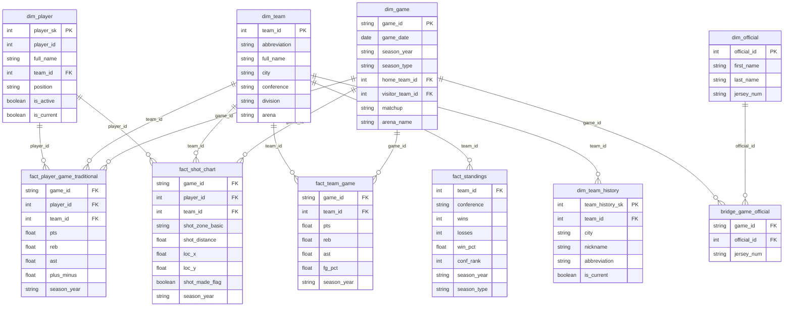

import { Callout } from "fumadocs-ui/components/callout";
import { siteInventory } from "@/lib/site-metrics.generated";

# Entity-Relationship Diagram

This curated page is the whiteboard version of the nbadb star surface: enough structure to see the shape of the warehouse quickly, without losing the grains that matter in analysis.

> **Whiteboard cue:** Start at `dim_game`, `dim_player`, and `dim_team`, then follow the spokes outward to event-level facts, rollups, and bridges.

<Callout type="info">
  Need the exhaustive, source-derived board? Use the companion [Auto ER
  Diagram](/docs/diagrams/er-auto), which is generated from schema definitions
  and should not be hand-edited.
</Callout>

## Quick navigation

  <ScoutCard title="Find the central spine" label="Entry surface">
    Start with <a href="#how-to-read-the-board">How to read the board</a> if you
    need the fastest route through `dim_game`, `dim_player`, and `dim_team`.
  </ScoutCard>
  <ScoutCard title="Read by warehouse role" label="Entry surface">
    Jump to <a href="#schema-categories">Schema categories</a> when you care
    more about table class counts than individual relationships.
  </ScoutCard>
  <ScoutCard
    title="Open the full generator-owned board"
    label="Generated companion"
  >
    Use <a href="/docs/diagrams/er-auto">Auto ER Diagram</a> when you need the
    exhaustive schema inventory rather than curated emphasis.
  </ScoutCard>
  <ScoutCard title="Leave the whiteboard for SQL planning" label="Next route">
    Skip to <a href="#next-steps-from-er-diagram">Next steps</a> when the
    picture is clear and the next move is relationships, schema reference, or
    lineage.
  </ScoutCard>

## Use this page when…

| If you need to answer…                                              | Start here                                      |
| ------------------------------------------------------------------- | ----------------------------------------------- |
| “Which dimensions anchor most joins?”                               | [How to read the board](#how-to-read-the-board) |
| “Which relationships are many-to-many or history-aware?”            | [How to read the board](#how-to-read-the-board) |
| “How many dimensions, facts, bridges, aggregates, and views exist?” | [Schema categories](#schema-categories)         |
| “Where is the full schema-derived roster of entities?”              | [Auto ER Diagram](/docs/diagrams/er-auto)       |

The current source-backed inventory includes **{siteInventory.tableFamilyCounts.dimensions} dimensions**, **{siteInventory.tableFamilyCounts.facts} fact tables**, **{siteInventory.tableFamilyCounts.bridges} bridge tables**, **{siteInventory.tableFamilyCounts.aggregates} aggregate tables**, and **{siteInventory.tableFamilyCounts.analytics} analytics outputs**.

## How to Read the Board

If the board feels dense on first glance, read it in three laps: start at the conformed spine, fan
out into fact neighborhoods, then finish with bridges and history-aware dimensions.

### Scan order

1. **Center first** — Find `dim_game`, `dim_player`, and `dim_team` before you read any peripheral table.
2. **Follow the repeated grains** — Look for player-game, team-game, play-by-play, and shot-level fact clusters.
3. **Finish on exceptions** — Bridge tables and SCD2 dimensions explain the relationships that do not fit a single-grain path.

| Scan first                           | What to trace                                                              | Why it matters                                                                                                |
| ------------------------------------ | -------------------------------------------------------------------------- | ------------------------------------------------------------------------------------------------------------- |
| `dim_game`, `dim_player`, `dim_team` | The busiest join paths                                                     | These conformed dimensions sit at the center of most analytical queries                                       |
| Fact clusters                        | Repeated grains such as player-game, team-game, tracking, and play-by-play | They show how nbadb separates possessions, summaries, and specialty surfaces without collapsing them together |
| Bridge tables                        | `bridge_game_official` and `bridge_play_player`                            | They capture many-to-many relationships that do not belong to a single fact grain                             |
| History-aware dimensions             | `dim_player` and `dim_team_history`                                        | They preserve roster and franchise changes with SCD2 fields instead of overwriting the past                   |

## Schema Categories

<table>
  <thead>
    <tr>
      <th>Category</th>
      <th>Count</th>
      <th>Description</th>
    </tr>
  </thead>
  <tbody>
    <tr>
      <td>Dimensions</td>
      <td>{siteInventory.tableFamilyCounts.dimensions}</td>
      <td>Slowly changing reference data</td>
    </tr>
    <tr>
      <td>Facts</td>
      <td>{siteInventory.tableFamilyCounts.facts}</td>
      <td>Event-level transactional data</td>
    </tr>
    <tr>
      <td>Bridges</td>
      <td>{siteInventory.tableFamilyCounts.bridges}</td>
      <td>Many-to-many associations</td>
    </tr>
    <tr>
      <td>Aggregates</td>
      <td>{siteInventory.tableFamilyCounts.aggregates}</td>
      <td>Pre-aggregated rollups</td>
    </tr>
    <tr>
      <td>Analytics outputs</td>
      <td>{siteInventory.tableFamilyCounts.analytics}</td>
      <td>Denormalized analysis-ready surfaces</td>
    </tr>
  </tbody>
</table>

<CourtDivider label="Next board cut" />

## Next steps from ER diagram

  <ScoutCard title="Open the generator-owned full roster" label="Next stop">
    Jump to <a href="/docs/diagrams/er-auto">Auto ER Diagram</a> when you need
    the exhaustive, schema-derived inventory rather than the curated whiteboard
    view.
  </ScoutCard>
  <ScoutCard title="Turn structure into join plans" label="Next stop">
    Continue to <a href="/docs/schema/relationships">Relationships</a> or{" "}
    <a href="/docs/schema">Schema Reference</a> when the next question is how to
    join this surface safely in SQL.
  </ScoutCard>
  <ScoutCard title="Trace one table back to the inbound feed" label="Next stop">
    Move to <a href="/docs/lineage/table-lineage">Table Lineage</a> when the
    diagram has shown where a table sits, but you still need to know which
    source endpoints and staging tables feed it.
  </ScoutCard>

