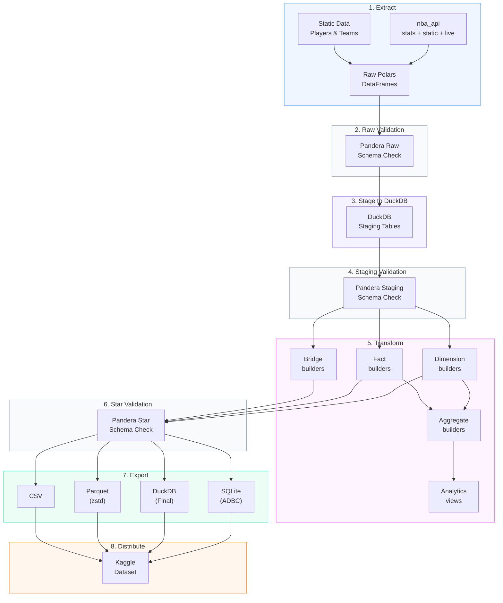
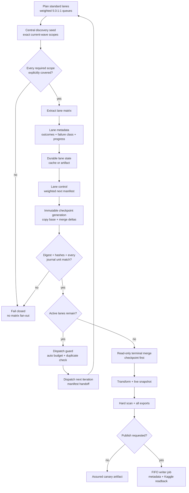

import { Callout } from "fumadocs-ui/components/callout";
import { siteInventory } from "@/lib/site-metrics.generated";

# Pipeline Flow

This page reads like a set play: bring the ball in from the NBA API, validate each possession, stage the data, and fan it out into star-schema outputs that are ready for analysis and distribution.

> **Playbook cue:** The validation checkpoints work like replay review — they stop bad possessions before they become downstream tables.

<Callout type="info">
  The shape of the play stays the same across `init`, `daily`, `monthly`,
  `backfill run`, and `export`; only the scope and runtime change.
</Callout>

## Quick navigation

  <ScoutCard title="Read the whole play left to right" label="Entry surface">
    Start with{" "}
    <a href="#read-the-possession-left-to-right">
      Read the possession left to right
    </a>
    when you need the fast version before any command or table detail.
  </ScoutCard>
  <ScoutCard title="Check the command lane" label="Entry surface">
    Jump to <a href="#pipeline-commands">Pipeline commands</a> when you already
    know the stages and only need the run-mode route.
  </ScoutCard>
  <ScoutCard title="Focus on guardrails" label="Entry surface">
    Use{" "}
    <a href="#read-the-possession-left-to-right">
      Read the possession left to right
    </a>{" "}
    for the validation checkpoints that stop bad data before it reaches star
    outputs.
  </ScoutCard>
  <ScoutCard title="Leave the playbook for dependency trace" label="Next route">
    Skip to <a href="#next-steps-from-pipeline-flow">Next steps</a> when the
    stage map is clear and you need endpoint coverage, ER shape, or lineage.
  </ScoutCard>

## Use this page when…

| If you need to answer…                                                                    | Start here                                                              |
| ----------------------------------------------------------------------------------------- | ----------------------------------------------------------------------- |
| “Where does validation happen?”                                                           | [Read the possession left to right](#read-the-possession-left-to-right) |
| “What actually changes between `init`, `daily`, `monthly`, `backfill run`, and `export`?” | [Pipeline commands](#pipeline-commands)                                 |
| “Which stages produce the public warehouse surface?”                                      | [Read the possession left to right](#read-the-possession-left-to-right) |
| “Where should I go after the stage map?”                                                  | [Next steps from pipeline flow](#next-steps-from-pipeline-flow)         |

nbadb follows an **ELT (Extract, Load, Transform)** pipeline pattern.

The current source-backed inventory is **{siteInventory.tableFamilyCounts.dimensions} dimensions**, **{siteInventory.tableFamilyCounts.facts} facts**, **{siteInventory.tableFamilyCounts.bridges} bridges**, **{siteInventory.tableFamilyCounts.aggregates} aggregate tables**, and **{siteInventory.tableFamilyCounts.analytics} analytics outputs**.

<CourtDivider label="Call the stages" />

## Full Extraction control plane

Long-running GitHub Actions full extraction uses the same ELT stages, but wraps
extraction in weighted temporal lanes, centralized exact-scope discovery, and
durable checkpoint aggregation. The `standard` profile is the default. Each
matrix wave targets fresh, partial-progress, retry, and infrastructure work at
`5:3:1:1` when every queue has work, with a ceiling-rounded 25% endpoint-family
cap while another family is available. Priority and family diversity can override
the preferred queue in a particular slot.

The checkpoint is the recovery boundary: each redispatch copies the previous
checkpoint into a new generation and merges only newly completed lane databases.
Terminal merge consumes that checkpoint before export. Incomplete lanes can also
carry durable DuckDB state artifacts into the next iteration when the cache is
missing or unusable.

The discovery seed uses one VPN tunnel when VPN mode is effective and requests
only the season/season-type combinations in the current matrix. It restores the
prior chain's discovery artifact from the exact manifest source run, merges new
scope evidence, refreshes every requested active-season player/game/workload scope
(including aggregate-only player waves),
and publishes the cumulative artifact. Stable historical scopes remain cacheable. If the prior artifact is
unavailable, it reseeds from scratch before applying the same gate. Missing scopes
stop the workflow; explicit zero-row results count only when the corresponding
combination is recorded as covered.

Checkpoint generations are immutable copy-plus-delta artifacts. Even a zero-delta
iteration creates a distinct database copy rather than republishing or mutating
the previous file. Each report binds the physical DuckDB SHA-256 and every included
lane's coverage hash. Current metadata schema v3 additionally binds the downloaded
lane database digest, lane fields, exact coverage hash, every manifest season/type,
and concrete game/player/workload journal evidence before merge. A lane cannot
self-declare `contract_blocked`; its evidence must equal recomputed support rules.
Staging merges use bag-aware overlap subtraction so duplicate
rows legitimately present within a source retain their maximum multiplicity. A stale
report, changed/swapped database, or reused lane ID with a different contract fails
before readiness. For chaining, literal `max_iterations=auto` propagates to the
next run while the manifest's numeric budget enforces and, when needed, extends the
safety cap from remaining matrix capacity. The dispatcher searches paginated
workflow runs for the exact next `chain=<id> iteration=<n>` title, blocks active or
successful matches, records failed/cancelled history as retryable, and then requires
exactly one newly visible child run. Workflow-level concurrency uses both chain and
iteration, so the parent cannot hold the child's concurrency slot.

The pinned source SHA must be an ancestor of its trusted branch. A zero-active
resume can attest and replay the source run's terminal checkpoint without rebuilding
lanes. Set `publish=false` for a safe Actions canary: the read-only assurance job
still executes merge, transform, live snapshot, hard scan, and every export format,
but receives neither write permission nor Kaggle secrets. Publishing is a separate
writer job that downloads the exact assured artifact and enters the shared FIFO
publisher queue before metadata commit and exact-version Kaggle readback.

## Read the possession left to right

| Stage                      | What to look for                                           | Why it matters                                                                 |
| -------------------------- | ---------------------------------------------------------- | ------------------------------------------------------------------------------ |
| 1. Extract                 | Which endpoints and static feeds start the run             | This is the inbound surface and the first place coverage gaps appear           |
| 2. Raw validation          | Structural checks on API-shaped payloads                   | Bad possessions get stopped before they are staged as if they were trustworthy |
| 3. Stage to DuckDB         | Normalized `stg_*` landing zone                            | This is the operational layer most transforms depend on directly               |
| 4. Staging validation      | Type, nullability, and range checks                        | Naming is normalized here and contract drift becomes visible                   |
| 5. Transform               | Dimension, fact, bridge, aggregate, and analytics builders | This is where warehouse shape and dependency fan-out happen                    |
| 6. Star validation         | Final schema enforcement on public tables                  | It protects the analytical contract before export                              |
| 7-8. Export and distribute | SQLite, DuckDB, Parquet, CSV, and Kaggle lanes             | This is the finish: same modeled surface, different packaging                  |

### The short read

1. **Extract** raw payloads from live endpoints and static reference sources.
2. **Validate** the raw and staging layers before transform logic touches downstream models.
3. **Transform** staging tables into public dimensions, facts, bridges, aggregates, and analytics views.
4. **Export and distribute** the validated star surface to SQLite, DuckDB, Parquet, CSV, and Kaggle-ready artifacts.

## Pipeline commands

| Command              | Stages                                     | Duration |
| -------------------- | ------------------------------------------ | -------- |
| `nbadb init`         | 1-8 (full rebuild)                         | ~2-4h    |
| `nbadb daily`        | 1-7 (incremental, 7-day lookback)          | ~5-15m   |
| `nbadb monthly`      | 1-7 (dimension refresh)                    | ~30-60m  |
| `nbadb backfill run` | 1-7 (targeted gap-fill by season/endpoint) | varies   |
| `nbadb export`       | 7-8 (re-export only)                       | ~5-10m   |

## Key Technologies

- **Polars**: Primary DataFrame engine for all transforms
- **DuckDB**: Staging engine with zero-copy Arrow interchange
- **Pandera**: 3-tier schema validation (raw, staging, star)
- **ADBC**: Arrow Database Connectivity for SQLite export
- **zstd**: Compression for Parquet output files

<CourtDivider label="Next board cut" />

## Next steps from pipeline flow

  <ScoutCard
    title="Reconnect each stage to actual source families"
    label="Next stop"
  >
    Use <a href="/docs/diagrams/endpoint-map">Endpoint Map</a> when you need to
    know which endpoint families feed the possession before it reaches staging
    and transform layers.
  </ScoutCard>
  <ScoutCard title="Inspect the finishing lineup" label="Next stop">
    Open <a href="/docs/diagrams/er-diagram">ER Diagram</a> when the playbook
    has shown the movement and you now need the shape of the dimensions, facts,
    and bridges produced at the end.
  </ScoutCard>
  <ScoutCard
    title="Replay one dependency chain in slow motion"
    label="Next stop"
  >
    Continue to <a href="/docs/lineage/table-lineage">Table Lineage</a> when a
    pipeline stage is not specific enough and you need the exact tables involved
    in one downstream possession.
  </ScoutCard>

