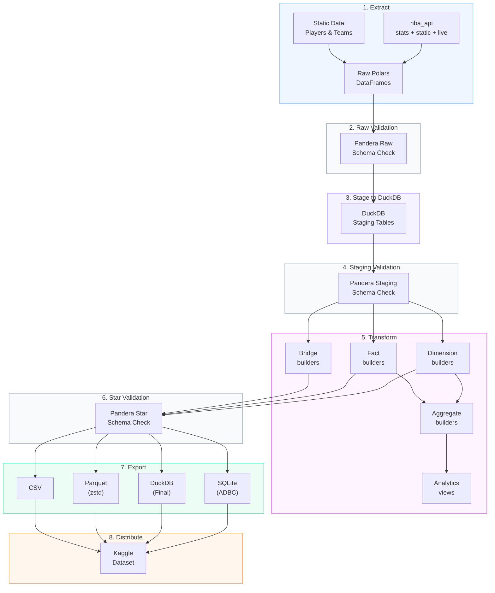

import { Callout } from "fumadocs-ui/components/callout";
import { siteInventory } from "@/lib/site-metrics.generated";

# Pipeline Flow

This page reads like a set play: bring the ball in from the NBA API, validate each possession, stage the data, and fan it out into star-schema outputs that are ready for analysis and distribution.

> **Playbook cue:** The validation checkpoints work like replay review — they stop bad possessions before they become downstream tables.

<Callout type="info">
  The shape of the play stays the same across `init`, `daily`, `monthly`,
  `backfill run`, and `export`; only the scope and runtime change.
</Callout>

## Quick navigation

  <ScoutCard title="Read the whole play left to right" label="Entry surface">
    Start with{" "}
    <a href="#read-the-possession-left-to-right">
      Read the possession left to right
    </a>
    when you need the fast version before any command or table detail.
  </ScoutCard>
  <ScoutCard title="Check the command lane" label="Entry surface">
    Jump to <a href="#pipeline-commands">Pipeline commands</a> when you already
    know the stages and only need the run-mode route.
  </ScoutCard>
  <ScoutCard title="Focus on guardrails" label="Entry surface">
    Use{" "}
    <a href="#read-the-possession-left-to-right">
      Read the possession left to right
    </a>{" "}
    for the validation checkpoints that stop bad data before it reaches star
    outputs.
  </ScoutCard>
  <ScoutCard title="Leave the playbook for dependency trace" label="Next route">
    Skip to <a href="#next-steps-from-pipeline-flow">Next steps</a> when the
    stage map is clear and you need endpoint coverage, ER shape, or lineage.
  </ScoutCard>

## Use this page when…

| If you need to answer…                                                                    | Start here                                                              |
| ----------------------------------------------------------------------------------------- | ----------------------------------------------------------------------- |
| “Where does validation happen?”                                                           | [Read the possession left to right](#read-the-possession-left-to-right) |
| “What actually changes between `init`, `daily`, `monthly`, `backfill run`, and `export`?” | [Pipeline commands](#pipeline-commands)                                 |
| “Which stages produce the public warehouse surface?”                                      | [Read the possession left to right](#read-the-possession-left-to-right) |
| “Where should I go after the stage map?”                                                  | [Next steps from pipeline flow](#next-steps-from-pipeline-flow)         |

nbadb follows an **ELT (Extract, Load, Transform)** pipeline pattern.

The current source-backed inventory is **{siteInventory.tableFamilyCounts.dimensions} dimensions**, **{siteInventory.tableFamilyCounts.facts} facts**, **{siteInventory.tableFamilyCounts.bridges} bridges**, **{siteInventory.tableFamilyCounts.aggregates} aggregate tables**, and **{siteInventory.tableFamilyCounts.analytics} analytics outputs**.

<CourtDivider label="Call the stages" />

## Read the possession left to right

| Stage                      | What to look for                                           | Why it matters                                                                 |
| -------------------------- | ---------------------------------------------------------- | ------------------------------------------------------------------------------ |
| 1. Extract                 | Which endpoints and static feeds start the run             | This is the inbound surface and the first place coverage gaps appear           |
| 2. Raw validation          | Structural checks on API-shaped payloads                   | Bad possessions get stopped before they are staged as if they were trustworthy |
| 3. Stage to DuckDB         | Normalized `stg_*` landing zone                            | This is the operational layer most transforms depend on directly               |
| 4. Staging validation      | Type, nullability, and range checks                        | Naming is normalized here and contract drift becomes visible                   |
| 5. Transform               | Dimension, fact, bridge, aggregate, and analytics builders | This is where warehouse shape and dependency fan-out happen                    |
| 6. Star validation         | Final schema enforcement on public tables                  | It protects the analytical contract before export                              |
| 7-8. Export and distribute | SQLite, DuckDB, Parquet, CSV, and Kaggle lanes             | This is the finish: same modeled surface, different packaging                  |

### The short read

1. **Extract** raw payloads from live endpoints and static reference sources.
2. **Validate** the raw and staging layers before transform logic touches downstream models.
3. **Transform** staging tables into public dimensions, facts, bridges, aggregates, and analytics views.
4. **Export and distribute** the validated star surface to SQLite, DuckDB, Parquet, CSV, and Kaggle-ready artifacts.

## Pipeline commands

| Command              | Stages                                     | Duration |
| -------------------- | ------------------------------------------ | -------- |
| `nbadb init`         | 1-8 (full rebuild)                         | ~2-4h    |
| `nbadb daily`        | 1-7 (incremental, 7-day lookback)          | ~5-15m   |
| `nbadb monthly`      | 1-7 (dimension refresh)                    | ~30-60m  |
| `nbadb backfill run` | 1-7 (targeted gap-fill by season/endpoint) | varies   |
| `nbadb export`       | 7-8 (re-export only)                       | ~5-10m   |

## Key Technologies

- **Polars**: Primary DataFrame engine for all transforms
- **DuckDB**: Staging engine with zero-copy Arrow interchange
- **Pandera**: 3-tier schema validation (raw, staging, star)
- **ADBC**: Arrow Database Connectivity for SQLite export
- **zstd**: Compression for Parquet output files

<CourtDivider label="Next board cut" />

## Next steps from pipeline flow

  <ScoutCard
    title="Reconnect each stage to actual source families"
    label="Next stop"
  >
    Use <a href="/docs/diagrams/endpoint-map">Endpoint Map</a> when you need to
    know which endpoint families feed the possession before it reaches staging
    and transform layers.
  </ScoutCard>
  <ScoutCard title="Inspect the finishing lineup" label="Next stop">
    Open <a href="/docs/diagrams/er-diagram">ER Diagram</a> when the playbook
    has shown the movement and you now need the shape of the dimensions, facts,
    and bridges produced at the end.
  </ScoutCard>
  <ScoutCard
    title="Replay one dependency chain in slow motion"
    label="Next stop"
  >
    Continue to <a href="/docs/lineage/table-lineage">Table Lineage</a> when a
    pipeline stage is not specific enough and you need the exact tables involved
    in one downstream possession.
  </ScoutCard>

