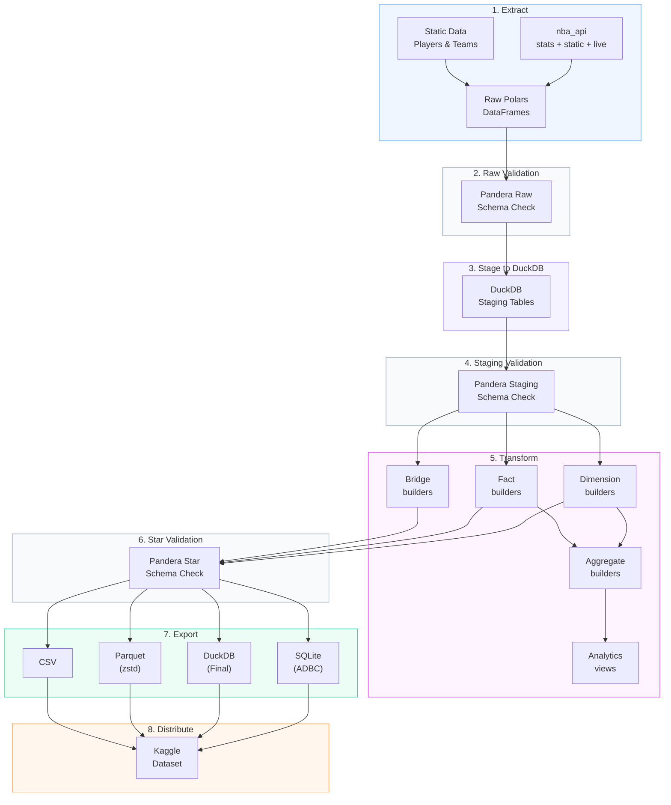
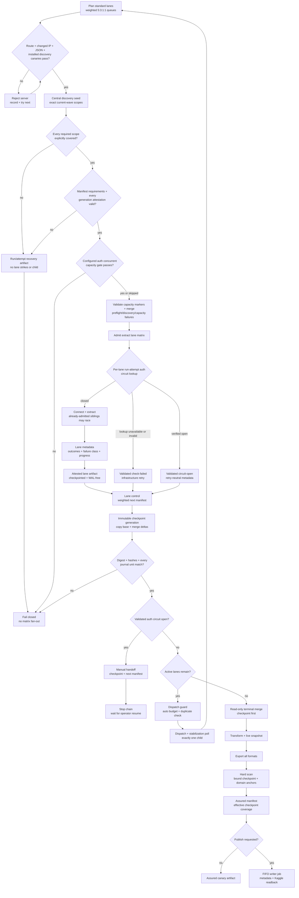

import { Callout } from "fumadocs-ui/components/callout";
import { siteInventory } from "@/lib/site-metrics.generated";

# Pipeline Flow

This page reads like a set play: bring the ball in from the NBA API, validate each possession, stage the data, and fan it out into star-schema outputs that are ready for analysis and distribution.

> **Playbook cue:** The validation checkpoints work like replay review — they stop bad possessions before they become downstream tables.

<Callout type="info">
  The shape of the play stays the same across `init`, `daily`, `monthly`,
  `backfill run`, and `export`; only the scope and runtime change.
</Callout>

## Quick navigation

  <ScoutCard title="Read the whole play left to right" label="Entry surface">
    Start with{" "}
    <a href="#read-the-possession-left-to-right">
      Read the possession left to right
    </a>
    when you need the fast version before any command or table detail.
  </ScoutCard>
  <ScoutCard title="Check the command lane" label="Entry surface">
    Jump to <a href="#pipeline-commands">Pipeline commands</a> when you already
    know the stages and only need the run-mode route.
  </ScoutCard>
  <ScoutCard title="Focus on guardrails" label="Entry surface">
    Use{" "}
    <a href="#read-the-possession-left-to-right">
      Read the possession left to right
    </a>{" "}
    for the validation checkpoints that stop bad data before it reaches star
    outputs.
  </ScoutCard>
  <ScoutCard title="Leave the playbook for dependency trace" label="Next route">
    Skip to <a href="#next-steps-from-pipeline-flow">Next steps</a> when the
    stage map is clear and you need endpoint coverage, ER shape, or lineage.
  </ScoutCard>

## Use this page when…

| If you need to answer…                                                                    | Start here                                                              |
| ----------------------------------------------------------------------------------------- | ----------------------------------------------------------------------- |
| “Where does validation happen?”                                                           | [Read the possession left to right](#read-the-possession-left-to-right) |
| “What actually changes between `init`, `daily`, `monthly`, `backfill run`, and `export`?” | [Pipeline commands](#pipeline-commands)                                 |
| “Which stages produce the public warehouse surface?”                                      | [Read the possession left to right](#read-the-possession-left-to-right) |
| “Where should I go after the stage map?”                                                  | [Next steps from pipeline flow](#next-steps-from-pipeline-flow)         |

nbadb follows an **ELT (Extract, Load, Transform)** pipeline pattern.

The current source-backed inventory is **{siteInventory.tableFamilyCounts.dimensions} dimensions**, **{siteInventory.tableFamilyCounts.facts} facts**, **{siteInventory.tableFamilyCounts.bridges} bridges**, **{siteInventory.tableFamilyCounts.aggregates} aggregate tables**, and **{siteInventory.tableFamilyCounts.analytics} analytics outputs**.

<CourtDivider label="Call the stages" />

## Full Extraction control plane

Long-running GitHub Actions full extraction uses the same ELT stages, but wraps
extraction in weighted temporal lanes, centralized exact-scope discovery, and
durable checkpoint aggregation. The `standard` profile is the default. Each
matrix wave targets fresh, partial-progress, retry, and infrastructure work at
`5:3:1:1` when every queue has work, with a ceiling-rounded 25% endpoint-family
cap while another family is available. Priority and family diversity can override
the preferred queue in a particular slot. When another endpoint identity is
available, the scheduler also prevents six consecutive runner slots from being
endpoint-homogeneous. This distributes endpoint pressure; it does not attest six
unique VPN exit IPs.

The checkpoint is the recovery boundary: each redispatch copies the previous
checkpoint into a new generation and merges only newly completed lane databases.
Terminal merge consumes that checkpoint before export. Incomplete lanes can also
carry exact, attested DuckDB state artifacts into the next iteration after the upload
action returns a positive artifact ID and SHA-256 receipt. Workload-bound
state is revalidated against the active discovery generation during restore. Canonical
diagnostic metadata still reaches lane control when a snapshot is not resumable, but
only an explicitly attested and durably uploaded pointer is carried forward. Split children clear parent
state, and lane-state cache-prefix and parent-lane fallback are not recovery boundaries.
Prior/current lane artifacts and prior checkpoints must match exact
chain/source/run/artifact/generation/coverage provenance. A prior inventory containing
any lane outside the current manifest is rejected, and only a successfully validated
checkpoint is promoted under the canonical artifact name.

The discovery seed uses one VPN tunnel when VPN mode is effective. Tunnel selection
requires a full route, a changed exit IP, bounded GitHub control-plane reachability,
a strict `TeamYears` result-set response, and bounded `common_all_players` plus
`league_game_log` canaries through the installed `nbadb`/`nba_api` stack. The player
canary requires positive player/team membership.
A configured-credential wave then proves its exact active `vpn_parallelism` with a
small concurrent gate before the extraction matrix is admitted. Every probe holds its
tunnel while all run-attempt markers reach a barrier, then rechecks its live process,
route, and exit IP. Any failed gate probe or barrier blocks fan-out and retains
lane-specific VPN diagnostics; its unvalidated failed-host list is not promoted because
no child manifest is created. A lane's first capacity-marker upload is no-overwrite;
only a reported first-upload failure permits one exact lane-unique overwrite retry.
Auth-circuit marker retries remain no-overwrite and resolve only by exact sibling
lookup. Token-derived and direct modes skip that gate. Both
`network_mode=vpn` and `network_mode=auto` planning cap the iteration at
`vpn_parallelism * 32` jobs before credential mode is resolved; admission may prove
fewer configured tunnels, while token-derived auth later runs at most one simultaneous
matrix job without shrinking the planned batch. Each planned row carries a round-robin
VPN slot, and a non-cancelling `queue: max` concurrency group serializes every later
logical lane that reuses that slot. Configured-credential runs admit the complete
current matrix behind those slot queues, preventing a waiting job for one slow slot
from consuming the admission credit needed by another slot. Fresh recommendation hostnames are assigned by a
run-attempt-seeded hash to exactly one live slot, so candidate reordering, per-lane
failures, or additive pool expansion cannot create concurrent host overlap.
Before extraction, a fail-closed job validates every successful capacity marker and
merges preflight and discovery failures with those probes' failed hosts into one
run-attempt-scoped quarantine report. Extraction
connectors reserve enough deadline for the initial
attempt and cleanup, five-minute account cooldown, and one follow-up and cleanup before an
authentication-capacity probe starts.
An exact later `vpn_auth_failure` publishes an immutable run-attempt circuit marker.
Each matrix job checks it before authenticating and verifies the artifact identity,
workflow source, archive digest, safe single-file ZIP, and marker provenance. Siblings
already admitted can race the first marker and receive their own rejection; later queued
lanes become retry-neutral only for a verified open marker. Lookup or validation failure
still blocks authentication, but consumes a bounded infrastructure retry and does not
open the provider circuit or suppress redispatch. Lane control treats either rejection
or valid circuit-open deferral as circuit-open, checkpoints completed work, and routes
the next manifest to a manual handoff without automatic redispatch. Only a
circuit-closed path with active lanes can dispatch a child. Each extraction job also records a 350-minute internal deadline before
checkout inside the 360-minute Actions cap and caps the lane process against elapsed
time so at least 20 minutes remain for checkpointing, attestation, metadata, artifact
upload/retry, diagnostics, and tunnel cleanup.
A generic-internet-only or endpoint-blocked tunnel is
rejected, recorded, excluded from fallback technologies, disconnected, and replaced.
The validated effective quarantine is applied before fan-out and persisted into each
child manifest. The seed requests
only the season/season-type combinations in the current matrix. It restores the
prior chain's discovery artifact from the exact manifest source run, merges new
scope evidence, refreshes every requested active-season player/game/workload scope
(including aggregate-only player waves),
and publishes the cumulative artifact. Stable historical scopes remain cacheable. If the prior artifact is
unavailable, it reseeds from scratch before applying the same gate. Missing scopes
stop the workflow; explicit zero-row results count only when the corresponding
combination is recorded as covered. Typed zero-row game/workload scopes are valid;
empty player-ID scopes are not. Immutable content-addressed discovery and workload
Parquet generations are published through atomic manifest pointers that bind scope or
pairs, schema, row counts, sentinel semantics, and SHA-256. The 90-minute soft deadline
checkpoints an atomic schema-v2 summary; a 95-minute process watchdog preserves upload
headroom before the 120-minute job timeout. The summary is bound to the exact lane
manifest, and the verifier independently derives its required units before reloading
every requested scope/generation before canonical upload and after lane installation.
Both transport-transient and response-contract/validation failures, including wrapped
causes, consume the bounded discovery retry budget; true application failures remain
permanent.
Incomplete state uses a distinct
run/attempt-scoped recovery artifact; a later seed may resume its validated exact
scopes, but the bundle must pass complete seeding and verification before extraction
can consume it canonically. `lane_control` does not run after seed failure, so
unattempted lanes cannot receive false retries.

Checkpoint generations are immutable copy-plus-delta artifacts. Even a zero-delta
iteration creates a distinct database copy rather than republishing or mutating
the previous file. Each report binds the physical DuckDB SHA-256 and every included
lane's coverage hash. Current metadata and state-attestation schema v3 additionally
bind the downloaded lane database digest, source, chain, lane, exact run and artifact
name, exact coverage hash, and every manifest season/type.
Player/team/season lanes are also bound to the exact content-addressed workload
generation, including zero-pair sentinels, and every expected identity/context must
have journal evidence before merge. A lane cannot
self-declare `contract_blocked`; its evidence must equal recomputed support rules.
Validated blocked lanes live in a separate artifact-bound evidence inventory. Its
canonical rows and digest must also match the current or previous manifest chain-state
commitment, so the checkpoint report cannot authenticate its own ancestry. Newly classified
rows survive cancellation in a pending commitment that the next checkpoint merges and clears.
Blocked lanes do
not count toward the effective checkpoint coverage used by terminal assured identity.
Staging merges use bag-aware overlap subtraction so duplicate
rows legitimately present within a source retain their maximum multiplicity. A stale
report, changed/swapped database, or reused lane ID with a different contract fails
before readiness. For chaining, literal `max_iterations=auto` propagates to the
next run while the first manifest fixes a numeric safety cap from remaining
matrix-wide dispatch credits, retry depth, and possible split descendants. Child
manifests never extend it. Cumulative zero-progress accounting remains bounded across
alternating failure classes. The dispatcher searches paginated
workflow runs for the exact next `chain=<id> iteration=<n>` title, blocks active or
successful matches, records failed/cancelled history as retryable, and then requires
exactly one newly visible child run to remain exactly one through a stabilization poll
before acknowledgement. Direct-mode workflow concurrency uses chain and iteration,
so the parent cannot hold the child's slot. VPN/auto chains instead share
a repository-wide FIFO concurrency queue, preventing account-slot overlap without
allowing a newer pending chain to displace an already-queued child.

The pinned source SHA must be an ancestor of its trusted branch. A zero-active
resume can attest and replay the exact manifest/report/database trio from the source run's
terminal checkpoint without rebuilding
lanes. Set `publish=false` for a safe Actions canary: the read-only assurance job
still executes merge, transform, live snapshot, every export format, and then the hard
scan with canonical manifest/database/chain/source verification, required silver/gold
domain anchors and row parity, and the terminal checkpoint's complete lane/run/coverage proof, but receives
neither write permission nor Kaggle
secrets. Publishing is a separate writer job that resolves the exact GitHub artifact
ID, verifies the archive SHA-256 against the upload result, revalidates the assured
manifest, and enters the shared FIFO publisher queue. Metadata is generated for all
254 runtime transform outputs. The publisher uses `--full-publication` to require both
assurance files, matching terminal provenance, and exact-version complete-inventory
SHA-256 readback; generic `--verify-remote` remains available for nonterminal updates.

## Read the possession left to right

| Stage                      | What to look for                                           | Why it matters                                                                 |
| -------------------------- | ---------------------------------------------------------- | ------------------------------------------------------------------------------ |
| 1. Extract                 | Which endpoints and static feeds start the run             | This is the inbound surface and the first place coverage gaps appear           |
| 2. Raw validation          | Structural checks on API-shaped payloads                   | Bad possessions get stopped before they are staged as if they were trustworthy |
| 3. Stage to DuckDB         | Normalized `stg_*` landing zone                            | This is the operational layer most transforms depend on directly               |
| 4. Staging validation      | Type, nullability, and range checks                        | Naming is normalized here and contract drift becomes visible                   |
| 5. Transform               | Dimension, fact, bridge, aggregate, and analytics builders | This is where warehouse shape and dependency fan-out happen                    |
| 6. Star validation         | Final schema enforcement on public tables                  | It protects the analytical contract before export                              |
| 7-8. Export and distribute | SQLite, DuckDB, Parquet, CSV, and Kaggle lanes             | This is the finish: same modeled surface, different packaging                  |

### The short read

1. **Extract** raw payloads from live endpoints and static reference sources.
2. **Validate** the raw and staging layers before transform logic touches downstream models.
3. **Transform** staging tables into public dimensions, facts, bridges, aggregates, and analytics views.
4. **Export and distribute** the validated star surface to SQLite, DuckDB, Parquet, CSV, and Kaggle-ready artifacts.

## Pipeline commands

| Command              | Stages                                     | Duration                                         |
| -------------------- | ------------------------------------------ | ------------------------------------------------ |
| `nbadb init`         | 1-8 (full rebuild)                         | API-bound; varies by full endpoint/history scope |
| `nbadb daily`        | 1-7 (incremental, 7-day lookback)          | ~5-15m                                           |
| `nbadb monthly`      | 1-7 (dimension refresh)                    | ~30-60m                                          |
| `nbadb backfill run` | 1-7 (targeted gap-fill by season/endpoint) | varies                                           |
| `nbadb export`       | 7-8 (re-export only)                       | ~5-10m                                           |

## Key Technologies

- **Polars**: Primary DataFrame engine for all transforms
- **DuckDB**: Staging engine with zero-copy Arrow interchange
- **Pandera**: 3-tier schema validation (raw, staging, star)
- **ADBC**: Arrow Database Connectivity for SQLite export
- **zstd**: Compression for Parquet output files

<CourtDivider label="Next board cut" />

## Next steps from pipeline flow

  <ScoutCard
    title="Reconnect each stage to actual source families"
    label="Next stop"
  >
    Use <a href="/docs/diagrams/endpoint-map">Endpoint Map</a> when you need to
    know which endpoint families feed the possession before it reaches staging
    and transform layers.
  </ScoutCard>
  <ScoutCard title="Inspect the finishing lineup" label="Next stop">
    Open <a href="/docs/diagrams/er-diagram">ER Diagram</a> when the playbook
    has shown the movement and you now need the shape of the dimensions, facts,
    and bridges produced at the end.
  </ScoutCard>
  <ScoutCard
    title="Replay one dependency chain in slow motion"
    label="Next stop"
  >
    Continue to <a href="/docs/lineage/table-lineage">Table Lineage</a> when a
    pipeline stage is not specific enough and you need the exact tables involved
    in one downstream possession.
  </ScoutCard>

