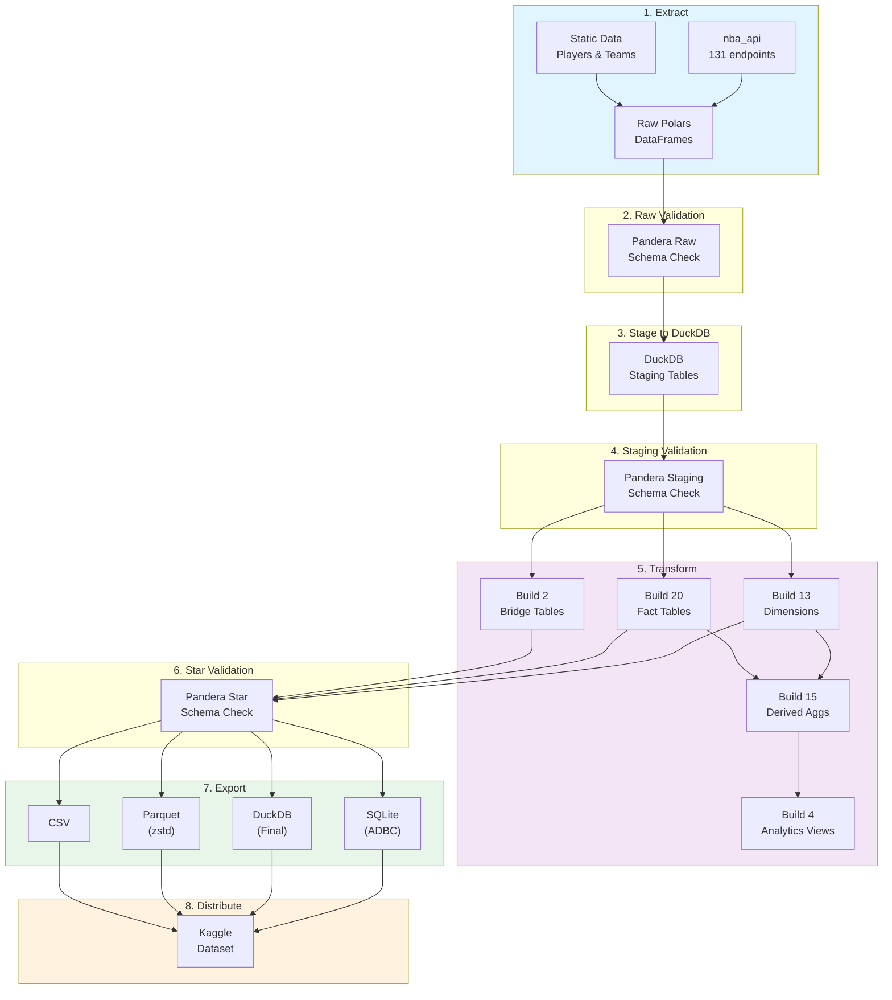

# Pipeline Flow

nbadb follows an **ELT (Extract, Load, Transform)** pipeline pattern.

## Pipeline Commands

| Command | Stages | Duration |
|---------|--------|----------|
| `nbadb init` | 1-8 (full rebuild) | ~2-4h |
| `nbadb daily` | 1-7 (incremental, 7-day lookback) | ~5-15m |
| `nbadb monthly` | 1-7 (dimension refresh) | ~30-60m |
| `nbadb full` | 1-7 (fill gaps, preserve existing) | ~2-4h |
| `nbadb export` | 7-8 (re-export only) | ~5-10m |

## Key Technologies

- **Polars**: Primary DataFrame engine for all transforms
- **DuckDB**: Staging engine with zero-copy Arrow interchange
- **Pandera**: 3-tier schema validation (raw, staging, star)
- **ADBC**: Arrow Database Connectivity for SQLite export
- **zstd**: Compression for Parquet output files
