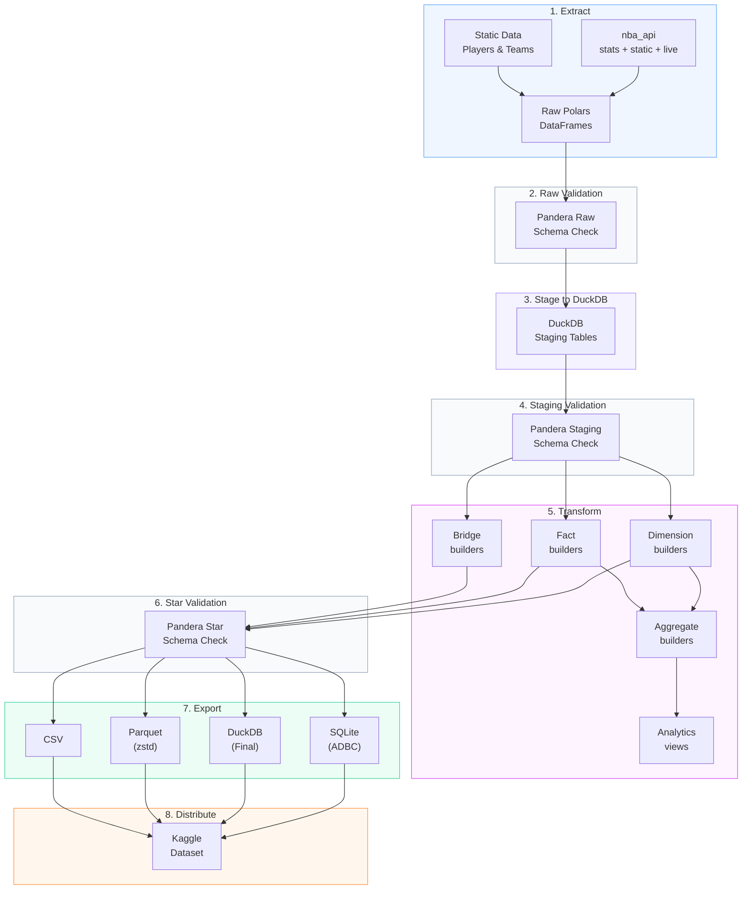

import { Callout } from "fumadocs-ui/components/callout";
import { siteInventory } from "@/lib/site-metrics.generated";

# Pipeline Flow

This page reads like a set play: bring the ball in from the NBA API, validate each possession, stage the data, and fan it out into star-schema outputs that are ready for analysis and distribution.

> **Playbook cue:** The validation checkpoints work like replay review — they stop bad possessions before they become downstream tables.

<Callout type="info">
  The extract-stage-transform-export shape stays the same across `init`,
  `daily`, `monthly`, `backfill run`, and `export`. Recurring commands start
  from the current local/Kaggle baseline and do not require a private repository
  or generation store; see [Daily Updates](/docs/guides/daily-updates).
</Callout>

## Quick navigation

  <ScoutCard title="Read the whole play left to right" label="Entry surface">
    Start with{" "}
    <a href="#read-the-possession-left-to-right">
      Read the possession left to right
    </a>
    when you need the fast version before any command or table detail.
  </ScoutCard>
  <ScoutCard title="Check the command lane" label="Entry surface">
    Jump to <a href="#pipeline-commands">Pipeline commands</a> when you already
    know the stages and only need the run-mode route.
  </ScoutCard>
  <ScoutCard title="Focus on guardrails" label="Entry surface">
    Use{" "}
    <a href="#read-the-possession-left-to-right">
      Read the possession left to right
    </a>{" "}
    for the validation checkpoints that stop bad data before it reaches star
    outputs.
  </ScoutCard>
  <ScoutCard title="Leave the playbook for dependency trace" label="Next route">
    Skip to <a href="#next-steps-from-pipeline-flow">Next steps</a> when the
    stage map is clear and you need endpoint coverage, ER shape, or lineage.
  </ScoutCard>

## Use this page when…

| If you need to answer…                                                                    | Start here                                                              |
| ----------------------------------------------------------------------------------------- | ----------------------------------------------------------------------- |
| “Where does validation happen?”                                                           | [Read the possession left to right](#read-the-possession-left-to-right) |
| “What actually changes between `init`, `daily`, `monthly`, `backfill run`, and `export`?” | [Pipeline commands](#pipeline-commands)                                 |
| “Which stages produce the public warehouse surface?”                                      | [Read the possession left to right](#read-the-possession-left-to-right) |
| “Where should I go after the stage map?”                                                  | [Next steps from pipeline flow](#next-steps-from-pipeline-flow)         |

nbadb follows an **ELT (Extract, Load, Transform)** pipeline pattern.

```mermaid
flowchart TD
    subgraph Extract["1. Extract"]
        API["nba_api\nstats + static + live"] --> Raw["Raw Polars\nDataFrames"]
        Static["Static Data\nPlayers & Teams"] --> Raw
    end

    subgraph Validate1["2. Raw Validation"]
        Raw --> RawSchema["Pandera Raw\nSchema Check"]
    end

    subgraph Stage["3. Stage to DuckDB"]
        RawSchema --> DuckStage["DuckDB\nStaging Tables"]
    end

    subgraph Validate2["4. Staging Validation"]
        DuckStage --> StagingSchema["Pandera Staging\nSchema Check"]
    end

    subgraph Transform["5. Transform"]
        StagingSchema --> Dims["Dimension\nbuilders"]
        StagingSchema --> Facts["Fact\nbuilders"]
        StagingSchema --> Bridges["Bridge\nbuilders"]
        Dims --> Derived["Aggregate\nbuilders"]
        Facts --> Derived
        Derived --> Views["Analytics\nviews"]
    end

    subgraph Validate3["6. Star Validation"]
        Dims --> StarSchema["Pandera Star\nSchema Check"]
        Facts --> StarSchema
        Bridges --> StarSchema
    end

    subgraph Export["7. Export"]
        StarSchema --> SQLite["SQLite\n(ADBC)"]
        StarSchema --> DuckFinal["DuckDB\n(Final)"]
        StarSchema --> Parquet["Parquet\n(zstd)"]
        StarSchema --> CSV["CSV"]
    end

    subgraph Upload["8. Distribute"]
        SQLite --> Kaggle["Kaggle\nDataset"]
        DuckFinal --> Kaggle
        Parquet --> Kaggle
        CSV --> Kaggle
    end

    classDef extract fill:#eff6ff,stroke:#60a5fa
    classDef validate fill:#f8fafc,stroke:#94a3b8
    classDef stage fill:#f5f3ff,stroke:#a78bfa
    classDef transform fill:#fdf4ff,stroke:#d946ef
    classDef export fill:#ecfdf5,stroke:#34d399
    classDef upload fill:#fff7ed,stroke:#fb923c

    class Extract extract
    class Validate1,Validate2,Validate3 validate
    class Stage stage
    class Transform transform
    class Export export
    class Upload upload
```

The current source-backed inventory is **{siteInventory.tableFamilyCounts.dimensions} dimensions**, **{siteInventory.tableFamilyCounts.facts} facts**, **{siteInventory.tableFamilyCounts.bridges} bridges**, **{siteInventory.tableFamilyCounts.aggregates} aggregate tables**, and **{siteInventory.tableFamilyCounts.analytics} analytics outputs**.

<CourtDivider label="Call the stages" />

## Full Extraction control plane

Long-running GitHub Actions full extraction uses the same ELT stages, but wraps
extraction in weighted temporal lanes, centralized exact-scope discovery, and
durable checkpoint aggregation. The `standard` profile is the default. Each
matrix wave targets fresh, partial-progress, retry, and infrastructure work at
`5:3:1:1` when every queue has work, with a ceiling-rounded 25% endpoint-family
cap while another family is available. Priority and family diversity can override
the preferred queue in a particular slot. When another endpoint identity is
available, the scheduler also prevents six consecutive runner slots from being
endpoint-homogeneous. This distributes endpoint pressure; it does not attest six
unique VPN exit IPs.

Before planning, `workflow_guard` requires a fresh primary or partial
`workflow_dispatch` attempt, observes a stable exact-title inventory, and rejects
`gh run rerun` attempts. Inline manifests, receipt-bound lane-manifest handoffs, and
source-run recovery are mutually exclusive. A recovery launch is an
`operation=continue` dispatch that preserves the original chain and pinned source
while supplying the exact five-field continuation source: source run id, source run
attempt, manifest artifact name, manifest artifact id, and manifest artifact digest.
The attempt is never inferred from an artifact name or a `latest`-style lookup.

Every dispatch is admitted under an exact operation authority. The full-extraction
workflow accepts only the first three kinds; publication and recurring builds run as
separate dispatches:

| Operation kind        | Dispatch surface     | Allowed effects                                                                       |
| --------------------- | -------------------- | ------------------------------------------------------------------------------------- |
| `targeted_smoke`      | full extraction      | Exactly one VPN lane, one iteration, one-lane manual manifest; no merge or redispatch |
| `extract`             | full extraction      | Fresh chain; provider network allowed; no continuation source; no publication effects |
| `continue`            | full extraction      | Requires the exact five-field continuation source from a distinct run; no publication |
| `publish`             | publication dispatch | Requires the sealed terminal handoff member; no provider network; Kaggle mutation     |
| `reconcile`           | publication dispatch | Requires the sealed terminal handoff member; readback-only recovery of an intent      |
| `daily_build`         | recurring dispatch   | Requires parent readback, private-capture, and data-green members; provider network   |
| `monthly_build`       | recurring dispatch   | Same parent members as `daily_build` over its broader season scope                    |
| `data_green_closeout` | closeout dispatch    | Requires remote-readback and human-verification members; records DATA-GREEN           |

The checkpoint is the recovery boundary: each redispatch copies the previous
checkpoint into a new generation and merges only newly completed lane databases.
Durable lane identity comes from the semantic lane contract and coverage hash, not
the scheduler's attempt-local `lane_index`; a later wave may reorder completed lanes
without invalidating their state. A checkpoint becomes a recovery boundary only after
its transaction advances through `candidate`, `built`, `uploaded_verified`, and
`committed`. Terminal merge consumes that committed checkpoint before export.
Incomplete lanes can also
carry exact, attested DuckDB state artifacts into the next iteration after the upload
action returns a positive artifact ID and SHA-256 receipt. Workload-bound
state is revalidated against the active discovery generation during restore. Canonical
diagnostic metadata still reaches lane control when a snapshot is not resumable, but
only an explicitly attested and durably uploaded pointer is carried forward. Split children clear parent
state, and lane-state cache-prefix and parent-lane fallback are not recovery boundaries.
Prior/current lane artifacts and prior checkpoints must match exact
chain/source/run/artifact/generation/coverage provenance. A prior inventory containing
any lane outside the current manifest is rejected. Validation alone does not advance
the recovery pointer; only a committed transaction with a REST-verified immutable
upload receipt does.

```mermaid
flowchart TD
    WorkflowGuard{"Fresh attempt + stable exact-title\nsource mode valid?"} -->|yes| Plan["Plan standard lanes\nweighted 5:3:1:1 queues"]
    WorkflowGuard -->|no| Stop
    Plan --> VpnGate{"Route + changed IP + JSON +\ninstalled discovery canaries pass?"}
    VpnGate -->|no| RotateVpn["Reject server\nrecord + try next"]
    RotateVpn --> VpnGate
    VpnGate -->|yes| Discovery["Central discovery seed\nexact current-wave scopes"]
    Discovery --> ScopeGate{"Every required scope\nexplicitly covered?"}
    ScopeGate -->|no| Recovery["Run/attempt recovery artifact\nno lane strikes or child"]
    Recovery --> Stop["Fail closed\nno matrix fan-out"]
    ScopeGate -->|yes| BundleGate{"Manifest requirements + every\ngeneration attestation valid?"}
    BundleGate -->|no| Recovery
    BundleGate -->|yes| CapacityGate{"Configured auth concurrent\ncapacity gate passes?"}
    CapacityGate -->|no| Stop
    CapacityGate -->|yes or skipped| QuarantineGate["Validate capacity markers + merge\npreflight/discovery/capacity failures"]
    QuarantineGate --> ExtractMatrix["Admit extract lane matrix"]
    ExtractMatrix --> CircuitGate{"Per-lane run-attempt auth\ncircuit lookup"}
    CircuitGate -->|lookup unavailable or invalid| CircuitCheckFailed["Validated check-failed\ninfrastructure retry"]
    CircuitGate -->|verified open| CircuitOpenDeferred["Validated circuit-open\nretry-neutral metadata"]
    CircuitGate -->|closed| ConnectExtract["Connect + extract\nalready-admitted siblings may race"]
    ConnectExtract --> LaneMetadata["Lane metadata\noutcomes + failure class + progress"]
    LaneMetadata --> LaneState["Attested lane artifact\ncheckpointed + WAL-free"]
    LaneState --> LaneControl["Lane control\nweighted next manifest"]
    CircuitCheckFailed --> LaneControl
    CircuitOpenDeferred --> LaneControl
    LaneControl --> Candidate["Candidate transaction\nsemantic coverage + generation"]
    Candidate --> Checkpoint["Build immutable generation\ncopy base + merge deltas"]
    Checkpoint --> IdentityGate{"Digest + hashes + every\njournal unit match?"}
    IdentityGate -->|no| Stop
    IdentityGate -->|yes| UploadReceipt["Upload + REST verify\nexact ID/digest/size/source"]
    UploadReceipt --> Commit["Commit transaction\nwrite next-manifest pointer"]
    Commit --> CircuitState{"Validated auth circuit open?"}
    CircuitState -->|yes| ManualHandoff["Manual handoff\ncheckpoint + next manifest"]
    ManualHandoff --> ManualStop["Stop chain\nwait for operator resume"]
    CircuitState -->|no| Decision{"Active lanes remain?"}
    Decision -->|yes| DispatchGuard["Dispatch guard\nauto budget + duplicate check"]
    DispatchGuard --> Dispatch["REST dispatch returns run details\nverify exact child identity"]
    Dispatch --> Plan
    Decision -->|no| Merge["Read-only terminal merge\ncheckpoint first"]
    Merge --> TransformOnly["Transform + live snapshot"]
    TransformOnly --> ExportAll["Export all formats"]
    ExportAll --> Scan["Hard scan\nbound checkpoint + domain anchors"]
    Scan --> Assured["Assured manifest\neffective checkpoint coverage"]
    Assured --> Handoff{"Terminal publication\nhandoff sealed?"}
    Handoff -->|no| Canary["Assured canary artifact"]
    Handoff -->|yes| Publish["Separate handoff-bound dispatch\nFIFO writer + sealed handoff bytes"]
    Publish --> Intent["GitHub Deployment pending\nwrite-ahead intent"]
    Intent --> Claim["Recheck + claim in_progress\nimmediately before Kaggle"]
    Claim --> Kaggle["Single Kaggle mutation"]
    Kaggle --> Readback["Exact version + inventory\nstreamed SHA-256 readback"]
    Readback --> LedgerSuccess["GitHub Deployment success\nverified REST receipt"]
```

The discovery seed uses one VPN tunnel when VPN mode is effective. Tunnel selection
requires a full route, a changed exit IP, bounded GitHub control-plane reachability,
a strict `TeamYears` result-set response, and bounded `common_all_players` plus
`league_game_log` canaries through the installed `nbadb`/`nba_api` stack. The player
canary requires positive player/team membership.
A configured-credential wave then proves its exact active `vpn_parallelism` with a
small concurrent gate before the extraction matrix is admitted. Every probe holds its
tunnel while all run-attempt markers reach a barrier, then rechecks its live process,
route, and exit IP. Any failed gate probe or barrier blocks fan-out and retains
lane-specific VPN diagnostics; its unvalidated failed-host list is not promoted because
no child manifest is created. Capacity slot zero is preferred-only on the freshly
verified discovery/preflight anchor and has no fresh or protocol fallback. Every
non-anchor probe owns one of the
`capacity - 1` explicit fresh recommendation partitions; a single fresh partition owns
the whole pool and uses Nord's current recommendation rank as the tie-breaker after
network and city diversity rather than leaving candidates reserved for the connected anchor. A
lane's first capacity-marker upload is no-overwrite;
only a reported first-upload failure permits one exact lane-unique overwrite retry.
Auth-circuit collision recovery never overwrites an existing marker: it either validates
an exact sibling or makes one additional no-overwrite publish attempt only when bounded
polling reports `absent_timeout`. Invalid, unstable, or API-failure evidence cannot trigger
that retry. If GitHub finalizes concurrent first-writer uploads under that exact name, the
resolver observes three snapshots and requires the final two to agree. Every candidate in
each changed inventory must pass the complete archive and provenance validation contract
before the lowest artifact ID in the stable inventory is selected; any invalid or unstable
inventory fails closed. Token-derived and
direct modes skip that gate. Both
`network_mode=vpn` and `network_mode=auto` planning cap the iteration at
`vpn_parallelism * 32` jobs before credential mode is resolved; admission may prove
fewer configured tunnels, while token-derived auth later runs at most one simultaneous
matrix job without shrinking the planned batch. For `N` planned rows and `S` requested
slots, the manifest uses `min(N, S)` contiguous slots and requires row `i` to use
`i mod min(N, S)`. It fails closed unless lane membership/order is exact and unique,
slot values are integer and in range, loads differ by at most one, and every load is at
most `ceil(N / S)` (`64 / 6` yields `11, 11, 11, 11, 10, 10`). A non-cancelling named
per-slot concurrency group (`cancel-in-progress: false`; GitHub Actions job
concurrency exposes only `group` and `cancel-in-progress`) serializes every later
logical lane that reuses that slot. Configured-credential runs admit the complete
current matrix behind those slot groups, preventing a waiting job for one slow slot
from consuming the admission credit needed by another slot. Fresh recommendation hostnames are assigned by a
run-attempt-seeded hash to exactly one live slot, so candidate reordering, per-lane
failures, or additive pool expansion cannot create concurrent host overlap.
The workflow default remains `vpn_parallelism=2` because this planning precedes
credential-source resolution; a default of six would plan 192 jobs even when
token-derived authentication later serializes them. Fast configured-credential
production launches explicitly pass `vpn_parallelism=6`, subject to the fail-closed
six-tunnel admission gate. Six runners and tunnels still do not attest six distinct
exit IPs.
Before extraction, a fail-closed job validates every successful capacity marker and
merges preflight and discovery failures with those probes' failed hosts into one
run-attempt-scoped quarantine report. Extraction
connectors reserve enough deadline for the initial
attempt and cleanup, five-minute account cooldown, and one follow-up and cleanup before an
authentication-capacity probe starts.
An exact later `vpn_auth_failure` publishes an immutable run-attempt circuit marker.
Each matrix job checks it before authenticating and verifies the artifact identity,
workflow source, archive digest, safe single-file ZIP, and marker provenance. Siblings
already admitted can race the first marker and receive their own rejection; later queued
lanes become retry-neutral only for a verified open marker. Concurrent marker uploads
converge only after the final two snapshots in a bounded three-snapshot window agree and
every observed duplicate validates. The same guard runs again immediately before connector
authentication. Lookup or validation failure
still blocks authentication, but consumes a bounded infrastructure retry and does not
open the provider circuit or suppress redispatch. Lane control treats either rejection
or valid circuit-open deferral as circuit-open, checkpoints completed work, and routes
the next manifest to a manual handoff without automatic redispatch. Only a
circuit-closed path with active lanes can dispatch a child. Each extraction job also records a 350-minute internal deadline before
checkout inside the 360-minute Actions cap and caps the lane process against elapsed
time so at least 20 minutes remain for checkpointing, attestation, metadata, artifact
upload/retry, diagnostics, and tunnel cleanup.
A generic-internet-only or endpoint-blocked tunnel is
rejected, recorded, excluded from fallback technologies, disconnected, and replaced.
The validated effective quarantine is applied before fan-out and persisted into each
child manifest. The seed requests
only the season/season-type combinations in the current matrix. It restores the
prior chain's discovery artifact from the exact distinct manifest or resume source
run, merges new scope evidence, refreshes every requested active-season
player/game/workload scope (including aggregate-only player waves), and publishes the
cumulative artifact. Stable historical scopes remain cacheable. An unavailable,
expired, ambiguous, or invalid explicit source fails closed; prior attempts of the
current run are not a recovery boundary, and explicit source recovery never falls
back to scratch reseeding. Missing scopes
stop the workflow; explicit zero-row results count only when the corresponding
combination is recorded as covered. Typed zero-row game/workload scopes are valid;
empty player-ID scopes are not. Immutable content-addressed discovery and workload
Parquet generations are published through atomic manifest pointers that bind scope or
pairs, schema, row counts, sentinel semantics, and SHA-256. The 90-minute soft deadline
checkpoints an atomic schema-v2 summary; a 95-minute process watchdog preserves upload
headroom before the 120-minute job timeout. The summary is bound to the exact lane
manifest, and the verifier independently derives its required units before reloading
every requested scope/generation before canonical upload and after lane installation.
Both transport-transient and response-contract/validation failures, including wrapped
causes, consume the bounded discovery retry budget; true application failures remain
permanent.
Incomplete state uses a distinct
run/attempt-scoped recovery artifact; a fresh workflow may resume its validated exact
scopes only through the explicit distinct source-run contract. The bundle must pass
complete seeding and verification before extraction can consume it canonically.
`lane_control` does not run after seed failure, so unattempted lanes cannot receive
false retries.

Checkpoint generations are immutable copy-plus-delta artifacts. Even a zero-delta
iteration creates a distinct database copy rather than republishing or mutating
the previous file. Each report binds the physical DuckDB SHA-256 and every included
lane's coverage hash. Current metadata and state-attestation schema v3 additionally
bind the downloaded lane database digest, source, chain, lane, exact run and artifact
name, exact coverage hash, and every manifest season/type.
Player/team/season lanes are also bound to the exact content-addressed workload
generation, including zero-pair sentinels, and every expected identity/context must
have journal evidence before merge. A lane cannot
self-declare `contract_blocked`; its evidence must equal recomputed support rules.
Validated blocked lanes live in a separate artifact-bound evidence inventory. Its
canonical rows and digest must also match the current or previous manifest chain-state
commitment, so the checkpoint report cannot authenticate its own ancestry. Newly classified
rows survive cancellation in a pending commitment that the next checkpoint merges and clears.
Blocked lanes do
not count toward the effective checkpoint coverage used by terminal assured identity.
Staging merges use bag-aware overlap subtraction so duplicate
rows legitimately present within a source retain their maximum multiplicity. A stale
report, changed/swapped database, or reused lane ID with a different contract fails
before readiness. The builder records a `built` transaction only after all of those
checks pass. The uploader then binds the immutable artifact receipt, REST-verifies the
exact ID, run, name, digest, size, and source, and advances through
`uploaded_verified` to `committed`. Only that committed receipt can update
`chain_state.latest_checkpoint_*`; restore downloads the exact artifact ID with
digest-mismatch failure enabled. The checkpoint contract is schema v3, and every
artifact receipt binds an explicit `artifact_run_attempt` that is never inferred from
the artifact name or any latest-style lookup. A bounded name-based fallback remains only for
persisted legacy manifests without a transaction receipt.

`win_probability` limits durable work to ten calls per chunk. Three consecutive
identical upstream response-contract failures open a circuit scoped to that pattern
run. Every later call that reaches the open circuit remains failed and resumable without
an upstream request. Execution stops after the first fully failed newly attempted chunk,
leaving the remaining calls explicitly unattempted. Neither category is journaled as
success or removed from the required coverage inventory.

For chaining, literal `max_iterations=auto` propagates to the
next run while the first manifest fixes a numeric safety cap from remaining
matrix-wide dispatch credits, retry depth, and possible split descendants. Child
manifests never extend it. Cumulative zero-progress accounting remains bounded across
alternating failure classes. The dispatcher searches paginated workflow runs only as
a preflight duplicate guard for the exact next `chain=<id> iteration=<n>` title,
blocking active or successful matches while allowing failed/cancelled history. It then
posts an exact `workflow_dispatch` body containing only `{ref, inputs}`, requires an
exact `workflow_run_id` / `run_url` / `html_url` response, and re-reads that child to
verify its URLs, workflow identity, title, event, branch, `run_attempt == 1`, head SHA,
and source before acknowledgement. Cross-run receipts distinguish semantic source
`S=WORKFLOW_SOURCE_SHA` from producing-run head `H`: manifests and checkpoints remain
bound to `S`, artifacts remain bound to their exact owner run and `H`, and a handoff
requires `S == H` or source ancestry plus byte-identical full-extraction workflow
content. The committed next-manifest uses a run/attempt-unique
non-overwriting artifact; its ID and digest are forwarded to the child for REST
ID/name/digest/size/owner-run/head plus separate semantic-source verification and
exact-ID download. Run/name-only
handoff is a bounded legacy path only when both receipt fields are absent. It still
requires exact producing-owner, semantic-source ancestry, workflow-byte identity,
stable unique inventory, a direct
artifact-ID recheck, digest verification when supplied, and exactly one safe expected
manifest member. If the parent exits first, its trap attempts to cancel that exact
returned child ID. Direct-mode workflow concurrency uses chain and iteration,
so the parent cannot hold the child's slot. VPN/auto chains instead share
a repository-wide FIFO concurrency queue, preventing account-slot overlap without
allowing a newer pending chain to displace an already-queued child.

Historical lane-state, lane-metadata, discovery, and checkpoint inputs use the same
owner-attestation boundary: the consumer rechecks the completed first-attempt owner,
selects from a stable complete inventory, directly verifies each positive artifact ID,
and downloads by ID with the GitHub archive digest enforced separately from the
DuckDB database SHA-256. Current-run committed-manifest and terminal-replay authority
artifacts are likewise bound to the current run, attempt one, and `GITHUB_SHA` before
terminal merge consumes them.

The pinned source SHA must be an ancestor of its trusted branch. A zero-active source
resume freezes planning's selected manifest and schema-v1 selection receipt into the
uploaded plan artifact. Terminal replay REST-verifies that artifact's exact ID, name,
digest, size, unexpired state, archive URL, owner run at exact attempt one, current
producing `GITHUB_SHA` after a final owner re-read, and separate
semantic source, downloads it by ID, and validates
the selected manifest/report/database trio without reselecting a same-name artifact.
It can therefore replay the source run's terminal checkpoint without rebuilding lanes.
The terminal assurance job stays read-only: it
still executes merge, transform, live snapshot, every export format, and then the hard
scan with canonical manifest/database/chain/source verification, required silver/gold
domain anchors and row parity, and the terminal checkpoint's complete lane/run/coverage proof, but receives
neither write permission nor Kaggle
secrets. Publication is decoupled from extraction — there is no `publish` input. The
terminal run uploads the checkpoint, next manifest, private evidence, and sanitized
public candidate, re-reads each exact identity, and seals a
`TerminalPublicationHandoffV1`; a separate handoff-bound dispatch publishes from that
sealed receipt. The publisher resolves the exact GitHub artifact
ID and verifies that its name, unexpired receipt, producing attempt one, and
`GITHUB_SHA` match the immutable upload authority. It repeats the current owner read
before fetching archive bytes; only the explicit publication-recovery roles — exact
cross-run `pending` takeover or no-upload `in_progress` reconciliation — may act from
a later owner attempt, and they may not create or replace the
attempt-one authority. The publisher then verifies the archive SHA-256 and safe layout, revalidates the assured
manifest, and enters the exact non-cancelling `nbadb-kaggle-publish` named concurrency
group. It
validates the complete ZIP inventory before extraction and rejects empty, duplicate,
absolute, traversing, symlinked, special, or colliding members before consumption. It
requires `actions: write`, `deployments: write`, `GH_TOKEN`, the publication source
SHA, default-head enforcement, and
`--publication-ledger github-deployment --require-durable-intent`. Head discovery asks
GraphQL for the newest two dataset-specific Deployments in `CREATED_AT DESC` order,
then validates their exact REST receipts and complete at-most-two-status sets,
ignoring transport order and sorting chronology locally. Executor admission fully
paginates up to 1,000 attempt jobs and direct-verifies the unique publisher job ID;
the parent run may remain pending while that job is in progress. Executor proof uses
`GITHUB_WORKFLOW` and the immutable workflow definition, while historical status
executors validate their own workflows; dynamic `run-name` remains a separate run
title. Default-head proof also distinguishes Git's
`/git/ref/heads/<branch>` request from its canonical
`/git/refs/heads/<branch>` response URL.

The ledger records `pending` before mutation, rechecks and claims `in_progress`
immediately before Kaggle, and records `success` only after exact-version
complete-inventory SHA-256 readback. Any crash after the verified claim is
reconciliation-only until the exact marker/version/inventory/hash evidence resolves
it. Recovery is not same-run-only: a distinct run may take over a still-`pending`
intent (`record_pending_takeover` binding an uploaded takeover receipt and artifact
member durably, `claim_pending_takeover` claiming it exactly once after the origin
executor is proven durably terminal, then `mark_resolved` re-verifying the origin
live) or reconcile an already-claimed `in_progress` intent readback-only without a
second Kaggle mutation. Full-extraction secondary publication cache restore/save keys
include the current
workflow run ID; only a later attempt of that same run may restore them, and the
Deployment ledger plus remote evidence remain authoritative. Metadata is generated for all 261 runtime transform outputs. The publisher uses
`--full-publication` to require both assurance files and matching terminal provenance;
generic `--verify-remote` remains available for nonterminal updates. After exact
publication or reconciliation, it resolves metadata head `M` as the source or one
direct, non-merge, byte-reproducible metadata-only child. A child `M` triggers an exact
`.github/workflows/ci.yml` dispatch; closeout binds the returned run to `M`, fully
paginates and direct-verifies its jobs, and requires exactly six successes:
`workflow-lint`, `lint`, `metadata`, `typecheck`, `docs`, and `test`. The default ref
must still equal `M` before the metadata-closeout receipt is uploaded. An unchanged
source skips CI but still records closeout.

## Read the possession left to right

| Stage                      | What to look for                                           | Why it matters                                                                 |
| -------------------------- | ---------------------------------------------------------- | ------------------------------------------------------------------------------ |
| 1. Extract                 | Which endpoints and static feeds start the run             | This is the inbound surface and the first place coverage gaps appear           |
| 2. Raw validation          | Structural checks on API-shaped payloads                   | Bad possessions get stopped before they are staged as if they were trustworthy |
| 3. Stage to DuckDB         | Normalized `stg_*` landing zone                            | This is the operational layer most transforms depend on directly               |
| 4. Staging validation      | Type, nullability, and range checks                        | Naming is normalized here and contract drift becomes visible                   |
| 5. Transform               | Dimension, fact, bridge, aggregate, and analytics builders | This is where warehouse shape and dependency fan-out happen                    |
| 6. Star validation         | Final schema enforcement on public tables                  | It protects the analytical contract before export                              |
| 7-8. Export and distribute | SQLite, DuckDB, Parquet, CSV, and Kaggle lanes             | This is the finish: same modeled surface, different packaging                  |

### The short read

1. **Extract** raw payloads from live endpoints and static reference sources.
2. **Validate** the raw and staging layers before transform logic touches downstream models.
3. **Transform** staging tables into public dimensions, facts, bridges, aggregates, and analytics views.
4. **Export and distribute** the validated star surface to SQLite, DuckDB, Parquet, CSV, and Kaggle-ready artifacts.

## Pipeline commands

| Command              | Stages                                                                      | Duration                                         |
| -------------------- | --------------------------------------------------------------------------- | ------------------------------------------------ |
| `nbadb init`         | 1-8 (full rebuild)                                                          | API-bound; varies by full endpoint/history scope |
| `nbadb daily`        | Current/open-season + recent games + live closure + complete stable rebuild | API-bound; varies by discovered current workload |
| `nbadb monthly`      | Recent seasons + season-local discovery + live closure + stable rebuild     | API-bound; broader than daily                    |
| `nbadb backfill run` | 1-7 (targeted gap-fill by season/endpoint)                                  | varies                                           |
| `nbadb export`       | 7-8 (re-export only)                                                        | ~5-10m                                           |

## Key Technologies

- **Polars**: Primary DataFrame engine for all transforms
- **DuckDB**: Staging engine with zero-copy Arrow interchange
- **Pandera**: 3-tier schema validation (raw, staging, star)
- **ADBC**: Arrow Database Connectivity for SQLite export
- **zstd**: Compression for Parquet output files

<CourtDivider label="Next board cut" />

## Next steps from pipeline flow

  <ScoutCard
    title="Reconnect each stage to actual source families"
    label="Next stop"
  >
    Use <a href="/docs/diagrams/endpoint-map">Endpoint Map</a> when you need to
    know which endpoint families feed the possession before it reaches staging
    and transform layers.
  </ScoutCard>
  <ScoutCard title="Inspect the finishing lineup" label="Next stop">
    Open <a href="/docs/diagrams/er-diagram">ER Diagram</a> when the playbook
    has shown the movement and you now need the shape of the dimensions, facts,
    and bridges produced at the end.
  </ScoutCard>
  <ScoutCard
    title="Replay one dependency chain in slow motion"
    label="Next stop"
  >
    Continue to <a href="/docs/lineage/table-lineage">Table Lineage</a> when a
    pipeline stage is not specific enough and you need the exact tables involved
    in one downstream possession.
  </ScoutCard>

