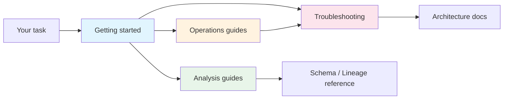

import { Callout } from "fumadocs-ui/components/callout";

# Guides

Hands-on workflows for analysts and operators. Pick the guide that matches the job in front of you; browse the full list in the sidebar.

<Callout type="info">
  New to the project? The [Role-Based Onboarding Hub](/docs/guides/role-based-onboarding-hub) routes you to the right first page based on your role.
</Callout>

## Where to start

| If you need to…                          | Start here                                                          | Then                                                     |
| ---------------------------------------- | ------------------------------------------------------------------- | -------------------------------------------------------- |
| Try queries without local setup          | [SQL Playground](/docs/playground)                                  | [Analytics Quickstart](/docs/guides/analytics-quickstart) |
| Answer a question with the dataset       | [Analytics Quickstart](/docs/guides/analytics-quickstart)           | [DuckDB Query Examples](/docs/guides/duckdb-queries)      |
| Onboard a new contributor                | [Role-Based Onboarding Hub](/docs/guides/role-based-onboarding-hub) | [CLI Reference](/docs/cli-reference)                      |
| Run or recover the pipeline              | [Daily Updates](/docs/guides/daily-updates)                         | [Troubleshooting Playbook](/docs/guides/troubleshooting-playbook) |

## How guides connect

**Getting started** — [SQL Playground](/docs/playground), [Analytics Quickstart](/docs/guides/analytics-quickstart), [Role-Based Onboarding Hub](/docs/guides/role-based-onboarding-hub)

**Analysis** — [DuckDB Query Examples](/docs/guides/duckdb-queries), [Player Comparison](/docs/guides/player-comparison), [Shot Chart Analysis](/docs/guides/shot-chart-analysis), [Parquet Usage](/docs/guides/parquet-usage)

**Operations** — [Daily Updates](/docs/guides/daily-updates), [Kaggle Setup](/docs/guides/kaggle-setup)

**Troubleshooting & change management** — [Troubleshooting Playbook](/docs/guides/troubleshooting-playbook), [Strategic Shift Rollout](/docs/guides/strategic-shift-rollout)

## Tips

1. Start with the guide that matches your current task, not the whole section.
2. Copy a working pattern before writing one from scratch.
3. Move to [Schema Reference](/docs/schema) or [Lineage](/docs/lineage) when your question becomes about column contracts or data dependencies.
