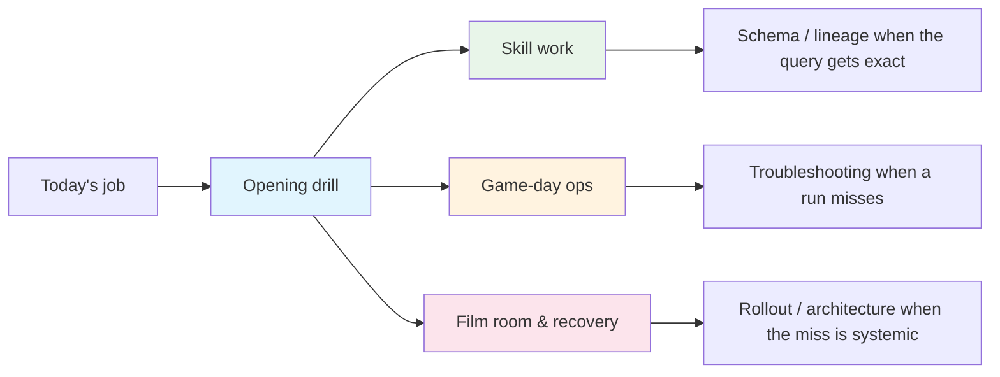

import { Callout } from "fumadocs-ui/components/callout";

# Guides

Use this section like the **practice facility** for nbadb: pick the workflow that matches the job in front of you, run the opening drill, and then branch into deeper schema, lineage, or troubleshooting pages only when the possession demands it.

<StatGrid columns={4}>
  <StatPill
    label="Guides"
    value="11"
    note="hands-on plays for analysis, ops, and onboarding"
  />
  <StatPill
    label="Tracks"
    value="4"
    note="opening drill, skill work, game-day ops, recovery"
  />
  <StatPill
    label="Best for"
    value="Execution"
    note="repeatable workflows over static reference reading"
  />
  <StatPill
    label="Tone"
    value="Practice"
    note="start narrow, then widen only when the play calls for it"
  />
</StatGrid>

<Callout type="info">
  Start with the guide that matches the question you need answered
  <strong> today</strong>. The best route is usually the shortest one that gets
  you to a working query, a clean rerun, or a confident handoff.
</Callout>

## Run one first possession

| If today you need to… | Start here | First useful action | Branch next |
| --------------------- | ---------- | ------------------- | ----------- |
| Warm up in a browser before touching local data | [SQL Playground](/docs/playground) | Run one sample query and change one filter, sort, or aggregate | [Analytics Quickstart](/docs/guides/analytics-quickstart) |
| Answer a live basketball question with the published dataset | [Analytics Quickstart](/docs/guides/analytics-quickstart) | Connect to `nba.duckdb` and stop once `SHOW TABLES` returns the surfaces you expect | [DuckDB Query Examples](/docs/guides/duckdb-queries) |
| Get a contributor onto the right build or docs lane | [Role-Based Onboarding Hub](/docs/guides/role-based-onboarding-hub) | Run `uv sync --extra dev` and keep the next page open before editing anything | [CLI Reference](/docs/cli-reference) |
| Run or recover the pipeline without reading the whole playbook | [Role-Based Onboarding Hub](/docs/guides/role-based-onboarding-hub) | Check the current floor state, then choose the exact recurring or recovery command | [Daily Updates](/docs/guides/daily-updates) |

## Pick your first drill

  <ScoutCard title="Warm up without local setup" label="Start here">
    Open <a href="/docs/playground">SQL Playground</a> first when you want browser-only reps, a teaching surface, or a fast way to reduce query-shape anxiety before you touch the warehouse.
  </ScoutCard>
  <ScoutCard title="Answer a basketball question fast" label="Start here">
    Start on <a href="/docs/guides/analytics-quickstart">Analytics Quickstart</a> when you already have the file or want the shortest route to one live query, one dataframe, or one standings read you can reuse.
  </ScoutCard>
  <ScoutCard title="Get a contributor onto the floor" label="Start here">
    Open <a href="/docs/guides/role-based-onboarding-hub">Role-Based Onboarding Hub</a> first when the job is build setup, docs work, or choosing the right entry page before a code change.
  </ScoutCard>
  <ScoutCard title="Run or recover the pipeline" label="Start here">
    Use <a href="/docs/guides/daily-updates">Daily Updates</a> for recurring work, then move to <a href="/docs/guides/troubleshooting-playbook">Troubleshooting Playbook</a> only when you need the exact artifact, report, or failed command that explains the miss.
  </ScoutCard>

<CourtDivider label="Route board" />

If you only remember one flow, use this one.

Text fallback: start on an opening-drill page, then branch into one of three lanes. Skill work is for reusable analysis patterns, game-day ops is for recurring runs and delivery, and film room and recovery is for debugging, migration, or stakeholder alignment.

## Choose the practice lane

  <ScoutCard title="Opening drill" label="Get moving fast">
    Use <a href="/docs/guides/role-based-onboarding-hub">Role-Based Onboarding Hub</a>, <a href="/docs/guides/analytics-quickstart">Analytics Quickstart</a>, or <a href="/docs/playground">SQL Playground</a> when the first win matters more than broad orientation.
  </ScoutCard>
  <ScoutCard title="Skill work" label="Build a reusable pattern">
    Use <a href="/docs/guides/duckdb-queries">DuckDB Query Examples</a>, <a href="/docs/guides/player-comparison">Player Comparison</a>, <a href="/docs/guides/shot-chart-analysis">Shot Chart Analysis</a>, and <a href="/docs/guides/parquet-usage">Parquet Usage</a> once the possession has narrowed to a specific analytical move.
  </ScoutCard>
  <ScoutCard title="Game-day operations" label="Run the floor">
    Keep <a href="/docs/guides/daily-updates">Daily Updates</a> open for recurring refresh work, then switch to <a href="/docs/guides/kaggle-setup">Kaggle Setup</a> when the conversation shifts from local correctness to packaging and delivery.
  </ScoutCard>
  <ScoutCard title="Film room & recovery" label="Explain or recover the miss">
    Use <a href="/docs/guides/troubleshooting-playbook">Troubleshooting Playbook</a> when the artifact is broken, or <a href="/docs/guides/strategic-shift-rollout">Strategic Shift Rollout</a> when the real issue is sequencing, migration, or stakeholder alignment.
  </ScoutCard>

## Guide tracks

<InsightCard title="How to read this roster">
  Pick a track by the artifact you need to leave with: a first working query, a repeatable operator command, a debugging report, or a shareable deliverable. If the guide stops narrowing the possession, jump to the schema or lineage layer instead of reading the whole roster front to back.
</InsightCard>

### Opening drill

  <ScoutCard title="Role-Based Onboarding Hub" label="Persona route">
    Best for choosing the right first page and command by role. Typical next stop: <a href="/docs/installation">Installation</a>, <a href="/docs/cli-reference">CLI Reference</a>, or <a href="/docs/schema">Schema Reference</a>.
  </ScoutCard>
  <ScoutCard title="Analytics Quickstart" label="First answer">
    Best for getting from download to first answer. Typical next stop: <a href="/docs/guides/duckdb-queries">DuckDB Query Examples</a> or <a href="/docs/guides/player-comparison">Player Comparison</a>.
  </ScoutCard>
  <ScoutCard title="SQL Playground" label="Browser-only reps">
    Best for DuckDB-WASM practice with self-contained NBA-flavored sample data. Typical next stop: <a href="/docs/guides/analytics-quickstart">Analytics Quickstart</a> or <a href="/docs/guides/duckdb-queries">DuckDB Query Examples</a>.
  </ScoutCard>

### Skill work

  <ScoutCard title="DuckDB Query Examples" label="SQL-first exploration">
    Use this when you want copy-ready query patterns. Typical next stop: <a href="/docs/schema">Schema Reference</a> or <a href="/docs/lineage/table-lineage">Table Lineage</a>.
  </ScoutCard>
  <ScoutCard title="Player Comparison" label="Head-to-head reads">
    Use this when the question is player-versus-player framing. Typical next stop: <a href="/docs/guides/shot-chart-analysis">Shot Chart Analysis</a>.
  </ScoutCard>
  <ScoutCard title="Shot Chart Analysis" label="Court-map work">
    Use this when location and shot-zone patterns matter. Typical next stop: <a href="/docs/lineage/column-lineage">Column Lineage</a>.
  </ScoutCard>
  <ScoutCard title="Parquet Usage" label="DataFrame-first workflows">
    Use this when the workflow lives in Polars, Pandas, or Arrow. Typical next stop: <a href="/docs/schema">Schema Reference</a>.
  </ScoutCard>

### Game-day operations

  <ScoutCard title="Daily Updates" label="Recurring refreshes">
    Keep this open for recurring pipeline runs and operational checks. Typical next stop: <a href="/docs/guides/troubleshooting-playbook">Troubleshooting Playbook</a>.
  </ScoutCard>
  <ScoutCard title="Kaggle Setup" label="Delivery flow">
    Use this when the task shifts from local shape to packaging and publish flow. Typical next stop: <a href="/docs/architecture">Architecture</a>.
  </ScoutCard>

### Film room and recovery

  <ScoutCard title="Troubleshooting Playbook" label="Failure isolation">
    Use this when you need a narrow recovery loop for a broken artifact, failing command, or quality miss. Typical next stop: the exact health artifact, coverage report, or docs-autogen command that explains the issue.
  </ScoutCard>
  <ScoutCard title="Strategic Shift Rollout" label="Change management">
    Use this when the real problem is sequencing, migration, or stakeholder alignment. Typical next stop: <a href="/docs/architecture">Architecture</a> or <a href="/docs/diagrams/pipeline-flow">Pipeline Flow</a>.
  </ScoutCard>
  <ScoutCard title="Visual Asset Prompt Pack" label="Creative systems">
    Use this when you need on-brand hero art, OG cards, icons, or texture plates for docs and sharing surfaces.
  </ScoutCard>

## How to use this section well

1. Start on the guide that matches the current job, not the whole platform.
2. Borrow a working pattern before you invent a new one.
3. Drop into [Schema Reference](/docs/schema) or [Lineage](/docs/lineage) only when the workflow turns into a contract or dependency question.
4. End on the narrowest reusable artifact: a query, command, report, or checklist you can rerun on the next possession.
