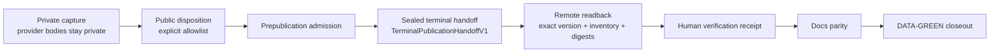

import { Callout } from "fumadocs-ui/components/callout";

# Kaggle Setup

Use this guide as the **loading dock** for the public nbadb dataset on Kaggle: [wyattowalsh/basketball](https://www.kaggle.com/datasets/wyattowalsh/basketball).

## Pick the right delivery format

| If you want…                           | Use…         |
| -------------------------------------- | ------------ |
| A single portable database file        | `nba.sqlite` |
| Fast local SQL and inspection          | `nba.duckdb` |
| Columnar files for Polars/Pandas/Arrow | `parquet/`   |
| Broadest compatibility                 | `csv/`       |

<Callout type="info">
  `nbadb download` copies the latest Kaggle dataset into your configured data
  directory. If Kaggle provides `nba.sqlite` but not `nba.duckdb`, nbadb seeds
  DuckDB from the SQLite file automatically.
</Callout>

## Choose your Kaggle route

| If you need to…                                  | Start here                                                                | Why                                                          |
| ------------------------------------------------ | ------------------------------------------------------------------------- | ------------------------------------------------------------ |
| Get a ready-to-use local dataset through the CLI | [Download via the nbadb CLI](#download-via-the-nbadb-cli)                 | Fastest path into the rest of the nbadb command surface      |
| Control the download inside Python               | [Download via `kagglehub`](#download-via-kagglehub)                       | Easier notebook or script integration                        |
| Understand recurring baseline admission          | [Exact recurring baseline admission](#exact-recurring-baseline-admission) | Separates a consumer download from verified update authority |
| Publish your own refreshed build                 | [Upload your own build](#upload-your-own-build)                           | Handles metadata generation and dataset upload               |

## Download via the nbadb CLI

```bash
nbadb download
```

That command downloads the dataset, copies the files into your data directory, and makes the local folder ready for the rest of the CLI.

<Callout type="info">
  A generic `nbadb download` is the consumer convenience path. Automated
  recurring admission additionally binds the exact positive remote version,
  complete inventory readback, and assurance evidence before update work.
</Callout>

## Download via `kagglehub`

```python
import kagglehub

path = kagglehub.dataset_download("wyattowalsh/basketball")
print(f"Dataset downloaded to: {path}")
```

Use this route when you want direct control over download handling inside Python.

## Exact recurring baseline admission

Daily and monthly use the latest exact, positive, fully verified Kaggle version as
their public parent. The client resolves the version from validated marker evidence,
paginates its complete file inventory, streams every resource through SHA-256
readback, validates the assured manifest and terminal report, and installs the
download atomically before update work.

A cache directory name, generic latest pointer, partial download, GitHub artifact, or
local checkpoint is not a baseline receipt. There is no private-baseline receipt,
private repository, GHCR package, or generation pointer in the recurring contract.
Actions artifacts and caches remain bounded diagnostics or same-run acceleration.

<Callout type="warn">
  If the GitHub Deployment ledger contains an unresolved Kaggle mutation, the
  recurring workflow reconciles that exact intent before it downloads a new
  parent, builds another candidate, or invokes Kaggle. Exact already-published
  evidence closes the intent without a second upload; ambiguous evidence blocks
  the writer.
</Callout>

The recurring candidate preserves public-safe request/result/header-or-path/ordinal/
value/presence/provenance receipts, rebuilds every stable output, and derives its
resource denominator from the runtime registries plus conditional lossless tables
actually observed. Exact decoded-body capture is private evidence only: it may serve
bounded diagnostics, never enters any public candidate, archive, or metadata, and is
never a recurring baseline or publication dependency.

## What lands on disk

A default local layout looks like this:

```text
data/nbadb/
├── nba.sqlite
├── nba.duckdb
├── parquet/
│   └── <table>/...
├── csv/
│   └── <table>.csv
└── dataset-metadata.json
```

| Path                    | What it is                     | Reach for it when…                                           |
| ----------------------- | ------------------------------ | ------------------------------------------------------------ |
| `nba.sqlite`            | Portable relational export     | You need maximum tool compatibility                          |
| `nba.duckdb`            | Fast analytical local database | You want immediate SQL without file globs                    |
| `parquet/`              | Columnar table exports         | Your workflow is Polars, Pandas, Arrow, or DuckDB-over-files |
| `csv/`                  | Flat text exports              | A downstream system cannot read DuckDB or Parquet            |
| `dataset-metadata.json` | Kaggle dataset metadata        | You are preparing or inspecting a publish handoff            |

## Load the files in Python

| Format  | Best for                                            |
| ------- | --------------------------------------------------- |
| SQLite  | Portable inspection or compatibility-oriented tools |
| DuckDB  | Fast SQL, joins, and ad hoc analysis                |
| Parquet | DataFrame-first or file-based analytical workflows  |

### SQLite

```python
import sqlite3

conn = sqlite3.connect("data/nbadb/nba.sqlite")
rows = conn.execute("SELECT * FROM dim_player LIMIT 5").fetchall()
```

### DuckDB

```python
import duckdb

conn = duckdb.connect("data/nbadb/nba.duckdb")
df = conn.sql("SELECT * FROM dim_player LIMIT 5").pl()
```

### Parquet with Polars

```python
import polars as pl

df = pl.read_parquet("data/nbadb/parquet/dim_player/dim_player.parquet")
```

### Parquet with Pandas

```python
import pandas as pd

df = pd.read_parquet("data/nbadb/parquet/dim_player/dim_player.parquet")
```

## Upload your own build

```bash
uv run nbadb upload --data-dir data/nbadb --message "Post-trade-deadline refresh"
```

Without `--verify-remote`, this path is intentionally reported as **submitted and
unverified**, not complete. Use it only when asynchronous Kaggle submission is the
desired contract. The CLI defaults to `--publication-ledger local`; that mode can
retain local reconciliation evidence but is not crash- or cross-host-durable.
Automated release publication uses the full-extraction assured bundle, exact remote
readback, and the GitHub Actions-only
`--publication-ledger github-deployment --require-durable-intent` contract.

### Preflight checklist

| Confirm this first                                                                   | Why                                                                          |
| ------------------------------------------------------------------------------------ | ---------------------------------------------------------------------------- |
| Your target data directory already contains the dataset you want to publish          | `upload` publishes what is on disk                                           |
| Kaggle credentials are available to the environment that `kagglehub` uses            | Upload cannot authenticate without them                                      |
| `NBADB_KAGGLE_DATASET` points at the correct slug if you are not using the default   | Metadata and upload target must agree                                        |
| CSV export headers match the generated table schemas                                 | Kaggle resource schemas are order-bound                                      |
| `dataset-metadata.json` declares every public file or directory you intend to ship   | Upload stages only declared resources                                        |
| `assured-artifact-manifest.json` exists for a full release                           | `--full-publication` fails closed without it                                 |
| `terminal-assurance-report.json` exists for a full release                           | Full publication binds the complete terminal checkpoint evidence             |
| A recurring parent has an exact positive version and complete readback receipt       | A cache path or partial latest download cannot authorize recurring execution |
| The full-extraction release job grants `actions: write` and `deployments: write`     | Durable intent and explicit metadata CI closeout both fail closed            |
| `GH_TOKEN` and `NBADB_KAGGLE_PUBLICATION_SOURCE_SHA` are present                     | GitHub ledger and source binding fail closed without them                    |
| Default-head enforcement names the approved source or exact metadata-only child      | A moved branch cannot publish bytes from an unapproved source                |
| The job owns the named `nbadb-kaggle-publish` group with `cancel-in-progress: false` | The ledger verifies the exact cross-workflow publisher mutex                 |

### Operator preflight

```bash
test -f data/nbadb/assured-artifact-manifest.json
test -f data/nbadb/terminal-assurance-report.json
mkdir -p artifacts/health/local
jq '.checkpoint_report' data/nbadb/terminal-assurance-report.json > artifacts/health/local/checkpoint-report.json
chain_id="$(jq -r .chain_id data/nbadb/assured-artifact-manifest.json)"
source_sha="$(jq -r .source_sha data/nbadb/assured-artifact-manifest.json)"
coverage_fingerprint="$(jq -r .coverage_fingerprint data/nbadb/assured-artifact-manifest.json)"
uv run nbadb scan \
  --data-dir data/nbadb \
  --fail-on error \
  --full-publication \
  --checkpoint-report artifacts/health/local/checkpoint-report.json \
  --checkpoint-manifest artifacts/full-extraction/merge-manifest.json \
  --checkpoint-dir checkpoint-artifact \
  --checkpoint-chain-id "$chain_id" \
  --checkpoint-source-sha "$source_sha" \
  --report-path artifacts/health/local/scan-report.json
uv run python -m nbadb.core.artifact_identity verify \
  --root data/nbadb \
  --chain-id "$chain_id" \
  --source-sha "$source_sha" \
  --coverage-fingerprint "$coverage_fingerprint"
uv run nbadb metadata --data-dir data/nbadb --output data/nbadb/dataset-metadata.json
uv run python -m json.tool data/nbadb/dataset-metadata.json >/dev/null
uv run nbadb upload --data-dir data/nbadb --message "Describe this publish" \
  --full-publication --publication-ledger local
uv run python -m json.tool logs/kaggle/kaggle-upload-manifest.json >/dev/null
```

The last command is an explicit local-operator route. It still requires terminal
assurance and exact remote readback, but it does not provide cross-host durable
admission. The production release command runs only inside the verified Actions
publisher job:

```bash
uv run nbadb upload --data-dir data/nbadb --message "Describe this publish" \
  --full-publication \
  --publication-ledger github-deployment \
  --require-durable-intent
```

The full-extraction publisher supplies `GH_TOKEN`, `NBADB_KAGGLE_PUBLICATION_SOURCE_SHA`,
`NBADB_KAGGLE_REQUIRE_DEFAULT_HEAD=true`, and, for an approved metadata-only child,
`NBADB_KAGGLE_EXPECTED_DEFAULT_HEAD_SHA`. It also grants `actions: write` and
`deployments: write` and owns the exact `nbadb-kaggle-publish` concurrency stanza.
Daily and monthly use the same durable ledger and mutex with `actions: read`,
`contents: read`, and `deployments: write`; they generate metadata inside the
disposable candidate and do not commit it back to the repository.

The full-extraction workflow produces the assured bundle in the required order:
export every format, run the hard scan with required silver/gold domain anchors,
declared row-count parity, plus a canonical
manifest/database/chain/source verification of the terminal checkpoint's complete
lane/run/coverage inventory, and only
then build `assured-artifact-manifest.json`. Do not re-export after that manifest is
built; the publisher must consume the exact bytes that passed assurance. The artifact
ID, name, canonical digest, size, unexpired state, archive URL, and producing
`GITHUB_SHA` must bind the immutable attempt-one upload. The publisher repeats the
current owner read before fetching archive bytes. A later current owner attempt is
accepted only by the explicit publication-recovery roles — exact cross-run `pending`
takeover with a durably terminal origin, a takeover receipt plus artifact member, and
stable double inventory evidence, or no-upload `in_progress` reconciliation — and may
reuse, but never create or replace, that attempt-one authority. It then verifies the
downloaded archive SHA-256 and safe layout against
that receipt and revalidates the assured inventory before Kaggle staging.
The full ZIP inventory is validated before extraction: empty archives, duplicate
normalized paths, absolute or traversing paths, symlinks, special files, and
destination collisions fail before any assured member is consumed.
For a manual scan, download the terminal manifest and checkpoint artifacts shown above;
the assured publication bundle alone intentionally cannot self-attest its extraction proof.

`data/nbadb` is ignored by git, so validate its generated metadata directly instead of using `git diff` on that path. Use `uv run nbadb metadata --output data/nbadb/dataset-metadata.json` without `--data-dir` only as a catalog preview. Use an existing `--data-dir` for publish validation so the rendered resource inventory reflects the bundle on disk. The upload manifest records the staged-resource fingerprint, exact remote versions, marker observations, and final local post-upload check for the latest publish attempt.

## Remote verification contract

`--verify-remote` uses `nbadb-publication.json` to resolve an exact positive dataset
version, but successful verification is neither marker-only nor upload-only. It
paginates the exact version's complete Kaggle API file inventory, requires it to equal
the local staged inventory, and downloads one file at a time for SHA-256 readback.
`--full-publication` adds the pre-submission assured-manifest and terminal-report
requirements. Schema v3 validates the full-extraction checkpoint's complete
lane/run/coverage inventory. Recurring `--verify-remote` validates its frozen
candidate metadata and runtime-derived public inventory before durable mutation.
Both enforce the exact file-versus-partition-directory resource contract and
compare every table's ordered schema and row count across DuckDB, SQLite, CSV, and
Parquet. Each temporary file is removed before the next one, bounding readback
storage to the largest resource. nbadb does not infer a version from Kaggle
cache-directory names. The marker and persisted publication records must have valid
identity digests, state, transition evidence, and resolved versions before they can
influence another upload.

In durable mode, the client first proves the current Actions run, attempt, job, actor,
source SHA, active workflow definition, immutable workflow content, and exact publisher
mutex. Executor admission fully paginates up to 1,000 jobs for the exact attempt,
requires a unique publisher job, and direct-verifies its job ID. The parent run may
still be pending while the publisher job is in progress. Workflow identity comes from
`GITHUB_WORKFLOW`; a dynamic `run-name` is the run title and is not compared to the
workflow definition name. Historical status executors validate against their own
workflow definitions. Default-head verification
requests `/git/ref/heads/<branch>` and separately validates GitHub's canonical
`/git/refs/heads/<branch>` response URL. Dataset-specific ledger head discovery asks
GraphQL for the newest two Deployments ordered by `CREATED_AT DESC`, re-fetches each
exact Deployment and its complete at-most-two-status set through REST, ignores status
transport order and sorts chronology locally, and requires the final two of three
observations to agree. Duplicate chronology, more than one unresolved intent, or an
unresolved intent behind the current head fails closed.

Direct terminal resolution additionally requires the execution to match a fresh
current executor's run ID, attempt, publisher job, and admission digest, and requires
the deployment origin, exact claim, nonce, and latest status to remain unchanged. The
final exact remote claim observation is bracketed by active-executor checks, so claim
drift during the first check or executor drift during the observation writes no
success status. A later attempt of the same run may use only reconciliation. A
different run may recover an unresolved intent exactly two ways: exact cross-run
`pending` takeover (`record_pending_takeover` binds an uploaded takeover receipt and
artifact member durably, `claim_pending_takeover` claims it exactly once with that
durable status still the ledger head and the origin executor proven durably terminal,
then `mark_resolved` re-verifies the origin live) or no-upload `in_progress`
reconciliation from exact remote marker/version/inventory/readback evidence. The FIFO
publisher mutex
serializes repository-sanctioned writers. GitHub offers no conditional append spanning
job liveness and Deployment status history, so this sequential handshake does not claim
atomic exclusion of an arbitrary out-of-band status writer after the final claim read.

| Baseline result                                                                        | Upload behavior                                                                                                                                       | Manifest evidence                                                                                                                                 |
| -------------------------------------------------------------------------------------- | ----------------------------------------------------------------------------------------------------------------------------------------------------- | ------------------------------------------------------------------------------------------------------------------------------------------------- |
| Matching marker already present                                                        | Skip upload and reconcile the existing remote bundle.                                                                                                 | `status=reconciled_existing_remote`, `upload_attempts=0`, and `resolved_version=<exact version>`                                                  |
| Marker present but not this bundle                                                     | Upload once, then poll the marker until the expected hashes appear or the deadline expires.                                                           | `baseline.state=marker_present`, `baseline.version`, `observations`, and final `resolved_version`                                                 |
| Marker request returns Kaggle HTTP 404                                                 | Resolve the current version through Kaggle's dataset metadata API and allow one bootstrap upload only when the dataset has no unresolved publication. | `baseline.state=bootstrap_marker_missing`, `marker_status_code=404`, `baseline.version`, and `upload_allowed=true`                                |
| Timeout, authentication error, non-404 HTTP response, or missing/invalid exact version | Fail before upload.                                                                                                                                   | `status=baseline_reconciliation_failed`, `baseline.state=reconciliation_failed` or `bootstrap_version_resolution_failed`, and `upload_attempts=0` |

### Unresolved uploads and retries

If upload was attempted but the expected marker was not visible before
`--remote-timeout`, the command writes
`status=publication_reconciliation_required` and raises an error. Treat that as
an ambiguous remote result, not permission to upload again. Once Kaggle exposes a
matching marker, rerunning the same command reconciles it and skips upload.

The marker-404 bootstrap path is stricter. The manifest is written with
`status=upload_attempt_started` before the single upload call. If that attempt
remains unresolved, a later run blocks every new bundle for the dataset. When the
remote marker later matches the recorded prior `publish_key` and
`bundle_fingerprint`, the client records `prior_unresolved_reconciliation`, resolves
that publication at the exact marker version, and only then may upload the current
bundle. A missing or nonmatching marker remains reconciliation-required.

The external ledger adds a write-ahead boundary around that Kaggle protocol. It creates
and verifies one `pending` Deployment before mutation, re-verifies the executor,
approved default head, ledger head, and remote baseline, then claims and verifies
`in_progress` immediately before `kagglehub.dataset_upload`. `success` is recorded only
after the exact Kaggle version, complete inventory, and every resource digest pass.
Once `in_progress` is visible, any crash or exception is reconciliation-only: no retry
may enter `dataset_upload` until exact marker/version/full-hash evidence resolves the
intent. A missing or nonmatching marker keeps the dataset blocked.

Full extraction publishes only from the approved default-branch head. Daily and
monthly jobs share the same `nbadb-kaggle-publish` mutex, durable Deployment
ledger, exact remote readback, and default-head gate. They download the public
parent, run the recurring command, scan, export, generate metadata inside the
disposable candidate, then call `nbadb upload --verify-remote
--publication-ledger github-deployment --require-durable-intent`. No recurring
generation store, private pointer, or metadata commit participates.

After an exact upload or remote reconciliation, the full-extraction publisher performs
post-publication metadata closeout without another Kaggle mutation. It resolves
metadata head `M` as either the frozen source or one direct, non-merge child with the
fixed `chore: regenerate dataset-metadata.json` subject, only
`dataset-metadata.json` changed, and bytes reproduced from the assured data. A child
`M` causes an explicit `.github/workflows/ci.yml` dispatch with request body
`{ref: <default branch>, inputs: {}}`; the returned run ID and URLs are direct-verified
at exact `M`. Closeout fully paginates up to 1,000 jobs and accepts exactly one
successful `workflow-lint`, `lint`, `metadata`, `typecheck`, `docs`, and `test` job,
direct-verifies each job, then rechecks that the default ref still equals `M`. An
unchanged source skips CI but still writes the run/attempt-scoped metadata-closeout
receipt. This is why full extraction needs `actions: write`. Daily and monthly
use `actions: read`, `contents: read`, and `deployments: write`; their metadata
stays inside the candidate dataset rather than creating a repository child.

Within one process, uploads use a mutex. Processes sharing a host and log directory
also take an advisory file lock through `fcntl` on POSIX or `msvcrt` on Windows.
That lock is intentionally not cross-host; durable Actions publication relies on the
GitHub Deployment ledger, exact workflow mutex, and remote reconciliation instead.

## Version notes and metadata

```bash
uv run nbadb upload --data-dir data/nbadb --message "Post-trade-deadline refresh"
```

```bash
uv run nbadb metadata --data-dir data/nbadb --output data/nbadb/dataset-metadata.json
```

- The CLI default message is `"Automated update"`.
- nbadb ensures `dataset-metadata.json` exists before upload.
- The metadata generator uses the configured Kaggle dataset slug as the dataset `id`.
- The metadata preview generated without `--data-dir` declares 524 resources: two database files plus CSV and Parquet entries for all 261 runtime transform outputs. A concrete base export contains 695 tables—434 canonical staging surfaces plus 261 transform outputs—and 1,392 data resources. Full publication adds the assured artifact manifest and terminal assurance report for 1,394 resources. Each actually observed typed lossless staging table adds one table plus CSV and Parquet resources: either conditional landing yields 696 tables and 1,396 resources, while both yield 697 tables and 1,398 resources.
- Pass `--data-dir` when you want the root metadata file to reflect a concrete export directory before upload. Recurring workflows keep that generated file inside the disposable candidate rather than committing it.
- Upload-time metadata generation validates CSV headers against the generated resource schema field order and fails fast on drift. Full publication additionally checks exact resource kinds and four-format table/schema/row parity, including reconstructed Hive partition columns.
- Use `--verify-remote` when any update needs an exact Kaggle version and full resource-digest readback. Use `--full-publication` only with a complete schema-v3 full-extraction assurance bundle; it implies remote verification and revalidates `assured-artifact-manifest.json` plus the matching terminal report. Recurring workflows use `--verify-remote` with durable intent over their frozen candidate. Both modes upload at most once, then poll until the exact-version API inventory and every streamed file digest match or `--remote-timeout` expires. Defaults are 3,600 seconds and a 15-second poll interval.
- `--publication-ledger` accepts `local` or `github-deployment` and defaults to `local`. GitHub Deployment mode requires remote verification. `--require-durable-intent` requires GitHub Deployment mode and fails closed unless its external write-ahead intent is active.
- The same `--remote-timeout` independently bounds each full-bundle baseline reconciliation, any full readback needed when a marker appears during the marker-404 bootstrap recheck, and the post-upload readback phase. A full-bundle reconciliation that overruns its deadline fails closed before a new upload.
- The upload path validates local metadata/resources, stages only declared files and directories plus the publication marker, rejects symlinks/path traversal, and uses hardlinks where the filesystem permits so the upload root does not duplicate the source tree. It reserves disk headroom before KaggleHub archive creation and fails immediately on local permanent errors such as `ENOSPC`.

<Callout type="warn">
  Treat `dataset-metadata.json` as the generated source of truth for the Kaggle
  handoff. If Kaggle's page-level metadata needs manual reconciliation after an
  upload, use the generated file as the copy source rather than editing a second
  README by hand.
</Callout>

## Publication receipt chain

Each public release advances through one chain of durable receipts. DATA-GREEN is the
final closeout state, not an upload result:



## Related routes

- [Daily Updates](/docs/guides/daily-updates) for recurring refreshes before publish
- [Parquet Usage](/docs/guides/parquet-usage) for DataFrame-first workflows
- [Troubleshooting Playbook](/docs/guides/troubleshooting-playbook) for Kaggle, artifact, and credential misses
