import { Callout } from "fumadocs-ui/components/callout";

# Column Lineage

This page traces individual columns through the pipeline -- from their NBA API source field through raw, staging, and star schema layers. Use it like replay review for one touch in the possession: the exact field that drifted, changed names, or started failing validation.

<Callout>
  Start here when the bug is field-shaped: a wrong percentage, a renamed key, a
  surprising nullability change, or a foreign key that no longer lands where you
  expect.
</Callout>

## Quick navigation

<div className="grid gap-4 md:grid-cols-2 xl:grid-cols-4">
  <ScoutCard title="Trace identity fields" label="Entry surface">
    Start with <a href="#player-identity-lineage">Player identity lineage</a>{" "}
    when the issue is a key, natural identifier, or rename across layers.
  </ScoutCard>
  <ScoutCard title="Check metric math" label="Entry surface">
    Use <a href="#shooting-stats-lineage">Shooting stats lineage</a> or{" "}
    <a href="#advanced-metrics-lineage">Advanced metrics lineage</a> when a
    percentage or rating changed unexpectedly.
  </ScoutCard>
  <ScoutCard title="Follow context keys" label="Entry surface">
    Jump to <a href="#game-context-lineage">Game context lineage</a> or{" "}
    <a href="#team-lineage">Team lineage</a> when the breakage is about joins
    rather than metric math.
  </ScoutCard>
  <ScoutCard title="Inspect metadata sources" label="Under the hood">
    Go to <a href="#lineage-metadata-in-code">Lineage metadata in code</a> when
    you need to confirm how schema metadata and transformer dependencies encode
    the replay.
  </ScoutCard>
</div>

## Scan modes

| If the issue looks like…             | Start here                                            | Why                                                                                   |
| ------------------------------------ | ----------------------------------------------------- | ------------------------------------------------------------------------------------- |
| A renamed or drifting identifier     | [Player identity lineage](#player-identity-lineage)   | Keys usually reveal where naming changed between API, staging, and star layers        |
| A wrong percentage or derived metric | [Shooting stats lineage](#shooting-stats-lineage)     | Metric examples show where values are passed through versus recomputed                |
| A join or season-context mismatch    | [Game context lineage](#game-context-lineage)         | Shared keys like `game_id` and `season_year` explain most warehouse joins             |
| A denormalization or dimension split | [Shot chart lineage](#shot-chart-lineage)             | These examples show how raw fields become normalized dimensions and foreign keys      |
| A code-generation question           | [Lineage metadata in code](#lineage-metadata-in-code) | The schema metadata and `depends_on` declarations power the generated lineage surface |

## How Column Lineage Works

Each column passes through up to four stages:

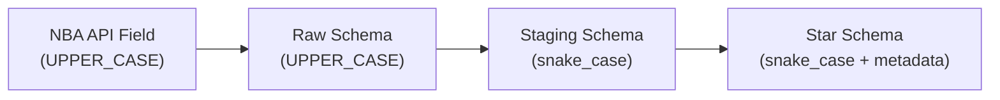

The `source` metadata on staging schemas and `description` + `fk_ref` metadata on star schemas encode this lineage.

| Frame                 | Typical change                       | What to watch for                                          |
| --------------------- | ------------------------------------ | ---------------------------------------------------------- |
| API → Raw             | Usually a straight pass-through      | Nullable or mixed-type payloads                            |
| Raw → Staging         | Renames to `snake_case` + validation | Contract tightening, parsed types, and nullability changes |
| Staging → Star        | Modeling decisions and FK wiring     | Surrogate keys, dimension resolution, and derived fields   |
| Star → Analytics/Aggs | Convenience joins or recomputation   | Semantic renames and metric rollups                        |

<CourtDivider label="Field-level replay" />

## Player Identity Lineage

### player_id

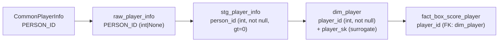

| Stage        | Column Name | Type          | Constraints                          |
| ------------ | ----------- | ------------- | ------------------------------------ |
| API Response | `PERSON_ID` | varies        | none                                 |
| Raw          | `PERSON_ID` | `int \| None` | nullable                             |
| Staging      | `person_id` | `int`         | `not null, gt=0`                     |
| Star (dim)   | `player_id` | `int`         | `not null, gt=0, NK`                 |
| Star (fact)  | `player_id` | `int`         | `not null, FK: dim_player.player_id` |

**Key transformation**: Raw `PERSON_ID` is renamed to `person_id` in staging. In `dim_player`, it becomes the natural key alongside the generated `player_sk` surrogate key. SCD2 logic creates multiple rows per player when team/position/jersey changes.

### player_name

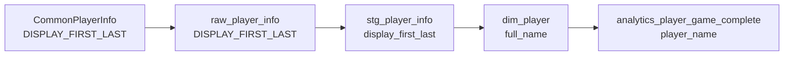

**Key transformation**: Renamed at each stage. The current `analytics_*` outputs use `player_name` for user-friendly querying.

<CourtDivider label="Metric math" />

## Shooting Stats Lineage

### fg_pct (Field Goal Percentage)

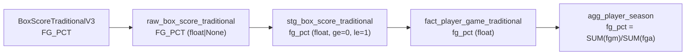

| Stage     | Column   | Notes                                       |
| --------- | -------- | ------------------------------------------- |
| API       | `FG_PCT` | Pre-computed by NBA                         |
| Raw       | `FG_PCT` | Passed through                              |
| Staging   | `fg_pct` | Validated: 0.0 - 1.0                        |
| Fact      | `fg_pct` | Per-game value                              |
| Aggregate | `fg_pct` | Re-computed from season totals for accuracy |

**Key transformation**: In `agg_player_season`, the season `fg_pct` is recomputed as `SUM(fgm) / SUM(fga)` rather than averaging per-game percentages, which would be statistically incorrect.

### ts_pct (True Shooting Percentage)

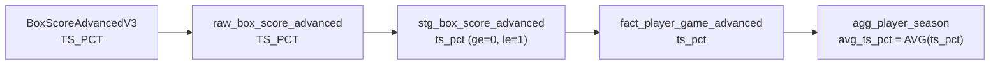

**Key transformation**: Season-level `avg_ts_pct` is computed as a simple average of per-game values in the current implementation. For more accurate results, recompute from totals: `PTS / (2 * (FGA + 0.44 * FTA))`.

<CourtDivider label="Shared context keys" />

## Game Context Lineage

### game_id

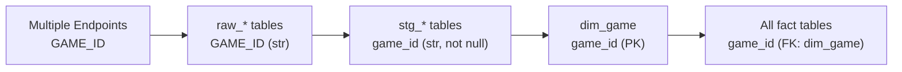

The `game_id` is the most widely referenced key in the schema. It flows unchanged through all stages but gains FK constraints in the star layer.

### season_year

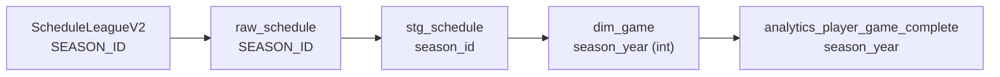

**Key transformation**: The API returns `SEASON_ID` as a string like `"22024"` (type prefix + year). The staging layer parses this to extract the integer year. `dim_game` stores it as `season_year` (int).

## Team Lineage

### team_id (in game context)

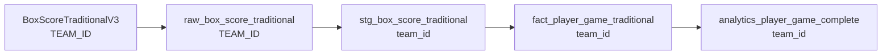

**Key transformation**: Player game rows carry `team_id` directly from the box score feed into `fact_player_game_traditional`, and `analytics_player_game_complete` preserves that team context alongside season and date metadata.

<CourtDivider label="Location and dimension resolution" />

## Shot Chart Lineage

### loc_x, loc_y (Court Coordinates)

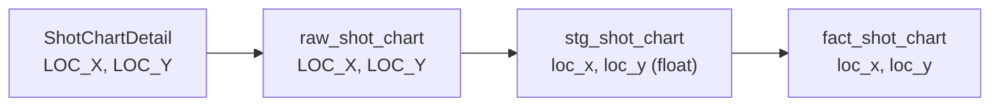

**Coordinate system**: `LOC_X` ranges from -250 to 250 (tenths of feet from basket center, left-right). `LOC_Y` ranges from -50 to 890 (tenths of feet from basket, towards half-court). The basket is at (0, 0). Current analytics rollups summarize shot zones in `agg_shot_zones`, but the raw coordinates remain available at `fact_shot_chart` grain.

### shot_zone (Dimension Resolution)

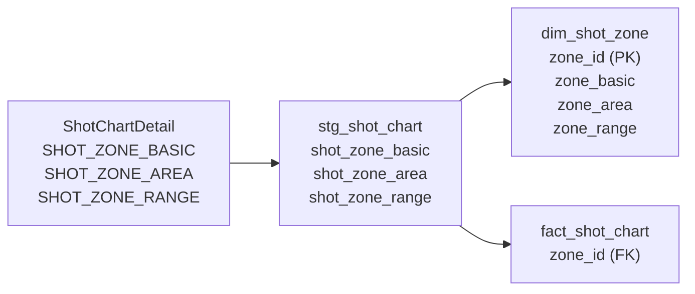

**Key transformation**: The three zone fields are denormalized in the API response. The transform extracts distinct combinations into `dim_shot_zone` and replaces the three text columns with a single `zone_id` FK in the fact table.

<CourtDivider label="Ratings and rollups" />

## Advanced Metrics Lineage

### off_rating / def_rating / net_rating

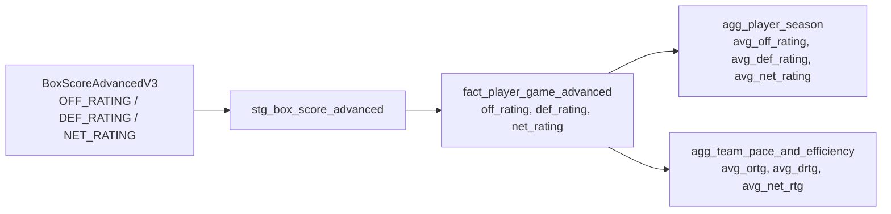

**Key transformation**: Per-game ratings flow directly to the fact table. Aggregate tables compute player-season averages in `agg_player_season` and team-level pace/efficiency summaries in `agg_team_pace_and_efficiency`.

<CourtDivider label="How the replay gets encoded" />

## Lineage Metadata in Code

### Staging: `source` metadata

Staging schemas track the original API column name:

```python
person_id: int = pa.Field(
    nullable=False,
    gt=0,
    metadata={"source": "PERSON_ID"},
)
```

### Star: `fk_ref` metadata

Star schemas track foreign key relationships:

```python
team_id: int | None = pa.Field(
    nullable=True,
    gt=0,
    metadata={
        "description": "Team identifier",
        "fk_ref": "dim_team.team_id",
    },
)
```

### Transform: `depends_on` class variable

Transformers declare their upstream dependencies:

```python
class AggPlayerSeasonTransformer(BaseTransformer):
    output_table = "agg_player_season"
    depends_on = [
        "fact_player_game_traditional",
        "fact_player_game_advanced",
        "fact_player_game_misc",
    ]
```

Together, these three metadata sources (`source`, `fk_ref`, `depends_on`) enable fully automated lineage generation via `nbadb.docs_gen.lineage`.

<CourtDivider label="Next replay angle" />

## Next steps from column lineage

<div className="grid gap-4 md:grid-cols-3">
  <ScoutCard title="Zoom back out to table-level movement" label="Next stop">
    Continue to <a href="/docs/lineage/table-lineage">Table Lineage</a> when the
    issue has spread beyond one field and you need the full upstream/downstream
    dependency chain.
  </ScoutCard>
  <ScoutCard title="Check naming and semantic intent" label="Next stop">
    Use <a href="/docs/data-dictionary/field-reference">Field Reference</a> or
    the <a href="/docs/data-dictionary/glossary">Glossary</a> when the lineage
    is clear but the meaning of the metric, suffix, or field family still is
    not.
  </ScoutCard>
  <ScoutCard title="Verify the exact generated contract" label="Next stop">
    Open <a href="/docs/schema/staging-reference">Staging Reference</a> or{" "}
    <a href="/docs/schema/star-reference">Star Reference</a> when you need the
    current schema-backed type, nullability, and constraint details for the
    field you just traced.
  </ScoutCard>
</div>
