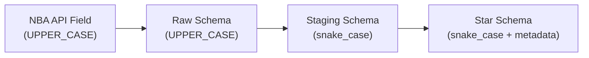
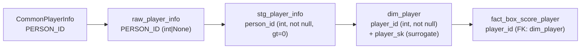
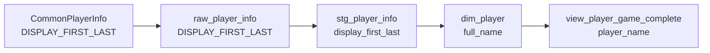
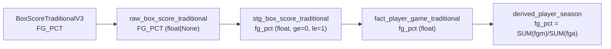
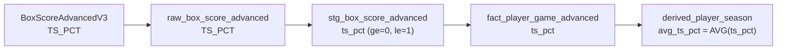
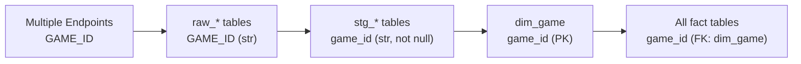
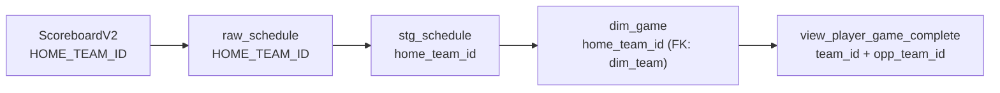
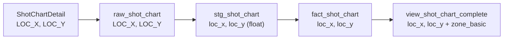
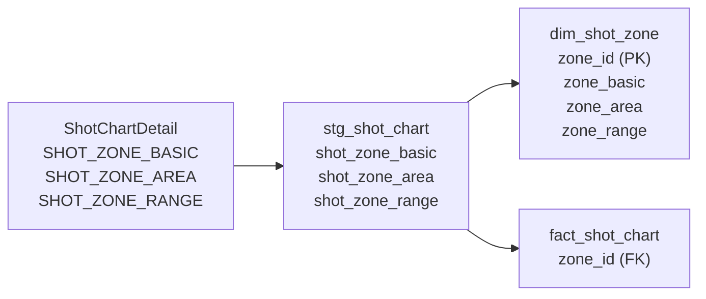
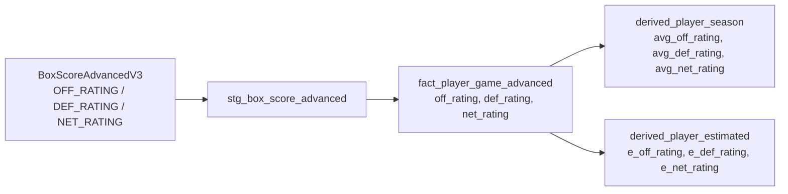

# Column Lineage

This page traces individual columns through the pipeline -- from their NBA API source field through raw, staging, and star schema layers. Understanding column lineage is essential for debugging data issues and validating transformations.

## How Column Lineage Works

Each column passes through up to four stages:



The `source` metadata on staging schemas and `description` + `fk_ref` metadata on star schemas encode this lineage.

## Player Identity Lineage

### player_id



| Stage | Column Name | Type | Constraints |
|-------|-------------|------|-------------|
| API Response | `PERSON_ID` | varies | none |
| Raw | `PERSON_ID` | `int \| None` | nullable |
| Staging | `person_id` | `int` | `not null, gt=0` |
| Star (dim) | `player_id` | `int` | `not null, gt=0, NK` |
| Star (fact) | `player_id` | `int` | `not null, FK: dim_player.player_id` |

**Key transformation**: Raw `PERSON_ID` is renamed to `person_id` in staging. In `dim_player`, it becomes the natural key alongside the generated `player_sk` surrogate key. SCD2 logic creates multiple rows per player when team/position/jersey changes.

### player_name



**Key transformation**: Renamed at each stage. The analytics views use `player_name` for user-friendly querying.

## Shooting Stats Lineage

### fg_pct (Field Goal Percentage)



| Stage | Column | Notes |
|-------|--------|-------|
| API | `FG_PCT` | Pre-computed by NBA |
| Raw | `FG_PCT` | Passed through |
| Staging | `fg_pct` | Validated: 0.0 - 1.0 |
| Fact | `fg_pct` | Per-game value |
| Derived | `fg_pct` | Re-computed from season totals for accuracy |

**Key transformation**: In `derived_player_season`, the season `fg_pct` is recomputed as `SUM(fgm) / SUM(fga)` rather than averaging per-game percentages, which would be statistically incorrect.

### ts_pct (True Shooting Percentage)



**Key transformation**: Season-level `avg_ts_pct` is computed as a simple average of per-game values in the current implementation. For more accurate results, recompute from totals: `PTS / (2 * (FGA + 0.44 * FTA))`.

## Game Context Lineage

### game_id



The `game_id` is the most widely referenced key in the schema. It flows unchanged through all stages but gains FK constraints in the star layer.

### season_year


**Key transformation**: The API returns `SEASON_ID` as a string like `"22024"` (type prefix + year). The staging layer parses this to extract the integer year. `dim_game` stores it as `season_year` (int).

## Team Lineage

### team_id (in game context)



**Key transformation**: `dim_game` stores both `home_team_id` and `away_team_id` as separate FK references to `dim_team`. Analytics views resolve these into `team_id` (player's team) and `opp_team_id` based on the `home_or_away` flag.

## Shot Chart Lineage

### loc_x, loc_y (Court Coordinates)



**Coordinate system**: `LOC_X` ranges from -250 to 250 (tenths of feet from basket center, left-right). `LOC_Y` ranges from -50 to 890 (tenths of feet from basket, towards half-court). The basket is at (0, 0).

### shot_zone (Dimension Resolution)



**Key transformation**: The three zone fields are denormalized in the API response. The transform extracts distinct combinations into `dim_shot_zone` and replaces the three text columns with a single `zone_id` FK in the fact table.

## Advanced Metrics Lineage

### off_rating / def_rating / net_rating



**Key transformation**: Per-game ratings flow directly to the fact table. Derived tables compute season averages. The `derived_player_estimated` table may apply additional estimation adjustments.

## Lineage Metadata in Code

### Staging: `source` metadata

Staging schemas track the original API column name:

```python
person_id: int = pa.Field(
    nullable=False,
    gt=0,
    metadata={"source": "PERSON_ID"},
)
```

### Star: `fk_ref` metadata

Star schemas track foreign key relationships:

```python
team_id: int | None = pa.Field(
    nullable=True,
    gt=0,
    metadata={
        "description": "Team identifier",
        "fk_ref": "dim_team.team_id",
    },
)
```

### Transform: `depends_on` class variable

Transformers declare their upstream dependencies:

```python
class AggPlayerSeasonTransformer(BaseTransformer):
    output_table = "agg_player_season"
    depends_on = [
        "fact_player_game_traditional",
        "fact_player_game_advanced",
        "fact_player_game_misc",
    ]
```

Together, these three metadata sources (`source`, `fk_ref`, `depends_on`) enable fully automated lineage generation via `nbadb.docs_gen.lineage`.
