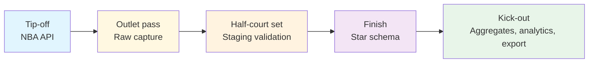

import { Callout } from "fumadocs-ui/components/callout";

# Data Lineage

Lineage is the film room for nbadb. Instead of watching a possession from the broadcast angle, you watch every touch: the inbound pass at the NBA API, the outlet into raw capture, the half-court reset in staging, and the finish in the analytical warehouse.

> **Replay-review note:** Start here when the question is "where did this come from?" or "what breaks if I change this?"

<div className="grid gap-3 md:grid-cols-3">
  <StatPill
    label="Tip-off"
    value="stats + static + live"
    note="The full covered nba_api runtime surface starts each lineage chain."
  />
  <StatPill
    label="Passing lanes"
    value="raw -> stg -> star"
    note="Each touch adds naming, validation, and dependency context."
  />
  <StatPill
    label="Finish"
    value="dim / fact / agg / analytics"
    note="Downstream tables either set the floor, record the action, or summarize the result."
  />
</div>

<CourtDivider label="Read the floor" />

## Choose Your Lens

| Lens                                                | Best for                                       | What you will see                                           |
| --------------------------------------------------- | ---------------------------------------------- | ----------------------------------------------------------- |
| [Table Lineage](/docs/lineage/table-lineage)        | Impact analysis and dependency tracing         | Full possession chains from endpoints to downstream tables  |
| [Column Lineage](/docs/lineage/column-lineage)      | Debugging a field, rename, or constraint issue | Passing-lane examples for important columns                 |
| [Generated Lineage Map](/docs/lineage/lineage-auto) | Exhaustive dependency lookup                   | Auto-generated transformer graph sourced from code metadata |

<Callout type="info">
  `lineage-auto.mdx` is generator-owned. Use the curated pages in this section
  for orientation, then use the generated map when you need exhaustive,
  code-sourced dependency detail.
</Callout>

## Quick navigation

<div className="grid gap-4 md:grid-cols-2 xl:grid-cols-4">
  <ScoutCard title="Trace full table chains" label="Entry surface">
    Start with <a href="/docs/lineage/table-lineage">Table Lineage</a> when you
    need to replay the whole possession from source feed to downstream table.
  </ScoutCard>
  <ScoutCard title="Debug one field" label="Entry surface">
    Use <a href="/docs/lineage/column-lineage">Column Lineage</a> when the
    breakage is local to one key, metric, rename, or constraint.
  </ScoutCard>
  <ScoutCard title="Open the exhaustive replay map" label="Generated companion">
    Jump to <a href="/docs/lineage/lineage-auto">Generated Lineage Map</a> when
    curated examples are not wide enough and you need code-sourced coverage.
  </ScoutCard>
  <ScoutCard
    title="Leave replay review for shape or contracts"
    label="Next route"
  >
    Skip to <a href="#next-steps-from-lineage">Next steps</a> when you are ready
    to switch from dependency tracing to diagrams, schema docs, or endpoint
    scouting.
  </ScoutCard>
</div>

## Use this section when…

| If you need to answer…                                             | Start here                                          |
| ------------------------------------------------------------------ | --------------------------------------------------- |
| “Where did this table come from?”                                  | [Table Lineage](/docs/lineage/table-lineage)        |
| “Which upstream field fed this column?”                            | [Column Lineage](/docs/lineage/column-lineage)      |
| “What else breaks if I change this staging schema or transformer?” | [Table Lineage](/docs/lineage/table-lineage)        |
| “Where is the exhaustive code-derived dependency map?”             | [Generated Lineage Map](/docs/lineage/lineage-auto) |

<div className="grid gap-4 md:grid-cols-3">
  <ScoutCard title="Replay the whole possession" label="Curated lens">
    Use <a href="/docs/lineage/table-lineage">Table Lineage</a> when a table,
    dashboard, or output surface looks wrong and you need to trace the full
    dependency chain back to the inbound feed.
  </ScoutCard>
  <ScoutCard title="Slow the tape down to one field" label="Curated lens">
    Open <a href="/docs/lineage/column-lineage">Column Lineage</a> when the
    breakage is local to a single key, metric, rename, or constraint rather than
    the whole table.
  </ScoutCard>
  <ScoutCard title="Check the full code-sourced map" label="Generated lens">
    Go to <a href="/docs/lineage/lineage-auto">Generated Lineage Map</a> when
    you need exhaustive dependency coverage generated directly from transformer
    metadata.
  </ScoutCard>
</div>

## Why Lineage Matters

1. **Debugging**: When a value looks wrong in a fact table, trace it back to the source API endpoint
2. **Impact analysis**: Before changing a staging schema, see which downstream tables are affected
3. **Coverage**: Identify which API endpoints feed which warehouse tables
4. **Documentation**: Understand the complete data flow without reading transform code

## Possession Map



Read it left to right: sources start the action, raw preserves the original shape, staging organizes the possession, and the star surface makes the result queryable.

## Read the replay by question

| Question                                | Focus on                                         | Then route to                                                                                                          |
| --------------------------------------- | ------------------------------------------------ | ---------------------------------------------------------------------------------------------------------------------- |
| “Where did the chain start?”            | The source and raw touches in the possession map | [Endpoints](/docs/endpoints) if you need source-family detail                                                          |
| “Where was the shape normalized?”       | The staging touch and validation table below     | [Schema Reference](/docs/schema) if you need exact contracts                                                           |
| “What table or view finished the play?” | The star and export touches                      | [Table Lineage](/docs/lineage/table-lineage) or [Column Lineage](/docs/lineage/column-lineage) for the detailed replay |

```text
NBA API --> Raw capture --> Staging validation --> Star surface --> Export
 source      preserve feed    normalize + type      dim/fact/agg        SQLite /
                                                 + dependency flow      DuckDB / Parquet / CSV
```

Each stage applies progressively stricter validation:

| Stage     | Schema Layer | Validation                   | Column Names            |
| --------- | ------------ | ---------------------------- | ----------------------- |
| Extract   | Raw          | Structural only              | UPPER_CASE (API native) |
| Stage     | Staging      | Types + nullability + ranges | snake_case              |
| Transform | Star         | Full constraints + FK refs   | snake_case              |

## Generation

Lineage documentation can be regenerated from transform code:

```bash
uv run nbadb docs-autogen
# or: uv run python -m nbadb.docs_gen
```

This introspects `BaseTransformer.depends_on` and staging schema `metadata["source"]` to build lineage graphs automatically.

<CourtDivider label="Run the next replay" />

## Next steps from lineage

<div className="grid gap-4 md:grid-cols-3">
  <ScoutCard
    title="Switch from dependency to warehouse shape"
    label="Next stop"
  >
    Move to <a href="/docs/diagrams">Diagrams</a> when you understand the chain
    of custody and now need the faster visual board for schema shape, pipeline
    flow, or endpoint coverage.
  </ScoutCard>
  <ScoutCard title="Verify exact contracts after the replay" label="Next stop">
    Continue to <a href="/docs/schema">Schema Reference</a> or the{" "}
    <a href="/docs/data-dictionary">Data Dictionary</a> when the lineage answer
    still needs an exact column contract, field meaning, or naming convention
    check.
  </ScoutCard>
  <ScoutCard
    title="Reconnect the replay to source scouting reports"
    label="Next stop"
  >
    Jump to <a href="/docs/endpoints">Endpoints</a> when the upstream question
    is really about the nba_api family, result set, or extractor surface that
    starts the possession.
  </ScoutCard>
</div>
