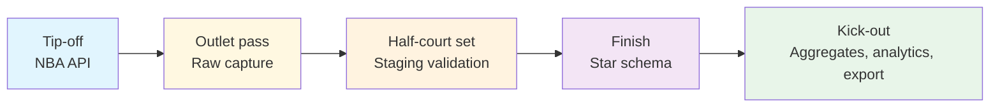

import { Callout } from "fumadocs-ui/components/callout";

# Data Lineage

Lineage is the film room for nbadb. Instead of watching a possession from the broadcast angle, you watch every touch: the inbound pass at the NBA API, the outlet into raw capture, the half-court reset in staging, and the finish in the analytical warehouse.

> **Replay-review note:** Start here when the question is "where did this come from?" or "what breaks if I change this?"

<div className="grid gap-3 md:grid-cols-3">
  <StatPill
    label="Tip-off"
    value="stats + static + live"
    note="The full covered nba_api runtime surface starts each lineage chain."
  />
  <StatPill
    label="Passing lanes"
    value="raw -> stg -> star"
    note="Each touch adds naming, validation, and dependency context."
  />
  <StatPill
    label="Finish"
    value="dim / fact / agg / analytics"
    note="Downstream tables either set the floor, record the action, or summarize the result."
  />
</div>

<Callout type="info">
  `lineage-auto.mdx` is generator-owned. Use the curated pages in this section
  for orientation, then use the generated map when you need exhaustive,
  code-sourced dependency detail.
</Callout>

<CourtDivider label="Read the floor" />

## Pick the replay lens

<div className="grid gap-4 md:grid-cols-3">
  <ScoutCard title="Table Lineage" label="Curated lens">
    Start with <a href="/docs/lineage/table-lineage">Table Lineage</a> when you
    need the full possession chain from source feed to downstream table.
  </ScoutCard>
  <ScoutCard title="Column Lineage" label="Curated lens">
    Start with <a href="/docs/lineage/column-lineage">Column Lineage</a> when
    the breakage is local to one key, metric, rename, or constraint.
  </ScoutCard>
  <ScoutCard title="Generated Lineage Map" label="Generated lens">
    Start with <a href="/docs/lineage/lineage-auto">Generated Lineage Map</a>{" "}
    when the curated examples are not wide enough and you need exhaustive,
    code-sourced coverage.
  </ScoutCard>
</div>

## Choose by symptom

| If you need to answer...                                           | Start here                                          | Then escalate to...                                                                                  |
| ------------------------------------------------------------------ | --------------------------------------------------- | ---------------------------------------------------------------------------------------------------- |
| “Where did this table come from?”                                  | [Table Lineage](/docs/lineage/table-lineage)        | [Generated Lineage Map](/docs/lineage/lineage-auto) if you need the full graph                       |
| “Which upstream field fed this column?”                            | [Column Lineage](/docs/lineage/column-lineage)      | [Generated Lineage Map](/docs/lineage/lineage-auto) if the example trail is not enough               |
| “What else breaks if I change this staging schema or transformer?” | [Table Lineage](/docs/lineage/table-lineage)        | [Generated Lineage Map](/docs/lineage/lineage-auto) for exhaustive dependency blast radius           |
| “Where is the exact code-derived dependency map?”                  | [Generated Lineage Map](/docs/lineage/lineage-auto) | [Schema Reference](/docs/schema) or [Data Dictionary](/docs/data-dictionary) once you need contracts |

## Curated vs generated boundary

| Surface                                             | Optimized for                                           | Not trying to do                         | Maintenance path             |
| --------------------------------------------------- | ------------------------------------------------------- | ---------------------------------------- | ---------------------------- |
| [Table Lineage](/docs/lineage/table-lineage)        | Table-level dependency tracing and impact analysis      | Exhaustively list every transformer edge | Hand-authored                |
| [Column Lineage](/docs/lineage/column-lineage)      | Field-level debugging examples and rename tracing       | Replace the full auto-generated graph    | Hand-authored                |
| [Generated Lineage Map](/docs/lineage/lineage-auto) | Exhaustive dependency lookup sourced from code metadata | Teach route selection or worked examples | Regenerate, do not hand-edit |

## Watch one possession end to end

<InsightCard title="Worked replay: follow a reusable key">
  A lineage question often starts with something simple like{" "}
  <code>player_id</code> or <code>game_id</code>. The useful replay is not just
  "where did this field appear first?" but "where was it normalized, and when
  did it become safe to join against the public model?"
</InsightCard>

| Touch                    | What changes                                                                 | What to verify                                                                           |
| ------------------------ | ---------------------------------------------------------------------------- | ---------------------------------------------------------------------------------------- |
| Source feed              | endpoint-specific naming and result-set shape                                | the field still maps cleanly back to the upstream NBA surface                            |
| Raw capture              | source shape is preserved with minimal interpretation                        | you can still reason about the original payload without warehouse assumptions            |
| Staging                  | names normalize to snake_case, types tighten, and join anchors become stable | downstream transforms have a clean, typed lane to build on                               |
| Star / analytics surface | the field becomes part of an analyst-facing grain or convenience view        | readers can join or filter without knowing the source quirks that started the possession |

Text fallback: use lineage to find the stage where a field stopped being source-shaped and became warehouse-safe. That is usually the moment when debugging, documentation, and join strategy become easier.

## Why Lineage Matters

1. **Debugging**: When a value looks wrong in a fact table, trace it back to the source API endpoint
2. **Impact analysis**: Before changing a staging schema, see which downstream tables are affected
3. **Coverage**: Identify which API endpoints feed which warehouse tables
4. **Documentation**: Understand the complete data flow without reading transform code

## Possession Map



Read it left to right: sources start the action, raw preserves the original shape, staging organizes the possession, and the star surface makes the result queryable.

## Read the replay by question

| Question                                | Focus on                                         | Then route to                                                                                                          |
| --------------------------------------- | ------------------------------------------------ | ---------------------------------------------------------------------------------------------------------------------- |
| “Where did the chain start?”            | The source and raw touches in the possession map | [Endpoints](/docs/endpoints) if you need source-family detail                                                          |
| “Where was the shape normalized?”       | The staging touch and validation table below     | [Schema Reference](/docs/schema) if you need exact contracts                                                           |
| “What table or view finished the play?” | The star and export touches                      | [Table Lineage](/docs/lineage/table-lineage) or [Column Lineage](/docs/lineage/column-lineage) for the detailed replay |

```text
NBA API --> Raw capture --> Staging validation --> Star surface --> Export
 source      preserve feed    normalize + type      dim/fact/agg        SQLite /
                                                 + dependency flow      DuckDB / Parquet / CSV
```

Each stage applies progressively stricter validation:

| Stage     | Schema Layer | Validation                   | Column Names            |
| --------- | ------------ | ---------------------------- | ----------------------- |
| Extract   | Raw          | Structural only              | UPPER_CASE (API native) |
| Stage     | Staging      | Types + nullability + ranges | snake_case              |
| Transform | Star         | Full constraints + FK refs   | snake_case              |

## Generation

Lineage documentation can be regenerated from transform code:

```bash
uv run nbadb docs-autogen
# or: uv run python -m nbadb.docs_gen
```

This introspects `BaseTransformer.depends_on` and staging schema `metadata["source"]` to build lineage graphs automatically.

<CourtDivider label="Run the next replay" />

## Next steps from lineage

<div className="grid gap-4 md:grid-cols-3">
  <ScoutCard
    title="Switch from dependency to warehouse shape"
    label="Next stop"
  >
    Move to <a href="/docs/diagrams">Diagrams</a> when you understand the chain
    of custody and now need the faster visual board for schema shape, pipeline
    flow, or endpoint coverage.
  </ScoutCard>
  <ScoutCard title="Verify exact contracts after the replay" label="Next stop">
    Continue to <a href="/docs/schema">Schema Reference</a> or the{" "}
    <a href="/docs/data-dictionary">Data Dictionary</a> when the lineage answer
    still needs an exact column contract, field meaning, or naming convention
    check.
  </ScoutCard>
  <ScoutCard
    title="Reconnect the replay to source scouting reports"
    label="Next stop"
  >
    Jump to <a href="/docs/endpoints">Endpoints</a> when the upstream question
    is really about the nba_api family, result set, or extractor surface that
    starts the possession.
  </ScoutCard>
</div>
