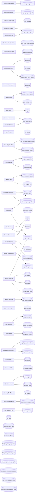

# Data Lineage

## Table-Level Lineage

```mermaid
flowchart LR
    BoxScoreAdvancedV3[BoxScoreAdvancedV3]
    BoxScoreHustleV2[BoxScoreHustleV2]
    BoxScoreMatchupsV3[BoxScoreMatchupsV3]
    BoxScoreMiscV3[BoxScoreMiscV3]
    BoxScorePlayerTrackV3[BoxScorePlayerTrackV3]
    BoxScoreScoringV3[BoxScoreScoringV3]
    BoxScoreSummaryV2[BoxScoreSummaryV2]
    BoxScoreTraditionalV3[BoxScoreTraditionalV3]
    CommonPlayerInfo[CommonPlayerInfo]
    CommonTeamRoster[CommonTeamRoster]
    CommonTeamYears[CommonTeamYears]
    DefenseHub[DefenseHub]
    DraftHistory[DraftHistory]
    FranchiseHistory[FranchiseHistory]
    GameRotation[GameRotation]
    HomePageLeaders[HomePageLeaders]
    HomePageV2[HomePageV2]
    LeadersTiles[LeadersTiles]
    LeagueDashLineups[LeagueDashLineups]
    LeagueDashPtDefend[LeagueDashPtDefend]
    LeagueGameLog[LeagueGameLog]
    LeagueLineupViz[LeagueLineupViz]
    LeagueStandingsV3[LeagueStandingsV3]
    PlayByPlayV3[PlayByPlayV3]
    PlayerAwards[PlayerAwards]
    PlayerEstimatedMetrics[PlayerEstimatedMetrics]
    Scoreboard[Scoreboard]
    ScoreboardV2[ScoreboardV2]
    ScoreboardV3[ScoreboardV3]
    ShotChartDetail[ShotChartDetail]
    SynergyPlayTypes[SynergyPlayTypes]
    TeamDetails[TeamDetails]
    TeamEstimatedMetrics[TeamEstimatedMetrics]
    TeamInfoCommon[TeamInfoCommon]
    WinProbabilityPBP[WinProbabilityPBP]
    bridge_game_official[(bridge_game_official)]
    bridge_game_team[(bridge_game_team)]
    bridge_lineup_player[(bridge_lineup_player)]
    bridge_play_player[(bridge_play_player)]
    bridge_player_team_season[(bridge_player_team_season)]
    dim_arena[(dim_arena)]
    dim_coach[(dim_coach)]
    dim_college[(dim_college)]
    dim_date[(dim_date)]
    dim_game[(dim_game)]
    dim_official[(dim_official)]
    dim_play_event_type[(dim_play_event_type)]
    dim_player[(dim_player)]
    dim_season[(dim_season)]
    dim_season_phase[(dim_season_phase)]
    dim_shot_zone[(dim_shot_zone)]
    dim_team[(dim_team)]
    dim_team_history[(dim_team_history)]
    fact_box_score_four_factors[(fact_box_score_four_factors)]
    fact_defense_hub[(fact_defense_hub)]
    fact_defense_hub_detail[(fact_defense_hub_detail)]
    fact_draft[(fact_draft)]
    fact_estimated_metrics[(fact_estimated_metrics)]
    fact_game_leaders[(fact_game_leaders)]
    fact_game_result[(fact_game_result)]
    fact_game_scoring[(fact_game_scoring)]
    fact_homepage[(fact_homepage)]
    fact_homepage_detail[(fact_homepage_detail)]
    fact_homepage_leaders[(fact_homepage_leaders)]
    fact_homepage_leaders_detail[(fact_homepage_leaders_detail)]
    fact_leaders_tiles[(fact_leaders_tiles)]
    fact_leaders_tiles_detail[(fact_leaders_tiles_detail)]
    fact_league_lineup_viz[(fact_league_lineup_viz)]
    fact_lineup_stats[(fact_lineup_stats)]
    fact_matchup[(fact_matchup)]
    fact_play_by_play[(fact_play_by_play)]
    fact_player_awards[(fact_player_awards)]
    fact_player_estimated_metrics[(fact_player_estimated_metrics)]
    fact_player_game_advanced[(fact_player_game_advanced)]
    fact_player_game_hustle[(fact_player_game_hustle)]
    fact_player_game_misc[(fact_player_game_misc)]
    fact_player_game_tracking[(fact_player_game_tracking)]
    fact_player_game_traditional[(fact_player_game_traditional)]
    fact_player_matchups_detail[(fact_player_matchups_detail)]
    fact_player_matchups_shot_detail[(fact_player_matchups_shot_detail)]
    fact_rotation[(fact_rotation)]
    fact_shot_chart[(fact_shot_chart)]
    fact_shot_chart_league_averages[(fact_shot_chart_league_averages)]
    fact_standings[(fact_standings)]
    fact_synergy[(fact_synergy)]
    fact_team_estimated_metrics[(fact_team_estimated_metrics)]
    fact_team_game[(fact_team_game)]
    fact_team_matchups_detail[(fact_team_matchups_detail)]
    fact_team_matchups_shot_detail[(fact_team_matchups_shot_detail)]
    fact_tracking_defense[(fact_tracking_defense)]
    fact_win_probability[(fact_win_probability)]
    BoxScoreAdvancedV3 --> fact_player_game_advanced
    BoxScoreHustleV2 --> fact_player_game_hustle
    BoxScoreMatchupsV3 --> fact_matchup
    BoxScoreMiscV3 --> fact_player_game_misc
    BoxScorePlayerTrackV3 --> fact_player_game_tracking
    BoxScoreScoringV3 --> fact_player_game_misc
    BoxScoreSummaryV2 --> bridge_game_official
    BoxScoreTraditionalV3 --> fact_player_game_traditional
    BoxScoreTraditionalV3 --> fact_team_game
    CommonPlayerInfo --> bridge_player_team_season
    CommonPlayerInfo --> dim_college
    CommonPlayerInfo --> dim_player
    CommonTeamRoster --> dim_coach
    CommonTeamYears --> dim_team
    DefenseHub --> fact_defense_hub
    DefenseHub --> fact_defense_hub_detail
    DraftHistory --> fact_draft
    FranchiseHistory --> dim_team_history
    GameRotation --> fact_rotation
    HomePageLeaders --> fact_homepage_leaders
    HomePageLeaders --> fact_homepage_leaders_detail
    HomePageV2 --> fact_homepage
    HomePageV2 --> fact_homepage_detail
    LeadersTiles --> fact_leaders_tiles
    LeadersTiles --> fact_leaders_tiles_detail
    LeagueDashLineups --> bridge_lineup_player
    LeagueDashLineups --> fact_lineup_stats
    LeagueDashPtDefend --> fact_tracking_defense
    LeagueGameLog --> bridge_game_team
    LeagueGameLog --> dim_game
    LeagueGameLog --> dim_season
    LeagueGameLog --> fact_game_result
    LeagueLineupViz --> fact_league_lineup_viz
    LeagueStandingsV3 --> fact_standings
    PlayByPlayV3 --> bridge_play_player
    PlayByPlayV3 --> fact_play_by_play
    PlayerAwards --> fact_player_awards
    PlayerEstimatedMetrics --> fact_estimated_metrics
    PlayerEstimatedMetrics --> fact_player_estimated_metrics
    Scoreboard --> fact_game_result
    Scoreboard --> fact_game_scoring
    Scoreboard --> fact_team_game
    ScoreboardV2 --> dim_official
    ScoreboardV3 --> fact_game_leaders
    ShotChartDetail --> dim_shot_zone
    ShotChartDetail --> fact_shot_chart
    SynergyPlayTypes --> fact_synergy
    TeamDetails --> dim_arena
    TeamDetails --> dim_team
    TeamEstimatedMetrics --> fact_team_estimated_metrics
    TeamInfoCommon --> dim_team_history
    WinProbabilityPBP --> fact_win_probability
```

## Column-Level Lineage

See `lineage.json` for machine-readable column-level tracing.
