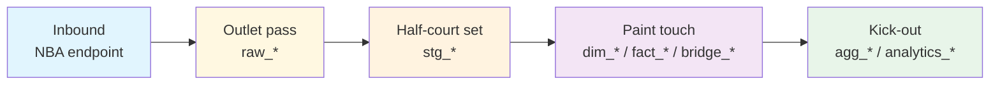

import { Callout } from "fumadocs-ui/components/callout";

# Table Lineage

This page traces every star schema table back to its source API endpoint(s) and intermediate staging table(s). Think of each block as a half-court possession: the endpoint initiates the action, raw and staging move the ball into structure, and the downstream table finishes the play.

<Callout>
Read each chain from left to right:

1. **Inbound** — source endpoint or generated upstream table
2. **Advance** — `raw_*` capture keeps the original feed available
3. **Set** — `stg_*` tables normalize names, types, and validation
4. **Finish** — `dim_*`, `fact_*`, `bridge_*`, `agg_*`, or `analytics_*` tables receive the final touch

</Callout>

## Quick navigation

<div className="grid gap-4 md:grid-cols-2 xl:grid-cols-4">
  <ScoutCard title="Start with dimensions" label="Entry surface">
    Jump to <a href="#dimension-tables">Dimension tables</a> when the downstream
    issue is about conformed entities like player, team, game, date, or season.
  </ScoutCard>
  <ScoutCard title="Start with facts" label="Entry surface">
    Use <a href="#fact-tables">Fact tables</a> when the breakage is at
    player-game, team-game, play-by-play, shot, standings, or matchup grain.
  </ScoutCard>
  <ScoutCard title="Check bridges or second-side tables" label="Entry surface">
    Go to <a href="#bridge-tables">Bridge tables</a>,{" "}
    <a href="#derived-aggregations">Derived aggregations</a>, or{" "}
    <a href="#analytics-views">Analytics views</a> when the dependency chain
    starts after the first finish.
  </ScoutCard>
  <ScoutCard
    title="Leave curated examples for full coverage"
    label="Generated companion"
  >
    Open <a href="/docs/lineage/lineage-auto">Generated Lineage Map</a> when you
    need wider dependency coverage than this page curates.
  </ScoutCard>
</div>



The diagram is a legend for the detailed chains below: dimensions set the floor, facts capture live possessions, bridges connect secondary actors, and aggregates/views summarize what happened after the shot goes up.

## Start with the right possession type

| If the downstream table starts with… | Start here                                    | What you will usually learn first                                  |
| ------------------------------------ | --------------------------------------------- | ------------------------------------------------------------------ |
| `dim_`                               | [Dimension tables](#dimension-tables)         | Which source feeds establish reusable join anchors                 |
| `fact_`                              | [Fact tables](#fact-tables)                   | The natural grain and primary inbound endpoint family              |
| `bridge_`                            | [Bridge tables](#bridge-tables)               | Which secondary actors are attached outside the main fact grain    |
| `agg_`                               | [Derived aggregations](#derived-aggregations) | Which star tables are recombined into reusable rollups             |
| `analytics_`                         | [Analytics views](#analytics-views)           | Which facts, aggregates, and dimensions are joined for convenience |

<CourtDivider label="Set the floor" />

## Dimension Tables

Dimension tables define the reusable court markings: who played, where, when, and which shared entities the rest of the warehouse joins against.

### dim_player

```
NBA API: CommonPlayerInfo, PlayerIndex
  --> raw_player_info, raw_player_career
    --> stg_player_info, stg_player_career
      --> dim_player (SCD2: DimPlayerTransformer)
```

**Transform**: SCD2 with change detection on team_id, position, jersey_number. Generates surrogate key `player_sk`.

### dim_team

```
NBA API: TeamInfoCommon, TeamDetails
  --> raw_team_info
    --> stg_team_info
      --> dim_team (DimTeamTransformer)
```

**Transform**: Direct mapping with franchise metadata enrichment.

### dim_game

```
NBA API: ScoreboardV2, LeagueGameLog, ScheduleLeagueV2
  --> raw_schedule, raw_game_log
    --> stg_schedule, stg_game_log
      --> dim_game (DimGameTransformer)
```

**Transform**: Deduplicates games, resolves home/away teams, joins arena data.

### dim_season

```
Generated from: season_year values across staging tables
  --> dim_season (DimSeasonTransformer)
```

**Transform**: Builds season dimension from distinct season_year values. Adds year_start, year_end, season_type.

### dim_date

```
Generated from: game_date range across dim_game
  --> dim_date (DimDateTransformer)
```

**Transform**: Generates calendar rows for every date in the range. Adds day_of_week, month_name, is_weekend.

### dim_official

```
NBA API: ScoreboardV2 (Officials)
  --> raw_schedule (officials result set)
    --> stg_schedule
      --> dim_official (DimOfficialTransformer)
```

**Transform**: Extracts distinct officials from game data.

### dim_coach

```
NBA API: CommonTeamRoster (Coaches)
  --> raw_team_info (coaches result set)
    --> stg_team_info
      --> dim_coach (DimCoachTransformer)
```

**Transform**: Extracts coaching staff, classifies head vs assistant.

### dim_arena

```
NBA API: TeamDetails, ScoreboardV2
  --> raw_team_info, raw_schedule
    --> stg_team_info
      --> dim_arena (DimArenaTransformer)
```

**Transform**: Extracts distinct arenas, generates surrogate arena_id.

### dim_shot_zone

```
NBA API: ShotChartDetail (zone fields)
  --> raw_shot_chart
    --> stg_shot_chart
      --> dim_shot_zone (DimShotZoneTransformer)
```

**Transform**: Extracts distinct (zone_basic, zone_area, zone_range) combinations.

### dim_play_event_type

```
NBA API: PlayByPlayV3 (action_type, sub_type)
  --> raw_play_by_play
    --> stg_play_by_play
      --> dim_play_event_type (DimPlayEventTypeTransformer)
```

**Transform**: Extracts distinct action_type/sub_type combinations, classifies field goal attempts.

### dim_college

```
NBA API: CommonPlayerInfo, DraftCombineStats
  --> raw_player_info
    --> stg_player_info
      --> dim_college (DimCollegeTransformer)
```

**Transform**: Extracts distinct college names, generates surrogate college_id.

### dim_lineup

```
NBA API: Derived from rotation data
  --> fact_rotation
    --> dim_lineup (via lineup detection logic)
```

**Transform**: Identifies 5-player combinations from rotation overlaps. Generates lineup_hash for deduplication.

<CourtDivider label="Live-ball possessions" />

## Fact Tables

Fact tables record the actual action: box scores, play-by-play, matchups, shots, rotations, standings, and draft outcomes at their natural grain.

### fact_box_score_player (Traditional)

```
NBA API: BoxScoreTraditionalV3
  --> raw_box_score_traditional
    --> stg_box_score_traditional
      --> fact_player_game_traditional (FactPlayerGameTraditionalTransformer)
```

**Transform**: Filters to player_id IS NOT NULL, selects standard box score columns.

### fact_box_score_advanced_player

```
NBA API: BoxScoreAdvancedV3
  --> raw_box_score_advanced
    --> stg_box_score_advanced
      --> fact_player_game_advanced (FactPlayerGameAdvancedTransformer)
```

### fact_box_score_hustle

```
NBA API: BoxScoreHustleV2
  --> raw_box_score_hustle
    --> stg_box_score_hustle
      --> fact_player_game_hustle (FactPlayerGameHustleTransformer)
```

### fact_box_score_tracking

```
NBA API: BoxScorePlayerTrackV3
  --> raw_box_score_tracking
    --> stg_box_score_tracking
      --> fact_player_game_tracking (FactPlayerGameTrackingTransformer)
```

### fact_box_score_defensive

```
NBA API: BoxScoreMatchupsV3
  --> raw_box_score_matchups
    --> stg_box_score_matchups
      --> fact_box_score_defensive (FactTrackingDefenseTransformer)
```

### fact_box_score_team

```
NBA API: BoxScoreTraditionalV3 (team result set)
  --> raw_box_score_traditional
    --> stg_box_score_traditional
      --> fact_team_game (FactTeamGameTransformer)
```

### fact_game_result

```
NBA API: LeagueGameLog, ScoreboardV2
  --> raw_game_log, raw_schedule
    --> stg_game_log, stg_schedule
      --> fact_game_result (FactGameResultTransformer)
```

### fact_play_by_play

```
NBA API: PlayByPlayV3
  --> raw_play_by_play
    --> stg_play_by_play
      --> fact_play_by_play (FactPlayByPlayTransformer)
```

### fact_shot_chart

```
NBA API: ShotChartDetail
  --> raw_shot_chart
    --> stg_shot_chart
      --> fact_shot_chart (FactShotChartTransformer)
```

### fact_win_probability

```
NBA API: WinProbabilityPBP
  --> raw_win_probability
    --> stg_win_probability
      --> fact_win_probability (FactWinProbabilityTransformer)
```

### fact_rotation

```
NBA API: GameRotation
  --> raw_rotation
    --> stg_rotation
      --> fact_rotation (FactRotationTransformer)
```

### fact_matchup

```
NBA API: BoxScoreMatchupsV3
  --> raw_box_score_matchups
    --> stg_box_score_matchups
      --> fact_matchup (FactMatchupTransformer)
```

### fact_standings

```
NBA API: LeagueStandingsV3
  --> raw_standings
    --> stg_standings
      --> fact_standings (FactStandingsTransformer)
```

### fact_draft

```
NBA API: DraftHistory, DraftCombineStats
  --> raw_draft
    --> stg_draft
      --> fact_draft (FactDraftTransformer)
```

### fact_synergy

```
NBA API: SynergyPlayTypes
  --> raw_synergy
    --> stg_synergy
      --> fact_synergy (FactSynergyTransformer)
```

<CourtDivider label="Handoffs and switches" />

## Bridge Tables

Bridge tables connect extra participants to the main event grain when a single row needs more than one player or official attached.

### bridge_game_official

```
NBA API: ScoreboardV2 (Officials)
  --> raw_schedule
    --> stg_schedule
      --> bridge_game_official (BridgeGameOfficialTransformer)
```

### bridge_play_player

```
NBA API: PlayByPlayV3 (player references)
  --> raw_play_by_play
    --> stg_play_by_play
      --> bridge_play_player (BridgePlayPlayerTransformer)
```

<CourtDivider label="Second-side actions" />

## Derived Aggregations

Aggregate tables consume star schema tables to produce reusable rollups:

### agg_player_season

```
fact_player_game_traditional + fact_player_game_advanced + dim_game
  --> agg_player_season (AggPlayerSeasonTransformer)
```

**Transform**: GROUP BY player_id, team_id, season_year, season_type. Computes totals, averages, and season shooting/rating summaries.

### agg_player_rolling

```
fact_player_game_traditional + dim_game
  --> agg_player_rolling (AggPlayerRollingTransformer)
```

**Transform**: Window functions with 5/10/20-game rolling averages ordered by game_date.

### agg_team_season

```
fact_team_game + dim_game
  --> agg_team_season (AggTeamSeasonTransformer)
```

**Transform**: GROUP BY team_id, season_year, season_type. Computes season-average box score and shooting splits.

<CourtDivider label="Kick-out reads" />

## Analytics Views

Analytics outputs join facts, aggregates, and dimensions for convenience:

### analytics_player_game_complete

```
fact_player_game_traditional
  + fact_player_game_advanced
  + fact_player_game_misc
  + fact_player_game_hustle
  + fact_player_game_tracking
  + dim_player
  + dim_game
  + dim_team
    --> analytics_player_game_complete (AnalyticsPlayerGameCompleteTransformer)
```

### analytics_player_season_complete

```
agg_player_season
  + agg_player_season_per36
  + agg_player_season_per48
  + dim_player
  + dim_team
    --> analytics_player_season_complete (AnalyticsPlayerSeasonCompleteTransformer)
```

### analytics_team_season_summary

```
agg_team_season
  + fact_standings
  + dim_team
    --> analytics_team_season_summary (AnalyticsTeamSeasonSummaryTransformer)
```

### analytics_head_to_head

```
fact_team_game
  + dim_game
  + dim_team
    --> analytics_head_to_head (AnalyticsHeadToHeadTransformer)
```

<CourtDivider label="Next replay angle" />

## Next steps from table lineage

<div className="grid gap-4 md:grid-cols-3">
  <ScoutCard title="Slow down to the field that changed" label="Next stop">
    Move to <a href="/docs/lineage/column-lineage">Column Lineage</a> when the
    table chain is clear but one key or metric still needs a frame-by-frame
    review.
  </ScoutCard>
  <ScoutCard title="Open the exhaustive dependency board" label="Next stop">
    Use <a href="/docs/lineage/lineage-auto">Generated Lineage Map</a> when you
    need wider coverage than the curated examples on this page.
  </ScoutCard>
  <ScoutCard
    title="Reconnect the replay to the visual boards"
    label="Next stop"
  >
    Jump to <a href="/docs/diagrams/pipeline-flow">Pipeline Flow</a> or{" "}
    <a href="/docs/diagrams/endpoint-map">Endpoint Map</a> when you want the
    same story told as a stage diagram or source-coverage board instead of a
    dependency trace.
  </ScoutCard>
</div>
