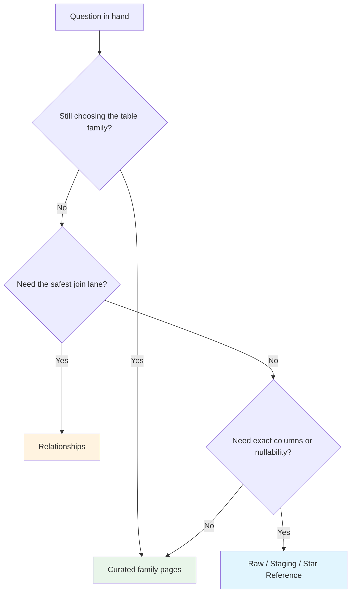

import { Callout } from "fumadocs-ui/components/callout";
import schemaData from "./schema.json";

# Schema Reference

The nbadb analytical surface exposes **public tables and views** across dimensions, facts, bridges, derived aggregations, and analytics views.

<Callout type="info">
  **Curated pages** (this index, the family guides, Relationships) explain how
  to use the model. **Generated reference pages** (Raw, Staging, Star) are
  schema-backed artifacts — use them for exact contracts and regenerate them
  instead of hand-editing when the code changes.
</Callout>

## Choose the right route

| If your question is…                           | Go to…                                                                                                                                                     | Why                                                                              |
| ---------------------------------------------- | ---------------------------------------------------------------------------------------------------------------------------------------------------------- | -------------------------------------------------------------------------------- |
| "Who or what is this row about?"               | [Dimensions](/docs/schema/dimensions)                                                                                                                      | Identity, history, calendar, venue, and controlled-vocabulary context live there |
| "Where do the measures actually live?"         | [Facts & Bridges](/docs/schema/facts)                                                                                                                      | Groups the main measurement tables by grain and job                              |
| "Is there already a reusable rollup for this?" | [Derived Aggregations](/docs/schema/derived)                                                                                                               | `agg_*` surfaces answer recurring season-, career-, and summary-style asks       |
| "Can I skip some manual joins?"                | [Analytics Views](/docs/schema/analytics-views)                                                                                                            | `analytics_*` surfaces are pre-joined outlets for notebooks and dashboards       |
| "How do I join these safely?"                  | [Relationships](/docs/schema/relationships)                                                                                                                | Optimized for join judgment, key lanes, and duplicate-row avoidance              |
| "What are the exact fields and constraints?"   | [Star Reference](/docs/schema/star-reference) or upstream [Staging Reference](/docs/schema/staging-reference) / [Raw Reference](/docs/schema/raw-reference) | Generated pages are the contract layer                                           |



## Read the jersey prefix

| Prefix          | Means                                            | Start on                                                                                           |
| --------------- | ------------------------------------------------ | -------------------------------------------------------------------------------------------------- |
| `dim_`          | conformed context and identity                   | [Dimensions](/docs/schema/dimensions)                                                              |
| `fact_`         | measurable events at a defined grain             | [Facts & Bridges](/docs/schema/facts)                                                              |
| `bridge_`       | many-to-many connector                           | [Facts & Bridges](/docs/schema/facts) or [Relationships](/docs/schema/relationships)               |
| `agg_`          | reusable pre-aggregated rollup                   | [Derived Aggregations](/docs/schema/derived)                                                       |
| `analytics_`    | pre-joined convenience surface                   | [Analytics Views](/docs/schema/analytics-views)                                                    |
| `stg_` / `raw_` | upstream tiers — trace the ball back to ingestion | [Staging Reference](/docs/schema/staging-reference) or [Raw Reference](/docs/schema/raw-reference) |

## Interactive schema explorer

Browse every star-schema table, inspect columns and types, and follow foreign-key links. Filter by family or search by name.

<SchemaExplorer data={schemaData} />

## Warehouse design notes

- **Star first** — dimensions create stable context around fact grains so common queries stay join-friendly.
- **History where it matters** — `dim_player` and `dim_team_history` use SCD Type 2 semantics for time-aware identity tracking.
- **Conformed anchors** — `player_id`, `team_id`, `game_id`, and `season_year` carry most of the joins across the model.
- **Smallest useful grain** — start at the narrowest fact that answers the question, then climb to `agg_` or `analytics_` only when the use case repeats.

## Regenerating tier references

```bash
uv run nbadb docs-autogen --docs-root docs/content/docs
```

That command owns the raw, staging, and star reference artifacts. Keep this index, the family guides, and [Relationships](/docs/schema/relationships) curated.

---

**See also:** [Data Dictionary](/docs/data-dictionary) for column meaning and naming patterns, [Glossary](/docs/data-dictionary/glossary) for stat term definitions, [Field Reference](/docs/data-dictionary/field-reference) for key and suffix conventions.
