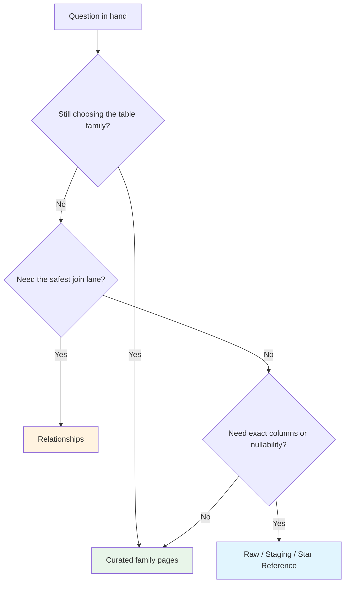

import { Callout } from "fumadocs-ui/components/callout";

# Schema Reference

The nbadb analytical surface exposes **public tables and views** across dimensions, facts, bridges, derived aggregations, and analytics views.

Treat this section like the warehouse playbook: the curated pages explain how the lineup fits together, while the generated reference pages give you the box-score-exact schema contracts when you need to check a column, key, or constraint at 2am.

<StatGrid columns={4}>
  <StatPill
    label="Public surface"
    value="Star schema"
    note="tables + views on the analytical floor"
  />
  <StatPill
    label="Dimensions"
    value="dim_*"
    note="identity, history, and lookup spacing"
  />
  <StatPill
    label="Facts + bridges"
    value="fact_* · bridge_*"
    note="event and measurement tables plus bridge connectors"
  />
  <StatPill
    label="Shortcuts"
    value="agg_* · analytics_*"
    note="pre-aggregated rollups and analytics convenience views"
  />
</StatGrid>

<Callout type="info">
The curated pages explain <strong>how to use the model</strong>. The raw, staging, and star reference pages are <strong>generated, schema-backed artifacts</strong>: use them for exact contracts, and regenerate them instead of hand-editing when the code changes.
</Callout>

## Work the section in three possessions

1. **Choose the family.** Start on the curated guides when you still need judgment about grain, surface, or whether a shortcut already exists.
2. **Lock the join lane.** Switch to [Relationships](/docs/schema/relationships) once you know the tables but want the cleanest path between them.
3. **Verify the contract.** Finish on [Raw Reference](/docs/schema/raw-reference), [Staging Reference](/docs/schema/staging-reference), or [Star Reference](/docs/schema/star-reference) when the question turns into exact columns, types, or nullability.

<div className="grid gap-4 md:grid-cols-3">
  <ScoutCard title="Curated family guides" label="Start here">
    Use <a href="/docs/schema/dimensions">Dimensions</a>, <a href="/docs/schema/facts">Facts &amp; Bridges</a>, <a href="/docs/schema/derived">Derived Aggregations</a>, and <a href="/docs/schema/analytics-views">Analytics Views</a> when you are still picking the right surface.
  </ScoutCard>
  <ScoutCard title="Relationships" label="Second stop">
    Use <a href="/docs/schema/relationships">Relationships</a> when the tables are known but the join lane is still muddy.
  </ScoutCard>
  <ScoutCard title="Generated tier references" label="Finish here">
    Use the generated tier pages when you need schema-backed exactness rather than routing or join advice.
  </ScoutCard>
</div>

## Choose the right route

| If your question is... | Go to... | Why this is the right lane |
| ---------------------- | -------- | -------------------------- |
| “Who or what is this row about?” | [Dimensions](/docs/schema/dimensions) | Identity, history, calendar, venue, and controlled-vocabulary context live there |
| “Where do the measures actually live?” | [Facts & Bridges](/docs/schema/facts) | That scouting report groups the main measurement tables by grain and job |
| “Is there already a reusable rollup for this?” | [Derived Aggregations](/docs/schema/derived) | `agg_*` surfaces answer recurring season-, career-, and summary-style asks |
| “Can I skip some manual joins?” | [Analytics Views](/docs/schema/analytics-views) | `analytics_*` surfaces are the fast-break outlets for notebooks and dashboards |
| “How do I join these safely?” | [Relationships](/docs/schema/relationships) | It is optimized for join judgment, key lanes, and duplicate-row avoidance |
| “What are the exact fields and constraints?” | [Star Reference](/docs/schema/star-reference) or upstream [Staging Reference](/docs/schema/staging-reference) / [Raw Reference](/docs/schema/raw-reference) | Those generated pages are the contract layer |

<CourtDivider label="Curated vs generated" />

## Know which page owns which job

| Surface | Optimized for | Stop here when... | Maintenance path |
| ------- | ------------- | ----------------- | ---------------- |
| Curated family guides | Table-family choice, workflow advice, and first-pass judgment | You know the family and the likely grain | Hand-authored |
| [Relationships](/docs/schema/relationships) | Join patterns, key lanes, and duplicate-row avoidance | The join path is clear and you only need exact column contracts | Hand-authored |
| Generated tier references | Exact columns, types, nullability, and schema-backed constraints | You need narrative guidance or table-family choice again | Regenerate, do not hand-edit |

<InsightCard title="Default reading order">
  Use curated pages for judgment and generated pages for verification. When a page starts trying to do both jobs, switch layers instead of forcing it.
</InsightCard>

## Choose your first pass

<div className="grid gap-4 md:grid-cols-2 xl:grid-cols-4">
  <ScoutCard title="Pick the family" label="Start here">
    Use <a href="/docs/schema/dimensions">Dimensions</a>, <a href="/docs/schema/facts">Facts &amp; Bridges</a>, <a href="/docs/schema/derived">Derived Aggregations</a>, or <a href="/docs/schema/analytics-views">Analytics Views</a> when the first question is still "which surface actually answers this?"
  </ScoutCard>
  <ScoutCard title="Lock the join lane" label="Start here">
    Jump to <a href="/docs/schema/relationships">Relationships</a> once you know the tables involved but need the safest path between them.
  </ScoutCard>
  <ScoutCard title="Use the shortcut on purpose" label="Start here">
    Reach for <a href="/docs/schema/analytics-views">Analytics Views</a> or <a href="/docs/schema/derived">Derived Aggregations</a> when the job repeats and you do not want to rebuild the same joins every possession.
  </ScoutCard>
  <ScoutCard title="Verify the exact contract" label="Exactness">
    Go straight to <a href="/docs/schema/raw-reference">Raw Reference</a>, <a href="/docs/schema/staging-reference">Staging Reference</a>, or <a href="/docs/schema/star-reference">Star Reference</a> when exact columns, types, and nullability matter more than narrative guidance.
  </ScoutCard>
</div>

If you only remember one decision tree, use this one.



Text fallback: start on the curated family pages when you still need judgment, jump to Relationships when the join lane is the real question, and finish on the generated references when exact contracts matter.

## Start by the handle you already have

| If you already have... | Start here | Why this is the fastest lane |
| ---------------------- | ---------- | ---------------------------- |
| a player or team question | [Facts & Bridges](/docs/schema/facts) or [Dimensions](/docs/schema/dimensions) | facts answer the measurement question, dimensions answer the identity and context question |
| a `game_id` | [Facts & Bridges](/docs/schema/facts) | that is the cleanest way to decide whether the grain is player-game, team-game, play-by-play, shot, or rotation |
| a season-level reporting ask | [Derived Aggregations](/docs/schema/derived) | repeated rollups are often already built, which is faster than recreating them from the fact layer |
| a dashboard or notebook use case | [Analytics Views](/docs/schema/analytics-views) | those outputs are the fast-break outlets for first-pass analysis |
| a known table pair but an uncertain join | [Relationships](/docs/schema/relationships) | the join lane is the real blocker, not table-family choice |
| an exact field, type, or nullability question | [Star Reference](/docs/schema/star-reference) or the upstream [Raw](/docs/schema/raw-reference) / [Staging](/docs/schema/staging-reference) references | generated pages are optimized for contract verification, not route selection |

## Read the jersey prefix

| Prefix | Read it as... | Usually start on... |
| ------ | ------------- | ------------------- |
| `dim_` | conformed context and identity | [Dimensions](/docs/schema/dimensions) |
| `fact_` | measurable events or summaries at a defined grain | [Facts & Bridges](/docs/schema/facts) |
| `bridge_` | many-to-many connector | [Facts & Bridges](/docs/schema/facts) or [Relationships](/docs/schema/relationships) |
| `agg_` | reusable pre-aggregated rollup | [Derived Aggregations](/docs/schema/derived) |
| `analytics_` | pre-joined convenience surface | [Analytics Views](/docs/schema/analytics-views) |
| `stg_` / `raw_` | upstream reference tiers used to trace the ball back to extraction | [Staging Reference](/docs/schema/staging-reference) or [Raw Reference](/docs/schema/raw-reference) |

## Warehouse offensive system

- **Star first**: dimensions create stable context around fact grains so common queries stay join-friendly.
- **History where it matters**: `dim_player` and `dim_team_history` use SCD Type 2 semantics for time-aware identity tracking.
- **Conformed anchors**: `player_id`, `team_id`, `game_id`, and `season_year` do most of the passing across the model.
- **Smallest useful grain**: start at the narrowest fact that answers the question, then climb to `agg_` or `analytics_` only when the use case repeats.

## Generated tier references

Regenerate the command-owned reference pages with:

```bash
uv run nbadb docs-autogen --docs-root docs/content/docs
```

That command owns the raw, staging, and star reference artifacts. Keep this index, the family guides, and [Relationships](/docs/schema/relationships) curated.

---

**See also:** [Data Dictionary](/docs/data-dictionary) for column meaning and naming patterns, [Glossary](/docs/data-dictionary/glossary) for stat term definitions, [Field Reference](/docs/data-dictionary/field-reference) for key and suffix conventions.
