## Context

Daily and monthly updates are bounded transactions over the public nbadb
dataset. They must refresh mutable NBA API scopes without silently reusing stale
journal completion, dropping newly observed result sets or fields, retaining
rows deleted upstream, or publishing a partially rebuilt set of formats.

The current Kaggle dataset predates the complete active model authority. It is
therefore not a valid production parent for this change. The recurring system is
implemented and tested before release, but production admission begins only
after the full-extraction owner publishes a fresh full-model baseline and proves
its exact positive version through complete streamed remote readback.

The system already has two durable primitives that cover the problem: Kaggle is
the public dataset authority, and the GitHub Deployment ledger serializes and
reconciles publication intent. A second repository, private package, private
baseline, or private generation pointer adds another authority without adding
provider coverage.

## Goals

- Start from the newest exact, positive, fully verified Kaggle version admitted
  under the active full-model authority, never from the current incomplete
  public dataset or an unversioned latest alias.
- Execute the complete three-part frozen daily, monthly, or opportunistic
  request universe.
- Preserve every successful body-bearing parser input and every provider
  result, field, value, presence state, and provenance through public landings
  and committed receipts; explicitly classify no-parser-input providers.
- Apply corrections, deletions, and valid-empty responses transactionally.
- Rebuild and assure the complete dynamic public inventory before one upload.
- Resume local computation safely and reconcile remote mutation without a
  second dataset authority.
- Coalesce cross-workflow demand without losing next-day freshness, deeper
  monthly scope, or single-writer ordering.
- Create exactly one cumulative Kaggle version for every distinct fully assured
  update transaction, even when NBA table bytes are unchanged.
- Emit truthful freshness, immutable-readback, human-verification, docs-parity,
  and final DATA-GREEN receipts without allowing automation to impersonate the
  human verifier.

## Non-Goals

- No second repository, GHCR/OCI state package, encrypted planning store, or
  current/previous/candidate remote pointer.
- No use of GitHub artifacts or caches as a dataset baseline.
- No optional/private parser-body architecture: successful body-bearing calls
  require exact public parser-input bodies, while error bodies and transport
  secrets remain excluded.
- No claim of `DATA-GREEN` without an exact-SHA live extraction and exact remote
  readback, one exact-parent daily successor, exact-version immutable
  redownload, genuine human four-format interrogation, docs parity, and final
  receipt join.
- No paid proxy, VPN, subscription, trial, or inferred device capacity as a
  production prerequisite or hidden fallback. Unproven free capacity blocks
  provider work without reducing scope.

## Decisions

### 1. A fresh full-model publication is the first admissible parent

Production recurring admission first requires the initial publication receipt
for a brand-new exact-SHA attempt-one full extraction under the active complete
model authority. The receipt must bind one exact positive Kaggle version and a
complete streamed SHA-256 readback. Until that exists, the current public
dataset is explicitly inadmissible and recurring workflows may produce only
local/nonpublishing evidence.

For every admitted recurring transaction, admission first reconciles any
unresolved GitHub Deployment publication intent. It then resolves the newest
exact positive Kaggle version from marker/version equality and stabilized
dataset metadata, passes that version explicitly to verified-baseline download,
forces the complete API file inventory through one-file-at-a-time digest
verification, validates the assured manifest and terminal report, installs a
new owner-only immutable parent root, and separately clones or installs the
disposable candidate. A cache directory name, generic latest pointer, table
maximum, partial download, or unassured version is not authority.

The baseline receipt binds the exact version, public inventory, source SHA,
active model/authority identity, initial or update assurance, publication
ledger, parent cutoff, and byte digests. GitHub caches and artifacts may
accelerate or diagnose a run, but they cannot replace that receipt or authorize
a different baseline.

### 2. The candidate is disposable and transaction-local

Admission first freezes `update_transaction_id` from the original logical
scheduler demand, exact parent, cutoff/as-of, and observation window. That ID is
stable across run attempts, child continuations, and cross-run recovery; a later
logical transaction receives a new ID even when it uses the same cutoff or
produces equal NBA table bytes.

The recurring job never mutates the verified parent in place. It creates one
candidate bound to that stable ID, records its baseline receipt, and performs
extraction, source-scope replacement, transforms, export, scan, and inventory
freeze beneath the candidate root. Failure or cancellation discards authority
to the candidate; the verified Kaggle parent remains unchanged and downloadable.

Local checkpoints may bind candidate progress to the same baseline, source SHA,
mode, cutoff/as-of/window, request universe, candidate, and stable transaction
ID. A mismatched or incomplete checkpoint is ignored or rejected. It is not a
public dataset version and is never a fallback parent for a later transaction.

### 3. Every mode compiles the same three-part temporal closure

The mode, exact parent cutoff, per-request/per-field last committed observations,
target `as_of`, observation window, seal, configured season types, route
contracts, temporal support evidence, and discovered dependency values compile
to an immutable `RecurringUpdatePlanV1` before terminal completion can be
claimed. Event cutoff, observation timestamps/window, and seal remain distinct.

Every daily, monthly, or opportunistic plan is the deduplicated union of:

1. exact parent/request/field cutoff-to-`as_of` catch-up;
2. conservative endpoint-specific overlap for corrections, late changes, and
   mutable snapshots; and
3. explicit older request/game/entity/field identity-gap repair.

Daily closes the expected prior NBA calendar day in the configured timezone,
the current/open season, active entity refreshes, every applicable result route,
and active live-game roots. Monthly includes all daily closure, a deeper
recent-season refresh with season-local discovery, and a whole-history audit of
request, game, entity, route, field identity, and field-introduction/internal-gap
evidence. Opportunistic demand may target a newer cutoff only when the complete
same proof budget is available; it never weakens or supersedes queued deeper
scope.

- When no reliable parent/request/field observation exists, the planner refreshes
  that entire defensible scope or remains incomplete; `_pipeline_watermarks` and
  table maxima are advisory and never parent/cutoff authority.
- Foundation-dependent endpoints run only after their exact provider-owned
  workload is committed. Missing or partial foundations remain incomplete;
  valid empty foundations close as typed zero without guessed calls.
- Alternate wrappers remain distinct physical routes when they own distinct
  staging tables. Unsupported or contract-blocked combinations require bounded
  evidence; they are never silently omitted.

The request universe is a least fixed point: every discovered game, date,
player, team, player-team-season, live game, and provider-owned dependent
workload must be consumed or explicitly classified. Runtime code cannot widen
the frozen manifest or let a parent journal row suppress a mutable request. The
monthly whole-history audit emits its own exact examined/gap/repaired/unresolved
receipt and cannot claim success while any unclassified identity or field gap
remains.

### 4. One durable coordinator coalesces recurring demand

Daily, monthly, and opportunistic workflows submit immutable demand records to
one durable cross-workflow coordinator before candidate creation. It retains the
newest required cutoff, unions nonredundant deeper scopes and explicit gap
repairs, coalesces redundant queued requests, admits at most one active
candidate/writer, and records every supersession/union decision.

An active or recovering transaction keeps its stable ID. A later compatible
demand can be queued or joined only under defined immutable rules; it cannot
silently change the active parent, cutoff, request universe, or publication
intent. The coordinator proves that monthly work cannot erase daily next-day
freshness, an opportunistic request cannot jump the durable queue, and completed
work cannot leave an older unaccounted cutoff backlog.

### 5. Freshness is an explicit always-finalized outcome

Every admitted or rejected recurring execution emits `RecurringRunStatusV1`
from an `if: always()` or trap-style finalizer, including failures during exact
parent resolution, free-capacity admission, checkout, extraction, scan, or
publication. The receipt binds the expected prior NBA calendar day and timezone,
provider-availability cutoff, scheduled deadline, actual completion, exact
parent version/cutoff, newest assured remote cutoff, transaction/coordinator
identity, `fresh`/`not_fresh`, reason class, and no-mutation proof.

Skipped or no-game days can be `fresh` only when calendar/provider evidence and
the complete request closure prove no missing update. Workflow success, a local
candidate, or a status default can never imply freshness.

### 6. Public parser inputs and lossless landings are durable authority

Every successful body-bearing response captures the exact bytes presented to
the provider parser before decoding or parsing. A public body receipt binds the
body's full SHA-256 and length to the logical invocation, ordered provider-call
occurrence, retry attempt, canonical request, provider authority, and
observation provenance. Physical content-addressed storage may deduplicate or
deterministically compress identical bytes, but the body and per-attempt receipt
remain mandatory public authority. Declared static or other no-parser-input
paths use an explicit bodyless disposition; rejected/transport failures never
invent successful body evidence.

Every successful response also records enough parsed data to reconstruct what
the provider parser returned and compare it with that exact input:

- canonical request identity and output-changing parameters;
- endpoint, provider result name and ordinal, canonical route, and source row
  ordinal;
- ordered headers or nested paths, values, types, null/empty/presence state,
  provider authority, and observation provenance;
- present-empty, optional-absent, blocked, and unavailable dispositions; and
- committed result, route, staging, and logical-call receipts.

One logical call may own multiple ordered result receipts and one live response
may land in a single lossless response table; completeness follows the declared
coverage relation, not a one-call/one-table count assumption. Additive or
unclassified fields land in the typed lossless drift surface until reviewed.

Cookies, authorization data, request headers, proxy/VPN details, credentials,
and unrestricted error bodies never enter public bodies, landings, receipts,
diagnostics, exports, metadata, or logs. Any missing or unreadable required
parser-input body fails completion, resume, recurring baseline admission,
assurance, export, and publication.

### 7. Source-owned scopes are replaced transactionally

Each route declares its request-owned source-scope key. A committed request
replaces that exact slice in one DuckDB transaction, including changed rows,
deleted rows, duplicate multiplicity required by the provider contract, and
valid-empty deletion. Out-of-scope history is unchanged. Journal completion is
written only after the durable staging receipt can be read back and verified.

Immutable observations may append when their contract is explicitly
append-only. Mutable snapshots, game logs, roster scopes, and request-scoped
secondary packets use replacement semantics. Secondary packets keep the full
parent request identity so joins cannot mix incompatible seasons, entities, or
context measures.

### 8. Every dynamic output is rebuilt and frozen

The candidate rebuilds every convention-discovered stable transform, including
schema-valid empty outputs. The current census is 434 canonical staging routes
and 261 public transform outputs: 204 facts, 18 dimensions, 6 bridges, 19
aggregates, and 14 analytics outputs.

Inventory size is derived at runtime. The base contract is 695 tables and 1,394
resources. Observing either typed lossless drift surface yields 696 tables and
1,396 resources; observing both yields 697 tables and 1,398 resources. These
numbers are documentation and test census, not hard-coded product logic.

DuckDB and Parquet are the logical-type authorities and require complete logical
type/value equality. SQLite and CSV are convenience projections that still
require ordered-schema and row-count parity plus explicitly defined
normalization-projected decoded value parity against the same canonical rows.
The complete resource manifest is frozen before assurance; no export or metadata
rewrite occurs afterward.

### 9. `UpdateAssuranceV1` is the recurring publication gate

One canonical receipt binds:

- exact Kaggle parent version, parent inventory, and baseline fingerprint;
- source SHA, stable `update_transaction_id`, coordinator demand, mode,
  cutoff/as-of/observation-window/seal, configured three-part scope, and
  request-universe digest;
- logical/result/route/staging receipt closure and typed-zero dispositions;
- observation and field-conservation digests;
- stable model inventory and transform attestations;
- scan report, complete four-format parity, database/export identities, and
  frozen dynamic resource manifest;
- replacement transaction status, cancellation state, free-execution admission,
  and `RecurringRunStatusV1`; and
- publication admission identity when upload is requested.

Assurance fails on any missing request, unaccounted result/field/value, stale
scope, transform failure, format mismatch, unexpected resource, or cancellation.
Experimental fitted models remain non-gating unless explicitly promoted into
the stable registry. This is candidate/local assurance only; it never sets or
implies `DATA-GREEN`.

### 10. Publication versions every distinct assured transaction

The existing `nbadb-kaggle-publish` FIFO mutex and GitHub Deployment ledger are
the cross-host write-ahead authority, and GitHub Actions is the only Kaggle
writer. Before mutation the job rechecks the default source, current executor,
exact candidate assurance, stable transaction ID, and current parent, then
records `RecurringPublicationIntentV1` as durable `pending` and verified
`in_progress`. At most one unresolved mutation exists for the dataset. After the
Kaggle call the writer resolves the exact positive version, paginates the
complete inventory, streams every remote resource through size/SHA-256 readback,
proves schema/count/value/source/marker parity, and only then records success.

If a process stops after durable intent, every later execution reconciles that
same immutable intent first. Exact remote success for the same transaction and
intent records or confirms success without a second upload. Missing, divergent,
or inconclusive evidence blocks all new uploads. A later run cannot create a new
candidate merely to bypass unresolved publication state.

A later distinct fully assured transaction MUST create exactly one new
cumulative Kaggle version even when its NBA table data and cutoff match a prior
version. It contains a truthful transaction-specific generation/assurance
resource so its frozen bundle is distinct without fabricating provider data.
Equal marker/bundle evidence may suppress mutation only for retry/recovery of the
same stable transaction and intent, never for a new transaction.

Identity construction is acyclic: freeze the transaction ID, parent, cutoff and
window; build the truthful generation/assurance resource; freeze the canonical
candidate inventory under explicit self-exclusion rules; derive the publication
intent from that inventory and executor; then stage marker and receipts. A
marker or digest cannot recursively include itself.

### 11. Performance changes cannot reduce completeness

The initial and recurring extractors may batch persistence, stream frames,
partition independent requests, reuse provider connections safely, and schedule
bounded concurrent work. Every optimization preserves the same frozen request
universe, route/result/field denominator, retry classification, typed-zero
semantics, and final receipts. Sampling, capped enumeration, dropped optional
packets, guessed dependencies, or concurrency that loses deterministic
accounting are not performance optimizations.

Planning authority itself is bounded and replayable at the native 250,000-call
request-universe ceiling. Detailed committed calls and route-dispatch rows live
in immutable content-addressed partitions of at most 10,000 rows and a fixed
canonical-byte ceiling below the store control limit. Each descriptor binds its
ordinal range, byte length/hash, row count, and ordered row root. The generation
manifest and execution plan contain only scalar total count/roots plus a closed
bounded descriptor inventory (at most 25 descriptors at the current native
ceiling); they do not duplicate complete scope, dispatch, or replacement-binding
arrays. Checkpoints likewise retain scalar/partition receipts rather than the
complete committed-call object graph. Runtime and assurance strict-replay those
partitions in ordinal order and reject every gap, overlap, omission, duplicate,
reorder, stale object, or route/scope positional substitution.

### 12. MODEL-GREEN and DATA-GREEN remain separate

`MODEL-GREEN` covers local contracts, fixtures, deterministic inventories,
source-scope semantics, and fail-closed assurance logic. The current audit may
remain red while structural census tests pass. `DATA-GREEN` additionally needs
one brand-new attempt-one full extraction from the exact reviewed SHA, complete
row-level reconciliation, a new full-model initial cumulative Kaggle version and
exact readback, one exact-parent daily successor version and exact readback,
truthful next-day freshness, bounded monthly/opportunistic coordination proof,
immutable newest-version redownload, genuine human verification, docs parity,
and a final receipt join. Old checkpoints and the current incomplete Kaggle
version are diagnostics only after the new contract.

Stable source, silver, and gold outputs gate release; separately versioned fitted
RAPM, xFG, WPA, forecast, rating, and prospect-value experiments are non-gating
unless individually admitted. Local successor assurance remains
candidate/assured-local and cannot carry `data_green=true`.

### 13. Production execution is Actions-only and proven free

GitHub Actions is the only production initial, catch-up, daily, monthly,
opportunistic, publication, and final-closeout control plane. Notebooks, local
schedulers, fallback scripts, and out-of-band clients cannot mutate Kaggle.

Every provider-working execution requires current `FreeExecutionAdmissionV1`
bound to the source/run/attempt, runner and capacity, authoritative zero-cost
evidence, NBA reachability canaries, deadline, and expiry. If no free path is
independently proven at the point of use, the run emits
`capacity_blocked`/`not_fresh`, performs no provider or Kaggle mutation, and does
not shrink coverage. NordVPN or another paid proxy/VPN/subscription/trial is not
a normative requirement or fallback.

### 14. Immutable readback, human verification, and docs parity close the data

After the required initial and exact-parent daily publications, the newest exact
successor `/versions/N` is force-downloaded into a fresh empty owner-only root.
`ImmutableVersionReadbackV1` binds exact version, complete inventory, sizes,
streamed SHA-256 digests, safe layout, and publication receipts; the dataset root
is then made non-writable. Evidence, query output, decoder caches, and temporary
databases live in a separate root. Complete before/after tree hashes must match,
with no post-hoc exclusions or new sidecars/WAL/journal files.

Automation emits `HumanVerificationChallengeV1` for a nonempty coverage matrix
spanning raw/lossless, stable model families, early/recent eras, temporal and
zero/unavailable edges, and the updated window. A trusted handoff independently
records the human actor. The human opens DuckDB read-only with external access
disabled, SQLite with `mode=ro&immutable=1`, independently decodes Parquet and
CSV, inspects the exact Kaggle version page/inventory, records observations and
query-result digests, and acknowledges the nonce and audit time.

Automation may validate `HumanVerificationReceiptV1`; it may not author the
human observations or acknowledgement. Headless/default-success/`--yes` paths
and workflow-populated attestations fail. `DocsMetadataParityV1` then proves
authored docs, generated schema/lineage/catalog, Kaggle metadata, model/temporal/
provenance descriptions, cadence, limitations, and experimental labels match
the frozen registries, receipts, and exact remote version.

### 15. One Actions-only final join issues `DataGreenReceiptV1`

The final non-Kaggle-writing closeout validates and joins the exact upstream and
model authority, fresh extraction/checkpoint/catch-up/scan, initial publication,
accepted daily successor, recurring status/coordinator, four-format parity,
both remote readbacks, immutable newest-version readback, authenticated human
receipt, docs parity, source/CI/free-admission, and external rights evidence.
`DataGreenReceiptV1` fails closed on any missing, stale, mismatched,
self-asserted, incomplete, or locally substituted proof. Its existence is the
only `DATA-GREEN` authority.

Implementation delivery follows the same proof discipline: dependency-safe
packets use one exclusive writer per file or shared authority, maximize read-only
fan-out where writers would conflict, resolve every dispatch before joins, and
bind final evidence to the exact reviewed source tree. A dispatched worker or
partial local diff is not completion.

## Dependency Graph

```mermaid
flowchart LR
  A["MODEL-GREEN + fresh full extraction"] --> B["Initial version + exact readback"]
  B --> C["Reconcile ledger and verify exact parent"]
  C --> D["Durable demand coordinator"]
  D --> E["Freeze transaction ID + three-part plan"]
  E --> F["Install isolated candidate"]
  F --> G["Capture evidence + replace exact scopes"]
  G --> H["Rebuild, four-format parity, scan"]
  H --> I["UpdateAssuranceV1 + RecurringRunStatusV1"]
  I --> J["Fenced same-transaction intent"]
  J --> K["Exactly one new version"]
  K --> L["Complete streamed remote readback"]
  L --> M["Immutable redownload + human proof"]
  M --> N["DocsMetadataParityV1"]
  N --> O["DataGreenReceiptV1"]
```

## Risks and Mitigations

- **Large candidates:** preflight free-space and deadline headroom; stream and
  batch without narrowing the manifest.
- **Provider drift:** preserve additive fields immediately and fail semantic
  promotion until the route/field contract is reconciled.
- **Crash ambiguity:** order commits as stable transaction identity,
  provider/result receipts, staging transaction, journal completion, assurance,
  durable upload intent, mutation, then exact readback; retry only the same
  intent through reconciliation.
- **Cross-format mismatch:** freeze one manifest and prove ordered schema, row
  counts, authoritative values, and normalization-projected decoded convenience
  values before upload.
- **Equal-data version suppression:** include a truthful transaction-specific
  generation resource; restrict already-published success to the same immutable
  transaction and intent.
- **Recurring backlog or priority inversion:** durably retain the newest cutoff,
  union deeper scopes, record coalescing decisions, and admit one candidate/writer.
- **Human impersonation:** separate automated challenge/receipt validation from
  authenticated manual observations; reject headless or default acknowledgement.
- **Unproven execution cost:** fail closed before provider work; no paid fallback
  and no coverage reduction.
- **Sensitive leakage:** use a strict public metadata allowlist and reject
  transport secrets or error-body content at every landing/export boundary.
- **False green:** report structural, model, populated-data, and remote-publication
  evidence separately.

## Migration and History

Reusable source-scope replacement, receipt, scan, exact-version downloader,
streaming readback, and publication-ledger code may be adapted. Mandatory private
planning stores, private baseline receipts, generation pointers, paid/VPN
production gates, and their public CLI/workflow surfaces are retired once
reference and focused behavior tests prove the replacement path. Existing
`successor_*` files are classified before reuse or retirement. The non-normative
history summary preserves earlier crash-ordering and typed-zero lessons without
keeping superseded architecture active.
